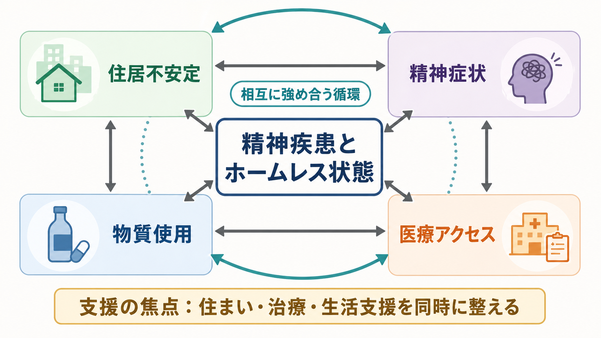
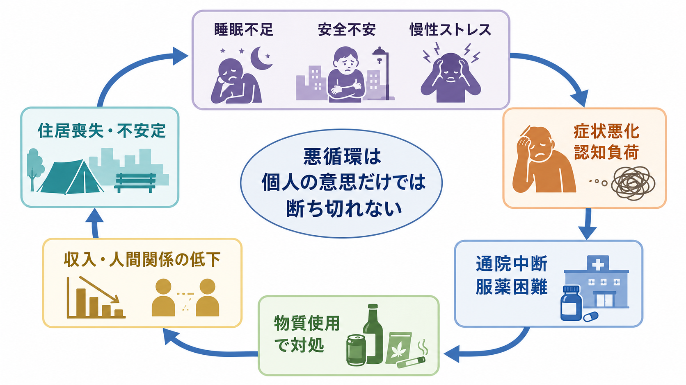
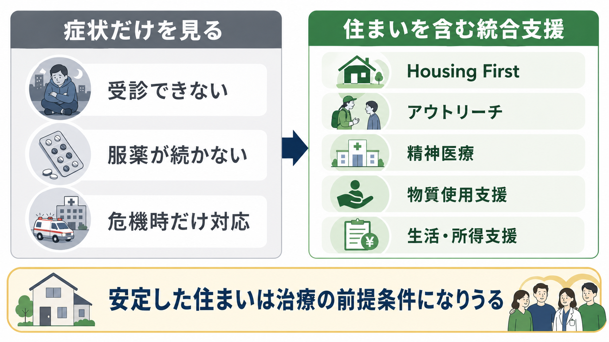

# 精神疾患とホームレス状態はどう関係するのか

## 要点

- ホームレス状態は「家がない」だけでなく、路上、シェルター、一時滞在、退去リスク、過密・不適切住居などを含む住居不安定の連続体として考えると理解しやすい。
- 精神疾患はホームレス状態の原因にも結果にもなりうる。症状、物質使用、失業、家族関係、スティグマ、低廉な住宅不足が重なり、単線的な因果ではなく悪循環を作る。
- ホームレス状態にある人では精神疾患と物質使用障害の有病率が高いが、その事実は「本人の問題だけでホームレスになる」という意味ではない。住宅市場、貧困、制度アクセス、差別も主要な決定因子である。
- 支援では、精神症状だけを治療対象にするより、住まい、アウトリーチ、精神医療、物質使用支援、所得・生活支援を同時に設計する必要がある。

## この記事で答える問い

この記事では、次の問いに答える。

1. 精神疾患とホームレス状態は、どちらが原因なのか。
2. 住居不安定、物質使用、医療アクセスはどのように絡み合うのか。
3. 臨床や研究では、どのような支援モデルが重要になるのか。

## まず結論

精神疾患とホームレス状態の関係は、双方向で、かつ社会構造に埋め込まれている。たとえば[[統合失調症とは何か]]、[[双極性障害とは何か]]、[[うつ病とは何か]]、[[PTSDとは何か]]、物質使用障害は、就労、家族関係、家計管理、対人関係、制度手続きの困難を通じて住居喪失リスクを高めうる。一方で、住居を失うこと自体も、睡眠不足、安全不安、慢性ストレス、暴力被害、孤立、治療中断を通じて精神症状を悪化させうる。

したがって、臨床的には「病気が先か、ホームレス状態が先か」と二分するより、「どの要因が今の悪循環を維持しているか」を評価するほうが有用である。これは[[生物心理社会モデルとは何か]]の典型的な応用場面であり、診断、住居、物質使用、身体疾患、制度アクセスを同じケースフォーミュレーションに入れる必要がある。

## 背景

米国 HUD の 2024 年 Point-in-Time 推計では、2024 年 1 月の単一夜に 771,480 人がホームレス状態にあり、記録開始以降で最多だった。これは一時点の推計であり、年間を通じた経験者数や隠れた住居不安定をすべて捉えるものではないが、住宅費、所得、家族、移民、災害、制度資源の問題がメンタルヘルスと切り離せないことを示している [1]。

ホームレス状態にある成人の精神疾患有病率を扱った 2024 年の系統的レビュー・メタ解析では、現在の精神疾患有病率は 67%、生涯有病率は 77% と推定された。特定の診断では、物質使用障害 44%、大うつ病 19%、統合失調症 7%、双極性障害 8% が報告されている [2]。ただし、この数字は「精神疾患がホームレス状態の唯一原因」という意味ではない。むしろ、精神疾患が高頻度に存在する集団ほど、住宅政策、差別、医療アクセス、社会的支援の不足による影響を強く受けるという読み方が必要である。

高所得国のホームレス状態と健康を整理した Lancet のレビューも、ホームレス状態の要因を個人要因と構造要因の相互作用として位置づけ、低廉な住宅の不足を重要な構造的決定因子としている。また、ホームレス状態にある人では、精神疾患、物質使用、感染症、慢性疾患、早期死亡、救急医療利用が多いことが整理されている [3]。

## 基本概念

### ホームレス状態

ホームレス状態は、路上生活だけを指す狭い概念ではない。研究や政策では、屋根のない状態、シェルターや一時宿泊施設にいる状態、退去や家庭内暴力などで住居を失う危険が高い状態、住居として不適切な場所や過密住居にいる状態まで含めて扱うことがある [4]。

この広い定義を使うと、精神疾患との関係も見えやすくなる。たとえば、家賃滞納、対人トラブル、DV、退院後の住まいの未確保、家族からの排除、刑務所・児童福祉・病院から地域への移行失敗は、路上生活になる前からすでにメンタルヘルス上のリスクを高めている。

### 住居不安定

住居不安定とは、住む場所があるかないかの二分法ではなく、「今夜眠れる場所はあるが、来月も安全に住めるかわからない」「住所がないため手続きができない」「共同生活のストレスで症状が悪化する」といった不安定さを含む概念である。精神科臨床では、住所、連絡手段、保険、収入、食事、睡眠場所を診断面接と同じくらい具体的に確認する必要がある。

### 物質使用

物質使用は、ホームレス状態の原因にも、対処行動にも、結果にもなりうる。[[アルコール使用障害とは何か]]や[[オピオイド使用障害とは何か]]があると、就労、対人関係、金銭管理、法律問題が悪化し住居喪失リスクが高まる。一方で、路上や不安定な居住環境では、寒さ、不眠、痛み、不安、トラウマ記憶、孤立への短期的対処として物質使用が強化されることもある。

## 仕組み

### 1. 住居不安定が症状を悪化させる

住居が不安定になると、睡眠、食事、清潔、服薬、通院、休息、安全確保が難しくなる。睡眠不足と慢性ストレスは、抑うつ、不安、易刺激性、幻覚・妄想の増悪、認知負荷の上昇につながる。住所や電話が不安定だと、予約確認、紹介状、検査結果、福祉制度の通知も届きにくくなる。

### 2. 精神症状が住居維持を難しくする

精神症状は、賃貸契約、家計管理、近隣関係、書類手続き、就労継続に影響する。幻聴や妄想が強いと支援者への不信が強まり、うつ状態では申請や通院のエネルギーが失われ、躁状態では金銭管理や対人衝突が問題化しやすい。トラウマ関連症状がある人では、集団シェルターや管理的な支援環境が再トラウマ化の場になることもある。

### 3. 医療アクセスの障壁が慢性化を作る

2026 年の系統的スコーピングレビューは、ホームレス状態にある人の医療アクセス障壁を、個人、対人、制度、地域、政策の複数レベルで整理している。頻度の高い障壁には、医療への不信、認知・行動上の困難、物質使用、スティグマ、医療者の否定的態度、官僚的手続き、ケア継続性の不足、費用、交通、身分証明や書類の不足が含まれる [4]。これは[[精神科におけるスティグマをどう扱うか]]や[[社会的支援は健康にどう影響するのか]]ともつながる。

### 4. 物質使用がリスクを増幅する

物質使用は、短期的には寒さ、不眠、不安、痛みを和らげるように見えることがある。しかし長期的には、離脱、過量摂取、感染症、暴力被害、逮捕、金銭問題、服薬中断を通じて、精神疾患と住居不安定の循環を強める。したがって、物質使用を「治療の前にやめるべき問題」とだけ扱うと、支援からの脱落を招きやすい。害の低減、動機づけ面接、薬物療法、ピアサポート、ケースマネジメントを組み合わせる視点が必要である [5]。

## 図解

この記事の中心モデルは、次のように整理できる。

| 領域 | リスクとして働くもの | 支援の焦点 |
|---|---|---|
| 住居 | 家賃滞納、退去、シェルター不適合、住所不定 | 安定住居、家賃補助、退院・出所前支援 |
| 精神症状 | 幻覚妄想、抑うつ、躁状態、トラウマ症状、認知機能低下 | アウトリーチ、継続診療、危機介入、共同意思決定 |
| 物質使用 | 離脱、過量摂取、治療中断、対人・法律問題 | 害の低減、MOUD、動機づけ面接、ピア支援 |
| 医療アクセス | 書類、保険、交通、予約、スティグマ、費用 | 低閾値外来、移動診療、ケースマネジメント、制度同行 |
| 社会的支援 | 孤立、家族断絶、差別、就労困難 | 所得支援、就労支援、地域資源、[[社会的処方とは何か]] |

## 臨床・研究との接続

### 評価では「住所」より「生活の実行可能性」を見る

精神科面接で住所が記載されていても、それだけでは安全な住まいがあるとは限らない。臨床では、次のように具体的に確認する。

- 今夜眠る場所はあるか。
- そこは安全で、休息でき、服薬を保管できる場所か。
- 1か月後も住める見込みがあるか。
- 郵便、電話、保険、身分証、銀行口座、交通手段はあるか。
- 支援者と連絡を取れる手段はあるか。

この情報は、診断名と同じくらい治療計画を左右する。たとえば、服薬アドヒアランスが低いように見える場合でも、実際には薬を保管できない、食後内服が難しい、予約票が届かない、通院交通費がない、という問題が背景にあるかもしれない。

### Housing First は「治療不要」ではない

Housing First は、断酒・断薬や症状安定を住居提供の前提条件にしない支援モデルである。重要なのは、住まいを先に確保し、そのうえで精神医療、物質使用支援、ケースマネジメントを継続する点である。RCT を対象にした系統的レビュー・メタ解析では、Housing First は住宅安定性を改善する一方、短期の精神健康や物質使用への効果推定は不確実で、研究数やバイアスの限界も指摘されている [6]。つまり「住まいだけで全て解決する」のではなく、「住まいがないと治療や回復の土台が崩れやすい」と理解するのが妥当である。

Toronto の RCT では、Housing First と Intensive Case Management を受けた群は、通常支援群より 24 か月間の安定居住日数割合が高く、地域機能にも改善が見られた [7]。SAMHSA の実践ガイドも、住居を待つ期間からアウトリーチ、MOUD、動機づけ面接、集中ケースマネジメント、ピアサポートなどを提供することを重視している [5]。

### 研究では「選択バイアス」と「測定の難しさ」に注意する

ホームレス状態にある人の研究では、サンプルの偏りが大きい。シェルター利用者だけを対象にすると、路上生活者や制度を避ける人を取りこぼす。医療機関データだけを使うと、医療につながっていない人が見えない。診断評価も、急性ストレス、睡眠不足、物質使用、身体疾患、知的・認知機能の問題に影響される。

そのため、研究を読むときは、対象が「路上」「シェルター」「一時住宅」「退院後」「慢性ホームレス状態」のどれなのか、診断が構造化面接か自己申告か、物質使用や身体疾患をどう扱ったかを確認する必要がある。

## よくある誤解

### 誤解1：精神疾患があるからホームレスになる

精神疾患はリスク因子だが、それだけでは説明できない。低廉な住宅不足、所得格差、家族・地域の支援不足、制度手続き、差別、退院・出所・児童福祉からの移行失敗が重なる。精神疾患だけを原因にすると、構造的介入が見えなくなる。

### 誤解2：治療や断酒ができてから住居を提供すべきである

この発想は直感的だが、住居不安定のままでは通院、服薬、睡眠、安全確保が難しい。Housing First の考え方は、治療を不要にするのではなく、治療に参加できる土台として住まいを扱う点にある [6]。

### 誤解3：物質使用がある人は支援に乗らない

物質使用がある人ほど、害の低減、MOUD、動機づけ面接、ピアサポート、アウトリーチのような低閾値支援が必要である。支援の入口を高くすると、最もリスクの高い人が排除されやすい。

### 誤解4：医療アクセスは保険があれば解決する

保険は重要だが、それだけでは不十分である。スティグマ、医療不信、身分証、交通、予約管理、待ち時間、書類、デジタルアクセス、医療者の態度、ケア継続性の不足も障壁になる [4]。

## 関連ノート

- [[生物心理社会モデルとは何か]]
- [[社会的支援は健康にどう影響するのか]]
- [[社会的処方とは何か]]
- [[精神科におけるスティグマをどう扱うか]]
- [[統合失調症とは何か]]
- [[双極性障害とは何か]]
- [[うつ病とは何か]]
- [[PTSDとは何か]]
- [[アルコール使用障害とは何か]]
- [[オピオイド使用障害とは何か]]
- [[依存症とうつ病はどう併存するのか]]

## MOC更新候補

- `content/00_MOC/MOC｜精神医学.md` がある場合は、社会的決定要因・住居不安定・物質使用を横断するノートとして追加候補。
- `content/00_MOC/MOC｜倫理・哲学・社会.md` がある場合は、住居、貧困、スティグマ、医療アクセスの接点として追加候補。

## 理解チェック

1. 精神疾患とホームレス状態の関係を「双方向」と呼ぶ理由は何か。
2. 住居不安定が服薬アドヒアランスを下げる経路を 3 つ挙げると何か。
3. Housing First は「治療をしない支援」ではなく、どのような意味で治療と関係するのか。
4. 医療アクセスの障壁を、個人要因だけでなく制度・地域・政策レベルで考える必要がある理由は何か。

## 未解決問題

- 日本のホームレス状態・住居不安定と精神疾患の大規模疫学データは、国際研究と比べてどの程度整備されているか。
- 女性、若者、LGBTQ、移民、退院直後、刑事司法からの移行者では、どの支援モデルが最も効果的か。
- Housing First が精神症状、物質使用、生活の質、医療費、死亡率に与える長期効果を、どのアウトカムで評価すべきか。
- 支援の低閾値化と、地域住民の安全・合意形成をどのように両立できるか。

## 参考文献

[1] Sousa, T. de, Henry, M., & Abt Global. (2024). *The 2024 Annual Homelessness Assessment Report (AHAR) to Congress: Part 1: Point-in-Time Estimates of Homelessness*. U.S. Department of Housing and Urban Development. https://www.huduser.gov/portal/publications/2024-ahar-part-1-pit-estimates-of-homelessness.html

[2] Barry, R., Anderson, J., Tran, L., Bahji, A., Dimitropoulos, G., Ghosh, S. M., Kirkham, J., Messier, G., Patten, S. B., Rittenbach, K., & Seitz, D. (2024). Prevalence of mental health disorders among individuals experiencing homelessness: A systematic review and meta-analysis. *JAMA Psychiatry, 81*(7), 691-699. https://doi.org/10.1001/jamapsychiatry.2024.0426

[3] Fazel, S., Geddes, J. R., & Kushel, M. (2014). The health of homeless people in high-income countries: Descriptive epidemiology, health consequences, and clinical and policy recommendations. *The Lancet, 384*(9953), 1529-1540. https://doi.org/10.1016/S0140-6736(14)61132-6

[4] Gorski, D., Alves da Costa, F., Fuertes, R., Gama-Marques, J., Tavoschi, L., & Tonin, F. S. (2026). Barriers to and facilitators of healthcare access among people experiencing homelessness: A systematic scoping review. *International Journal for Equity in Health, 25*, 99. https://doi.org/10.1186/s12939-026-02840-z

[5] Substance Abuse and Mental Health Services Administration. (2023). *Expanding access to and use of behavioral health services for people experiencing homelessness*. Evidence-Based Resource Guide Series. https://library.samhsa.gov/product/expanding-access-and-use-behavioral-health-services-people-experiencing-homelessness/pep22

[6] Baxter, A. J., Tweed, E. J., Katikireddi, S. V., & Thomson, H. (2019). Effects of Housing First approaches on health and well-being of adults who are homeless or at risk of homelessness: Systematic review and meta-analysis of randomised controlled trials. *Journal of Epidemiology and Community Health, 73*(5), 379-387. https://doi.org/10.1136/jech-2018-210981

[7] Stergiopoulos, V., Gozdzik, A., Misir, V., Skosireva, A., Connelly, J., Sarang, A., Whisler, A., Hwang, S. W., O'Campo, P., & McKenzie, K. (2015). Effectiveness of Housing First with Intensive Case Management in an ethnically diverse sample of homeless adults with mental illness: A randomized controlled trial. *PLOS ONE, 10*(7), e0130281. https://doi.org/10.1371/journal.pone.0130281

## 更新ログ

- 2026-04-28: 初稿作成。住居不安定、物質使用、医療アクセス、Housing First を中心に整理。
