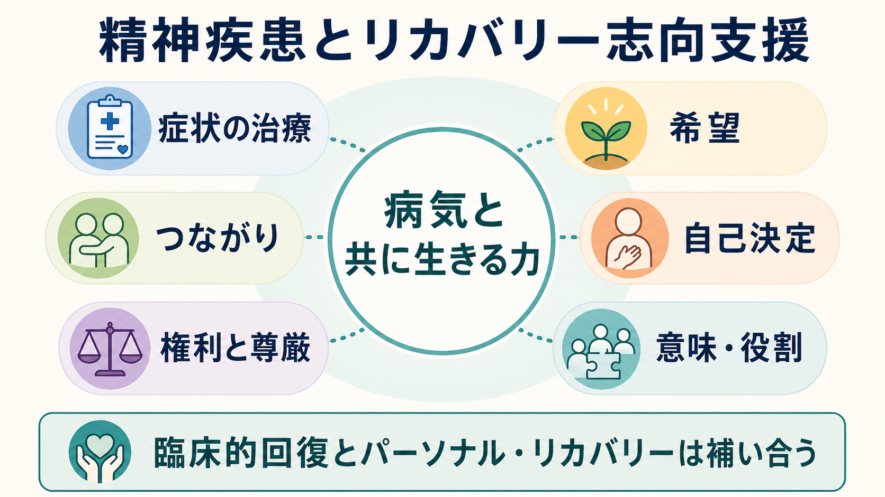
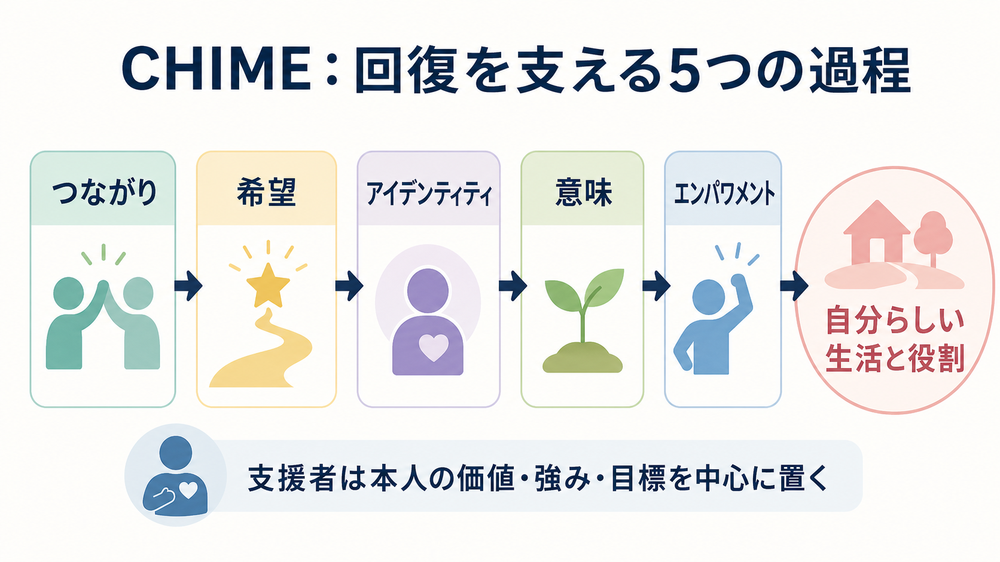
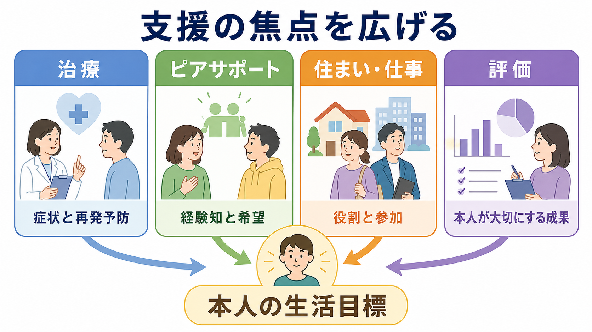

# 精神疾患とリカバリー志向支援はどう関係するのか

## 要点

- リカバリー志向支援は、症状を軽くする医療を否定するものではなく、症状があっても本人が大切にする生活・関係・役割を取り戻すために医療を位置づけ直す考え方である。
- リカバリーには、寛解・再発予防・機能改善を重視する「臨床的回復」と、希望、自己決定、意味、つながり、役割を重視する「パーソナル・リカバリー」がある。
- 支援者の仕事は「治す主体」になることだけではなく、本人が選び、試し、失敗から立て直し、社会参加できる条件を整えることである。
- 根拠は発展途上であり、ピアサポートやリカバリー研修の効果はアウトカムによって一貫しない。したがって、理念だけでなく評価・権利保障・実装の質が重要になる。

## この記事で答える問い

精神疾患は、症状、認知機能、生活機能、対人関係、就労・学業、自己像に影響する。たとえば [[統合失調症とは何か]]、[[うつ病とは何か]]、[[双極性障害とは何か]]、[[PTSDとは何か]] では、症状の軽減だけでなく、生活の立て直しが大きな課題になる。この記事では、精神疾患の治療とリカバリー志向支援が競合するのではなく、どのように補い合うのかを整理する。

## まず結論

リカバリー志向支援は、「精神疾患が完全に消えたら人生が始まる」という発想を弱める。代わりに、「症状の治療」「本人の価値」「社会的役割」「権利と尊厳」を同時に扱う。WHO は、地域精神保健サービスを、本人中心で権利に基づく方向へ転換することを強調しており、住まい、危機支援、ピアサポート、地域参加を含む包括的な支援を推奨している [1]。

SAMHSA も、リカバリーを、健康とウェルビーイングを改善し、自己決定的な生活を送り、可能性を追求する変化のプロセスとして定義している [2]。つまり、リカバリーは「治療の後に来るもの」ではなく、治療の目標設定、面接、支援計画、社会資源の使い方を変える実践原理である。

## 背景

精神医療では長く、症状の消失、入院の回避、服薬継続、再発予防が主要なアウトカムとして扱われてきた。これらは重要である。たとえば [[統合失調症の再発とは何か]] では、再発が生活の安定や本人の自信に大きな影響を与えるため、早期介入と再発予防は欠かせない。

一方で、症状が残る人でも、学ぶ、働く、家族や友人と関わる、地域で暮らす、自分の経験を意味づける、といった回復過程は起こりうる。Anthony は、精神疾患からのリカバリーを、病気による制限が残っていても、満足でき、希望があり、貢献できる生活を送る過程として位置づけた [3]。この転換は、精神医療の焦点を「疾患だけ」から「疾患をもつ人の生活」へ広げた。

## 基本概念

### 臨床的回復

臨床的回復は、症状の軽減、再発予防、認知機能・社会機能の改善、入院期間の短縮、安全性の確保などを重視する。これは医療が得意とする領域であり、薬物療法、心理療法、心理教育、危機介入、身体疾患への対応などが含まれる。

ただし、臨床的回復だけを目標にすると、本人が「何のために治療するのか」が見えにくくなることがある。症状評価は必要だが、本人にとって大切な生活目標と結びつかなければ、治療は管理的に感じられやすい。

### パーソナル・リカバリー

パーソナル・リカバリーは、本人の主観的な意味、希望、自己決定、つながり、アイデンティティ、役割を重視する。Leamy らの体系的レビューは、リカバリーの中核過程を CHIME、すなわち Connectedness（つながり）、Hope（希望）、Identity（アイデンティティ）、Meaning（意味）、Empowerment（エンパワメント）として整理した [4]。

この枠組みでは、[[統合失調症の陰性症状とは何か]] のような意欲低下や社会的ひきこもりを、単に「症状」としてだけでなく、孤立、失敗経験、スティグマ、役割喪失、自己効力感の低下と絡む問題として見る。したがって支援は、症状に対する治療と、生活の中で小さな選択と成功を積み直す支援を組み合わせる。

## 仕組み

リカバリー志向支援の中心には、本人の価値・強み・目標を支援計画の出発点に置くという考え方がある。支援者は、本人の生活史、症状への対処、得意なこと、避けたいこと、再発のサイン、頼れる人、働きたい・学びたい・暮らしたい場所を一緒に整理する。

このとき重要なのは、本人を「治療への協力者」としてだけ扱わないことである。本人は、自分の生活の専門家であり、支援者は医学的・心理社会的知識を持つ専門家である。リカバリー志向支援は、この二つの専門性を対等に組み合わせる。

REFOCUS 試験では、精神病圏の人を支援する地域精神保健チームに対し、本人の価値、治療選好、強み、目標、スタッフと本人の協働関係を高めるチームレベル介入が検討された。英国のクラスターRCTでは主要なパーソナル・リカバリー尺度で明確な差を示せなかったが [5]、オーストラリアの REFOCUS-PULSAR では小さいながら有意な改善が報告された [6]。この違いは、理念を掲げるだけでは不十分で、対象、実装、継続性、評価指標が結果を左右することを示している。

## 図解

リカバリー志向支援は、支援の焦点を「症状をどう減らすか」から「症状と付き合いながら、どのような生活を取り戻すか」へ広げる。臨床的には、再発予防、危機対応、服薬や心理療法が土台になる。心理社会的には、ピアサポート、住まい、就労・就学、家族・地域との関係、権利擁護が重要になる。

| 焦点 | 従来の狭い見方 | リカバリー志向の見方 |
|---|---|---|
| 症状 | 症状を減らすことが最終目標 | 症状を扱いながら生活目標に近づく |
| 本人 | 治療を受ける対象 | 生活の目標を決める主体 |
| 支援者 | 指導・管理する専門家 | 医学知と経験知をつなぐ伴走者 |
| 成果 | 再発率、入院日数、症状尺度 | 希望、自己決定、役割、参加、生活の質も含める |
| リスク | 危険を避けるため活動を制限する | 支持されたリスクテイクを通じて経験を増やす |

## 臨床・研究との接続

臨床では、リカバリー志向支援は面接の問いを変える。「症状はどうですか」だけでなく、「最近少しでも自分らしく過ごせた場面は何ですか」「今の治療は何に役立っていますか」「次に試したい小さな行動は何ですか」と尋ねる。これにより、治療計画は服薬や通院だけでなく、本人の価値に沿った行動計画になる。

ピアサポートは、経験知、希望、ロールモデル、孤立の緩和を通じてリカバリーを支える可能性がある。ただし、統合失調症など重い精神疾患を対象にした Cochrane レビューでは、入院や死亡などの主要アウトカムに関するエビデンスの質は低く、効果を支持も否定もできないとされた [7]。したがって、ピアサポートは「万能の代替治療」ではなく、訓練、守秘、スーパービジョン、ピア支援者自身の安全を含む仕組みとして実装する必要がある。

就労支援では、重い精神疾患をもつ成人の就労獲得・維持に対して、援助付き雇用、特に Individual Placement and Support に近い支援が有効である可能性が示されている [8]。これは、リカバリーが気分の問題だけでなく、役割、収入、所属、自己効力感と結びつくことを示す。

研究では、症状尺度だけでなく、本人報告アウトカム、生活の質、希望、エンパワメント、社会参加、治療同盟、権利侵害の少なさを含めた評価が必要になる。[[初回エピソード精神病とは何か]] のように早期段階から支援する場合、症状を抑えるだけでなく、学業・就労・友人関係の中断を最小化することが長期的なリカバリーに関わる。

## よくある誤解

### 誤解1：リカバリー志向は薬物療法を否定する

否定しない。薬物療法や心理療法は、本人が大切にする生活を実現するための手段になりうる。問題は、治療が本人の目標から切り離され、服薬遵守だけが目的化することである。

### 誤解2：希望を語れば回復する

希望は重要だが、精神論ではない。希望が現実的な力をもつには、住まい、収入、支援者、危機時の連絡先、合理的配慮、スティグマの少ない環境が必要である。

### 誤解3：本人の自己決定を尊重すれば支援者は何もしない

自己決定は放任ではない。選択肢を増やし、情報を共有し、リスクを一緒に見積もり、本人が試せる範囲を調整することが支援である。特に自傷他害、虐待、重い身体疾患、急性精神病状態などでは、安全確保と権利保障を同時に考える必要がある。

### 誤解4：リカバリーは完全な社会復帰を意味する

リカバリーは一方向の成功物語ではない。体調の波、再発、休職、孤立、支援の受け直しを含みうる。重要なのは、後退があっても本人の価値と役割を再び組み直せることである。

## 関連ノート

- [[統合失調症とは何か]]
- [[統合失調症の再発とは何か]]
- [[統合失調症の陰性症状とは何か]]
- [[初回エピソード精神病とは何か]]
- [[うつ病とは何か]]
- [[双極性障害とは何か]]
- [[PTSDとは何か]]
- [[MOC｜精神医学]]
- [[MOC｜臨床実践・治療]]

## MOC更新候補

- `content/00_MOC/MOC｜精神医学.md`
- `content/00_MOC/MOC｜臨床実践・治療.md`

並列ジョブとの競合を避けるため、この記事では MOC 本体は更新していない。

## 理解チェック

1. 臨床的回復とパーソナル・リカバリーは、どの点で異なり、どの点で補い合うか。
2. CHIME の5要素は、精神疾患をもつ人の生活支援でどのように使えるか。
3. ピアサポートや就労支援を「リカバリー志向」と呼ぶだけでは不十分なのはなぜか。
4. 支持されたリスクテイクと放任は、どこが違うか。

## 未解決問題

- どのリカバリー志向介入が、どの診断群・病期・文化的背景で有効なのかは、まだ十分に整理されていない。
- パーソナル・リカバリーを測定する尺度は増えているが、本人にとって意味のある変化をどこまで捉えられるかには限界がある。
- ピアサポートを制度化するとき、経験知の価値を保ちながら、過重労働、低賃金、専門職化しすぎる問題をどう避けるかが課題である。
- 権利に基づく支援と、急性期の安全確保・強制性のある介入をどう調整するかは、臨床・倫理・制度の接点に残る難問である。

## 参考文献

[1] World Health Organization. (2021). *Guidance on community mental health services: promoting person-centred and rights-based approaches*. https://www.who.int/publications/i/item/9789240025707

[2] Substance Abuse and Mental Health Services Administration. (2025). *Recovery and Recovery Support*. https://www.samhsa.gov/recovery

[3] Anthony, W. A. (1993). Recovery from mental illness: The guiding vision of the mental health service system in the 1990s. *Psychosocial Rehabilitation Journal, 16*(4), 11-23. https://doi.org/10.1037/h0095655

[4] Leamy, M., Bird, V., Le Boutillier, C., Williams, J., & Slade, M. (2011). Conceptual framework for personal recovery in mental health: systematic review and narrative synthesis. *The British Journal of Psychiatry, 199*(6), 445-452. https://doi.org/10.1192/bjp.bp.110.083733

[5] Slade, M., Bird, V., Clarke, E., Le Boutillier, C., McCrone, P., Macpherson, R., Pesola, F., Wallace, G., Williams, J., & Leamy, M. (2015). Supporting recovery in patients with psychosis through care by community-based adult mental health teams (REFOCUS): a multisite, cluster, randomised, controlled trial. *The Lancet Psychiatry, 2*(6), 503-514. https://doi.org/10.1016/S2215-0366(15)00086-3

[6] Meadows, G., Brophy, L., Shawyer, F., Enticott, J. C., Fossey, E., Thornton, C. D., Weller, P. J., & Slade, M. (2019). REFOCUS-PULSAR recovery-oriented practice training in specialist mental health care: a stepped-wedge cluster randomised controlled trial. *The Lancet Psychiatry, 6*(2), 103-114. https://doi.org/10.1016/S2215-0366(18)30429-2

[7] Chien, W. T., Clifton, A. V., Zhao, S., & Lui, S. (2019). Peer support for people with schizophrenia or other serious mental illness. *Cochrane Database of Systematic Reviews, 2019*(4), CD010880. https://doi.org/10.1002/14651858.CD010880.pub2

[8] Suijkerbuijk, Y. B., Schaafsma, F. G., van Mechelen, J. C., Ojajarvi, A., Corbiere, M., & Anema, J. R. (2017). Interventions for obtaining and maintaining employment in adults with severe mental illness, a network meta-analysis. *Cochrane Database of Systematic Reviews, 2017*(9), CD011867. https://doi.org/10.1002/14651858.CD011867.pub2
