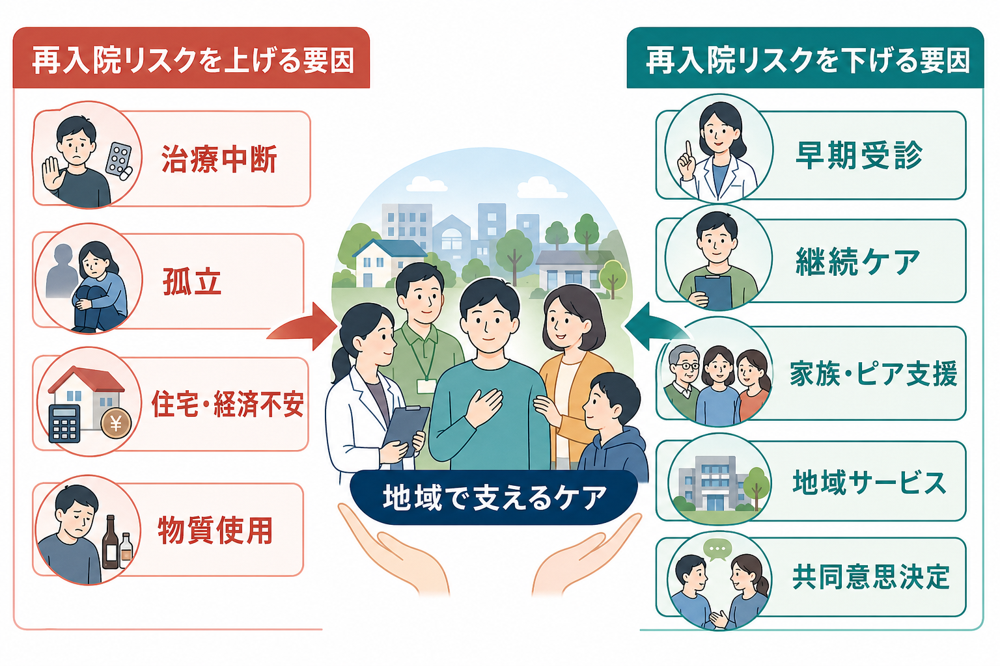
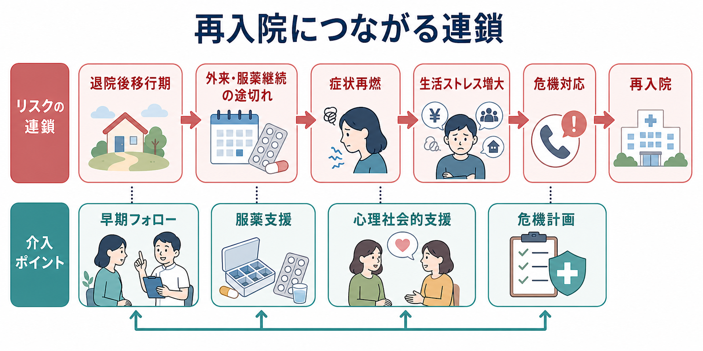

# 精神疾患と再入院はどう関係するのか

## 要点

- 精神科の再入院は、疾患名だけで決まるのではなく、[[精神疾患の再発とは何か|再発]]、退院直後の支援の切れ目、[[精神疾患と治療中断はどう関係するのか|治療中断]]、社会的孤立、生活基盤の不安定さが重なって起こりやすくなる。
- とくに退院後の数週間から数か月は、症状・生活・対人関係・医療アクセスが同時に揺れやすい「移行期」であり、外来フォロー、服薬支援、危機計画、地域連携が重要になる[1][2]。
- 再入院は失敗の印ではない。危機時には必要な安全確保でもあるが、反復する場合は、本人だけでなくケアの連続性と社会的環境を見直す必要がある。

## この記事で答える問い

このノートでは、「なぜ精神疾患では入院が反復することがあるのか」「治療中断・孤立・支援不足はどのように再入院へつながるのか」「再入院を減らす支援は何を狙うのか」を整理する。ここで扱う内容は教育・研究目的の一般的整理であり、個別の診断や治療方針を指示するものではない。

## まず結論

精神疾患と再入院の関係は、「重い疾患だから再入院する」という単純な因果ではない。多くの場合、症状の再燃、服薬や外来通院の途切れ、退院後の生活ストレス、孤立、家族・住居・経済・物質使用などの課題、そして支援体制の不足が循環をつくる[1]。この循環のどこかで支援が入ると、再入院リスクは下がりうる。

## 背景

精神科入院は、急性期の安全確保、症状の集中的治療、生活機能の回復に役立つ。一方で、退院は「治療の終了」ではなく、病棟の構造化された環境から、地域生活の不確実性へ戻る移行である。退院直後に予約、服薬、住まい、収入、対人関係、家族調整、支援者との連絡が整わないと、症状の悪化が早く進みやすい[1][2]。

再入院研究では、過去の入院回数、退院時の症状、診断、併存する物質使用、社会的支援の乏しさ、外来フォローの不足、入院期間や地域サービスの利用可能性などが検討されている[1]。ただし、これらは「誰が悪いか」を示す指標ではなく、介入すべき接点を見つけるための手がかりである。

## 基本概念

**再入院**とは、退院後に再び入院治療が必要になることである。研究では30日、90日、1年など観察期間が異なるため、論文間で率を単純比較するには注意が必要である[1]。

**再発・再燃**は、症状が再び強まることである。統合失調症では、抗精神病薬の維持療法が再発予防に有効で、薬物療法を中断すると再発リスクが上がることがメタ解析で示されている[3]。ただし再発は薬だけで説明できず、ストレス、睡眠、対人関係、物質使用、生活リズム、支援体制も関わる。

**治療中断**は、外来受診、服薬、心理社会的支援、地域サービスとの接点が切れることである。これは[[精神疾患と服薬アドヒアランス不良はどう関係するのか|服薬アドヒアランス不良]]だけでなく、予約の取りにくさ、副作用、病識の揺れ、医療不信、経済的・地理的障壁、孤立などから生じる。

## 仕組み

### 1. 退院後移行期に支援が途切れる

退院直後は、病棟で支えられていた服薬、睡眠、食事、危機対応、相談先が本人の生活環境に戻る時期である。この時期に早期フォロー、電話支援、退院計画、地域サービスとの接続などの移行支援を行うと、早期再入院を減らす可能性がある[2]。したがって、退院計画は退院日の直前ではなく、入院中から外来・訪問・家族・福祉・住居支援をつなぐ作業として考える。

### 2. 治療中断が症状再燃を招く

統合失調症では、抗精神病薬の維持療法が再発予防に寄与する一方、中断や不規則な服薬は再発、救急受診、再入院へつながりやすい[3][4]。ただし「飲まない本人の問題」とだけ見ると介入点を見失う。副作用、効果への納得、認知機能、抑うつ、物質使用、生活の混乱、医療者との関係が絡むため、共同意思決定と副作用対策が重要になる。

### 3. 社会的孤立が危機を増幅する

社会的孤立は、症状悪化に気づく人、相談できる人、通院や生活を支える人が少ない状態をつくる。[[社会的支援は健康にどう影響するのか|社会的支援]]が乏しいと、本人は小さな変化を一人で抱え込みやすく、睡眠悪化、物質使用、受診回避、生活リズムの乱れが重なりやすい[1][7]。家族や友人の存在だけでなく、ピアサポート、相談支援、訪問支援、デイケア、就労・住居支援など、複数の薄い支えを重ねることが保護因子になる。

### 4. 家族支援と地域支援が再入院の循環を弱める

統合失調症では、家族介入が再発や入院を減らす方向の効果をもつことがレビューで示されている[5]。また、重い精神疾患で入院利用が多い人には、集中的ケースマネジメントや地域ベースの支援が、入院日数やケアの中断を減らす可能性がある[6]。これは「家族が頑張ればよい」という意味ではなく、家族負担を下げながら、本人・家族・医療・福祉が同じ危機計画を共有することを意味する。

## 図解

再入院のリスクは、単一の矢印ではなく循環として見ると理解しやすい。

| 局面 | 起こりやすいこと | 支援の焦点 |
|---|---|---|
| 退院直後 | 生活リズム、外来予約、服薬管理が不安定になる | 早期フォロー、退院前カンファレンス、連絡先の明確化 |
| 症状再燃 | 不眠、不安、幻覚妄想、抑うつ、希死念慮、物質使用が強まる | 早期受診、危機計画、家族・支援者への共有 |
| 社会的孤立 | 誰にも相談できず、受診や服薬が途切れる | ピア支援、訪問支援、居場所、相談支援 |
| 再入院 | 安全確保と治療再調整が必要になる | 退院後の同じ循環を繰り返さない計画 |

## 臨床・研究との接続

臨床では、再入院を「防ぐべきイベント」とだけ見ると危険である。自傷他害の切迫、重度のセルフネグレクト、精神病症状の急激な悪化、重い躁状態やうつ状態などでは、入院が必要な安全策になる。重要なのは、必要な入院をためらわないことと、避けられる反復入院を減らすことを区別することである。

研究では、30日再入院のような短期指標は医療システムの連携を反映しやすく、1年再入院は疾患経過、社会的支援、地域資源、生活基盤の影響をより受けやすい。したがって、再入院率だけで医療の質を評価するよりも、退院後フォロー率、危機計画の共有、本人の満足度、家族負担、地域生活の安定、強制的入院の減少などを併せて見る必要がある[1][7]。

## よくある誤解

**誤解1: 再入院は本人の努力不足である。**  
再入院には症状、薬物療法、支援体制、住居、経済、孤立、サービス利用可能性が関わる。本人の努力だけに還元すると、実際に変えられる環境要因を見逃す。

**誤解2: 退院すれば治療は一段落である。**  
退院はむしろ移行支援が必要な時期である。退院後早期の外来・訪問・電話・地域支援への接続は、再入院予防の中心的な介入点である[2]。

**誤解3: 入院を避けることが常に最善である。**  
危機時の入院は安全確保と治療再調整のために必要な場合がある。大切なのは、入院を罰や失敗として扱わず、退院後に同じリスク連鎖を繰り返さない設計へつなげることである。

## 関連ノート

- [[精神疾患の再発とは何か]]
- [[精神疾患と治療中断はどう関係するのか]]
- [[精神疾患と服薬アドヒアランス不良はどう関係するのか]]
- [[再発予防計画とは何か]]
- [[地域連携は精神科診療で何を意味するのか]]
- [[精神疾患と家族負担はどう関係するのか]]
- [[社会的支援は健康にどう影響するのか]]
- [[統合失調症の再発とは何か]]

## 理解チェック

1. 再入院を「疾患の重さ」だけで説明すると、どのような介入点を見落とすか。
2. 退院後移行期に、外来・服薬・生活支援が途切れると何が起こりやすいか。
3. 社会的孤立は、症状再燃や治療中断とどのようにつながるか。
4. 再入院を減らす支援と、必要な入院を確保する支援はどのように両立できるか。

## 参考文献

[1] Sfetcu, R., Musat, S., Haaramo, P., et al. (2017). Overview of post-discharge predictors for psychiatric re-hospitalisations: A systematic review of the literature. *BMC Psychiatry, 17*, 227. https://doi.org/10.1186/s12888-017-1386-z

[2] Vigod, S. N., Kurdyak, P. A., Dennis, C.-L., et al. (2013). Transitional interventions to reduce early psychiatric readmissions in adults: Systematic review. *The British Journal of Psychiatry, 202*(3), 187-194. https://doi.org/10.1192/bjp.bp.112.115030

[3] Leucht, S., Tardy, M., Komossa, K., et al. (2012). Antipsychotic drugs versus placebo for relapse prevention in schizophrenia: A systematic review and meta-analysis. *The Lancet, 379*(9831), 2063-2071. https://doi.org/10.1016/S0140-6736(12)60239-6

[4] Emsley, R., Chiliza, B., Asmal, L., & Harvey, B. H. (2013). The nature of relapse in schizophrenia. *BMC Psychiatry, 13*, 50. https://doi.org/10.1186/1471-244X-13-50

[5] Pharoah, F., Mari, J., Rathbone, J., & Wong, W. (2010). Family intervention for schizophrenia. *Cochrane Database of Systematic Reviews*, CD000088. https://doi.org/10.1002/14651858.CD000088.pub2

[6] Dieterich, M., Irving, C. B., Park, B., & Marshall, M. (2017). Intensive case management for severe mental illness. *Cochrane Database of Systematic Reviews*, CD007906. https://doi.org/10.1002/14651858.CD007906.pub3

[7] World Health Organization. (2022). *World mental health report: Transforming mental health for all*. https://www.who.int/publications/i/item/9789240049338

## 未解決問題

- 日本の精神科医療制度では、病床数、地域資源、訪問支援、住居支援の地域差が再入院にどう影響しているか。
- 再入院率を医療の質指標として使う場合、必要な入院まで抑制していないかをどう評価するか。
- 本人のリカバリー、家族負担、地域生活の安定を、再入院率と同時にどう測定するか。

## MOC更新候補

- `content/00_MOC/` の精神医学系MOCに、`[[精神疾患と再入院はどう関係するのか]]` を追加する候補。
- 関連トピックとして、再発予防、治療中断、服薬アドヒアランス、地域連携、家族支援、社会的支援のクラスターに接続する候補。
