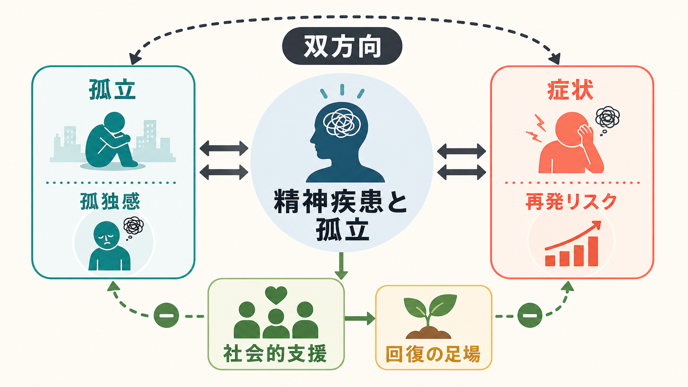
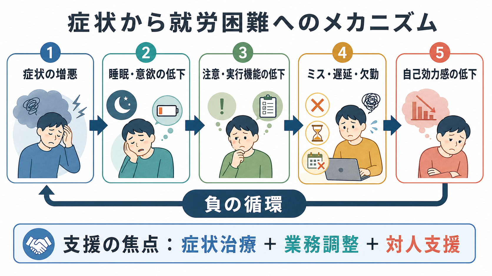

# 精神疾患と孤立はどう関係するのか

## 要点

- 孤立は「人との接触や関係の少なさ」、孤独感は「望むつながりと実際のつながりのずれから生じる主観的苦痛」であり、両者は重なるが同じではない。
- 孤立は精神疾患の単なる結果ではなく、ストレス、睡眠、反すう、活動低下、支援へのアクセス低下を通じて症状維持に関わりうる。
- 精神疾患の症状もまた、対人回避、スティグマ、生活機能低下、就労・学業困難を通じて孤立を深める。
- 臨床では「友人が何人いるか」だけでなく、「本人がどの関係を安全・有意味と感じているか」を評価する。
- 介入は、いきなり大きな交流を増やすより、症状治療、生活支援、家族・仲間・地域資源、[[社会的処方とは何か|社会的処方]]を組み合わせ、小さく反復可能な接点を作ることが現実的である。

## この記事で答える問い

この記事では、[[孤独は心身にどのような影響を与えるのか|孤独]]や社会的孤立が、[[うつ病とは何か|うつ病]]、[[不安症群とは何か|不安症]]、[[統合失調症とは何か|統合失調症]]などの精神疾患とどう関係するのかを整理する。中心となる問いは、「社会的つながりの減少は、症状の維持や再発にどのような経路で関わるのか」である。

## まず結論

精神疾患と孤立の関係は、一方向の因果ではなく、双方向の悪循環として理解するのがよい。孤立や孤独感は、抑うつ、不安、精神病症状、生活機能低下と関連し、精神疾患をもつ人の予後にも関わる可能性がある[1][2][3]。一方で、症状そのもの、服薬・通院の負担、スティグマ、経済的困難、家族関係の疲弊は、人との接点を減らし、孤立を深める。

重要なのは、「孤立しているから病気になる」と単純化しないことである。孤立はリスク因子であり、維持因子であり、結果でもある。したがって、臨床や支援では、孤立を個人の性格や努力不足として扱わず、症状、生活環境、支援資源、本人の意味づけを同時に見る必要がある。

## 背景

WHO は社会的孤立と孤独を、身体的健康、精神的健康、教育、雇用、地域社会に影響する公衆衛生上の課題として位置づけている[1]。系統的レビューの概観でも、孤立・孤独は心血管疾患や死亡だけでなく、抑うつを含むメンタルヘルス不調と一貫して関連することが報告されている[2]。

精神医学で特に重要なのは、孤立が「治療の外側」にある社会問題ではなく、症状の経過に入り込むことである。精神疾患をもつ成人を対象にした縦断研究の系統的レビューでは、孤独感や低い主観的社会的支援が、その後の症状、回復、生活機能、入院などの転帰と関連していた[3]。ただし、研究ごとに対象疾患、測定尺度、追跡期間が異なるため、「孤立を減らせば必ず再発が減る」とまでは言えない。

## 基本概念

**社会的孤立**は、客観的に見た接触頻度、関係数、社会参加の少なさを指す。たとえば、同居者がいない、定期的に会う相手が少ない、仕事・学校・地域活動から離れている、といった状態である。

**孤独感**は、本人が「つながれていない」「理解されていない」と感じる主観的経験である。周囲に人がいても孤独なことがあり、反対に一人でいる時間が多くても苦痛でない場合もある。したがって、臨床評価では「接触頻度」と「本人の感じ方」を分けて聞く必要がある。

**社会的支援**は、情緒的支援、情報的支援、道具的支援、評価的支援を含む。[[社会的支援は健康にどう影響するのか|社会的支援]]は、ストレスを直接減らすだけでなく、困ったときに医療や福祉へ接続する経路にもなる。

## 仕組み

孤立が症状維持に関わる経路は、少なくとも五つに分けられる。

第一に、孤立は脅威への警戒を高める。孤独感は「社会的な安全基地が乏しい」という感覚を伴いやすく、対人場面を危険として読み取りやすくする。Hawkley と Cacioppo は、孤独感が脅威への過警戒、睡眠の質低下、生理的ストレス反応を通じて健康に影響する可能性を整理している[4]。これは、[[HPA軸は精神疾患にどう関わるのか|HPA軸]]や自律神経系のストレス反応とも接続して考えられる。

第二に、孤立は反すうと回避を増やす。人との接点が少ないほど、自分の考えを外から修正する機会が減り、「迷惑をかける」「どうせ拒絶される」という予測が強まりやすい。これは[[社交不安症とは何か|社交不安]]、抑うつ、被害念慮の維持に関わる。

第三に、孤立は生活リズムを崩す。人との予定、仕事、学業、通院、食事の共有は、睡眠・覚醒、活動量、服薬、受診のリズムを支える外的手がかりになる。接点が失われると、[[睡眠障害とは何か|睡眠障害]]、昼夜逆転、活動低下が起こり、症状悪化に気づく他者も少なくなる。

第四に、孤立は支援への接続を遅らせる。症状が再燃しても、相談相手がいなければ受診や支援要請が遅れる。特に統合失調症や双極性障害では、本人の病識や判断が揺らぐ時期に、家族・支援者・医療者が早期サインを共有していることが再発予防上重要になる。

第五に、精神疾患の症状も孤立を作る。抑うつの意欲低下、不安の回避、統合失調症の陰性症状、[[PTSDとは何か|PTSD]]の過覚醒や回避、[[アルコール使用障害とは何か|物質使用]]に伴う対人葛藤は、社会的接点を狭める。つまり、孤立は原因であると同時に結果でもある。

## 図解

上の図は、症状悪化、睡眠・意欲の低下、実行機能の低下、社会的失敗、自己効力感の低下が連鎖し、再び症状悪化に戻る流れを示している。精神疾患と孤立の支援では、この輪のどこか一か所だけを「根性」で断つのではなく、症状治療、業務・学業調整、対人支援を同時に小さく入れる。

たとえば、抑うつの人に「友人に会いなさい」とだけ勧めても、疲労、罪責感、拒絶予測が強ければ実行できない。逆に、睡眠と活動量を少し整え、短いメッセージ、支援者との定期面談、家族への心理教育を組み合わせると、本人が耐えられる範囲で接点を回復しやすい。

## 臨床・研究との接続

評価では、次の四つを分けて聞く。

| 観点 | 具体的な問い |
|---|---|
| 客観的孤立 | 「この1週間で、誰かと会話した機会はどのくらいありましたか」 |
| 主観的孤独 | 「人といても孤独だと感じることはありますか」 |
| 支援の質 | 「困ったとき、誰なら連絡できますか」 |
| 接点の負担 | 「人と会った後に、疲れすぎたり怖くなったりしますか」 |

精神病症状との関係では、孤独感と精神病症状には中等度の関連が報告されている[5]。ただし、この関連は「孤独が精神病を直接作る」という意味ではない。抑うつ、不安、スティグマ、対人技能、貧困、住居不安定、医療アクセスなどが重なっている可能性がある。

介入研究については、精神疾患をもつ人の主観的・客観的孤立を減らす介入の系統的レビューで、認知的介入、支援つき社会参加、複合的介入などが検討されているが、研究の質や規模に限界があり、特定の方法を強く推奨するには証拠が十分でないとされる[6]。一方、医療現場で孤立・孤独を見落とさず、評価し、地域資源へつなぐ必要性は、米国 National Academies の報告書でも強調されている[7]。

統合失調症の再発予防では、家族介入、心理教育、認知行動療法、地域ベースの支援など複数の心理社会的介入が検討されている[8]。これは「社会的支援だけで再発を防ぐ」という話ではなく、薬物療法、心理教育、家族・地域支援、早期サインの共有を組み合わせることで、孤立が再発サインの見逃しにつながる経路を弱めるという理解が現実的である。

## よくある誤解

**誤解1: 孤立している人は、ただ人付き合いが苦手なだけである。**  
実際には、症状、スティグマ、経済的困難、住居、身体疾患、発達特性、トラウマ、家族関係が複雑に関わる。性格だけに還元すると、必要な支援が見えなくなる。

**誤解2: 交流を増やせば必ずよくなる。**  
交流は量より質が重要である。安全でない関係、批判が強い関係、過干渉な関係は、症状を悪化させることもある。本人にとって意味があり、負担が調整された接点を作る必要がある。

**誤解3: 孤独感は主観なので臨床的に重要でない。**  
孤独感は主観的経験だが、症状、睡眠、ストレス、支援希求に関わる。主観だからこそ、本人の語りを聞く価値がある。

**誤解4: 孤立を扱うのは医療ではなく福祉の仕事である。**  
孤立は医療だけで解決できないが、医療が見立てに入れないと、服薬や症状評価だけでは説明できない再発・中断・生活機能低下を見落とす。

## 関連ノート

- [[孤独は心身にどのような影響を与えるのか]]
- [[社会的支援は健康にどう影響するのか]]
- [[社会的処方とは何か]]
- [[生物心理社会モデルとは何か]]
- [[ストレス脆弱性モデルとは何か]]
- [[精神科におけるスティグマをどう扱うか]]
- [[ひきこもりとは何か]]
- [[うつ病とは何か]]
- [[統合失調症の再発とは何か]]
- [[統合失調症の陰性症状とは何か]]

## MOC更新候補

- `content/00_MOC/MOC｜精神医学.md`
- `content/00_MOC/MOC｜発達・愛着・社会心理.md`

並列作業との衝突を避けるため、本記事作成時点では MOC 本体は更新していない。

## 理解チェック

1. 社会的孤立と孤独感は、どのように違うか。
2. 孤立が症状維持に関わる経路を、睡眠、反すう、支援アクセスの観点から説明できるか。
3. 「交流を増やせばよい」という助言が、なぜ不十分な場合があるか。
4. 精神疾患の症状が孤立を深める経路を一つ挙げられるか。
5. 臨床評価で、接触頻度だけでなく「本人にとっての安全性」を聞く理由は何か。

## 未解決問題

- 孤立が症状を悪化させる因果効果と、症状が孤立を生む逆方向の効果をどう分離するか。
- 疾患別、年齢別、文化別に、どの介入がどの孤立タイプに効きやすいか。
- デジタル接点、対面接点、ピアサポート、家族支援をどう組み合わせると、長期的な再発予防につながるか。
- 孤独感を減らす介入が、入院、再発、就労、生活の質にどの程度波及するか。

## 参考文献

[1] World Health Organization. (2025). *From loneliness to social connection: charting a path to healthier societies: Report of the WHO Commission on Social Connection*. https://www.who.int/publications/i/item/978240112360

[2] Leigh-Hunt, N., Bagguley, D., Bash, K., Turner, V., Turnbull, S., Valtorta, N., & Caan, W. (2017). An overview of systematic reviews on the public health consequences of social isolation and loneliness. *Public Health, 152*, 157-171. https://doi.org/10.1016/j.puhe.2017.07.035

[3] Wang, J., Mann, F., Lloyd-Evans, B., Ma, R., & Johnson, S. (2018). Associations between loneliness and perceived social support and outcomes of mental health problems: a systematic review. *BMC Psychiatry, 18*, 156. https://doi.org/10.1186/s12888-018-1736-5

[4] Hawkley, L. C., & Cacioppo, J. T. (2010). Loneliness matters: a theoretical and empirical review of consequences and mechanisms. *Annals of Behavioral Medicine, 40*(2), 218-227. https://doi.org/10.1007/s12160-010-9210-8

[5] Michalska da Rocha, B., Rhodes, S., Vasilopoulou, E., & Hutton, P. (2018). Loneliness in psychosis: a meta-analytical review. *Schizophrenia Bulletin, 44*(1), 114-125. https://doi.org/10.1093/schbul/sbx036

[6] Ma, R., Mann, F., Wang, J., Lloyd-Evans, B., Terhune, J., Al-Shihabi, A., & Johnson, S. (2020). The effectiveness of interventions for reducing subjective and objective social isolation among people with mental health problems: a systematic review. *Social Psychiatry and Psychiatric Epidemiology, 55*, 839-876. https://doi.org/10.1007/s00127-019-01800-z

[7] National Academies of Sciences, Engineering, and Medicine. (2020). *Social Isolation and Loneliness in Older Adults: Opportunities for the Health Care System*. National Academies Press. https://doi.org/10.17226/25663

[8] Bighelli, I., Rodolico, A., García-Mieres, H., Pitschel-Walz, G., Hansen, W.-P., Schneider-Thoma, J., Siafis, S., Wu, H., Wang, D., Salanti, G., Furukawa, T. A., Barbui, C., & Leucht, S. (2021). Psychosocial and psychological interventions for relapse prevention in schizophrenia: a systematic review and network meta-analysis. *The Lancet Psychiatry, 8*(11), 969-980. https://doi.org/10.1016/S2215-0366(21)00243-1
