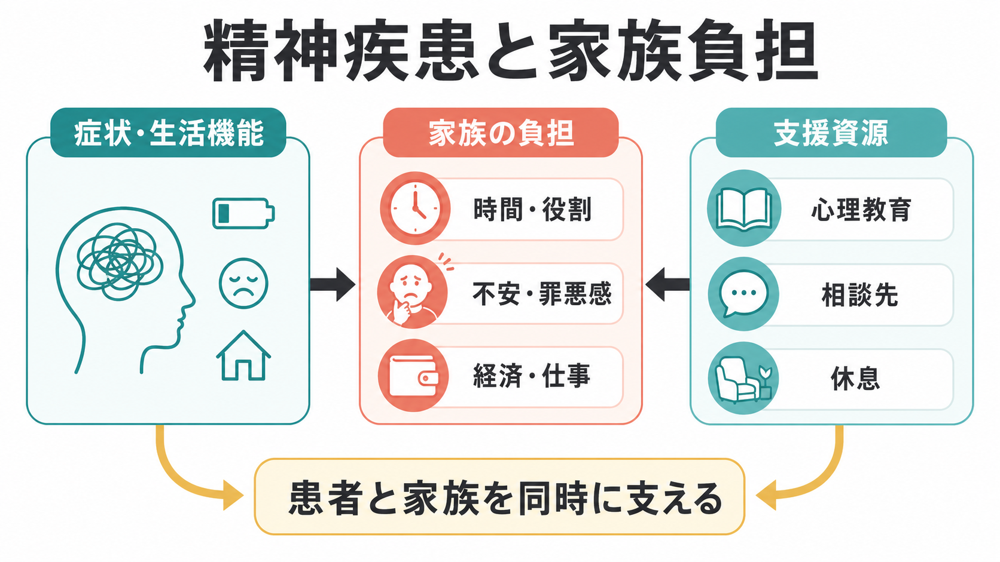
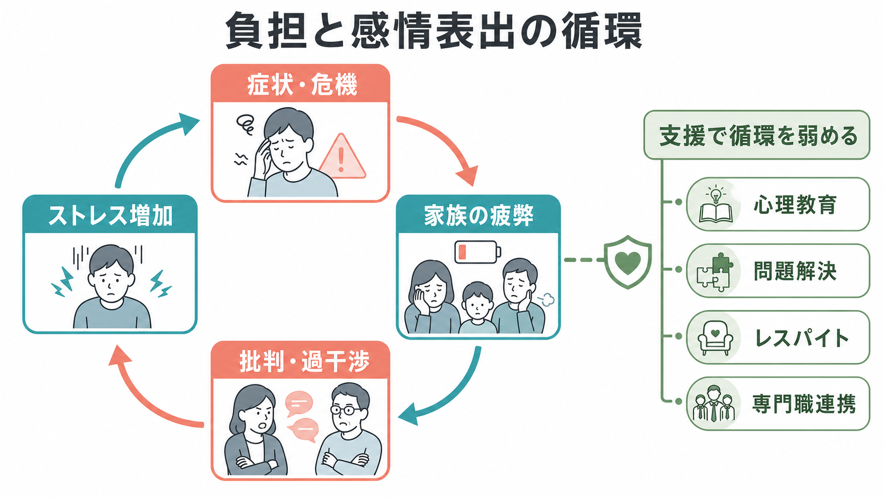
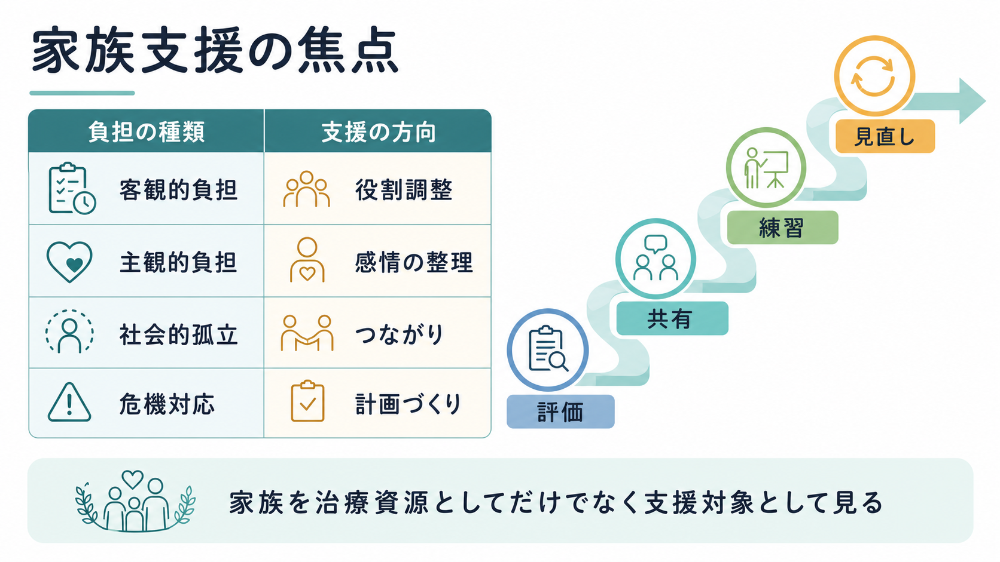

# 精神疾患と家族負担はどう関係するのか

## 要点

- [[精神疾患とは何か]]が長期化・再発化すると、家族は日常生活の支援、危機対応、経済的調整、感情的な心配を担いやすい。
- 家族負担は「客観的負担」と「主観的負担」に分けると整理しやすい。前者は時間・役割・費用、後者は不安、罪悪感、孤立、将来への見通しのなさを指す。
- 感情表出（expressed emotion; EE）は、批判、敵意、情緒的巻き込まれの高い家族環境を測る概念で、特に[[統合失調症とは何か]]の再発リスクと関連して研究されてきた[3]。
- 家族を「治療資源」としてだけ見ると、支援者側の消耗が見えにくくなる。本人の[[精神疾患の再発とは何か|再発予防]]と家族の健康を同時に扱う必要がある。
- 家族心理教育、問題解決、危機計画、レスパイト、福祉・地域資源への接続は、負担と再発リスクの悪循環を弱める実践的な支援である[4][5][6]。

## この記事で答える問い

この記事では、精神疾患と家族負担の関係を「家族がどれほど頑張るべきか」という道徳問題としてではなく、症状、生活機能、家族関係、支援制度が相互に影響する[[生物心理社会モデルとは何か|生物心理社会的]]な問題として整理する。

中心となる問いは、次の3つである。

1. 精神疾患は、家族にどのような負担を生じさせるのか。
2. 家族負担や感情表出は、本人の症状・再発・生活機能にどう関係するのか。
3. 患者と家族の双方を支えるために、どのような支援資源が重要なのか。

## まず結論

精神疾患と家族負担は一方向の因果ではなく、循環的に関係する。症状や生活機能の低下が家族の役割負担を増やし、家族の疲弊がコミュニケーションの硬さや危機対応の余裕のなさを生み、それが本人のストレスや再発リスクを高めることがある。一方で、家族心理教育、支援制度、専門職連携、危機時の計画が入ると、この循環は弱まりうる[4][5][6]。

重要なのは、家族を原因として責めないことである。感情表出の研究は、家族の批判や過干渉が再発と関連することを示してきたが、それは「家族が悪い」という意味ではない。むしろ、家族も慢性的な不確実性、睡眠不足、経済的圧迫、孤立のなかで反応している。したがって臨床的には、本人の治療だけでなく、家族の情報、休息、相談権、意思決定への関与範囲を整えることが必要になる[5]。

## 背景

精神疾患の家族負担は、[[重症精神障害とは何か]]、[[統合失調症とは何か]]、[[双極性障害とは何か]]、[[うつ病とは何か]]、依存症、認知症関連疾患などで特に問題になる。負担の程度は、診断名だけでなく、症状の急性度、陰性症状や認知機能障害、本人の生活機能、家族の同居状況、経済資源、地域支援の利用可能性によって変わる。

2022年までの研究を対象にしたシステマティックレビュー・メタ分析では、精神疾患をもつ人の介護者における介護負担の統合有病割合は約31.7%と推定され、入院環境や精神病症状をもつケースで高い傾向が報告された[1]。この数値は国・制度・尺度によって変わるが、家族負担が例外的な現象ではなく、精神医療の中心的な評価対象であることを示している。

家族負担が見落とされやすい理由は、家族が「当然支えるもの」と扱われやすいからである。しかし、精神疾患では症状の波、再発への不安、服薬・通院・金銭管理、対人トラブル、希死念慮や他害リスクへの心配など、日常的な見守りが長期化しやすい。家族は専門職ではないため、限られた情報と感情的な近さのなかで判断を迫られる。

## 基本概念

### 介護負担

介護負担は、本人を支えることで家族が受ける身体的、心理的、社会的、経済的な影響を指す。Zarit Burden Interview などの尺度では、介護が健康、社会生活、金銭面、感情面、人間関係に及ぼす主観的影響を測る考え方が広く使われている[2]。

精神疾患では、負担を次のように分けると理解しやすい。

| 種類 | 内容 | 例 |
|---|---|---|
| 客観的負担 | 外から観察しやすい負担 | 通院同行、金銭管理、家事代行、仕事の調整、緊急対応 |
| 主観的負担 | 本人の内面で経験される負担 | 不安、罪悪感、怒り、無力感、恥、将来への悲観 |
| 関係性の負担 | 家族関係の変化 | 親子・夫婦・きょうだい関係の役割固定、対立、距離の取りにくさ |
| 制度的負担 | 支援にアクセスする負担 | 相談先の不明瞭さ、手続きの複雑さ、支援の地域差 |

### 感情表出

感情表出は、家族が本人に向ける批判、敵意、情緒的巻き込まれを評価する研究概念である。統合失調症を中心に、感情表出の高い環境が再発と関連することが報告されてきた[3]。ただし、これは家庭内の雰囲気だけで再発が決まるという意味ではない。服薬、ストレス、睡眠、物質使用、社会的孤立、疾患の重症度なども再発に関わる。

臨床上は、感情表出を「家族の欠点」として扱うより、家族が追い込まれたときに起きやすいコミュニケーション・パターンとして理解するほうが有用である。批判が増える背景には、危機の反復、説明不足、支援の不在、休息の欠如があることが多い。

### 支援資源

支援資源には、医療者との[[家族面接では何を評価するべきか|家族面接]]、[[心理教育とは何か]]、相談窓口、訪問支援、デイケア、就労・生活支援、家族会、レスパイト、社会保障、危機時の[[クライシスプランとは何か]]などが含まれる。NICEは、精神病や統合失調症の本人だけでなく、家族・介護者に情報提供、支援、介護者自身のニーズ評価を行うことを推奨している[5]。

## 仕組み

家族負担が問題になる仕組みは、単純な「原因と結果」ではなく、複数の循環で捉えるとわかりやすい。

### 1. 症状と生活機能が役割負担を増やす

幻覚・妄想、抑うつ、躁状態、不安、強迫、依存、認知機能障害、陰性症状などが強い時期には、本人が家事、金銭管理、服薬、通院、対人関係、仕事や学業を維持しにくくなる。すると家族が代替的に役割を担い、時間的・経済的な負担が増える。特に同居家族では、本人の生活リズムの乱れが家族の睡眠や仕事に直接影響する。

### 2. 不確実性が主観的負担を高める

精神疾患では、症状の変動や再発の兆候が見えにくいことがある。家族は「どこまで見守るべきか」「受診を促すべきか」「本人の意思を尊重する範囲はどこまでか」という判断に悩む。[[共同意思決定とは何か]]が不十分なまま家族に責任だけが残ると、罪悪感や過覚醒が強まりやすい。

### 3. 疲弊がコミュニケーションを硬くする

家族が慢性的に疲弊すると、注意、説得、監視、批判、感情的な反応が増えやすい。本人側から見ると、それは支援ではなく圧迫や否定として経験されることがある。結果として、本人のストレス、回避、怒り、孤立が増え、家族側はさらに不安になって関与を強める。この循環が、感情表出の研究で問題にされてきた関係性の一部である[3]。

### 4. 支援資源が循環を弱める

家族心理教育や家族介入は、疾患理解、再発サインの共有、問題解決、コミュニケーション練習、危機計画を通じて、本人と家族の双方に働きかける。Cochraneレビューでは、統合失調症に対する家族介入が再発や入院を減らす可能性が示されているが、研究品質の限界にも注意が必要である[4]。WHO mhGAPも、精神病の維持期に家族介入・家族心理教育・心理教育などの心理社会的介入を提供することを推奨している[6]。

## 図解

この図の要点は、支援を「本人の症状を管理するために家族を教育する」だけに狭めないことである。家族支援には、少なくとも次の4つの焦点がある。

| 焦点 | 評価すること | 支援の方向 |
|---|---|---|
| 情報 | 疾患、治療、再発サイン、制度を理解できているか | わかりやすい説明、心理教育、書面化 |
| 役割 | 家族の役割が過剰に固定されていないか | 役割調整、専門職・福祉への分担 |
| 感情 | 不安、怒り、罪悪感、孤立が強くないか | 家族面接、家族会、相談先、休息 |
| 危機 | 悪化時に誰が何をするか決まっているか | クライシスプラン、緊急連絡先、同意範囲の確認 |

## 臨床・研究との接続

臨床では、家族負担を「付随情報」ではなく、本人の治療計画の一部として評価する必要がある。たとえば[[精神科治療計画はどのように立てるのか|治療計画]]では、本人の症状、生活機能、服薬、睡眠、物質使用だけでなく、家族が担っている役割、家族の睡眠、仕事、経済、孤立、相談先を確認する。

研究上は、家族負担、感情表出、再発、生活機能、QOL、支援利用の関係を同時に測ることが重要である。介入研究では、本人の再発率だけでなく、家族の負担、抑うつ、不安、介護者QOL、サービス利用、費用対効果も評価する必要がある。近年のレビューでは、家族心理教育が統合失調症の家族介護者負担を軽減する可能性が検討されているが、研究数や方法のばらつきがあり、どの要素が最も効くのかはさらに検証が必要である[7]。

また、家族介入は統合失調症だけのものではない。[[双極性障害とは何か]]では再発サインと生活リズム、[[うつ病とは何か]]では自殺リスクと過剰な巻き込まれ、依存症では境界設定と再使用時の対応、認知症関連疾患ではBPSDとレスパイトなど、疾患ごとに焦点が異なる。認知行動的家族介入のレビューも、重症精神疾患をもつ本人と家族の支援可能性を示している[8]。

## よくある誤解

### 「家族のせいで再発する」という意味ではない

感情表出と再発の関連は、家族を責めるための理論ではない。家族の批判や過干渉は、しばしば不安、孤立、支援不足、説明不足の結果として生じる。臨床的な焦点は、責任追及ではなく、再発リスクを下げるコミュニケーションと支援環境を作ることである。

### 「家族は治療チームに必ず入るべき」とも限らない

家族関与は本人の同意、関係性、安全性、プライバシーを踏まえて調整する必要がある。虐待、暴力、支配的関係、深刻な対立がある場合、家族関与は慎重に設計する。[[守秘義務とは何か]]と本人の意思を尊重しつつ、共有可能な情報の範囲を具体化する。

### 「心理教育だけで十分」ではない

情報提供は必要だが、それだけでは負担は下がらないことがある。家族が本当に必要としているのは、危機時の連絡先、休める時間、金銭・住居・就労支援、本人との距離の取り方、感情を言語化できる場である。[[地域連携は精神科診療で何を意味するのか]]や[[社会的処方とは何か]]の視点が重要になる。

### 「家族が支えれば支えるほどよい」わけではない

過剰な支援は、家族の消耗だけでなく、本人の自律性の低下や関係性の固定化につながることがある。支援の目標は、家族がすべてを抱えることではなく、本人の回復、家族の健康、専門職・地域資源の分担を同時に成立させることである。

## 関連ノート

- [[精神疾患とは何か]]
- [[重症精神障害とは何か]]
- [[統合失調症とは何か]]
- [[精神疾患の再発とは何か]]
- [[心理教育とは何か]]
- [[家族面接では何を評価するべきか]]
- [[家族への説明で何に注意するべきか]]
- [[クライシスプランとは何か]]
- [[地域連携は精神科診療で何を意味するのか]]
- [[共同意思決定とは何か]]
- [[社会的処方とは何か]]
- [[生物心理社会モデルとは何か]]

MOC更新候補: `content/00_MOC/` 配下の精神医学、臨床実践、地域支援・家族支援に関するMOCがある場合、本記事を追加候補にする。

## 理解チェック

1. 家族負担を「客観的負担」と「主観的負担」に分けると、どのような見落としを防げるか。
2. 感情表出の概念を、家族を責めずに臨床で使うにはどう説明すればよいか。
3. 家族心理教育が再発予防に役立つと考えられる経路を、症状・ストレス・コミュニケーションの観点から説明できるか。
4. 家族を治療資源としてだけでなく支援対象として見ると、治療計画に何を追加すべきか。

## 参考文献

[1] Abdul Rahman, A., et al. (2022). Caregiver Burden among Caregivers of Patients with Mental Illness: A Systematic Review and Meta-Analysis. *Healthcare*, 10(12), 2423. https://doi.org/10.3390/healthcare10122423

[2] Bachner, Y. G., & O'Rourke, N. (2007). Reliability generalization of responses by care providers to the Zarit Burden Interview. *Aging & Mental Health*, 11(6), 678-685. https://doi.org/10.1080/13607860701529965

[3] Butzlaff, R. L., & Hooley, J. M. (1998). Expressed Emotion and Psychiatric Relapse: A Meta-analysis. *Archives of General Psychiatry*, 55(6), 547-552. https://doi.org/10.1001/archpsyc.55.6.547

[4] Pharoah, F., Mari, J. J., Rathbone, J., & Wong, W. (2010). Family intervention for schizophrenia. *Cochrane Database of Systematic Reviews*, 12, CD000088. https://doi.org/10.1002/14651858.CD000088.pub3

[5] National Institute for Health and Care Excellence. (2014). *Psychosis and schizophrenia in adults: prevention and management* (CG178). https://www.nice.org.uk/guidance/cg178

[6] World Health Organization. (2023 updated). Psychoeducation, family interventions and cognitive-behavioural therapy. mhGAP Evidence Centre. https://www.who.int/teams/mental-health-and-substance-use/treatment-care/mental-health-gap-action-programme/evidence-centre/psychosis-and-bipolar-disorders/psychoeducation-family-interventions-and-cognitive-behavioural-therapy

[7] Okafor, A. J., & Monahan, M. (2023). Effectiveness of Psychoeducation on Burden among Family Caregivers of Adults with Schizophrenia: A Systematic Review and Meta-Analysis. *Nursing Research and Practice*, 2023, 2167096. https://doi.org/10.1155/2023/2167096

[8] Ma, C. F., Chan, S. K. W., Chien, W. T., Bressington, D., Mui, E. Y. W., Lee, E. H. M., & Chen, E. Y. H. (2020). Cognitive behavioural family intervention for people diagnosed with severe mental illness and their families: A systematic review and meta-analysis of randomized controlled trials. *Journal of Psychiatric and Mental Health Nursing*, 27(2), 128-139. https://doi.org/10.1111/jpm.12567

## 未解決問題

- 家族介入のどの成分、すなわち心理教育、問題解決、コミュニケーション練習、レスパイト、制度接続のどれが、どの家族に最も有効か。
- 家族負担を下げる介入が、本人の長期的な生活機能、就労、社会参加、QOLにどの程度つながるか。
- 同居家族、別居家族、きょうだい、パートナー、子どもなど、家族内の立場ごとに必要な支援をどう設計するか。
- 家族が関与しにくい、または関与しないほうがよいケースで、本人の支援ネットワークをどう作るか。
