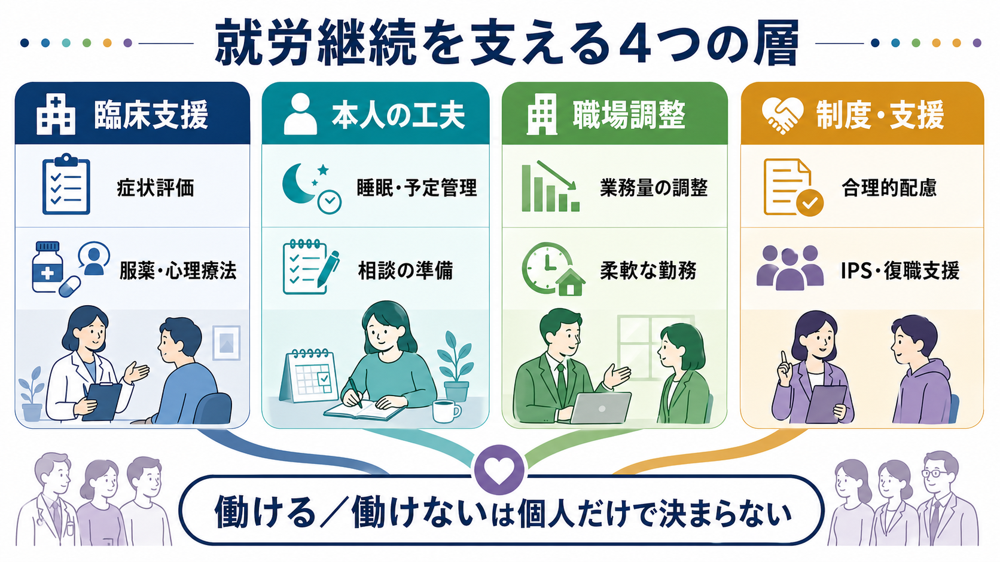
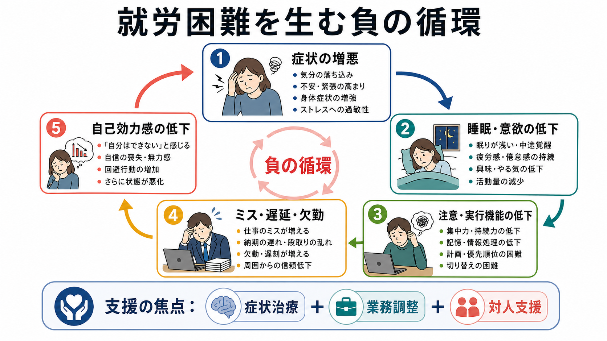

# 精神疾患と就労困難はどう関係するのか

## 要点

- 精神疾患による就労困難は、「病名」だけで決まるのではなく、症状の強さ、認知機能、対人関係、職場環境、社会制度が組み合わさって生じる。
- [[うつ病とは何か]]、[[不安症群とは何か]]、[[双極性障害とは何か]]、[[統合失調症とは何か]]、[[適応障害とは何か]]などでは、欠勤だけでなく、出勤していても能率や安全性が下がるプレゼンティーズムが問題になる。
- 就労支援は「症状を治せば終わり」ではなく、業務量、裁量、対人負荷、通院しやすさ、合理的配慮、復職支援を含む多層的な調整として考える必要がある。

## この記事で答える問い

精神疾患があると、なぜ仕事を続けることが難しくなるのか。この記事では、個人の能力不足として単純化せず、症状、認知、対人関係、職場環境がどのように相互作用して就労継続を難しくするのかを整理する。

## まず結論

精神疾患と就労困難の関係は、線形の因果ではない。たとえば抑うつ症状が強まると睡眠、意欲、集中、処理速度が落ち、ミスや遅延が増える。すると自己効力感が下がり、上司や同僚への相談が遅れ、さらに症状が悪化する。この循環に、長時間労働、低い裁量、支援の乏しさ、スティグマ、通院しにくい勤務形態が重なると、休職、離職、再発が起こりやすくなる[1][2]。

反対に、症状評価、治療、職場調整、本人の希望に沿った就労支援が組み合わさると、重い精神疾患があっても就労参加の可能性は高まる。個別の診断や治療方針は医療者と相談すべきだが、研究・教育上は「働けるかどうか」を個人の内側だけで説明しないことが重要である[2][7][8]。

## 背景

精神疾患は、世界的に労働年齢人口の健康と生産性に大きな影響を与える。WHOは、うつ病や不安症を含むメンタルヘルスの問題が労働損失と生活の質に大きく関わるとし、職場での予防、保護、支援を組み合わせる必要を強調している[1][2]。OECDも、精神疾患と就労困難を医療だけでなく教育、雇用、社会保障の課題として扱うべきだと述べている[3]。

就労困難には、失業や休職だけでなく、遅刻、早退、欠勤、業務遂行の低下、対人トラブル、職場での孤立、復職後の再休職も含まれる。したがって、[[職場メンタルヘルスで多い疾患には何があるのか]]を理解するときも、「診断名」より「どの機能が、どの職務要件とぶつかっているか」を見る必要がある。

## 基本概念

**症状**は、気分の落ち込み、不安、パニック、躁状態、幻覚・妄想、睡眠障害、疲労、意欲低下などを指す。症状が強いほど、出勤、集中、意思決定、対人応答が難しくなりやすい。

**認知機能**は、注意、作業記憶、処理速度、実行機能、学習、社会認知を含む。[[統合失調症の認知機能障害とは何か]]で典型的に問題になるが、うつ病や双極性障害でも、症状が軽くなった後に認知機能の低下が残り、業務効率や復職に影響することがある[5][6]。

**対人関係**は、報告・連絡・相談、あいまいな指示の解釈、叱責への反応、チーム作業、顧客対応を含む。精神疾患では、過度な自己責任感、被害的な解釈、回避、不安、感情調整の難しさが、相談の遅れや孤立につながる。

**職場環境**は、業務量、裁量、勤務時間、心理的安全性、上司の支援、配置、評価制度、休暇制度を含む。職場の心理社会的ストレス要因は、精神疾患の発症や悪化リスクと関連することが示されている[4]。

## 仕組み

### 1. 症状が出勤と持続力を下げる

抑うつでは、睡眠障害、疲労、興味の低下、罪責感が、朝の起床、通勤、長時間の集中を難しくする。[[不安症群とは何か]]では、予期不安や身体症状が会議、電話、顧客対応を避ける方向に働く。[[双極性障害とは何か]]では、抑うつ期の機能低下に加え、躁・軽躁状態で睡眠不足、過活動、衝動的判断が問題になることがある。

### 2. 認知機能が「できるはずの作業」を難しくする

仕事は、単に知識を持っているだけでは遂行できない。予定を立てる、優先順位をつける、途中で切り替える、ミスを検出する、相手の意図を読む、といった認知機能が必要である。うつ病では認知症状が仕事の生産性低下と関連し、統合失調症では神経認知が就労成績と関連することが報告されている[5][6]。

### 3. 対人関係が支援への接続を左右する

症状が悪化したとき、早めに相談できれば業務量や締切を調整できる。しかし、スティグマへの不安、叱責への恐れ、過去の対人失敗、自己開示への抵抗があると、相談は遅れやすい。結果として、周囲からは「突然休んだ」「責任感がない」と見え、本人は「理解されない」と感じる。このすれ違いが、さらに孤立と症状悪化を招く。

### 4. 職場環境が脆弱性を増幅または緩和する

同じ症状でも、職場環境によって就労への影響は大きく変わる。たとえば、裁量があり、短時間勤務や在宅勤務、通院配慮、業務の優先順位づけが可能な職場では、症状の波を吸収しやすい。逆に、長時間労働、低裁量、高い対人負荷、曖昧な評価、相談しにくい文化があると、症状の小さな変動が大きな就労困難へ拡大する[2][4]。

## 図解

## 臨床・研究との接続

臨床では、就労困難を「休ませるか、働かせるか」という二択で捉えない。評価すべきなのは、症状の重症度、自殺リスク、睡眠、薬物療法の副作用、認知機能、家庭・経済状況、職務内容、職場の支援資源である。[[精神疾患の寛解とは何か]]で扱う症状の軽減と、実際に働ける機能回復は一致しないことがある。

重い精神疾患では、本人の希望に基づいて一般就労を目指す Individual Placement and Support、すなわち IPS 型の援助付き雇用が、従来型の訓練中心モデルより競争的就労を増やすことが示されている[7]。これは、[[重症精神障害とは何か]]を「就労不能」と同一視しないための重要な根拠である。

日本の復職支援では、主治医、産業医、人事労務、上司、本人が情報を整理し、段階的な復職、業務調整、再発予防を検討する枠組みが示されている[8]。ただし、医療情報の共有は本人の同意とプライバシー保護を前提にする必要がある。

## よくある誤解

**誤解1: 診断名が同じなら必要な配慮も同じである。**  
同じ[[大うつ病性障害とは何か]]でも、主な問題が睡眠なのか、認知症状なのか、対人不安なのか、身体症状なのかで必要な支援は変わる。

**誤解2: 休職すれば自然に元の働き方に戻れる。**  
症状が軽くなっても、体力、生活リズム、認知負荷、対人負荷、職場の変化への再適応が必要になる。復職は「元に戻る」だけでなく、再発しにくい働き方を作り直す過程でもある。

**誤解3: 職場配慮は甘やかしである。**  
合理的な調整は、本人だけを特別扱いするためではなく、職務要件と健康状態のミスマッチを減らし、安全で持続可能な就労を可能にするための環境調整である。

**誤解4: 働けないのは意欲がないからである。**  
意欲低下は症状そのもの、睡眠障害、薬の副作用、認知機能低下、失敗経験、職場での孤立から生じうる。道徳的評価に置き換えると、適切な評価と支援が遅れる。

## 関連ノート

- [[職場メンタルヘルスで多い疾患には何があるのか]]
- [[うつ病とは何か]]
- [[大うつ病性障害とは何か]]
- [[不安症群とは何か]]
- [[双極性障害とは何か]]
- [[統合失調症とは何か]]
- [[統合失調症の認知機能障害とは何か]]
- [[適応障害とは何か]]
- [[バーンアウトとは何か]]
- [[精神疾患の寛解とは何か]]

## MOC更新候補

- `content/00_MOC/` 配下の精神医学、臨床実践、職場メンタルヘルス関連 MOC に追加候補。
- 並列ジョブとの衝突を避けるため、本記事作成時点では MOC 本体は更新していない。

## 理解チェック

1. 精神疾患による就労困難を、症状だけで説明すると何を見落とすか。
2. 認知機能の低下は、欠勤以外にどのような業務上の問題として現れるか。
3. 職場環境は、症状の影響をどのように増幅または緩和するか。
4. IPS 型の援助付き雇用が示す重要な考え方は何か。

## 未解決問題

- 精神疾患ごとの診断カテゴリと、職務別に必要な認知・対人機能をどう対応づけるか。
- 在宅勤務、ハイブリッド勤務、短時間勤務が、どの症状群には有効で、どの症状群では孤立や回避を強めるのか。
- 合理的配慮の効果を、本人の満足度、再休職率、職場全体の公平感、業務成果を含めてどう評価するか。

## 参考文献

[1] World Health Organization. (2024). *Mental health at work*. https://www.who.int/news-room/fact-sheets/detail/mental-health-at-work

[2] World Health Organization. (2022). *WHO guidelines on mental health at work*. https://www.who.int/publications/i/item/9789240053052

[3] OECD. (2015). *Fit Mind, Fit Job: From Evidence to Practice in Mental Health and Work*. https://doi.org/10.1787/9789264228283-en

[4] Harvey, S. B., Modini, M., Joyce, S., et al. (2017). Can work make you mentally ill? A systematic meta-review of work-related risk factors for common mental health problems. *Occupational and Environmental Medicine, 74*(4), 301-310. https://doi.org/10.1136/oemed-2016-104015

[5] Lam, R. W., McIntosh, D., Wang, J., et al. (2016). Cognitive dysfunction in major depressive disorder: Effects on psychosocial functioning and implications for treatment. *The Canadian Journal of Psychiatry, 61*(11), 649-654. https://doi.org/10.1177/0706743716659416

[6] McGurk, S. R., & Mueser, K. T. (2004). Cognitive functioning, symptoms, and work in supported employment: A review and heuristic model. *Schizophrenia Research, 70*(2-3), 147-173. https://doi.org/10.1016/j.schres.2004.01.009

[7] Kinoshita, Y., Furukawa, T. A., Kinoshita, K., et al. (2013). Supported employment for adults with severe mental illness. *Cochrane Database of Systematic Reviews*, CD008297. https://doi.org/10.1002/14651858.CD008297.pub2

[8] 厚生労働省. (2020). *心の健康問題により休業した労働者の職場復帰支援の手引き*. https://www.mhlw.go.jp/stf/seisakunitsuite/bunya/0000055195.html
