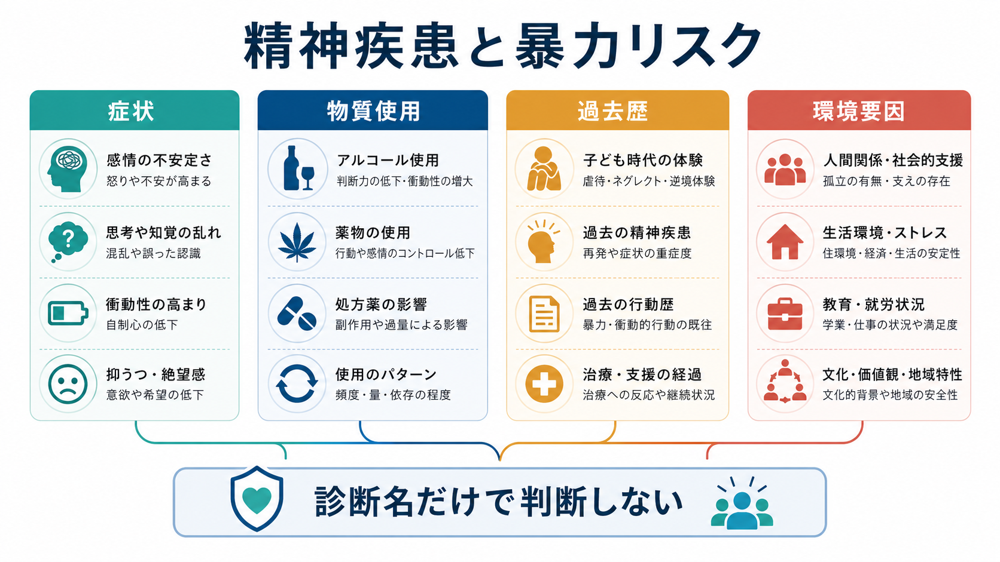
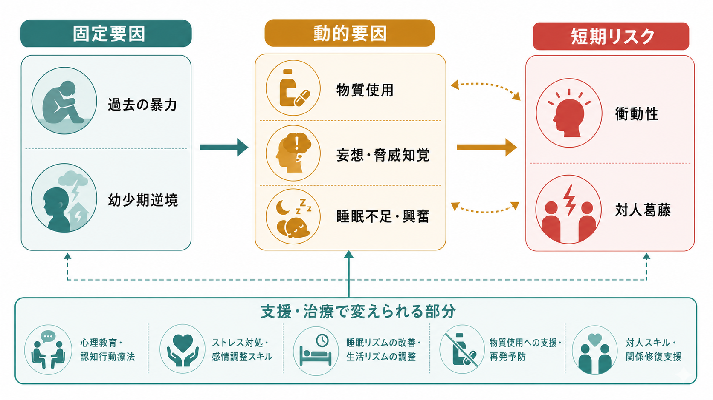
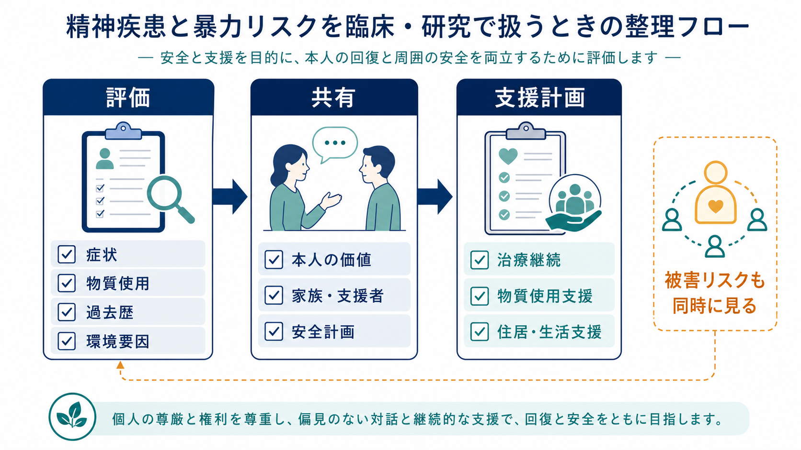

# 精神疾患と暴力リスクはどう関係するのか

## 要点

- 「精神疾患があるから暴力的」とは言えない。大規模疫学研究では、重い精神疾患そのものよりも、物質使用、過去の暴力、被害経験、離別・失業などの文脈要因を合わせて見る必要が示されている[1]。
- [[統合失調症とは何か]]などの精神病性障害では、暴力リスクの上昇が報告されることがあるが、物質使用障害の併存や犯罪歴を分けると解釈は大きく変わる[2][3]。
- 臨床で重要なのは、診断名で人を危険視することではなく、「変えられるリスク」を見つけ、安全、治療継続、生活支援、被害予防につなげることである[4][5]。
- 重い精神疾患をもつ人は、加害者としてだけでなく、暴力被害のリスクも高い。安全評価では、本人が他者に及ぼすリスクと、本人が受けるリスクを同時に扱う必要がある[6]。

## この記事で答える問い

1. 精神疾患と暴力リスクの関連は、どの程度まで「疾患」そのものに帰せるのか。
2. 症状、物質使用、過去歴、環境要因は、どのように分けて考えるべきか。
3. 臨床・研究では、スティグマを避けながらリスクをどう扱うべきか。

## まず結論

精神疾患と暴力リスクの関係は、「診断名だけで決まる単純な関係」ではない。研究全体から見ると、暴力リスクは、過去の暴力、若年、男性、物質使用、被害経験、離別、失業、脅威知覚、治療中断、急性興奮などが重なったときに上がりやすい[1][4]。そのため、[[双極性障害とは何か]]、[[うつ病とは何か]]、[[統合失調症とは何か]]といった診断名は重要な情報ではあるが、それだけでは不十分である。

## 背景

精神疾患と暴力は、メディア報道や司法・医療政策で強く結びつけて語られやすい。しかし、その語られ方が過剰になると、精神疾患のある人への恐怖、差別、受診回避を助長する。概説的レビューでは、精神疾患は暴力の「必要条件」でも「十分条件」でもなく、社会経済的要因、物質使用、過去歴などの一般的リスク要因を含めて考える必要があると整理されている[7]。

一方で、精神科臨床が暴力リスクを扱わなくてよいわけではない。急性期病棟、救急、地域支援、家族支援では、興奮、恐怖、被害妄想、薬物・アルコール、睡眠不足、退院直後の生活不安定などが重なり、安全上の問題が起こることがある。NICE の暴力・攻撃性マネジメント指針も、本人と周囲の安全を守るため、予防、早期対応、本人中心の意思決定を重視している[5]。

退院後 1 年を追跡した MacArthur Violence Risk Assessment Study でも、精神科入院歴そのものより、物質使用症状を含む併存要因を分けて読む必要が示された[8]。

## 基本概念

### 暴力リスク

ここでいう暴力リスクとは、他者に対する身体的暴力、脅迫、重大な攻撃行動が生じる可能性を指す。ただし、研究によっては言語的攻撃、器物破損、逮捕・有罪判決、自己申告、家族・支援者の報告など、アウトカムの定義が異なる。したがって、「何を暴力として測った研究か」を確認しないと、リスクの大きさを比較しにくい。

### 固定要因と動的要因

暴力リスク評価では、変えにくい固定要因と、支援で変えられる動的要因を分けると見通しがよい。

| 区分 | 例 | 臨床上の意味 |
|---|---|---|
| 固定要因 | 過去の暴力、幼少期逆境、過去の司法歴 | 将来リスクの背景情報。消せないが、支援計画の濃さを決める材料になる。 |
| 動的要因 | [[物質使用障害とは何か]]、[[アルコール使用障害とは何か]]、服薬中断、睡眠不足、急性興奮、脅威知覚 | 介入可能性が高い。短期リスクの変化を追う指標になる。 |
| 環境要因 | 失業、離別、孤立、住居不安定、支援者不在、被害経験 | 個人の症状だけでは説明できないリスクを作る。社会的支援の対象になる。 |
| 保護因子 | 治療継続、信頼できる支援者、生活安定、本人の価値・目標、安全計画 | リスクを下げる方向に働く。本人中心の計画に組み込む。 |

## 仕組み

### 1. 診断名だけでは予測力が弱い

米国の NESARC データを用いた縦断研究では、重い精神疾患がある群で暴力行動の割合は高く見えたが、重い精神疾患単独では将来の暴力を独立して予測しなかった。重要だったのは、過去の暴力、若年、男性、身体的虐待歴、離別、失業、被害経験、物質使用、脅威を感じやすいことなどであった[1]。この知見は、診断名を入口にしつつも、実際の評価では複数のリスク領域を分ける必要があることを示している。

### 2. 物質使用はリスクを大きく変える

スウェーデンの登録研究では、統合失調症のある人の暴力犯罪リスクは、物質使用障害の併存がある場合に大きく上がった。一方で、物質使用障害を伴わない場合の過剰リスクはより小さく、同胞比較を含めると家族・社会的背景の影響も示唆された[2]。これは、[[物質誘発性精神病とは何か]]や[[中毒性精神障害とは何か]]の理解ともつながる。

### 3. 精神病性症状の内容と文脈が重要である

精神病圏の 110 研究を統合したメタ解析では、犯罪歴、物質使用、衝動統制の乏しさ、敵意、最近のアルコール・薬物使用、治療不遵守などが暴力リスクと関連した。陰性症状や神経心理学的要因は、一貫して強い関連を示したわけではなかった[4]。したがって、[[統合失調症の陽性症状とは何か]]や[[妄想性障害とは何か]]に含まれる症状でも、「誰に脅かされていると感じるか」「現実検討がどの程度保たれているか」「物質使用や睡眠不足が重なっているか」を見る必要がある。

### 4. 過去歴は強いが、未来を決定しない

過去の暴力は、多くの研究で将来の暴力の強い予測因子である[1][4]。ただし、これは「その人は変わらない」という意味ではない。過去歴は、支援の密度、危機時連絡先、物質使用への介入、住居・家族支援、退院後フォローアップを厚くするための情報である。

### 5. 環境要因と被害経験がリスクを作る

離別、失業、被害経験、孤立、住居不安定は、症状とは別に暴力リスクを押し上げることがある[1]。また、重い精神疾患のある成人は、近時の身体的・性的暴力被害のリスクも高いことがメタ解析で示されている[6]。つまり、臨床評価では「この人が危険か」だけでなく、「この人が危険にさらされていないか」を同時に問う必要がある。

## 図解

上の図は、暴力リスクを固定要因、動的要因、短期リスク、支援可能な部分に分けている。固定要因は背景として重要だが、それだけを強調するとスティグマになりやすい。臨床的には、物質使用、睡眠、興奮、脅威知覚、対人葛藤、支援者の有無など、今後数日から数週間で変わる要素を追うほうが実践的である。

## 臨床・研究との接続

### リスク評価は「危険人物探し」ではない

リスク評価の目的は、本人の尊厳と権利を守りながら、本人と周囲の安全を高めることである。NICE 指針は、暴力・攻撃性の短期マネジメントを、予防、早期認識、本人中心の意思決定、必要最小限の介入として整理している[5]。これは、リスクを罰や排除の理由にするのではなく、支援計画の入力として扱う姿勢である。

### 実務では 4 領域で聞く

1. 症状: 妄想、幻聴、脅威知覚、興奮、睡眠不足、躁状態、抑うつ、希死念慮。
2. 物質使用: アルコール、覚醒剤、大麻、処方薬過量、離脱、使用頻度の増加。
3. 過去歴: 過去の暴力、司法歴、被害歴、幼少期逆境、退院直後の再燃歴。
4. 環境要因: 住居、失業、離別、孤立、家族葛藤、支援者、治療アクセス。

この 4 領域は、[[PTSDとは何か]]、[[トラウマ関連障害群とは何か]]、[[パーソナリティ障害群とは何か]]、[[反社会性パーソナリティ障害とは何か]]、[[認知症とは何か]]、[[せん妄と認知症はどう違うのか]]など、多くの臨床テーマを横断する。

### 研究では交絡と測定の違いに注意する

研究を読むときは、少なくとも次を確認する。

- 暴力の定義が、自己申告、家族報告、逮捕、有罪判決、病棟内インシデントのどれか。
- 物質使用障害、過去の暴力、社会経済状況、被害経験を統制しているか。
- 絶対リスクと相対リスクを区別しているか。
- 診断群の平均値を、個人の将来行動にそのまま当てはめていないか。
- 加害リスクだけでなく、被害リスクと治療アクセスも扱っているか。

## よくある誤解

### 誤解1: 精神疾患がある人は暴力的である

多くの人は暴力を行わない。精神疾患は暴力の必要条件でも十分条件でもなく、暴力の大部分は精神疾患だけでは説明できない[7]。診断名だけで危険視することは、臨床的にも倫理的にも不正確である。

### 誤解2: 精神病性症状があれば必ず危険である

精神病性症状の存在だけでは不十分である。脅威を感じる内容、切迫感、命令性幻聴、物質使用、睡眠不足、対人葛藤、支援者不在などが重なるかどうかが重要である[4]。

### 誤解3: 物質使用は副次的な問題である

物質使用は副次的ではない。統合失調症や気分障害のある人でも、物質使用障害の併存は暴力リスクの解釈を大きく変える[1][2]。[[依存症とうつ病はどう併存するのか]]や[[依存症とADHDはどう関係するのか]]のように、併存を分けて評価することが必要である。

### 誤解4: リスク評価は本人の自由を制限するために行う

リスク評価は、本人の権利を尊重しながら、安全、治療継続、生活支援、危機時の選択肢を増やすために行う。本人の価値や希望を聞かずに、周囲だけで決める評価は、支援の質を下げる。

## 関連ノート

- [[統合失調症とは何か]]
- [[双極性障害とは何か]]
- [[うつ病とは何か]]
- [[物質使用障害とは何か]]
- [[アルコール使用障害とは何か]]
- [[物質誘発性精神病とは何か]]
- [[PTSDとは何か]]
- [[トラウマ関連障害群とは何か]]
- [[パーソナリティ障害群とは何か]]
- [[反社会性パーソナリティ障害とは何か]]
- [[気分障害における自殺リスクとは何か]]

## MOC更新候補

- [[MOC｜精神医学]]
- [[MOC｜臨床実践・治療]]
- [[MOC｜倫理・哲学・社会]]

## 理解チェック

1. 「診断名だけで暴力リスクを判断しない」とは、具体的に何を追加で見るという意味か。
2. 固定要因と動的要因を分けると、支援計画はどう変わるか。
3. 物質使用障害の併存は、精神疾患と暴力リスクの解釈をどう変えるか。
4. 加害リスクと被害リスクを同時に見る必要があるのはなぜか。

## 未解決問題

- 個人レベルの短期リスク予測は、集団レベルの相対リスクよりも難しい。予測精度、偽陽性、権利制限のバランスをどう取るかは継続的な課題である。
- 物質使用、住居不安定、孤立、被害経験への介入が、どの程度暴力リスクを下げるかは、研究デザインによって結論が変わりうる。
- 日本の地域精神医療、司法、福祉制度の文脈で、海外研究の知見をどこまで一般化できるかは慎重に検討する必要がある。

## 参考文献

[1] Elbogen, E. B., & Johnson, S. C. (2009). The intricate link between violence and mental disorder: Results from the National Epidemiologic Survey on Alcohol and Related Conditions. *Archives of General Psychiatry, 66*(2), 152-161. https://doi.org/10.1001/archgenpsychiatry.2008.537

[2] Fazel, S., Långström, N., Hjern, A., Grann, M., & Lichtenstein, P. (2009). Schizophrenia, substance abuse, and violent crime. *JAMA, 301*(19), 2016-2023. https://doi.org/10.1001/jama.2009.675

[3] Fazel, S., Gulati, G., Linsell, L., Geddes, J. R., & Grann, M. (2009). Schizophrenia and violence: Systematic review and meta-analysis. *PLoS Medicine, 6*(8), e1000120. https://doi.org/10.1371/journal.pmed.1000120

[4] Witt, K., van Dorn, R., & Fazel, S. (2013). Risk factors for violence in psychosis: Systematic review and meta-regression analysis of 110 studies. *PLoS ONE, 8*(2), e55942. https://doi.org/10.1371/journal.pone.0055942

[5] National Institute for Health and Care Excellence. (2015). *Violence and aggression: Short-term management in mental health, health and community settings* (NICE guideline NG10). Last reviewed 11 July 2024. https://www.nice.org.uk/guidance/ng10

[6] Khalifeh, H., Oram, S., Osborn, D., Howard, L. M., & Johnson, S. (2016). Recent physical and sexual violence against adults with severe mental illness: A systematic review and meta-analysis. *International Review of Psychiatry, 28*(5), 433-451. https://doi.org/10.1080/09540261.2016.1223608

[7] Stuart, H. (2003). Violence and mental illness: An overview. *World Psychiatry, 2*(2), 121-124. https://pmc.ncbi.nlm.nih.gov/articles/PMC1525086/

[8] Steadman, H. J., Mulvey, E. P., Monahan, J., Robbins, P. C., Appelbaum, P. S., Grisso, T., Roth, L. H., & Silver, E. (1998). Violence by people discharged from acute psychiatric inpatient facilities and by others in the same neighborhoods. *Archives of General Psychiatry, 55*(5), 393-401. https://doi.org/10.1001/archpsyc.55.5.393
