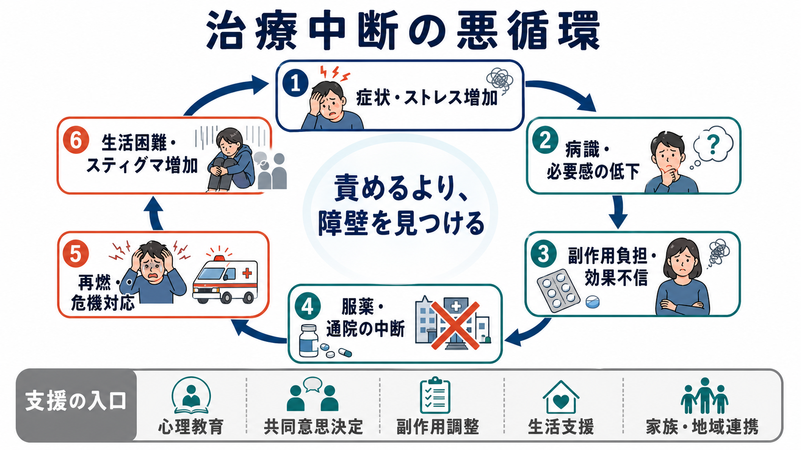
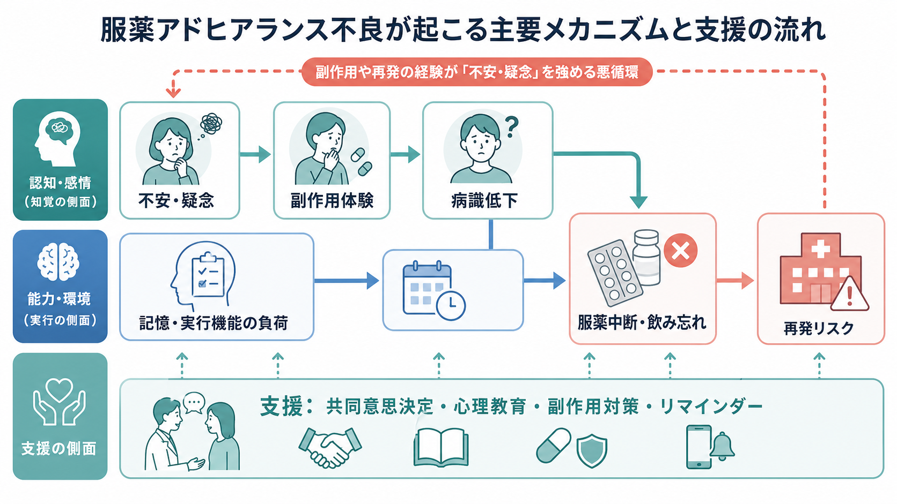

# 精神疾患と服薬アドヒアランス不良はどう関係するのか

## 要点

- 服薬アドヒアランス不良は「怠慢」ではなく、症状、病識、認知機能、副作用、薬への信念、生活環境、医療者との関係が重なって起こる多因子現象である。
- 精神疾患では、症状の波、妄想的解釈、躁状態の高揚感、うつ病の意欲低下、認知機能障害が、服薬を続ける力そのものを弱めうる。
- 支援の中心は、説得よりも、薬への不安を聞くこと、副作用を具体的に扱うこと、本人の目標と治療選択を結び直すことである。
- 長期注射薬、服薬リマインダー、家族・地域支援、心理教育は有用だが、本人の価値観を置き去りにすると逆に不信を強める。

## この記事で答える問い

この記事では、[[統合失調症とは何か]]、[[双極性障害とは何か]]、[[うつ病とは何か]]などの精神疾患で、なぜ服薬アドヒアランス不良が起こりやすいのかを整理する。特に、[[病識とは何か]]、[[病識欠如とは何か]]、[[拒薬とは何か]]、[[心理教育とは何か]]、[[共同意思決定とは何か]]、[[治療関係とは何か]]とのつながりを重視する。

## まず結論

精神疾患における服薬アドヒアランス不良は、「薬を飲むか飲まないか」という単純な行動ではない。WHO は長期治療のアドヒアランスを、患者要因だけでなく、疾患、治療、医療制度、社会経済的条件が相互作用する問題として整理している[1]。NICE も、服薬支援の出発点を「患者を処方薬に関する意思決定に関与させること」としており、医療者が一方的に正解を伝えるモデルではなく、本人が納得できる選択を支えるモデルを推奨している[2]。

精神疾患では、この構造がさらに複雑になる。精神病症状では薬や医療者への疑念が強まり、躁状態では病気や再発リスクの必要感が下がり、うつ状態では意欲低下や絶望感が服薬行動を妨げる。統合失調症、双極症、うつ病を含む主要精神疾患のメタ分析では、心理社会的支援、治療・疾患関連要因、医療制度要因がアドヒアランス不良に関係し、全体として不良率は高い水準にあると報告されている[3]。

## 背景

アドヒアランスとは、患者の行動が医療者と合意した推奨にどの程度沿っているかを表す概念である。かつて使われた「コンプライアンス」は、医療者の指示に従うかどうかという上下関係を含みやすい。一方、アドヒアランスは、本人の理解、価値観、生活条件、医療者との合意を含めて考える点が重要である[2]。

精神科薬物療法では、服薬の利益がすぐに体感されにくいことがある。再発予防薬や気分安定薬は、症状が落ち着いている時期ほど「もう不要ではないか」と感じられやすい。反対に、副作用は体重増加、眠気、性機能障害、アカシジア、振戦、口渇などとして日々の生活に直接現れる。つまり、本人の主観的な損益計算では「利益は見えにくく、不利益は見えやすい」状態になりやすい。

## 基本概念

### 意図的な中断と非意図的な中断

服薬アドヒアランス不良には、意図的な中断と非意図的な中断がある。意図的な中断は、「副作用がつらい」「薬に依存したくない」「病気ではないと思う」「薬を飲むと自分らしさが失われる」といった理由で起こる。非意図的な中断は、飲み忘れ、処方切れ、通院困難、費用、生活リズムの乱れ、認知機能障害などで起こる。

臨床では、この2つを分けて聞く必要がある。薬への不安を持つ人にリマインダーだけを渡しても問題は解けない。逆に、飲む意思はあるが実行機能や生活環境でつまずいている人に説得を重ねても、支援としてはずれてしまう。

### 病識と必要感

[[病識とは何か]]は、「自分が病気であると認めるかどうか」だけではない。症状をどう理解しているか、治療の必要性をどう見積もっているか、再発リスクをどう感じているかを含む。統合失調症では病識低下が抗精神病薬の服薬不良と関連しやすいことが古くから指摘されている[4]。ただし、病識を高める支援は、本人を論破することではない。本人の体験の意味を尊重しながら、「眠れなくなると困る」「入院は避けたい」「仕事を続けたい」といった本人の目標に治療を結び直す作業である。

## 仕組み

### 1. 薬への不安と信念

薬への不安には、依存への恐れ、人格が変わることへの恐れ、長期服薬への抵抗、過去の副作用体験、医療不信が含まれる。精神病症状がある場合は、薬が害を及ぼすという妄想的確信と結びつくこともある。こうした不安を「誤解」とだけ扱うと、本人は聞かれていないと感じ、治療関係が弱くなる。

実際の支援では、まず「何が一番心配か」を具体化する。薬そのものへの不安なのか、副作用なのか、診断への納得のなさなのか、過去の強制的な治療体験なのかで、支援の焦点は変わる。

### 2. 副作用と生活上の損失

副作用は、服薬アドヒアランス不良の中心的な理由になりうる。抗うつ薬では、副作用と服薬不良の関係を扱った近年のシステマティックレビューがあり、性機能障害、消化器症状、眠気、体重変化などが服薬継続に影響しうると整理されている[5]。抗精神病薬や気分安定薬でも、体重増加、錐体外路症状、鎮静、血液検査や妊娠可能性に関する不安などが、本人の生活の質や自己像に影響する。

副作用支援では、「我慢してください」ではなく、用量調整、服薬時間の変更、薬剤変更、副作用治療、身体モニタリング、本人が優先したい生活機能の確認を組み合わせる。ここで重要なのは、効果と副作用を医療者側の評価だけで決めないことである。

### 3. 病識低下、認知機能、実行機能

統合失調症や双極症では、病識低下、注意・記憶・遂行機能の問題、症状による生活リズムの乱れが重なりやすい。本人が服薬の必要性を理解していても、毎日同じ時間に薬を準備し、飲み、処方を切らさず、受診を継続するには、かなりの実行機能が必要である。

そのため、服薬カレンダー、分包、スマートフォン通知、訪問看護、家族との役割分担、薬局との連携は、単なる補助ではなく治療の一部になりうる。精神疾患のアドヒアランス評価では、本人の自己申告だけでなく、処方記録、薬剤残数、家族・支援者情報、治療経過など複数の情報を組み合わせることが勧められている[6]。

## 図解

1枚目の図は、服薬中断が症状悪化、病識低下、生活困難、スティグマを通じて悪循環を作ることを示している。中心は「責めるより、障壁を見つける」という見方である。

2枚目の図は、薬への不安、副作用体験、病識低下、認知機能の負荷が、服薬中断・飲み忘れと再発リスクにつながる流れを示している。下段の支援は、共同意思決定、心理教育、副作用対策、リマインダーを同時に考える必要があることを表している。

## 臨床・研究との接続

### 統合失調症

[[統合失調症とは何か]]では、抗精神病薬の継続が再発予防に重要である一方、病識低下、認知機能障害、幻覚妄想、薬への不信、副作用が服薬継続を難しくする。統合失調症の非アドヒアランスに関するレビューでは、病識、薬物使用、治療関係、過去のアドヒアランス、複雑な処方、副作用などがリスク要因として挙げられている[4]。APA の統合失調症治療ガイドラインも、患者の目標や選好、精神症状、身体健康、認知機能、物質使用、治療歴を含む包括的評価に基づく治療計画を重視している[7]。

長期作用型注射薬は、飲み忘れや処方中断が中心の場合には選択肢になる。しかし、「飲まない人には注射にすればよい」という単純化は危険である。注射薬は、本人がメリットとデメリットを理解し、通院方法や副作用モニタリングに納得しているときに、アドヒアランス支援の一部として位置づけられる。

### 双極性障害

[[双極性障害とは何か]]では、躁状態や軽躁状態で「調子がよい」「病気ではない」「薬で勢いが落ちる」と感じられ、気分安定薬の必要感が低下しやすい。うつ状態では、意欲低下、希死念慮、絶望感、通院困難が服薬を妨げる。双極症のアドヒアランス不良に関するレビューでは、病識、疾患受容、副作用、治療同盟、物質使用、複雑な処方、社会的支援などが重要な要因として整理されている[8]。

支援では、再発予防を抽象的に説明するだけでなく、本人にとっての早期警告サイン、睡眠リズム、仕事・学業・家族関係への影響を一緒に整理する。薬を続ける意味を「症状を消す」だけでなく、「大事な生活を守る」こととして再定義する。

### うつ病

[[うつ病とは何か]]では、服薬開始後すぐに効果が出ないこと、副作用が先に出ること、回復後に自己判断で中止しやすいことが問題になる。抗うつ薬の副作用がアドヒアランスに与える影響は研究上も重要なテーマであり、患者が副作用をどう理解し、医療者に相談できるかが継続に関わる[5]。支援では、効果発現までの見通し、中止時の相談、離脱症状と再発の違い、生活リズムや心理療法との組み合わせを説明する。

## よくある誤解

### 「飲まないのは本人の意志が弱いから」

これは不正確である。意志だけで説明すると、病識、認知機能、副作用、経済・通院・家庭環境、医療不信などの介入可能な要因を見落とす。WHO のモデルでも、アドヒアランスは患者要因だけでなく多層的な要因から成る[1]。

### 「薬の必要性を強く説明すれば解決する」

説明は必要だが、それだけでは不十分である。NICE は、患者がどの程度意思決定に関わりたいかを確認し、本人が理解できる形で情報を提供することを重視している[2]。必要なのは、正しい情報を渡すことに加えて、本人の不安、価値観、過去の治療体験を聞くことである。

### 「アドヒアランス不良なら、すぐ強制的に管理すべき」

緊急の安全確保が必要な場面はありうるが、日常的な服薬支援の基本は強制ではない。強制的な経験は、長期的には医療不信を強めることがある。安全、意思決定能力、リスク、本人の権利、支援資源を分けて評価し、可能な限り共同意思決定を維持する必要がある。

## 支援方法

### 1. まず「飲めていない理由」を分類する

質問は責める形ではなく、「飲めない日があるとしたら、どんな日ですか」「薬について一番気になっていることは何ですか」「飲み忘れと、飲みたくない気持ちのどちらが近いですか」のように聞く。これにより、意図的中断、非意図的中断、副作用、病識、生活障壁を分けられる。

### 2. 副作用を具体的に扱う

副作用は、医療者が軽いと判断しても、本人には大きな損失になりうる。眠気で仕事に支障が出る、体重増加で外出が減る、性機能障害で自尊心や関係性が傷つく、アカシジアで不安が悪化する、といった生活文脈で評価する。

### 3. 本人の目標に治療を結びつける

「再発予防のため」だけでは遠く感じられる場合がある。「入院を避けたい」「家族と暮らしたい」「研究や仕事を続けたい」「眠れる生活を守りたい」など、本人の具体的な目標に薬物療法を位置づける。

### 4. 実行機能を補う仕組みを作る

飲み忘れが中心なら、薬を減らす・まとめる、分包、服薬カレンダー、スマートフォン通知、薬局連携、訪問看護、家族との確認などを検討する。支援の目的は監視ではなく、本人が失敗しにくい環境を作ることである。

### 5. 治療関係を点検する

アドヒアランス不良は、医療者への不信や説明不足のサインであることもある。[[治療関係とは何か]]を点検し、本人が質問しやすい診察構造を作ることが、長期的には薬剤変更より重要な場合もある。

## 関連ノート

- [[拒薬とは何か]]
- [[病識とは何か]]
- [[病識欠如とは何か]]
- [[共同意思決定とは何か]]
- [[心理教育とは何か]]
- [[治療関係とは何か]]
- [[精神科治療計画はどのように立てるのか]]
- [[統合失調症の再発とは何か]]
- [[薬剤性アカシジアとは何か]]
- [[薬物療法は神経回路にどう作用するのか]]

## MOC更新候補

- [[MOC｜臨床実践・治療]]
- 精神医学領域のMOCに、服薬支援、共同意思決定、再発予防をつなぐノートとして追加候補。

## 理解チェック

1. 服薬アドヒアランス不良を「意図的」と「非意図的」に分けると、支援方針はどう変わるか。
2. 精神疾患で病識低下があるとき、なぜ単なる説明や説得だけでは不十分なのか。
3. 副作用を扱うとき、検査値や医学的重症度だけでなく生活上の損失を聞く理由は何か。
4. 長期作用型注射薬が有用になりうる場面と、慎重に扱うべき場面は何か。
5. 共同意思決定は、アドヒアランス支援でどのように機能するか。

## 未解決問題

- 精神疾患別、薬剤別、支援環境別に、どの介入の組み合わせが最も効果的かはまだ一様に決めにくい。
- アドヒアランスを高める支援と、本人の自己決定を尊重する支援をどう両立するかは、臨床倫理上の継続課題である。
- デジタルリマインダーや電子服薬モニタリングは有望だが、監視感、プライバシー、医療不信への影響を慎重に検討する必要がある。

## 参考文献

[1] World Health Organization. (2003). *Adherence to long-term therapies: evidence for action*. World Health Organization. https://iris.who.int/handle/10665/42682

[2] National Institute for Health and Care Excellence. (2009). *Medicines adherence: involving patients in decisions about prescribed medicines and supporting adherence* (CG76). https://www.nice.org.uk/guidance/cg76

[3] Semahegn, A., Torpey, K., Manu, A., Assefa, N., Tesfaye, G., & Ankomah, A. (2020). Psychotropic medication non-adherence and its associated factors among patients with major psychiatric disorders: a systematic review and meta-analysis. *Systematic Reviews, 9*, 17. https://doi.org/10.1186/s13643-020-1274-3

[4] Lacro, J. P., Dunn, L. B., Dolder, C. R., Leckband, S. G., & Jeste, D. V. (2002). Prevalence of and risk factors for medication nonadherence in patients with schizophrenia: a comprehensive review of recent literature. *Journal of Clinical Psychiatry, 63*(10), 892-909. https://doi.org/10.4088/JCP.v63n1007

[5] Niarchou, E., Roberts, L. H., & Naughton, B. D. (2024). What is the impact of antidepressant side effects on medication adherence among adult patients diagnosed with depressive disorder: A systematic review. *Journal of Psychopharmacology, 38*(2), 127-136. https://doi.org/10.1177/02698811231224171

[6] Sajatovic, M., Velligan, D., Weiden, P. J., Valenstein, M. A., & Ogedegbe, G. (2010). Measurement of psychiatric treatment adherence. *Journal of Psychosomatic Research, 69*(6), 591-599. https://doi.org/10.1016/j.jpsychores.2009.05.007

[7] American Psychiatric Association. (2020). *The American Psychiatric Association Practice Guideline for the Treatment of Patients With Schizophrenia* (3rd ed.). https://doi.org/10.1176/appi.ajp.2020.177901

[8] Jawad, I., Watson, S., Haddad, P. M., Talbot, P. S., & McAllister-Williams, R. H. (2018). Medication nonadherence in bipolar disorder: a narrative review. *Therapeutic Advances in Psychopharmacology, 8*(12), 349-363. https://doi.org/10.1177/2045125318804364
