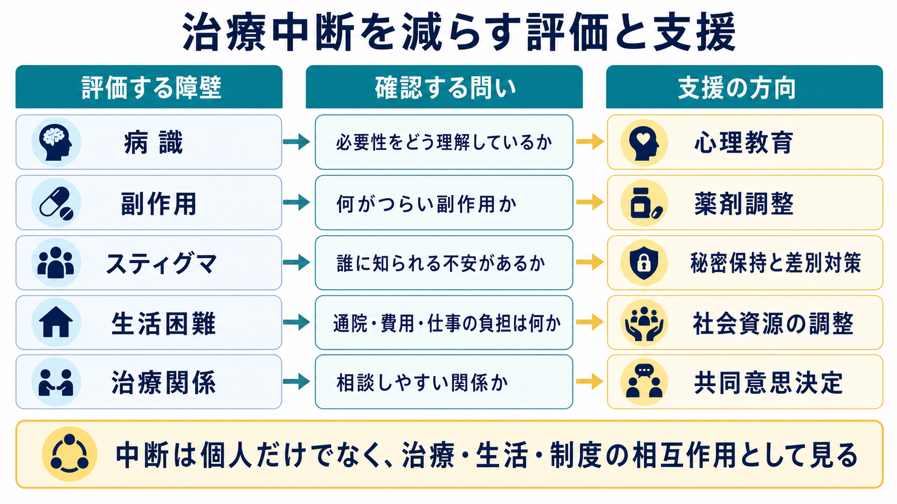
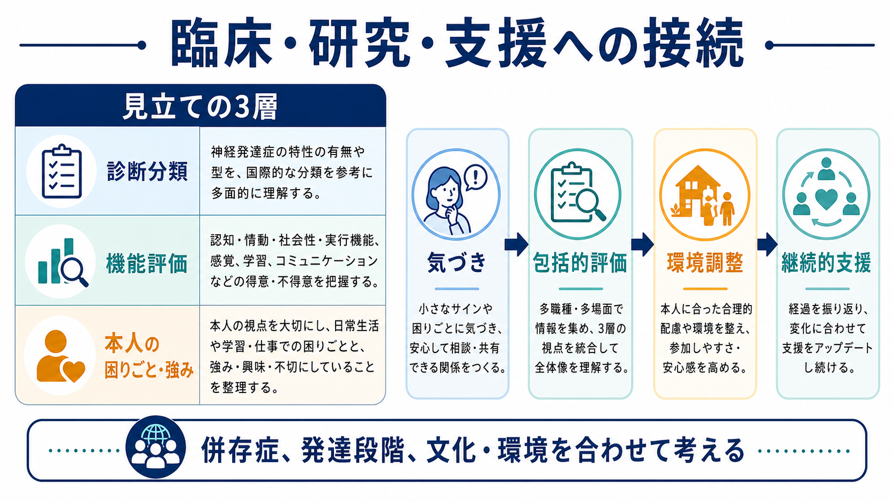

# 精神疾患と治療中断はどう関係するのか

## 要点

- 精神疾患の治療中断は、単に「本人が続ける気がない」ことではなく、[[病識とは何か|病識]]、副作用、薬への信念、スティグマ、生活困難、医療アクセス、[[治療関係とは何か|治療関係]]が重なって生じる。
- 大規模レビューでは、主要な精神疾患における向精神薬の不遵守は高頻度で、統合失調症、うつ病、双極性障害のいずれでも無視できない問題として報告されている[2]。
- 治療中断を減らすには、説得だけでなく、本人の理解、困りごと、副作用、費用・通院負担、家族・地域資源を非難せずに評価する必要がある[5][7]。
- 医療・精神医学に関する以下の記述は教育・研究目的であり、個別の診断や治療指示ではない。

## この記事で答える問い

1. なぜ精神疾患では治療が途切れやすいのか。
2. 病識・副作用・スティグマ・生活困難は、どのように治療継続に影響するのか。
3. 治療中断を「本人の問題」だけにしないために、臨床や研究では何を見るべきか。

## まず結論

精神疾患における治療中断は、症状そのもの、治療の負担、社会的な見られ方、生活上の制約が絡み合う現象である。たとえば、[[統合失調症とは何か|統合失調症]]では病識の低下、薬への否定的な主観的体験、過去の不遵守、物質使用、退院後支援の弱さ、治療同盟の弱さが服薬不遵守と関連しやすいと報告されている[3]。また、[[双極性障害とは何か|双極性障害]]や[[うつ病とは何か|うつ病]]でも、症状の波、効果実感の乏しさ、副作用、生活リズムの乱れ、スティグマが継続を難しくする。

したがって治療中断への対応は、「なぜ飲まないのか」「なぜ来ないのか」と詰問するよりも、「どの障壁が大きいのか」「本人は治療をどう理解しているのか」「何なら続けやすいのか」を一緒に見つける作業に近い。これは[[アドヒアランスとは何か|アドヒアランス]]だけでなく、[[コンコーダンスとは何か|コンコーダンス]]や[[共同意思決定とは何か|共同意思決定]]の問題でもある[7]。

## 背景

慢性疾患全般において、長期治療のアドヒアランスは医療上の大きな課題である。WHO は、アドヒアランスを患者側の意思だけではなく、社会・経済、医療チームと制度、疾患、治療、患者関連要因の5次元から理解する必要があると整理した[1]。精神疾患では、この5次元がとくに重なりやすい。症状が判断力や意欲、記憶、対人関係に影響し、治療が長期化しやすく、スティグマや経済的困難も加わるからである。

向精神薬不遵守に関する系統的レビュー・メタ分析では、主要な精神疾患全体で不遵守の統合推定が高く、統合失調症、うつ病、双極性障害の各群で治療継続が大きな課題であることが示された[2]。ただし、この数値は地域、測定方法、疾患相、医療制度、研究デザインによって変わるため、「半数近くが必ず中断する」という個別予測として使うべきではない。重要なのは、治療中断が珍しい例外ではなく、臨床であらかじめ評価すべき通常のリスクだという点である。

## 基本概念

### 治療中断

治療中断とは、薬を飲まないことだけではない。通院予約を続けられない、心理療法やデイケアに行けない、支援者との連絡が途切れる、再発予防計画が更新されない、処方は受けているが実際には使えていない、など複数の形がある。臨床では、意図的な中断と非意図的な中断を分けることが有用である[5]。

意図的な中断には、「薬は必要ないと思う」「副作用のほうがつらい」「精神科に通っていると知られたくない」といった理由がある。非意図的な中断には、忘れる、説明を理解できていない、費用が払えない、通院手段がない、仕事や育児で時間が取れない、症状により予定管理が難しい、などが含まれる。

### 病識

[[病識とは何か|病識]]は、「自分に病気があると認めるかどうか」だけではない。症状をどう説明するか、治療の必要性をどう理解するか、再発リスクをどう見積もるか、薬や支援を生活の中にどう位置づけるかを含む。統合失調症スペクトラムでは、病識の乏しさや薬への信念が服薬継続に影響する重要因子として繰り返し報告されている[3][4]。

### アドヒアランスとコンコーダンス

[[アドヒアランスとは何か|アドヒアランス]]は、本人の行動が合意された治療方針とどの程度一致しているかを指す。古い「コンプライアンス」という語が「医療者の指示に従う」というニュアンスを持ちやすいのに対し、アドヒアランスや[[コンコーダンスとは何か|コンコーダンス]]では、本人と医療者が治療目標を共有する過程が重視される[7]。

## 仕組み

### 1. 症状が治療を続ける力を削る

精神疾患では、症状そのものが治療継続の能力に影響する。抑うつでは意欲低下、疲労、悲観、集中困難が予約や服薬管理を難しくする。躁状態では病感の低下、過活動、睡眠短縮、衝動性が「治療は不要」という判断につながりうる。精神病症状では、妄想や被害的解釈が医療者や薬への不信と結びつくことがある。

このため、治療中断は「理解しているのにやらない」とは限らない。症状が予定管理、意思決定、対人信頼、リスク評価を揺らしている可能性を見立てる必要がある。

### 2. 副作用と効果実感が治療の意味を変える

薬物療法では、本人が感じる利益と負担の差し引きが継続に強く影響する。抗精神病薬の維持療法は統合失調症の再発予防に有効である一方、体重増加、錐体外路症状、鎮静などの副作用も増えうる[8]。副作用が生活の質、仕事、学業、対人関係、身体イメージに影響すると、本人にとって「再発予防のための薬」が「日常生活を損なうもの」と感じられる。

とくに効果が予防的で見えにくい場合、薬の利益は実感しにくい。症状が落ち着いているほど「もう必要ない」と感じやすく、副作用だけが目立つこともある。ここでは[[心理教育とは何か|心理教育]]、副作用の具体的確認、薬剤調整の相談、本人が大切にする生活目標との接続が重要になる。

### 3. スティグマが援助希求を遅らせる

精神疾患に関するスティグマは、受診や治療継続を妨げる。スティグマと援助希求に関する系統的レビューでは、恥、差別への恐れ、自己スティグマ、秘密にしたい気持ちが支援につながる行動を弱めることが示されている[6]。これは「精神科に行くこと」だけでなく、薬を持ち歩く、家族や職場に説明する、定期的に通院する、支援制度を利用する場面にも影響する。

したがって、[[精神科におけるスティグマをどう扱うか|スティグマをどう扱うか]]は治療継続の中心課題である。秘密保持、本人が望む情報共有の範囲、職場・学校での合理的配慮、差別的経験の確認を抜きにして、治療中断を十分に理解することは難しい。

### 4. 生活困難が「通える・続けられる」を左右する

生活困難は治療中断の直接要因になる。費用、交通、住まい、仕事、育児、介護、スマートフォンや保険手続きへのアクセス、家族関係、孤立、物質使用などが、通院や服薬の実行可能性を変える。[[物質使用障害とは何か|物質使用障害]]の併存は、症状悪化、生活の不安定化、薬への影響、予約忘れ、治療関係の摩擦を通じて中断リスクを高めることがある[3]。

ここで有用なのは、治療継続を「意欲」ではなく「実行条件」として見ることである。本人が治療に同意していても、予約の時間帯、薬の回数、交通費、睡眠リズム、職場の休みやすさが合わなければ継続は難しい。[[社会的処方とは何か|社会的処方]]、地域連携、ケースワーク、家族・ピアサポートは、医療の外側にある障壁を扱うための入口になる。

### 5. 治療関係が相談可能性を決める

副作用や飲み忘れを正直に言える関係がなければ、医療者は中断リスクを把握できない。専門家コンセンサスでは、単に「薬を飲んでいますか」と尋ねるより、服薬上の問題や予想される困難を非難しない形で聞くこと、必要に応じて家族・支援者や薬局記録など複数の情報源を使うことが推奨されている[5]。

治療関係が弱いと、本人は「怒られる」「説得される」「本音を言うと入院させられる」と予想し、困りごとを隠す。逆に、[[患者中心の精神科診療とは何か|患者中心の診療]]や[[共同意思決定とは何か|共同意思決定]]が機能していると、中断の前に調整の余地が生まれる。

## 図解

## 臨床・研究との接続

臨床では、治療中断を発見した時点で「なぜ守れなかったのか」と評価するだけでは遅いことがある。初診、退院前、薬剤変更時、症状改善時、生活環境の変化時に、あらかじめ中断リスクを見立てる必要がある。[[精神科初診で何を確認するべきか|初診]]では過去の治療歴、中断理由、副作用経験、医療不信、費用、家族関係を確認し、[[精神科治療計画はどのように立てるのか|治療計画]]では継続可能性を含めて設計する。

研究では、治療中断を単一のアウトカムとして扱うだけでなく、意図的中断、非意図的中断、部分的服薬、予約不履行、心理社会的支援からの脱落を区別する必要がある。自己申告、医師評価、薬局記録、血中濃度、電子モニタリングなどの測定法はそれぞれ限界があり、自己申告や医師評価だけでは過小評価される可能性がある[5]。

## よくある誤解

### 「中断する人は病気を軽く見ている」

実際には、本人が病気を軽く見ているとは限らない。副作用が強い、服薬が仕事に支障をきたす、家族に知られたくない、通院費が払えない、症状で予定管理ができない、医療者に不信感があるなど、合理的な背景があることも多い。

### 「病識があれば中断しない」

病識は重要だが、それだけで継続は決まらない。本人が治療の必要性を理解していても、副作用、費用、通院負担、スティグマ、生活の不安定さが大きければ中断は起こりうる。逆に、病識が揺らいでいても、信頼できる支援者、少ない副作用、簡単な服薬計画、危機時の連絡先があれば継続しやすくなる。

### 「説得すれば解決する」

説得だけでは、本人の懸念や生活障壁が残る。NICE の服薬アドヒアランス指針は、患者が薬について抱く懸念や必要性の認識が服薬行動に影響すること、医療者は非判断的にアドヒアランスを確認し、個別の困難に合わせて介入を調整することを勧めている[7]。

## 関連ノート

- [[アドヒアランスとは何か]]
- [[コンコーダンスとは何か]]
- [[共同意思決定とは何か]]
- [[心理教育とは何か]]
- [[病識とは何か]]
- [[治療関係とは何か]]
- [[精神科におけるスティグマをどう扱うか]]
- [[精神科治療計画はどのように立てるのか]]
- [[再発予防計画とは何か]]
- [[統合失調症とは何か]]
- [[双極性障害とは何か]]
- [[うつ病とは何か]]

## MOC更新候補

- `content/00_MOC/MOC-精神医学.md` または精神医学系 MOC がある場合、本記事を「治療継続・アドヒアランス」「精神科面接・治療関係」周辺に追加する候補。
- 並列ジョブとの競合を避けるため、この作業では MOC 本体は更新しない。

## 理解チェック

1. 治療中断を意図的中断と非意図的中断に分けると、どのような支援の違いが見えやすくなるか。
2. 病識が低いことと、治療者への不信があることは、臨床的にどう区別して聞けるか。
3. 副作用がある場合、「薬を続けるべきか」だけでなく、どの生活目標との関係で話し合う必要があるか。
4. スティグマや生活困難を評価しないまま治療中断を解釈すると、どのような誤りが起こりうるか。

## 未解決問題

- 治療中断の予測因子は多いが、個人レベルでどの組み合わせが最も重要かを高精度に予測する方法はまだ発展途上である。
- デジタル服薬支援、長時間作用型注射薬、ピアサポート、家族介入、社会的処方のどの組み合わせが、どの患者群に最も有効かはさらに検証が必要である。
- 治療継続を重視するあまり、本人の価値観や副作用負担を軽視しないための共同意思決定の実装が課題である。

## 参考文献

[1] World Health Organization. (2003). *Adherence to long-term therapies: evidence for action*. World Health Organization. https://iris.who.int/handle/10665/42682

[2] Semahegn, A., Torpey, K., Manu, A., Assefa, N., Tesfaye, G., & Ankomah, A. (2020). Psychotropic medication non-adherence and its associated factors among patients with major psychiatric disorders: a systematic review and meta-analysis. *Systematic Reviews, 9*, 17. https://doi.org/10.1186/s13643-020-1274-3

[3] Lacro, J. P., Dunn, L. B., Dolder, C. R., Leckband, S. G., & Jeste, D. V. (2002). Prevalence of and risk factors for medication nonadherence in patients with schizophrenia: a comprehensive review of recent literature. *Journal of Clinical Psychiatry, 63*(10), 892-909. https://doi.org/10.4088/jcp.v63n1007

[4] Sendt, K.-V., Tracy, D. K., & Bhattacharyya, S. (2015). A systematic review of factors influencing adherence to antipsychotic medication in schizophrenia-spectrum disorders. *Psychiatry Research, 225*(1-2), 14-30. https://doi.org/10.1016/j.psychres.2014.11.002

[5] Velligan, D. I., Weiden, P. J., Sajatovic, M., Scott, J., Carpenter, D., Ross, R., & Docherty, J. P. (2010). Assessment of adherence problems in patients with serious and persistent mental illness: recommendations from the Expert Consensus Guidelines. *Journal of Psychiatric Practice, 16*(1), 34-45. https://doi.org/10.1097/01.pra.0000367776.96012.ca

[6] Clement, S., Schauman, O., Graham, T., Maggioni, F., Evans-Lacko, S., Bezborodovs, N., Morgan, C., Rüsch, N., Brown, J. S. L., & Thornicroft, G. (2015). What is the impact of mental health-related stigma on help-seeking? A systematic review of quantitative and qualitative studies. *Psychological Medicine, 45*(1), 11-27. https://doi.org/10.1017/S0033291714000129

[7] National Institute for Health and Care Excellence. (2009). *Medicines adherence: involving patients in decisions about prescribed medicines and supporting adherence* (Clinical guideline CG76). https://www.nice.org.uk/guidance/cg76

[8] Leucht, S., Tardy, M., Komossa, K., Heres, S., Kissling, W., Salanti, G., & Davis, J. M. (2012). Antipsychotic drugs versus placebo for relapse prevention in schizophrenia: a systematic review and meta-analysis. *The Lancet, 379*(9831), 2063-2071. https://doi.org/10.1016/S0140-6736(12)60239-6
