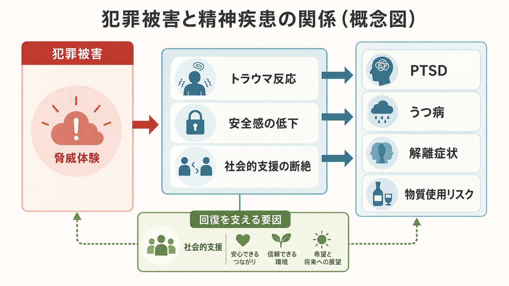
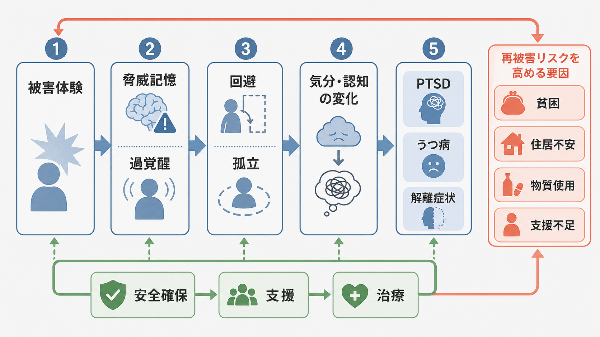
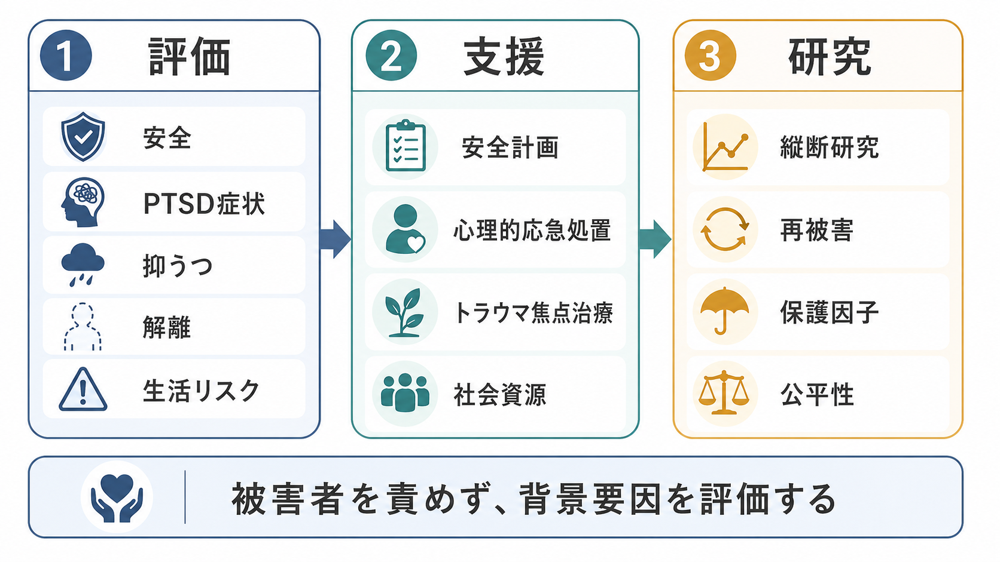

# 精神疾患と犯罪被害はどう関係するのか

## 要点

- 犯罪被害、とくに暴力、性被害、脅迫、家庭内暴力、ストーキングなどは、身体的危険だけでなく、[[PTSDとは何か|PTSD]]、[[うつ病とは何か|うつ病]]、不安、物質使用、解離症状のリスクを高める外傷体験になりうる[1][2][3]。
- ただし、被害にあった人が必ず精神疾患になるわけではない。症状の出方は、被害の種類、反復性、加害者との関係、身体的損傷、既往歴、社会的支援、住居や経済の安全性によって大きく変わる[2][3]。
- 既存の精神疾患がある人は、被害にあいやすい社会的・生活上の脆弱性を抱えることがあり、重い精神疾患をもつ人では暴力被害や性被害のリスクが高いことが系統的レビューで示されている[6][7]。
- 重要なのは「被害者に原因がある」と考えることではなく、症状、生活リスク、安全、支援不足、再被害リスクを同時に評価することである。

## この記事で答える問い

1. 犯罪被害は、どのようにPTSD・うつ病・解離症状へつながるのか。
2. 被害後に症状が続く人と回復していく人では、何が違うのか。
3. 精神疾患をもつ人は、なぜ犯罪被害のリスクが高く見積もられることがあるのか。
4. 臨床や研究では、被害体験をどのように扱うべきか。

## まず結論

犯罪被害と精神疾患の関係は一方向ではない。第一に、犯罪被害そのものが外傷体験となり、脅威記憶、過覚醒、回避、孤立、自己非難、睡眠障害を通じて、PTSD、うつ病、解離症状を引き起こすことがある[2][3]。第二に、すでに精神疾患をもつ人では、住居不安、経済的不安定、物質使用、対人関係の孤立、支援へのアクセス困難などが重なると、被害にあうリスクが高まる場合がある[6][7]。

したがって、犯罪被害を精神医学的に理解するときは、「被害が症状を生む経路」と「症状や生活困難が再被害リスクと結びつく経路」を分ける必要がある。後者を述べるときも、責任は加害行為とそれを可能にした環境にあり、被害者の症状を責める説明にしてはならない。

## 背景

犯罪被害には、身体暴力、性的暴力、強盗、脅迫、ハラスメント、家庭内暴力、ストーキング、虐待、オンライン被害などが含まれる。これらは法的カテゴリーとしては多様だが、精神医学的には「自分の安全、身体、尊厳、予測可能性が破られた体験」として共通する側面をもつ。

WHOは、親密な関係における暴力や性暴力が、身体・性・生殖の健康だけでなく、抑うつ、不安、その他の健康問題と関連する公衆衛生上の問題であると整理している[1]。心理的暴力についても、PTSD、抑うつ、不安との関連を示す系統的レビューがあり、とくに強制的支配、孤立、感情的・言語的暴力は見落とされやすい被害として重要である[4]。また、NIMHは、身体的または性的暴行、虐待、事故、災害、テロなどを経験または目撃した後にPTSDが生じうると説明している[2]。

## 基本概念

### 犯罪被害と外傷体験

すべての犯罪被害が同じ程度に外傷性をもつわけではない。PTSDリスクは、生命の危険、重傷、性的暴力、反復性、逃げられなさ、加害者との近さ、被害後の支援不足などによって高まりやすい[2][3]。たとえば同じ「暴力被害」でも、一回限りの被害と、家庭内や職場、学校、地域で繰り返される被害では、予測可能性と安全感への影響が異なる。

### PTSD

PTSDでは、侵入症状、回避、認知・気分の陰性変化、過覚醒が生活を妨げる。被害後にフラッシュバック、悪夢、強い警戒、音や場所への過敏さ、自己非難、孤立、睡眠障害が続く場合、単なる「気の持ちよう」ではなく、[[トラウマ関連障害群とは何か|トラウマ関連障害]]として評価が必要になる[2]。

### うつ病

被害後のうつ病は、喪失感、無力感、自己非難、社会的孤立、慢性的な不眠、生活基盤の崩れと結びつきやすい。PTSDとうつ病は併存しやすく、同じ人の中で「危険がまだ続いているように感じる反応」と「希望や意欲が失われる反応」が重なることがある[2]。この重なりは [[PTSDとうつ病はどう併存するのか]] とも関係する。

### 解離症状

解離症状には、現実感が薄れる、身体が自分のものではないように感じる、記憶が断片化する、感情が切り離される、といった体験が含まれる。解離は、強すぎる恐怖や逃げられなさに対する防衛的反応として理解されることがある一方、原因を単純化しすぎない慎重さも必要である。トラウマと解離の関連を支持するレビューはあるが、記憶、暗示性、測定法をめぐる論争も続いている[5]。

## 仕組み

### 1. 脅威記憶と過覚醒

被害体験は、「ここは危険だ」「同じことがまた起きるかもしれない」という学習を強く残す。被害場所、匂い、音、服装、時間帯、ニュース、似た人影などが手がかりになり、身体が危険信号として反応する。これは適応的な警戒として始まるが、生活全体に広がると過覚醒や回避を維持する[2]。

### 2. 回避と孤立

回避は短期的には苦痛を下げる。しかし、外出、通勤、通学、対人接触、司法手続き、医療相談を避け続けると、安全な現在を学び直す機会が減る。孤立は、うつ症状や自己非難を強め、支援に接続する機会も狭める。

### 3. 自己非難と恥

犯罪被害では、「自分が悪かったのではないか」「抵抗できなかったからだ」といった自己非難が起こりやすい。しかし、責任は加害行為にある。自己非難はPTSDやうつ病の維持要因になりうるため、臨床では事実確認と責任帰属を丁寧に分ける必要がある。

### 4. 解離と記憶の断片化

強い恐怖、痛み、屈辱、逃げられなさの中では、体験が連続した物語として記憶されず、断片的な感覚、映像、身体反応として残ることがある。これが後の侵入症状や現実感のゆらぎと結びつく場合がある[5]。

### 5. 再被害リスクと生活要因

重い精神疾患をもつ人の暴力被害リスクは、一般人口より高いとする系統的レビューがある[6][7]。背景には、症状そのものだけでなく、ホームレス状態、物質使用、経済的困難、孤立、支援不足、加害者から離れにくい生活環境がある。これは「精神疾患だから被害にあう」という単純な説明ではなく、社会的脆弱性と支援への接続の問題として理解する必要がある。

## 図解

1枚目は、犯罪被害からトラウマ反応、安全感の低下、社会的支援の断絶を経て、PTSD・うつ病・解離症状・物質使用リスクへ広がる全体像を示している。

2枚目は、被害体験、脅威記憶、過覚醒、回避、孤立、気分・認知の変化が循環し、症状を維持する流れを示している。下段の「安全確保・支援・治療」は、同じ循環を弱める保護的経路である。

3枚目は、評価、支援、研究の接続を示している。臨床では症状名だけでなく、安全、生活リスク、被害後の支援、再被害の危険を同時に見る必要がある。

## 臨床・研究との接続

臨床評価では、まず現在の安全を確認する。加害者との接触が続いているか、住居や経済が脅かされているか、自殺念慮や自傷リスクがあるか、医療・法律・福祉・学校・職場支援へつながれているかを評価する。そのうえで、PTSD症状、抑うつ、不安、解離、睡眠、物質使用、身体症状を分けて確認する。

治療については、NICEガイドラインが、成人のPTSDに対してトラウマ焦点化認知行動療法やEMDRを推奨している[8]。ただし、犯罪被害直後や ongoing trauma がある場合、いきなり外傷記憶へ集中的に取り組むより、安全確保、危機介入、生活支援、心理教育を優先することがある。これは個別の治療指示ではなく、専門職による評価が必要な領域である。

研究では、被害体験の有無だけでなく、被害の種類、反復性、時期、加害者との関係、社会的支援、既存の精神疾患、生活困難を縦断的に測る必要がある。横断研究だけでは、「被害が精神症状を生んだ」のか、「精神症状と生活困難が被害リスクを高めた」のか、「両者を生む第三の要因がある」のかを区別しにくい。

## よくある誤解

### 誤解1: 被害にあった人は必ずPTSDになる

多くの人は強い反応を経験しても、時間、支援、安全の回復とともに改善する。PTSDは、症状が持続し、生活機能を妨げる場合に問題になる[2]。

### 誤解2: 精神疾患がある人は加害者になりやすい

犯罪被害と精神疾患を論じるとき、社会的にはしばしば「加害リスク」ばかりが強調される。しかし、重い精神疾患をもつ人は、加害者である以前に被害者になりやすい集団でもある[6][7]。偏見を避けるためには、被害リスクと支援不足に焦点を当てる必要がある。

### 誤解3: 解離があるなら記憶は信用できない

解離や記憶の断片化は、被害の訴えを自動的に否定する根拠にはならない。一方で、臨床や司法の場では、本人の苦痛を尊重しつつ、記憶、証言、診断、法的判断を混同しない慎重さが必要である[5]。

### 誤解4: 支援とは心理療法だけである

犯罪被害後の回復には、心理療法だけでなく、安全な住居、経済支援、医療、法的支援、職場・学校調整、信頼できる人間関係が関わる。社会的支援の不足はPTSDリスクを高める要因としても整理されている[2]。

## 関連ノート

- [[PTSDとは何か]]
- [[PTSDとうつ病はどう併存するのか]]
- [[うつ病とは何か]]
- [[トラウマ関連障害群とは何か]]
- [[不安症群とは何か]]
- [[物質使用障害とは何か]]

MOC更新候補: `content/00_MOC/` 配下の精神医学、トラウマ、臨床実践、司法・社会支援に関するMOC。並列生成ジョブとの競合を避けるため、本記事ではMOC本体を更新しない。

今後の作成候補: 犯罪被害者支援とトラウマインフォームドケア、性暴力被害とPTSD、家庭内暴力とメンタルヘルス、解離症状と外傷記憶、精神疾患をもつ人の再被害予防。

## 理解チェック

1. 犯罪被害がPTSD、うつ病、解離症状につながる主な経路を説明できるか。
2. 「被害が精神症状を生む経路」と「精神疾患や生活困難が被害リスクと結びつく経路」を区別できるか。
3. 被害者責任論を避けるために、どのような表現や評価視点が必要か。
4. 臨床評価で、症状だけでなく安全・住居・経済・支援資源を確認する理由を説明できるか。

## 未解決問題

- 犯罪被害の種類ごとに、PTSD、うつ病、解離症状のリスクがどの程度異なるのか。
- 精神疾患をもつ人の被害リスクを下げる介入は、医療、住居、所得、司法支援のどの組み合わせで最も有効か。
- 解離症状、記憶の断片化、法的証言を、本人の尊厳を損なわずにどう評価するか。
- オンライン被害、デジタルストーキング、画像拡散被害が精神健康に与える影響を、既存の外傷モデルでどこまで説明できるか。

## 参考文献

[1] World Health Organization. (2024). *Violence against women*. https://www.who.int/news-room/fact-sheets/detail/violence-against-women

[2] National Institute of Mental Health. (2026). *Post-Traumatic Stress Disorder*. https://www.nimh.nih.gov/health/publications/post-traumatic-stress-disorder-ptsd

[3] Kessler, R. C., Aguilar-Gaxiola, S., Alonso, J., Benjet, C., Bromet, E. J., Cardoso, G., et al. (2017). Trauma and PTSD in the WHO World Mental Health Surveys. *European Journal of Psychotraumatology, 8*(sup5), 1353383. https://doi.org/10.1080/20008198.2017.1353383

[4] Dokkedahl, S. B., Kirubakaran, R., Bech-Hansen, D., Kristensen, T. R., & Elklit, A. (2022). The psychological subtype of intimate partner violence and its effect on mental health: a systematic review with meta-analyses. *Systematic Reviews, 11*, 163. https://doi.org/10.1186/s13643-022-02025-z

[5] Dalenberg, C. J., Brand, B. L., Gleaves, D. H., Dorahy, M. J., Loewenstein, R. J., Cardena, E., Frewen, P. A., Carlson, E. B., & Spiegel, D. (2012). Evaluation of the evidence for the trauma and fantasy models of dissociation. *Psychological Bulletin, 138*(3), 550-588. https://doi.org/10.1037/a0027447

[6] Khalifeh, H., Oram, S., Osborn, D., Howard, L. M., & Johnson, S. (2016). Recent physical and sexual violence against adults with severe mental illness: a systematic review and meta-analysis. *International Review of Psychiatry, 28*(5), 433-451. https://doi.org/10.1080/09540261.2016.1223608

[7] Maniglio, R. (2009). Severe mental illness and criminal victimization: a systematic review. *Acta Psychiatrica Scandinavica, 119*(3), 180-191. https://doi.org/10.1111/j.1600-0447.2008.01300.x

[8] National Institute for Health and Care Excellence. (2018, updated). *Post-traumatic stress disorder* (NICE guideline NG116). https://www.nice.org.uk/guidance/ng116
