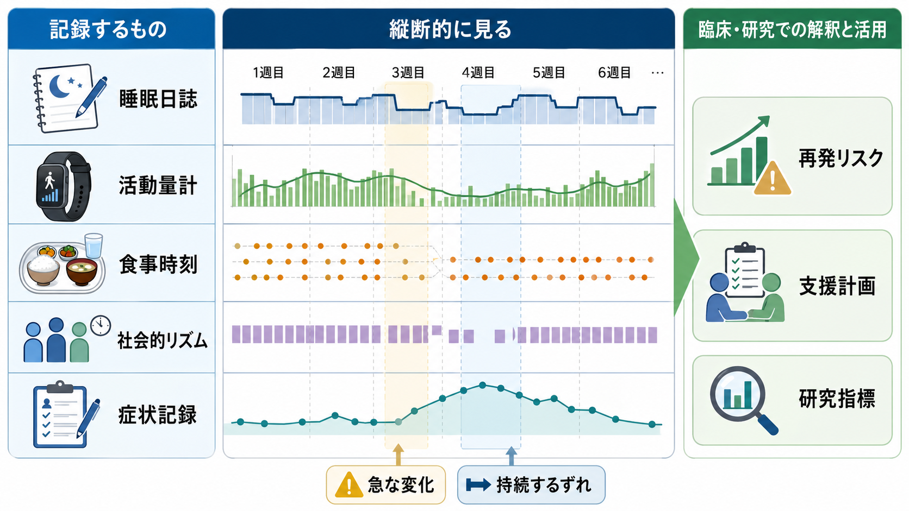

# 精神疾患と生活リズム障害はどう関係するのか

## 要点

- 生活リズム障害は、単なる「だらしなさ」や「睡眠不足」ではなく、睡眠覚醒、活動量、食事時刻、光曝露、対人予定、服薬、仕事・学校の時間構造がずれて、体内時計と日常生活が同期しにくくなる状態である。
- 精神疾患では、生活リズムの乱れが症状の結果として起こるだけでなく、情動調整、認知機能、ストレス反応、報酬系、社会参加を通じて症状を増幅することがある[2][3]。
- 不眠は将来の抑うつリスクと関連し、前向きコホート研究のメタ解析でも不眠をもつ人では抑うつ発症リスクが高いことが示されている[4]。
- 双極性障害では睡眠短縮、活動性上昇、社会的リズムの乱れがエピソードと結びつきやすく、対人関係・社会リズム療法はこの仮説に基づく心理社会的介入として研究されてきた[5]。
- 活動量計や睡眠日誌は、単独で診断を決める道具ではなく、時間経過の中で症状、生活機能、環境変化を結びつけて読む補助線である[6][8]。

## この記事で答える問い

1. 精神疾患でいう「生活リズム障害」は、睡眠障害や概日リズム睡眠覚醒障害と何が違うのか。
2. 睡眠覚醒、活動量、食事、社会的リズムの乱れは、どのように症状を強めるのか。
3. うつ病、双極性障害、統合失調症、不安症などでは、生活リズムをどのように評価すればよいのか。
4. 生活リズムを整える支援は、どこまで研究的に根拠があり、どこからは個別評価が必要なのか。

## まず結論

精神疾患と生活リズム障害の関係は、「精神症状があるから眠れない」という一方向の話ではない。睡眠覚醒の時刻、日中活動、食事、光、社会的予定がずれると、体内時計、睡眠圧、ホルモン、情動制御、報酬学習、対人機能が同じ時間にそろいにくくなる。その結果、疲労、焦燥、抑うつ、不安、認知機能低下、躁・軽躁方向の変化、幻覚妄想への脆弱性などが増幅されうる[2][3]。

ただし、生活リズムの乱れだけで診断名は決まらない。夜型、交代勤務、育児、介護、貧困、学校・職場環境、身体疾患、薬剤、物質使用、痛み、発達特性なども大きく関わる。臨床的には、生活リズムを「本人の意志の弱さ」ではなく、症状と環境の間にある時間構造として読むことが重要である。

## 背景

精神医学では、睡眠と生活リズムは古くから重要な観察項目だった。うつ病では不眠、早朝覚醒、過眠、食欲変化、日内変動が問題になり、双極性障害では睡眠欲求の低下や活動性上昇が躁・軽躁エピソードの評価に関わる。統合失調症や不安症、PTSD、発達障害、物質使用障害でも、睡眠の断片化、昼夜逆転、日中活動量の低下、社会的孤立が生活機能に影響する。

近年は、睡眠を単独の症状ではなく、複数の精神疾患にまたがるトランス診断的過程として捉える研究が増えている。Harvey は、睡眠・概日機能が気分障害の発症、維持、再発、情動調整と結びつく可能性を整理した[3]。また、睡眠と概日リズムの乱れは、神経伝達、ストレス応答、代謝、認知機能を同時に揺らすため、精神疾患の「結果」だけでなく「維持因子」や「再発脆弱性」としても読める[2]。

この視点は、[[概日リズムの乱れは精神疾患にどう関わるのか]]、[[睡眠障害とは何か]]、[[概日リズム睡眠覚醒障害とは何か]]と重なる。ただし本記事では、睡眠医学上の診断分類そのものよりも、精神症状と日常生活の時間構造がどう相互作用するかに焦点を置く。

## 基本概念

### 生活リズム障害

ここでいう生活リズム障害は、医学的診断名としての一つの疾患ではなく、次のような時間構造の乱れをまとめて指す。

| 領域 | 乱れの例 | 精神症状との接点 |
|---|---|---|
| 睡眠覚醒 | 入眠困難、中途覚醒、早朝覚醒、過眠、昼夜逆転 | 抑うつ、不安、焦燥、注意低下、再発リスク |
| 活動量 | 日中活動の低下、夜間活動の増加、活動のばらつき | [[行動活性化とは何か|行動活性化]]、報酬経験、社会参加 |
| 食事 | 欠食、夜間食、食事時刻の不規則化 | 代謝、覚醒度、概日同調、気分変動 |
| 光 | 朝の光不足、夜間の強い光、画面光 | 体内時計、メラトニン、睡眠相 |
| 社会的リズム | 登校・出勤・対人予定・服薬時刻の不安定化 | 双極性障害の再発脆弱性、孤立、役割機能 |

### 概日リズムと睡眠圧

睡眠は、主に二つの過程で調整される。一つは、起きている時間が長いほど眠気が高まる睡眠圧である。もう一つは、約24時間周期で眠りやすさ・覚醒しやすさを変える概日リズムである。夜更かしを続けると、睡眠圧は高まっているのに体内時計は「まだ起きる時間」と判断する、あるいは朝に起きたいのに生物学的な夜が続いている、という不一致が起こりうる。

この不一致は、単に眠気を増やすだけではない。注意、作業記憶、感情反応、報酬予測、ストレス反応にも影響しうる。したがって、[[うつ病とは何か|うつ病]]や[[双極性障害とは何か|双極性障害]]の症状を読むときも、「何時間眠ったか」だけでなく、「いつ眠り、いつ起き、いつ活動し、いつ食べ、誰と会ったか」を見る必要がある。

## 仕組み

### 1. 光と社会的予定が体内時計を同期する

体内時計は、光、食事、運動、社会的予定などの時間手がかりによって外界と同期する。なかでも光は強い同調因子であり、朝の光は体内時計を前進させやすく、夜間の強い光は睡眠相を遅らせやすい。AASM の概日リズム睡眠覚醒障害ガイドラインでも、メラトニンや光療法は、対象疾患とタイミングを限定して検討される介入であり、単純な「眠剤」ではなく時刻調整の道具として扱われる[1]。

### 2. 睡眠の断片化が情動制御を不安定にする

睡眠が浅く、短く、断片化すると、日中の疲労だけでなく、感情反応の強さ、脅威への感受性、反すう、衝動性、注意制御に影響しやすい。これは[[HPA軸は精神疾患にどう関わるのか|HPA軸]]、前頭前野、扁桃体、モノアミン系、報酬系を含む複数の経路と関係する[2][3]。

不眠と抑うつの関係は、とくに研究蓄積が多い。前向きコホート研究のメタ解析では、不眠は後の抑うつ発症リスク上昇と関連していた[4]。もちろん、これは「不眠があれば必ずうつ病になる」という意味ではない。むしろ、睡眠の問題を早く見つけることが、気分、活動、社会参加、身体疾患を含めた予防的支援の入口になるという意味で重要である。

### 3. 活動量の低下が報酬経験を減らす

抑うつや不安が強くなると、人は外出、仕事、学習、家事、対人接触を減らしやすい。短期的には負担を避けられるが、長期的には達成感、楽しさ、人との接触、身体活動、自然光を得る機会が減る。これにより、[[報酬系の異常はうつ病をどう説明するのか|報酬系]]と生活環境の相互作用が弱まり、さらに気分が落ちる循環が起こる。

活動量計研究は、この循環を時間経過として捉える助けになる。統合失調症と双極性障害の寛解期を対象にしたアクチグラフィのメタ解析では、健常対照と比べて睡眠開始・維持の困難、睡眠時間や床上時間の変化、運動活動量の低下が共通してみられた[6]。これは診断の代替ではないが、生活機能と症状を結びつける客観的手がかりになりうる。

### 4. 食事時刻も体内時計の手がかりになる

食事は代謝だけでなく、末梢時計や覚醒度にも影響する。交代勤務や夜間活動では、睡眠覚醒だけでなく食事時刻も昼夜とずれやすい。シミュレートされた夜勤環境の実験では、夜間にも食べる条件では抑うつ様気分と不安様気分が増え、日中のみ食べる条件ではその増加が抑えられたという報告がある[7]。これは小規模かつ実験環境の知見であり、そのまま個別の食事指導に置き換えるべきではないが、「いつ食べるか」が気分脆弱性と無関係ではないことを示す。

### 5. 社会的リズムの乱れが双極性障害で重要になる

双極性障害では、睡眠欲求の低下、活動性上昇、予定の詰め込み、夜間活動、対人ストレスがエピソードと結びつきやすい。対人関係・社会リズム療法は、対人問題と日常リズムの乱れが気分エピソードを誘発・維持しうるという考えに基づき、起床、食事、仕事、対人接触、就寝などの安定化を扱う。双極I型障害を対象とした研究では、2年転帰において社会リズムを扱う心理社会的介入の有用性が検討された[5]。

ここでも注意が必要である。社会リズムを整えることは、気分安定に役立つ可能性がある一方で、「規則正しくできない本人が悪い」という説明ではない。躁状態、抑うつ、服薬副作用、家庭内役割、夜勤、経済状況、支援資源の乏しさが、リズムを乱す側にもなる。

## 図解

3枚の図は、生活リズム障害を「症状の背景」ではなく「症状と環境をつなぐ時間構造」として読むための補助図である。1枚目は全体像、2枚目は体内時計の同期とずれ、3枚目は臨床・研究での縦断評価を示す。

| 図 | 何を見るか | 読み方 |
|---|---|---|
| 概念地図 | 睡眠、活動、食事、社会的リズムと症状の双方向性 | 原因を一つに決めず、循環として読む |
| メカニズム図 | 体内時計への入力と、ずれたときの情動・睡眠への影響 | 光、食事、活動、予定が同じ方向にそろうかを見る |
| 縦断評価図 | 睡眠日誌、活動量計、食事時刻、症状記録 | 急な変化と持続するずれを分けて読む |

## 臨床・研究との接続

### 評価では「時刻」と「ばらつき」を聞く

精神科診察で生活リズムを見るときは、平均睡眠時間だけでは不十分である。[[精神科診察で睡眠をどう評価するか]]と接続しながら、少なくとも次を確認したい。

| 評価項目 | 聞くこと | 意味 |
|---|---|---|
| 起床時刻 | 平日・休日でどれくらい違うか | 社会的ジェットラグ、学校・仕事とのずれ |
| 就床・入眠 | 布団に入る時刻と眠る時刻の差 | 不眠、反すう、スマートフォン、夜間活動 |
| 中途覚醒 | 何回起きるか、再入眠できるか | 睡眠の断片化、痛み、薬剤、物質 |
| 日中活動 | 外出、運動、仕事、学習、家事、対人接触 | 抑うつ、陰性症状、不安回避、疲労 |
| 食事 | 欠食、夜食、食事時刻のばらつき | 代謝、覚醒、概日同調 |
| 変化の時点 | いつから乱れたか | エピソード、ストレス因子、薬剤変更 |

### 活動量計は補助線であって診断器ではない

アクチグラフィやウェアラブル端末は、睡眠日誌だけでは見えにくい活動量、睡眠覚醒パターン、日ごとのばらつきを捉えられる。AASM の系統的レビューでも、アクチグラフィは不眠症や概日リズム睡眠覚醒障害などで、睡眠日誌とは異なる客観的情報を提供しうると整理されている[8]。

しかし、活動量計のデータだけで「うつ病」「双極性障害」「統合失調症」と診断することはできない。睡眠、症状、服薬、身体疾患、物質使用、生活環境、本人の主観的苦痛を合わせて読む必要がある。

### 支援は「正しい生活」ではなく「同期しやすい生活」を作る

生活リズム支援の目標は、道徳的に正しい生活を押しつけることではない。実践的には、本人の症状、仕事・学校、家庭役割、体質、文化、経済状況に合わせて、体内時計と社会生活が衝突しにくい条件を探す。

たとえば、朝の光を浴びる、起床時刻のばらつきを減らす、日中活動を小さく戻す、食事時刻を極端にずらさない、夜間の強い光を減らす、予定を詰め込みすぎない、睡眠日誌で変化を可視化する、といった支援が考えられる。ただし、個別の治療方針、薬剤、光療法、メラトニン使用は専門的評価に基づくべきである[1]。

## よくある誤解

### 誤解1: 生活リズムが乱れるのは本人の意志が弱いからである

違う。生活リズムは、症状、体内時計、睡眠圧、環境、仕事、学校、家庭、服薬、身体疾患、物質使用の相互作用で決まる。本人の努力だけに還元すると、評価すべき要因を見落とす。

### 誤解2: 眠れるようになれば精神疾患は治る

睡眠の改善は重要だが、精神疾患全体を睡眠だけで説明することはできない。抑うつ、不安、躁・軽躁、精神病症状、外傷反応、発達特性、社会的困難は、それぞれ複数の機序をもつ。睡眠はその中の強い調整因子として扱うのが適切である。

### 誤解3: 夜型はすべて病的である

夜型傾向そのものは個人差でもある。問題になるのは、本人の生活要求と体内時計が大きくずれ、苦痛や機能障害が生じる場合である。学生、交代勤務者、育児・介護中の人では、社会的時間との衝突を含めて評価する必要がある。

### 誤解4: ウェアラブル端末で診断できる

できない。活動量、睡眠推定、心拍、食事時刻の記録は有用な補助情報だが、診断は面接、症状経過、機能障害、除外診断、身体・薬剤・物質の評価を含む総合判断である[8]。

## 関連ノート

- [[概日リズムの乱れは精神疾患にどう関わるのか]]
- [[概日リズム睡眠覚醒障害とは何か]]
- [[睡眠覚醒障害群とは何か]]
- [[睡眠障害とは何か]]
- [[不眠障害とは何か]]
- [[精神科診察で睡眠をどう評価するか]]
- [[うつ病とは何か]]
- [[双極性障害とは何か]]
- [[統合失調症とは何か]]
- [[行動活性化とは何か]]
- [[HPA軸は精神疾患にどう関わるのか]]
- [[報酬系の異常はうつ病をどう説明するのか]]

## MOC更新候補

- `content/00_MOC/MOC｜神経科学と精神疾患.md` の睡眠・概日リズム関連項目に追加候補。
- 精神医学の疾患・症候群系 MOC があれば、睡眠覚醒障害、気分障害、統合失調症、生活機能評価の交差項目として追加候補。
- 並列ジョブとの競合を避けるため、本記事作成時点では MOC 本体は更新しない。

## 理解チェック

1. 生活リズム障害を、単なる睡眠時間不足ではなく「時間構造のずれ」として見る理由は何か。
2. 不眠が抑うつと関係するとき、「原因」と「結果」を単純に分けにくいのはなぜか。
3. 双極性障害で社会的リズムの安定が重視される理由は何か。
4. 活動量計や睡眠日誌を、診断器ではなく補助線として使うべき理由は何か。
5. 食事時刻が気分や覚醒に影響しうるという知見を、個別支援に使うときの注意点は何か。

## 未解決問題

- 生活リズムのどの指標が、うつ病、双極性障害、統合失調症、不安症の再発を最もよく予測するのか。
- ウェアラブル端末による睡眠・活動データを、本人の主観的苦痛や社会的文脈とどう統合するのか。
- 交代勤務、貧困、育児、介護、学校制度など、社会的時間構造そのものをどのように支援設計へ組み込むのか。
- 食事時刻、光曝露、運動、対人予定を組み合わせた介入が、どの疾患・どの段階で最も有効なのか。

## 参考文献

[1] Auger RR, Burgess HJ, Emens JS, Deriy LV, Thomas SM, Sharkey KM. (2015). Clinical Practice Guideline for the Treatment of Intrinsic Circadian Rhythm Sleep-Wake Disorders. *Journal of Clinical Sleep Medicine*, 11(10), 1199-1236. https://doi.org/10.5664/jcsm.5100

[2] Wulff K, Gatti S, Wettstein JG, Foster RG. (2010). Sleep and circadian rhythm disruption in psychiatric and neurodegenerative disease. *Nature Reviews Neuroscience*, 11, 589-599. https://doi.org/10.1038/nrn2868

[3] Harvey AG. (2011). Sleep and Circadian Functioning: Critical Mechanisms in the Mood Disorders? *Annual Review of Clinical Psychology*, 7, 297-319. https://doi.org/10.1146/annurev-clinpsy-032210-104550

[4] Li L, Wu C, Gan Y, Qu X, Lu Z. (2016). Insomnia and the risk of depression: a meta-analysis of prospective cohort studies. *BMC Psychiatry*, 16, 375. https://doi.org/10.1186/s12888-016-1075-3

[5] Frank E, Kupfer DJ, Thase ME, et al. (2005). Two-Year Outcomes for Interpersonal and Social Rhythm Therapy in Individuals With Bipolar I Disorder. *Archives of General Psychiatry*, 62(9), 996-1004. https://doi.org/10.1001/archpsyc.62.9.996

[6] Meyer N, Faulkner SM, McCutcheon RA, Pillinger T, Dijk DJ, MacCabe JH. (2020). Sleep and Circadian Rhythm Disturbance in Remitted Schizophrenia and Bipolar Disorder: A Systematic Review and Meta-analysis. *Schizophrenia Bulletin*, 46(5), 1126-1143. https://doi.org/10.1093/schbul/sbaa024

[7] Qian J, Vujovic N, Nguyen H, et al. (2022). Daytime eating prevents mood vulnerability in night work. *Proceedings of the National Academy of Sciences*, 119(38), e2206348119. https://doi.org/10.1073/pnas.2206348119

[8] Smith MT, McCrae CS, Cheung J, et al. (2018). Use of Actigraphy for the Evaluation of Sleep Disorders and Circadian Rhythm Sleep-Wake Disorders: An American Academy of Sleep Medicine Systematic Review, Meta-Analysis, and GRADE Assessment. *Journal of Clinical Sleep Medicine*, 14(7), 1209-1230. https://doi.org/10.5664/jcsm.7228
