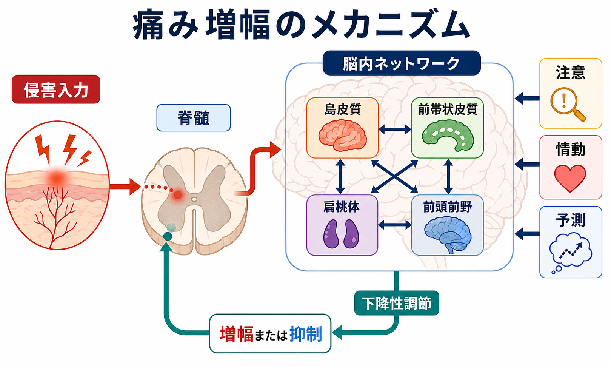
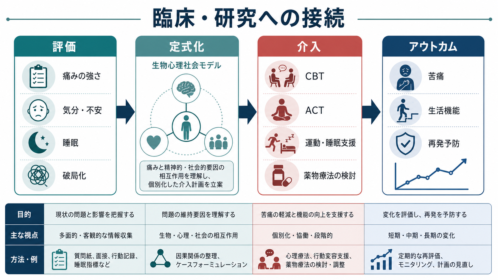

# 精神疾患と疼痛はどう関係するのか

## 要点

- 痛みは、末梢組織の損傷だけで決まる感覚ではなく、身体への危険を知らせる主観的経験である。情動、注意、予測、記憶、生活文脈によって強まったり弱まったりする[1]。
- 慢性疼痛は ICD-11 で疾患分類上の位置づけが整理され、一次性慢性疼痛のように、明確な組織損傷だけでは説明しにくい痛みも臨床的に扱われる[2]。
- [[うつ病とは何か]]、[[不安症群とは何か]]、[[PTSDとは何か]]、[[不眠障害とは何か]]は、疼痛の発生・持続・機能障害と相互に関連しやすい[3][4]。
- 悪循環の中心には、痛みへの注意固定、情動的脅威評価、破局化、回避、活動低下、睡眠悪化がある[5][6][7]。
- 臨床では「本当に痛いか」を疑うのではなく、痛みを保っている生物・心理・社会的要因を評価し、生活機能の回復を含めて支援する[8]。

## この記事で答える問い

1. 精神疾患と疼痛は、なぜ併存しやすいのか。
2. 痛み、情動、注意、破局化は、どのように悪循環を作るのか。
3. 臨床・研究では、この関係をどのように評価し、介入点を見つけるのか。

## まず結論

精神疾患と疼痛の関係は、「心の問題だから痛い」「身体の問題だから精神症状は二次的」という単純な二分法では捉えにくい。痛みは侵害入力に加えて、脳内ネットワーク、注意、情動、予測、社会的文脈が統合された経験である[1][5]。そのため、不安や抑うつがあると痛みに注意が向きやすくなり、痛みを危険なものとして解釈し、活動を避け、睡眠や体力が落ちる。すると身体の感受性がさらに高まり、痛みがより強く、長く、生活を制限するものとして経験される。

逆に、慢性的な痛みは喪失体験、活動制限、睡眠障害、孤立、医療不信を通じて、抑うつ・不安・怒り・絶望感を強める。したがって臨床では、痛みの部位や強さだけでなく、注意、破局化、恐怖回避、睡眠、生活機能、対人関係、治療への期待を同時に見る必要がある。

## 背景

痛みの国際的定義では、痛みは「実際の、またはそれに似た組織損傷に関連する不快な感覚・情動経験」とされる[1]。ここで重要なのは、痛みが感覚であると同時に情動経験でもある点である。痛みは身体の信号だが、その信号は「どれほど危険か」「自分は対処できるか」「過去に同じ痛みで何が起きたか」という評価と結びついて経験される。

ICD-11 では慢性疼痛の分類が整備され、慢性一次性疼痛、がん関連疼痛、術後・外傷後疼痛、神経障害性疼痛、頭痛・口腔顔面痛、内臓痛、筋骨格痛などが分類される[2]。この整理は、慢性疼痛を単なる症状ではなく、生活機能を損なう臨床的問題として扱うために重要である。

精神疾患との併存も珍しくない。疼痛とうつ病の併存に関するレビューでは、痛みとうつ症状は互いに重なり、診断・治療・予後を複雑にすることが示されている[3]。また、世界精神保健調査の解析では、複数の慢性疼痛状態と気分障害・不安障害の関連が報告されている[4]。

## 基本概念

### 疼痛

疼痛は、侵害受容だけではなく、身体状態、注意、情動、記憶、予測が統合された経験である。たとえば同じ刺激でも、安心できる状況では耐えやすく、強い不安や孤立の中では耐えがたく感じられることがある。

### 慢性疼痛

慢性疼痛は一般に3か月以上続く、または通常の治癒期間を超えて続く痛みとして扱われる[2]。慢性化すると、痛みは「損傷の警報」だけでなく、神経系の感作、回避行動、睡眠低下、生活機能低下と結びついた持続的な問題になりやすい。

### 破局化

破局化とは、痛みを過度に脅威的・制御不能・持続的なものとして評価する認知的・情動的傾向である。破局化が強いと、痛みへの注意が固定され、痛みの意味づけが「危険」「もう終わり」「動くと壊れる」に偏りやすい[6]。

### 恐怖回避

恐怖回避モデルでは、痛みを危険と解釈すると、運動や活動を避けるようになり、短期的には安心しても、長期的には筋力低下、社会参加の減少、抑うつ、痛みへの過敏性を招くと考える[7]。

## 仕組み

### 1. 痛みは注意を奪う

痛みは身体の脅威信号として、注意を強く引きつける。脳の痛み関連ネットワークは、単に「痛み専用の部位」ではなく、身体にとって重要な出来事を検出し、注意や行動を切り替えるシステムとして理解される[5]。そのため、不安が強い人ほど、痛みのわずかな変化を監視しやすくなる。

### 2. 情動が痛みの意味を変える

不安は「この痛みは危険かもしれない」という予測を強め、抑うつは「自分には対処できない」という無力感を強める。[[HPA軸は精神疾患にどう関わるのか]]で扱うようなストレス反応、自律神経活動、睡眠の乱れも、痛みの感受性と関連しうる。

### 3. 破局化が悪循環を固定する

破局化は、痛みの強さ、機能障害、医療利用、治療反応に関連する重要な心理要因として検討されてきた[6]。破局化が強いと、痛みを避けるために活動を制限し、その結果として体力・役割・楽しみが失われる。失われた生活は抑うつや不安を強め、痛みへの注意をさらに増やす。

### 4. 回避と活動低下が回復機会を減らす

痛みを避けることは短期的には自然な防衛反応である。しかし、必要以上に活動を避け続けると、身体機能、睡眠リズム、対人接触、自己効力感が落ちる。恐怖回避モデルは、この過程を慢性疼痛の維持因子として説明する[7]。

### 5. 下降性調節が「増幅」に傾く

痛みの入力は脊髄から脳へ上がるだけでなく、脳から脊髄へ戻る下降性調節によって増幅または抑制される。注意、情動、予測はこの調節に関わるため、ストレスや不安が強い状態では、同じ末梢入力でも痛みが強く感じられることがある[5]。

## 図解

### 図解案

概念地図としては、中央に「痛みの増幅」を置き、その周囲に「痛み」「不安・抑うつ」「注意の固定」「破局化」「回避・活動低下」「睡眠低下」を円環状に配置する。矢印は一方向ではなく双方向にし、痛みと精神症状が互いに原因にも結果にもなりうることを示す。

## 臨床・研究との接続

臨床で重要なのは、「痛みが心理的か身体的か」を二者択一で判定することではない。痛みは実在する経験であり、その持続には生物学的要因、心理的要因、社会的要因が重なる。したがって、[[5Pモデルとは何か]]のように、素因、誘因、持続因子、保護因子、問題の現れ方を分けて整理すると見通しがよくなる。

評価では、痛みの部位・強さ・持続時間だけでなく、以下を確認する。

- 気分、不安、トラウマ反応、希死念慮
- 睡眠、疲労、日中活動量
- 痛みに対する注意、破局化、恐怖回避
- 鎮痛薬、アルコール、その他の物質使用
- 仕事、家事、学業、対人関係への影響
- 何が痛みを和らげ、何が悪化させるか

介入では、痛みの消失だけを唯一の目標にすると行き詰まりやすい。慢性疼痛では、痛みの軽減、生活機能、睡眠、気分、自己効力感を並行して扱う。心理療法については、慢性疼痛に対する認知行動療法などの心理的介入の効果がレビューされており、効果は万能ではないが、苦痛や機能障害の軽減に役立つ場合がある[8]。薬物療法、運動療法、睡眠支援、心理教育、家族・職場調整は、個別の病態とリスクに応じて組み合わせる。

## よくある誤解

### 誤解1: 精神症状があるなら痛みは気のせいである

痛みは主観的経験だが、「気のせい」という意味ではない。主観的であることは、脳と身体が作る実在の経験であることと矛盾しない[1]。

### 誤解2: 画像検査で異常がなければ治療対象ではない

画像所見と痛みの強さは常に一致するわけではない。特に慢性疼痛では、神経系の感作、注意、情動、生活文脈を含めて評価する必要がある[2][5]。

### 誤解3: 痛みがなくなるまで動いてはいけない

急性損傷では安静が必要なこともあるが、慢性疼痛では過度の回避が機能低下を維持する場合がある[7]。ただし、活動再開は安全確認と段階づけが必要であり、個別の医学的評価を省略してよいという意味ではない。

### 誤解4: 破局化は本人の性格の弱さである

破局化は責めるためのラベルではなく、痛みが脅威として学習され、注意と予測が固定された状態を理解するための概念である[6]。臨床では、本人の努力不足ではなく、悪循環をほどく介入点として扱う。

## 関連ノート

- [[うつ病とは何か]]
- [[不安症群とは何か]]
- [[PTSDとは何か]]
- [[不眠障害とは何か]]
- [[身体症状症とは何か]]
- [[身体症状症は脳の予測処理で説明できるのか]]
- [[睡眠障害は脳機能にどのような影響を与えるのか]]
- [[HPA軸は精神疾患にどう関わるのか]]
- [[5Pモデルとは何か]]

## 理解チェック

1. 痛みを「感覚」と「情動経験」の両方として見ると、精神疾患との関係はどのように理解しやすくなるか。
2. 破局化、注意固定、恐怖回避は、どの順序で悪循環を作りうるか。
3. 慢性疼痛の評価で、痛みの強さ以外に確認すべき生活機能は何か。
4. 「痛みが心理的に影響される」と「痛みが本物ではない」は、なぜ別の主張なのか。

## 未解決問題

- 疼痛とうつ病・不安症の因果方向は、個人差が大きい。痛みが先か、精神症状が先か、共通リスクが先かを縦断研究で分ける必要がある。
- 破局化や恐怖回避を変える介入が、どの患者群で最も有効かは一様ではない。
- 脳画像研究で示されるネットワーク変化を、個別臨床の診断や治療選択にどこまで使えるかは慎重な検討が必要である。

## 参考文献

[1] Raja, S. N., Carr, D. B., Cohen, M., et al. (2020). The revised International Association for the Study of Pain definition of pain: concepts, challenges, and compromises. *Pain*, 161(9), 1976-1982. https://doi.org/10.1097/j.pain.0000000000001939

[2] Treede, R.-D., Rief, W., Barke, A., et al. (2019). Chronic pain as a symptom or a disease: the IASP Classification of Chronic Pain for the International Classification of Diseases, ICD-11. *Pain*, 160(1), 19-27. https://doi.org/10.1097/j.pain.0000000000001384

[3] Bair, M. J., Robinson, R. L., Katon, W., & Kroenke, K. (2003). Depression and pain comorbidity: a literature review. *Archives of Internal Medicine*, 163(20), 2433-2445. https://doi.org/10.1001/archinte.163.20.2433

[4] Tsang, A., Von Korff, M., Lee, S., et al. (2008). Common chronic pain conditions in developed and developing countries: gender and age differences and comorbidity with depression-anxiety disorders. *The Journal of Pain*, 9(10), 883-891. https://doi.org/10.1016/j.jpain.2008.05.005

[5] Legrain, V., Iannetti, G. D., Plaghki, L., & Mouraux, A. (2011). The pain matrix reloaded: a salience detection system for the body. *Progress in Neurobiology*, 93(1), 111-124. https://doi.org/10.1016/j.pneurobio.2010.10.005

[6] Quartana, P. J., Campbell, C. M., & Edwards, R. R. (2009). Pain catastrophizing: a critical review. *Expert Review of Neurotherapeutics*, 9(5), 745-758. https://doi.org/10.1586/ern.09.34

[7] Leeuw, M., Goossens, M. E. J. B., Linton, S. J., et al. (2007). The fear-avoidance model of musculoskeletal pain: current state of scientific evidence. *Journal of Behavioral Medicine*, 30(1), 77-94. https://doi.org/10.1007/s10865-006-9085-0

[8] Williams, A. C. C., Fisher, E., Hearn, L., & Eccleston, C. (2020). Psychological therapies for the management of chronic pain (excluding headache) in adults. *Cochrane Database of Systematic Reviews*, 2020(8), CD007407. https://doi.org/10.1002/14651858.CD007407.pub4
