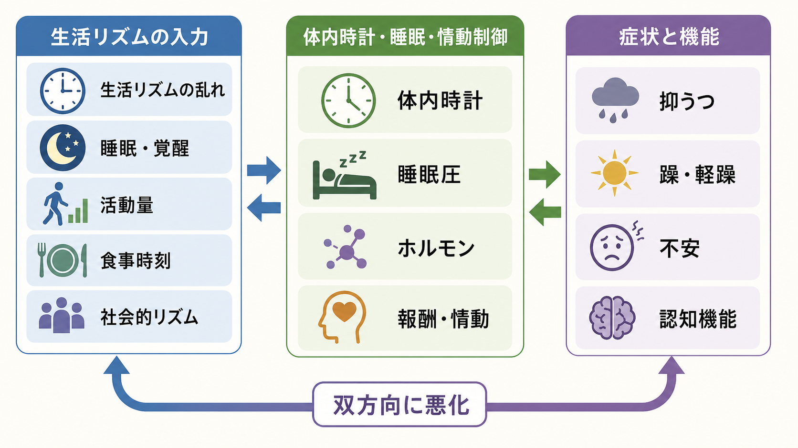

# 精神疾患と睡眠障害はどう関係するのか

## 要点

- 睡眠障害は、精神疾患の「結果」だけでなく、発症・再発・症状増悪・機能低下に関わる横断的なリスク因子として扱う必要がある。
- 不眠は抑うつと不安に双方向に関係し、将来のうつ病リスクとも関連する[1][2]。
- 双極性障害では、睡眠覚醒リズムや社会的リズムの乱れが病相再発の手がかりになりうる[3]。
- 統合失調症・双極性障害では、寛解期であっても睡眠・概日リズムの乱れが残ることがあり、生活機能や再発予防の観点から重要である[4]。
- CBT-I など不眠への介入は睡眠を改善するだけでなく、併存する精神症状の軽減にもつながりうる。ただし、個別の診断・治療方針は臨床評価に基づく[5][6]。

## この記事で答える問い

1. 睡眠障害は精神疾患の症状なのか、それとも原因なのか。
2. 不眠や概日リズムの乱れは、抑うつ・不安・躁状態・精神病症状にどう影響するのか。
3. 臨床や研究では、睡眠をどのように評価し、介入点として扱えばよいのか。

## まず結論

精神疾患と睡眠障害の関係は、単純な「原因と結果」ではなく、悪循環として理解するとよい。抑うつ、不安、躁状態、精神病症状、物質使用、痛み、生活ストレスは睡眠を乱し、乱れた睡眠は情動調整、注意、記憶、報酬系、ストレス反応、現実検討をさらに不安定にする。

したがって、[[睡眠障害とは何か]] を精神疾患の副次的な訴えとしてだけ扱うと見落としが起こる。[[精神科診察で睡眠をどう評価するか]] と接続して、就寝・起床時刻、睡眠時間、途中覚醒、早朝覚醒、過眠、日中眠気、夜間行動、薬物・物質、身体疾患、安全性を横断的に見ることが重要である。

## 背景

睡眠は、気分、覚醒水準、注意、記憶、報酬処理、社会的判断、自律神経、内分泌、免疫にまたがる基本的な調整機構である。そのため、睡眠が崩れると「気分が落ちる」「不安が強まる」「集中できない」「刺激に過敏になる」「考えがまとまりにくい」といった精神症状に近い変化が生じやすい。

一方で、精神症状も睡眠を崩す。抑うつでは早朝覚醒・入眠困難・過眠が起こりうる。[[不安症群とは何か]] では反すうや身体緊張が入眠を妨げる。[[双極性障害とは何か]] では睡眠欲求の低下やリズムの乱れが病相変化の手がかりになる。[[統合失調症とは何か]] では幻覚・妄想、不安、社会的孤立、薬剤影響、昼夜逆転が睡眠と複雑に絡む。

## 基本概念

### 不眠

不眠は、入眠困難、中途覚醒、早朝覚醒、睡眠の質の低下があり、日中機能に影響する状態である。慢性不眠では、睡眠への不安、寝床での覚醒、昼寝、活動低下、カフェインやアルコール、生活リズムの乱れが維持因子になりやすい。

前向きコホート研究のメタ分析では、不眠を持つ人は後のうつ病発症リスクが高いことが示されている[2]。また、睡眠障害・不安・抑うつの双方向性を調べた系統的レビューでは、不眠と不安・抑うつが互いに影響し合う可能性が示された[1]。

### 概日リズム

概日リズムは、光、食事、活動、社会的予定、メラトニン、体温などにより調整される約24時間周期のリズムである。[[概日リズム睡眠覚醒障害とは何か]] では、このリズムと社会的時刻がずれることで、眠りたい時刻に眠れない、起きたい時刻に起きられない、日中機能が落ちる。

双極性障害では、睡眠覚醒リズム、夕型傾向、メラトニン、社会的リズム、時計遺伝子などの研究が蓄積しており、概日リズム機能の乱れは病相の発症・再発と関係する可能性がある[3]。

### 睡眠の断片化と過眠

睡眠時間が長くても、途中覚醒、睡眠時無呼吸、痛み、夜間頻尿、悪夢、周期性四肢運動、薬剤影響などで睡眠が断片化すると、日中の疲労、眠気、注意低下が残る。過眠も、うつ病、双極性障害、ナルコレプシー、薬剤性鎮静、睡眠不足の反動などで意味が異なる。

## 仕組み

睡眠障害が精神症状に影響する経路は複数ある。

| 経路 | 何が起こるか | 関連しやすい症状 |
|---|---|---|
| 覚醒系の過活動 | 寝床でも交感神経・注意・心配が下がらない | 不安、焦燥、入眠困難 |
| 情動制御の低下 | 前頭前野による情動調整が弱まり、扁桃体反応が目立つ | 抑うつ、不安、易怒性 |
| 認知機能の低下 | 注意、作業記憶、実行機能、現実検討が不安定になる | 集中困難、判断低下、被害的解釈 |
| 報酬系・活動性の変化 | 睡眠欲求低下、活動亢進、刺激追求が目立つことがある | 躁状態、リスク行動 |
| 予測・知覚の不安定化 | 疲労、孤立、夜間覚醒が知覚体験や解釈を揺らす | 幻覚・妄想の増悪 |

精神病症状との関係では、睡眠障害と精神病体験の関連を扱う研究が増えている。大学生を対象にオンライン CBT-I を用いた大規模ランダム化比較試験 OASIS では、睡眠改善が不眠だけでなく、妄想様体験や幻覚様体験、抑うつ、不安にも改善をもたらすことが示された[7]。これは「不眠が精神病症状の唯一の原因」という意味ではなく、睡眠が介入可能な維持因子の一つであることを示す。

## 図解

図1は、生活リズム、体内時計、睡眠圧、情動制御、症状と機能が双方向に結びつく全体像を示す。図2は、睡眠時刻、食事、身体活動、光、人との予定が体内時計を同調させる一方、リズムがずれると睡眠断片化、ストレス反応、情動調整低下を介して症状が増幅する流れを示す。図3は、臨床・研究での評価、見立て、介入の入口を整理したものである。

## 臨床・研究との接続

臨床では、睡眠問題を次の三つに分けて見立てると整理しやすい。

1. 精神症状の一部としての睡眠変化  
   例: うつ病の早朝覚醒、躁状態の睡眠欲求低下、不安による入眠困難。

2. 精神症状を悪化させる維持因子  
   例: 睡眠不足により感情調整が低下し、反すう、過覚醒、被害的解釈が強まる。

3. 独立した併存症または身体・薬剤由来の問題  
   例: 睡眠時無呼吸、むずむず脚症候群、概日リズム睡眠覚醒障害、アルコール、カフェイン、向精神薬の鎮静・賦活。

評価では、睡眠日誌、睡眠尺度、アクチグラフィ、ポリソムノグラフィを必要に応じて使う。ただし尺度は診断そのものではない。[[生物心理社会モデルとは何か]] の観点から、症状、生活リズム、身体疾患、薬物・物質、環境、家族・仕事・学校、安全性を統合して見る。

介入研究では、CBT-I が中核的な位置を占める。AASM の成人慢性不眠ガイドラインは、多要素 CBT-I を強く推奨している[5]。精神疾患を併存する不眠に対するメタ分析でも、CBT-I は不眠重症度を改善し、精神症状にも小から中等度の改善をもたらす可能性が示されている[6]。睡眠衛生だけで済ませるのではなく、刺激制御、睡眠制限、認知再構成、リラクゼーション、生活リズムの調整などを、状態に応じて組み合わせる発想が重要である。

## よくある誤解

### 「眠れないのは精神疾患の結果にすぎない」

睡眠障害は結果である場合もあるが、維持因子・再発サイン・独立した併存症でもありうる。不眠を放置すると、抑うつ、不安、集中困難、衝動性、対人機能の低下を通じて悪循環が続くことがある[1][2]。

### 「短時間睡眠ならすべて躁状態である」

躁状態で重要なのは、単に睡眠時間が短いことではなく、睡眠欲求の低下、活動性亢進、気分高揚または易怒性、観念奔逸、リスク行動、機能障害がまとまっているかである。過労、育児、シフトワーク、カフェイン、身体疾患でも短時間睡眠は起こる。

### 「睡眠衛生を教えれば十分である」

睡眠衛生は有用な教育要素になりうるが、慢性不眠への単独介入としては不十分なことが多い。AASM ガイドラインでも、睡眠衛生単独ではなく、多要素 CBT-I が推奨されている[5]。

### 「睡眠を改善すれば精神疾患は治る」

睡眠介入は重要だが、精神疾患全体の治療を置き換えるものではない。薬物療法、心理療法、心理教育、家族・職場・学校調整、身体疾患評価、安全確保と合わせて考える必要がある。

## 関連ノート

- [[睡眠障害とは何か]]
- [[精神科診察で睡眠をどう評価するか]]
- [[概日リズム睡眠覚醒障害とは何か]]
- [[うつ病とは何か]]
- [[大うつ病性障害とは何か]]
- [[不安症群とは何か]]
- [[双極性障害とは何か]]
- [[統合失調症とは何か]]
- [[精神疾患とは何か]]
- [[生物心理社会モデルとは何か]]

MOC更新候補: `content/00_MOC/` 配下の精神医学、睡眠、症候学、疾患・症候群関連 MOC に本記事を追加する。

## 理解チェック

1. 不眠が抑うつ・不安と「双方向」に関係するとは、何を意味するか。
2. 短時間睡眠と睡眠欲求低下は、臨床的にどう違うか。
3. 睡眠問題を「症状の結果」「増悪因子」「独立した併存症」に分けると、評価はどう変わるか。
4. CBT-I が睡眠衛生単独と異なる点は何か。

## 参考文献

[1] Alvaro, P. K., Roberts, R. M., & Harris, J. K. (2013). A systematic review assessing bidirectionality between sleep disturbances, anxiety, and depression. *Sleep, 36*(7), 1059-1068. https://doi.org/10.5665/sleep.2810

[2] Li, L., Wu, C., Gan, Y., Qu, X., & Lu, Z. (2016). Insomnia and the risk of depression: a meta-analysis of prospective cohort studies. *BMC Psychiatry, 16*, 375. https://doi.org/10.1186/s12888-016-1075-3

[3] Takaesu, Y. (2018). Circadian rhythm in bipolar disorder: A review of the literature. *Psychiatry and Clinical Neurosciences, 72*(9), 673-682. https://doi.org/10.1111/pcn.12688

[4] Meyer, N., Faulkner, S. M., McCutcheon, R. A., Pillinger, T., Dijk, D.-J., & MacCabe, J. H. (2020). Sleep and circadian rhythm disturbance in remitted schizophrenia and bipolar disorder: A systematic review and meta-analysis. *Schizophrenia Bulletin, 46*(5), 1126-1143. https://doi.org/10.1093/schbul/sbaa024

[5] Edinger, J. D., Arnedt, J. T., Bertisch, S. M., et al. (2021). Behavioral and psychological treatments for chronic insomnia disorder in adults: An American Academy of Sleep Medicine clinical practice guideline. *Journal of Clinical Sleep Medicine, 17*(2), 255-262. https://doi.org/10.5664/jcsm.8986

[6] Hertenstein, E., Trinca, E., Wunderlin, M., et al. (2022). Cognitive behavioral therapy for insomnia in patients with mental disorders and comorbid insomnia: A systematic review and meta-analysis. *Sleep Medicine Reviews, 62*, 101597. https://doi.org/10.1016/j.smrv.2022.101597

[7] Freeman, D., Sheaves, B., Goodwin, G. M., et al. (2017). The effects of improving sleep on mental health (OASIS): A randomised controlled trial with mediation analysis. *The Lancet Psychiatry, 4*(10), 749-758. https://doi.org/10.1016/S2215-0366(17)30328-0

[8] Palagini, L., Hertenstein, E., Riemann, D., & Nissen, C. (2022). Sleep, insomnia and mental health. *Journal of Sleep Research, 31*(4), e13628. https://doi.org/10.1111/jsr.13628

## 未解決問題

- 睡眠指標のどの変化が、抑うつ・躁状態・精神病症状の再発を最も早く予測するのか。
- ウェアラブルやスマートフォン由来の睡眠・活動データを、過剰診断や監視感を高めずに臨床へ接続する方法。
- CBT-I、光曝露、社会リズム療法、薬物療法を、疾患横断的にどう個別化するか。
