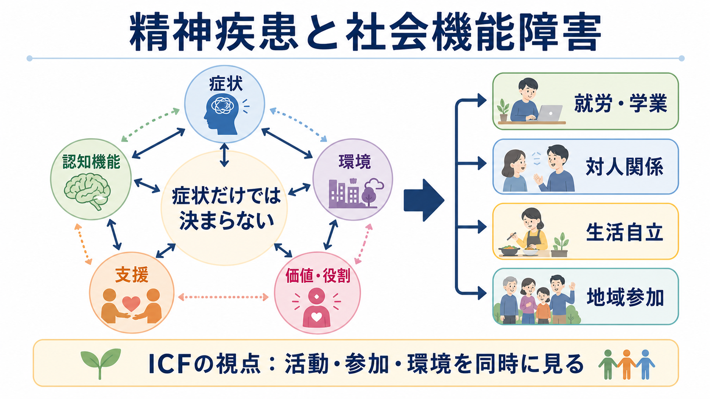
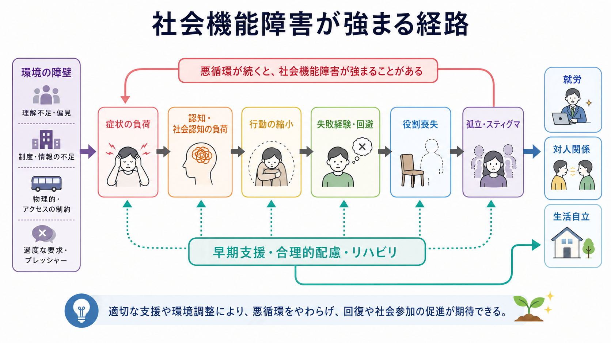

# 精神疾患と社会機能障害はどう関係するのか

## 要点

- 精神疾患の影響は、気分、不安、幻覚妄想、衝動性などの「症状」だけでなく、就労・学業、対人関係、家事、金銭管理、住居維持、地域参加といった生活上の機能に現れる。
- 社会機能障害は「症状が重いから自動的に起こる」ものではない。認知機能、社会認知、身体疾患、睡眠、物質使用、家族・職場・学校・制度の環境、スティグマ、支援資源が相互に作用する。
- ICFでは、障害を個人内の欠陥としてだけでなく、健康状態、活動、参加、環境因子の相互作用として捉える[2]。
- 治療評価では症状尺度だけでは不十分で、本人が実際に生活で何をできるか、何に困っているか、何を回復したいかを並行して見る必要がある[3][7]。

## この記事で答える問い

1. 精神疾患における「社会機能障害」とは何を指すのか。
2. なぜ症状が改善しても、就労・対人関係・生活自立の困難が残ることがあるのか。
3. 臨床や研究では、社会機能をどのように評価し、支援につなげるのか。

## まず結論

精神疾患と社会機能障害の関係は、単純な「症状 → 生活困難」の一本道ではない。症状は重要な入口だが、その影響は、注意・記憶・実行機能、感情調整、社会的手がかりの読み取り、睡眠、身体健康、職場や家庭の要求水準、支援の有無によって増幅も緩和もされる。したがって臨床では、[[うつ病とは何か]]、[[双極性障害とは何か]]、[[統合失調症とは何か]]、[[不安症群とは何か]]といった診断名だけでなく、「この人の生活で、何が、どの場面で、どの程度妨げられているか」を具体的に評価する。

## 背景

WHOは、精神疾患を認知、感情調整、行動の臨床的に重要な乱れとして説明し、多くの場合、苦痛または重要な機能領域の障害を伴うとする[1]。ここでいう機能領域には、仕事、学業、家庭生活、対人関係、セルフケア、地域参加などが含まれる。

この視点は、精神医学の重症度を「症状の数」だけで測らないために重要である。たとえば、同じ抑うつ症状でも、在宅勤務で柔軟に休める人と、夜勤・対人接客・育児負担が重なっている人では、生活への影響が大きく異なる。逆に、症状が残っていても、環境調整、ピアサポート、家族支援、就労支援、服薬・心理療法・リハビリテーションが組み合わされることで、本人が望む役割を取り戻せることがある[8]。

## 基本概念

### 社会機能障害

社会機能障害とは、精神症状や関連する認知・行動・環境要因のために、社会生活上の役割や活動が制限される状態を指す。代表的な領域は次の通りである。

| 領域 | 具体例 | 評価で見る点 |
|---|---|---|
| 就労・学業 | 出勤、集中、期限管理、対人調整、復職・復学 | 欠勤だけでなく、遂行速度、疲労、ミス、職場配慮の有無 |
| 対人関係 | 家族、友人、職場、支援者との関係 | 回避、衝突、孤立、過剰適応、支援要請のしにくさ |
| 生活自立 | 食事、睡眠、衛生、服薬、金銭管理、住居維持 | 「できる能力」と「実生活で継続できるか」の差 |
| 地域参加 | 趣味、外出、制度利用、役割、居場所 | 交通、費用、情報、スティグマ、心理的安全性 |

### 機能、能力、実行の違い

「能力」と「実際の生活での実行」は分けて考える必要がある。面接室では予定を説明できても、実際には睡眠リズム、疲労、職場の刺激、対人緊張が重なって出勤できないことがある。統合失調症研究では、神経認知や社会認知が機能的能力と現実生活機能に関連し、社会認知は社会機能と特に関連しやすいことが示されている[5]。この論点は、[[統合失調症の認知機能障害とは何か]]や[[統合失調症の陰性症状とは何か]]を理解するときにも重要である。

### ICFとWHODAS

ICFは、心身機能・構造、活動、参加、環境因子を含む枠組みで、障害を「個人の病気の結果」だけでなく「その人が置かれた世界との相互作用」として記述する[2]。WHODAS 2.0はICFに基づき、認知、移動、セルフケア、人との交流、生活活動、参加の6領域で機能と障害を評価する汎用尺度である[3]。

## 仕組み

社会機能障害は、少なくとも次の経路で強まりやすい。

1. 症状の直接効果  
   抑うつ、不安、強迫、幻覚妄想、躁状態、解離、過覚醒、衝動性などは、集中、睡眠、判断、対人応答、行動開始を妨げる。WHOの精神疾患解説でも、多くの精神疾患で日常生活や重要な機能領域への影響が強調されている[1]。

2. 認知・社会認知の負荷  
   注意、処理速度、記憶、実行機能、感情認識、他者意図の推測が低下すると、仕事の段取り、会話の微妙な調整、金銭管理、危機時の相談が難しくなる。うつ病、双極性障害、統合失調症では、症状が軽い時期にも認知機能と日常機能の問題が残ることがある[4]。

3. 回避と役割喪失の循環  
   失敗経験や強い疲労が続くと、本人は活動を減らして一時的に負荷を下げる。しかし活動の縮小が長期化すると、技能の使用機会、自己効力感、職場・友人・地域との接点が減り、さらに戻りにくくなる。[[ひきこもりとは何か]]に近い状態では、この循環を個人の意志だけに還元しないことが重要である。

4. 環境要因とスティグマ  
   過密な職場、休みにくい制度、情報不足、家族内の葛藤、貧困、住居不安、差別、過度な自己責任化は、症状の有無とは別に機能を制限する。ICFの枠組みでは、環境因子は活動や参加を妨げる障壁にも、回復を支える促進因子にもなる[2]。

## 図解

## 臨床・研究との接続

### 評価では「症状」と「機能」を分けて聞く

症状評価では、抑うつ、不安、幻覚妄想、躁症状、睡眠、希死念慮などを確認する。一方、機能評価では、生活の場面ごとに次を尋ねる。

- 何ができなくなったか。
- 以前はどの程度できていたか。
- できる日とできない日の差は何で生じるか。
- 本人はどの役割を取り戻したいか。
- 環境調整や支援で変えられる障壁は何か。

この分離は、症状改善が機能改善と完全には一致しないためである。うつ病治療研究のレビューでは、症状と機能の関係は双方向的で、機能改善が症状改善に遅れることがあるため、症状と機能の両方をアウトカムとして測る必要があると論じられている[7]。

### 支援は「本人を変える」だけではない

社会機能障害への支援は、薬物療法や心理療法だけでなく、心理社会的リハビリテーション、認知機能リハビリテーション、家族心理教育、生活支援、就労支援、合理的配慮、住居支援、ピアサポートを含む。IPSなどの個別就労支援は、精神疾患をもつ人の一般就労を支えるエビデンスに基づくモデルとして研究されている[8]。

### 研究ではアウトカムを多層化する

研究では、症状尺度、認知課題、機能的能力、実生活機能、生活の質、主観的リカバリーを分けて測る必要がある。統合失調症の社会機能に関するメタ分析では、陰性症状だけでなく陽性症状、解体症状、抑うつ症状、全般精神病理も社会機能と関連しており、単一要因で説明しにくいことが示されている[6]。

## よくある誤解

### 「症状が軽くなれば、生活機能もすぐ戻る」

症状改善は重要だが、生活機能の回復には時間、練習、環境調整、役割の再構築が必要なことがある。特に長期休職、退学、孤立、家事の崩れ、金銭問題がある場合、症状が下がった後にも段階的な支援が必要になる。

### 「働けないなら病気が重い、働けるなら軽い」

就労は重要な社会参加の一形態だが、病気の重症度をそのまま示す指標ではない。職場の柔軟性、経済的必要性、支援者、職務内容、本人の価値観によって大きく変わる。短時間就労や在宅勤務で安定する人もいれば、症状を隠して過剰適応し、後から悪化する人もいる。

### 「社会機能障害は本人の努力不足である」

社会機能障害には、症状、認知機能、身体状態、環境、制度、スティグマが関わる。努力や意志の問題として扱うと、本人が支援を求めにくくなり、孤立や回避が強まる。評価の目的は責任追及ではなく、障壁を具体化して変えられる要因を探すことである。

## 関連ノート

- [[うつ病とは何か]]
- [[双極性障害とは何か]]
- [[統合失調症とは何か]]
- [[統合失調症の認知機能障害とは何か]]
- [[統合失調症の陰性症状とは何か]]
- [[不安症群とは何か]]
- [[ひきこもりとは何か]]
- [[パーソナリティ機能の障害とは何か]]

### MOC更新候補

- `content/00_MOC/` 配下の精神医学MOCに、疾患横断的な評価・支援ノートとして追加候補。
- 同時編集を避けるため、このジョブではMOCファイル本体は更新しない。

## 理解チェック

1. 精神疾患の重症度を症状だけで判断すると、どのような生活上の困難を見落としやすいか。
2. 「能力」と「実生活での実行」を分けて評価する意義は何か。
3. 社会機能障害を強める環境要因には何があるか。
4. 症状改善後にも就労・対人関係・生活自立の支援が必要になる理由は何か。

## 未解決問題

- 診断横断的に使える社会機能評価と、疾患特異的な評価をどう組み合わせるべきか。
- 本人の主観的リカバリーと、就労日数や生活自立度のような外的指標をどう統合するべきか。
- スティグマ、貧困、住居、雇用制度などの構造的要因を、個別臨床の評価にどう反映するべきか。

## 参考文献

[1] World Health Organization. (2025). *Mental disorders*. https://www.who.int/news-room/fact-sheets/detail/mental-disorders

[2] World Health Organization. *International Classification of Functioning, Disability and Health (ICF)*. https://www.who.int/standards/classifications/international-classification-of-functioning-disability-and-health

[3] World Health Organization. (2012). *WHO Disability Assessment Schedule 2.0 (WHODAS 2.0)*. https://www.who.int/classifications/icf/whodasii/en/

[4] Harvey, P. D. (2011). Mood symptoms, cognition, and everyday functioning: in major depression, bipolar disorder, and schizophrenia. *Innovations in Clinical Neuroscience, 8*(10), 14-18. https://pmc.ncbi.nlm.nih.gov/articles/PMC3225134/

[5] Kharawala, S., Hastedt, C., Podhorna, J., Shukla, H., Kappelhoff, B., & Harvey, P. D. (2022). The relationship between cognition and functioning in schizophrenia: A semi-systematic review. *Schizophrenia Research: Cognition, 27*, 100217. https://doi.org/10.1016/j.scog.2021.100217

[6] Handest, R., Molstrom, I.-M., & Henriksen, M. G. (2023). A systematic review and meta-analysis of the association between psychopathology and social functioning in schizophrenia. *Schizophrenia Bulletin, 49*(6), 1470-1485. https://doi.org/10.1093/schbul/sbad075

[7] McKnight, P. E., & Kashdan, T. B. (2009). The importance of functional impairment to mental health outcomes: A case for reassessing our goals in depression treatment research. *Clinical Psychology Review, 29*(3), 243-259. https://doi.org/10.1016/j.cpr.2009.01.005

[8] de Winter, L., Couwenbergh, C., van Weeghel, J., Sanches, S., Michon, H., & Bond, G. R. (2022). Who benefits from individual placement and support? A meta-analysis. *Epidemiology and Psychiatric Sciences, 31*, e50. https://doi.org/10.1017/S2045796022000300
