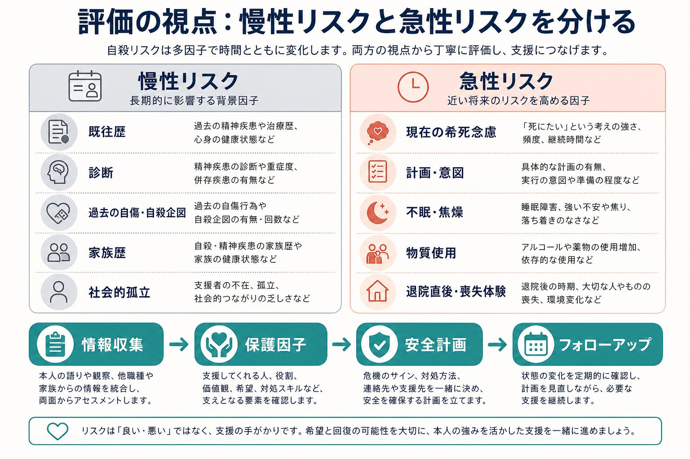
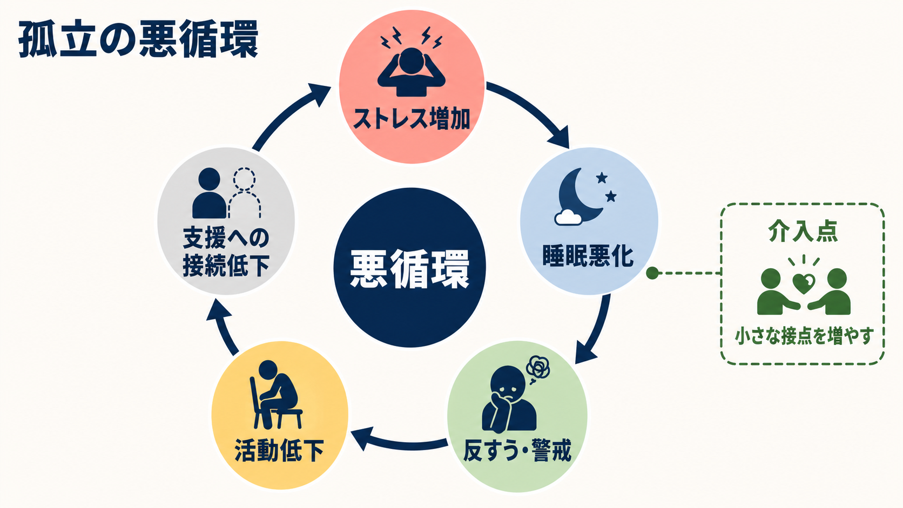

# 精神疾患と自殺リスクはどう関係するのか

## 要点

- 自殺リスクは精神疾患と強く関連するが、診断名だけで個人の危険度を決めることはできない。重要なのは、疾患別の基礎リスク、過去の自殺企図、現在の希死念慮、計画性、急性増悪因子、保護因子を統合して見ることである[1][2]。
- [[うつ病とは何か|うつ病]]、[[双極性障害とは何か|双極性障害]]、[[統合失調症とは何か|統合失調症]]、[[アルコール使用障害とは何か|アルコール使用障害]]などでは、一般人口より自殺死亡率が高いことが多くの研究で示されている[2]。
- 急性期には、[[不眠障害とは何か|不眠]]、焦燥、絶望感、強い不安、精神病症状、飲酒・薬物使用、退院直後、喪失体験、手段へのアクセスなどが、短期間でリスクを押し上げる[3][5]。
- リスク評価は「予言」ではなく、支援の焦点を見つける作業である。リスク尺度だけに依存せず、本人の語り、周囲からの情報、臨床状態、環境、保護因子を合わせて安全計画につなげる[5][6]。

## この記事で答える問い

1. 精神疾患があると、なぜ自殺リスクが上がりやすいのか。
2. 疾患別のリスクを、どの程度まで一般化してよいのか。
3. 慢性的な背景リスクと、数日から数週間で変わる急性リスクをどう分けて考えるのか。
4. 臨床・研究では、リスク評価をどのように支援へ接続するのか。

## まず結論

精神疾患と自殺リスクの関係は、「ある診断名があるから危険」という単純な対応ではない。精神疾患は、気分、睡眠、衝動性、認知の狭まり、幻覚・妄想、孤立、物質使用、身体疾患、社会的喪失などを通じて、自殺リスクの背景を作りうる。一方で、同じ診断名でも、症状の重症度、病相、治療継続、支援者とのつながり、手段へのアクセス、本人の希望や価値によってリスクは大きく変わる[2][5]。

したがって評価の基本は、疾患別の基礎リスクを出発点にしつつ、「いま危険が増えているサインは何か」「何が本人をつなぎとめているか」「今日から変えられる環境要因は何か」を具体的に見ることである。このノートは教育・研究目的の整理であり、個別の診断や治療指示ではない。切迫した危険がある場合は、地域の救急、医療機関、信頼できる支援者につなぐことが優先される。

## 背景

世界保健機関は、自殺を主要な公衆衛生課題として位置づけ、過去の自殺企図、精神疾患、アルコール有害使用、喪失、孤立、差別、慢性疼痛、手段へのアクセスなどを重要なリスク要因として整理している[1]。ここで注意すべきなのは、リスク要因は単独で機械的に働くのではなく、複数の要因が重なったときに危険が急に高まる点である。

精神疾患に関する大規模レビューでは、多くの精神疾患で一般人口より自殺死亡率が高いことが報告されている。特に気分障害、物質使用症、統合失調症、摂食障害、パーソナリティ症などは重要な評価対象になる[2]。ただし、これは「その診断名の人を危険視する」という意味ではない。診断名はリスクの入口であり、最終的には本人の現在の状態と文脈を評価する必要がある。

## 基本概念

### 慢性リスクと急性リスク

慢性リスクとは、長期的にリスクを押し上げる背景因子である。例として、過去の自殺企図、精神疾患の既往、家族歴、慢性疼痛、社会的孤立、反復する入院、生活基盤の不安定さなどがある[1][5]。

急性リスクとは、近い将来の危険を高める現在進行形の変化である。たとえば、希死念慮の強まり、具体的な計画や意図、手段への接近、強い不眠や焦燥、酩酊、精神病症状の増悪、退院直後、重大な喪失体験などである[3][5]。同じ慢性リスクを持つ人でも、急性リスクが高まる時期と落ち着いている時期では、必要な支援の密度が異なる。

### 疾患別リスクは「順位表」ではなく評価の入口

疾患群ごとの自殺リスクには大まかな傾向がある。[[気分障害における自殺リスクとは何か|気分障害]]では抑うつ、絶望感、混合状態、焦燥が重要になりやすい。[[双極性障害とは何か|双極性障害]]では、うつ状態だけでなく、混合特徴、衝動性、睡眠減少、物質使用が重なる時期に注意が必要である。[[統合失調症とは何か|統合失調症]]では、発症早期、退院直後、抑うつ、病識に伴う絶望感、命令性幻聴、物質使用がリスク評価に関わる。[[アルコール使用障害とは何か|アルコール使用障害]]や[[オピオイド使用障害とは何か|オピオイド使用障害]]では、酩酊、離脱、衝動性、社会的損失、併存うつが重要になる[2][5]。

一方で、疾患別の平均的傾向は個人の判断を代替しない。[[PTSDとは何か|PTSD]]、[[摂食障害群とは何か|摂食障害]]、[[パーソナリティ障害群とは何か|パーソナリティ障害]]でもリスクは上がりうるが、評価では診断名よりも、現在の苦痛、行動の切迫性、孤立、利用可能な支援、保護因子を見る必要がある。

## 仕組み

自殺リスクが高まる仕組みは、単一の経路ではない。精神疾患は、少なくとも次の複数の経路を通じてリスクを高めうる。

1. 気分・価値づけの変化  
   抑うつ、絶望感、罪責感、無価値感が強くなると、未来の選択肢が見えにくくなる。これは[[うつ病とは何か|うつ病]]だけでなく、双極性障害のうつ状態、統合失調症の抑うつ、PTSD、物質使用症でも起こりうる。

2. 覚醒・睡眠・衝動性の変化  
   不眠、焦燥、強い不安、混合状態、酩酊は、苦痛を増幅し、熟慮する力を下げる。特にアルコールや薬物は、抑制を弱め、短時間で行動化しやすい状態を作る[1][5]。

3. 認知の狭まり  
   強い苦痛が続くと、「これしかない」という思考の狭まりが起こりやすい。問題解決の選択肢が減り、支援要請も難しくなる。

4. 社会的接続の低下  
   孤立、失業、退学、家庭内葛藤、差別、住居不安定は、危機時に支える接点を減らす。自殺予防では、症状だけでなく、社会的接続を回復する視点が重要である[1][8]。

5. 手段へのアクセス  
   致死性の高い手段に近づきやすい環境は、短時間の危機を死亡に結びつけやすい。手段へのアクセス低減は、国際的な自殺予防戦略の中核である[8]。

## 図解

上の3枚の図は、同じ内容を別の角度から整理している。1枚目は、慢性リスクと急性リスクを分け、情報収集、保護因子、安全計画、フォローアップへ進む流れを示す。2枚目は、孤立や睡眠悪化、活動低下が悪循環を作り、支援接点がその循環を弱めうることを示す。3枚目は、疾患群ごとのリスク傾向を「順位づけ」ではなく、個別評価の入口として使う視点を示す。

## 臨床・研究との接続

### 評価は尺度だけで完結しない

NICE は、自傷後の再発や自殺の予測を、リスク尺度や単純な高・中・低分類だけで決めることを避けるよう勧めている[6]。VA/DoD ガイドラインも、リスク評価を、病歴、現在の自殺関連思考、精神状態、物質使用、保護因子、アクセス可能な手段、支援体制を統合する臨床的定式化として扱う[5]。尺度は記録や構造化の助けにはなるが、本人の語りや周囲の情報を置き換えるものではない。

### 退院直後は特に重要な時期である

精神科入院後の退院直後は、自殺死亡率が高い時期として繰り返し報告されている。メタ解析では、退院後、特に退院直後の期間にリスクが著しく高いことが示されている[3]。このため、退院計画、早期フォロー、家族・支援者との連携、薬剤・物質使用・睡眠の確認は、単なる事務手続きではなくリスク低減の要点になる。

### 安全計画とフォローアップ

安全計画は、危機のサイン、本人ができる対処、気をそらす行動、連絡できる人、専門機関、手段へのアクセス低減を、本人と共同で具体化する方法である。救急外来患者を対象にした研究では、安全計画とフォローアップ連絡を組み合わせた介入が、自殺関連行動の減少と治療接触の増加に関連した[7]。重要なのは、本人を管理対象として扱うことではなく、危機時に使える手順を本人の言葉で準備することである。

## よくある誤解

### 誤解1: 精神疾患があれば、必ず自殺リスクが高い

精神疾患は重要なリスク要因だが、同じ診断でもリスクは大きく異なる。症状が安定し、治療が継続され、支援者とつながり、手段へのアクセスが低い場合、危険度は下がりうる。診断名だけで本人を危険視することは、スティグマを強め、支援要請を妨げる。

### 誤解2: 自殺リスクは「聞くと悪化する」

自殺念慮を丁寧に尋ねることは、適切な評価と支援の入口である。むしろ曖昧に避けると、本人が孤立し、必要な安全計画や治療接続が遅れることがある[5][6]。

### 誤解3: リスク評価は将来を正確に予測する作業である

リスク評価は、誰がいつ自殺するかを確実に予測する作業ではない。臨床的には、変えられる要因、危機時の手順、支援密度、フォローアップのタイミングを決めるための定式化である。

### 誤解4: 危機が去れば支援は不要である

急性危機が下がっても、慢性リスクや生活上の問題が残ることは多い。退院後、喪失体験後、飲酒再開、睡眠悪化、治療中断などの時期には、再評価と支援の再調整が必要になる[3][5]。

## 関連ノート

- [[気分障害における自殺リスクとは何か]]
- [[自殺危機症候群とは何か]]
- [[自殺関連行動障害とは何か]]
- [[非自殺性自傷とは何か]]
- [[うつ病とは何か]]
- [[双極性障害とは何か]]
- [[統合失調症とは何か]]
- [[アルコール使用障害とは何か]]
- [[不眠障害とは何か]]
- [[PTSDとは何か]]

## 理解チェック

1. 慢性リスクと急性リスクの違いを、自殺リスク評価の文脈で説明できるか。
2. 疾患別リスクを、なぜ「順位表」として使ってはいけないのか。
3. 退院直後、飲酒、不眠、焦燥、手段へのアクセスが重なると、どのようにリスクが上がりうるか。
4. 安全計画には、どのような要素を含めるべきか。

## 参考文献

[1] World Health Organization. *Suicide*. https://www.who.int/news-room/fact-sheets/detail/suicide

[2] Chesney, E., Goodwin, G. M., & Fazel, S. (2014). Risks of all-cause and suicide mortality in mental disorders: a meta-review. *World Psychiatry, 13*(2), 153-160. https://doi.org/10.1002/wps.20128

[3] Chung, D. T., Ryan, C. J., Hadzi-Pavlovic, D., Singh, S. P., Stanton, C., & Large, M. M. (2017). Suicide rates after discharge from psychiatric facilities: a systematic review and meta-analysis. *JAMA Psychiatry, 74*(7), 694-702. https://doi.org/10.1001/jamapsychiatry.2017.1044

[4] Turecki, G., & Brent, D. A. (2016). Suicide and suicidal behaviour. *The Lancet, 387*(10024), 1227-1239. https://doi.org/10.1016/S0140-6736(15)00234-2

[5] U.S. Department of Veterans Affairs & U.S. Department of Defense. (2024). *VA/DoD Clinical Practice Guideline for Assessment and Management of Patients at Risk for Suicide*. https://www.healthquality.va.gov/guidelines/MH/srb/

[6] National Institute for Health and Care Excellence. (2022). *Self-harm: assessment, management and preventing recurrence* (NICE Guideline NG225). https://www.nice.org.uk/guidance/ng225

[7] Stanley, B., Brown, G. K., Brenner, L. A., et al. (2018). Comparison of the Safety Planning Intervention with follow-up vs usual care of suicidal patients treated in the emergency department. *JAMA Psychiatry, 75*(9), 894-900. https://doi.org/10.1001/jamapsychiatry.2018.1776

[8] World Health Organization. (2021). *LIVE LIFE: An implementation guide for suicide prevention in countries*. https://www.who.int/publications/i/item/9789240026629

## 未解決問題

- 疾患別の平均リスクを、個人の短期リスク評価にどう統合するのが最も妥当か。
- デジタル行動データや睡眠データを用いた予測モデルを、プライバシーと偽陽性の問題を抑えながら臨床実装できるか。
- 退院直後や治療中断時に、どのフォローアップ頻度・方法が最も有効か。
- 自殺リスクを扱う教育が、スティグマを減らし、支援要請を増やす形で設計できるか。

## MOC更新候補

- `content/00_MOC/` 配下の精神医学、自殺予防、臨床評価に関するMOCへ `[[精神疾患と自殺リスクはどう関係するのか]]` を追加する候補。
- 並列ジョブとの競合を避けるため、このタスクではMOC本体は更新しない。
