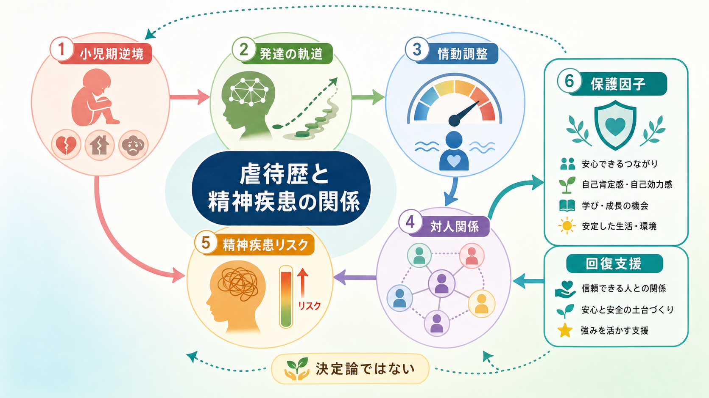
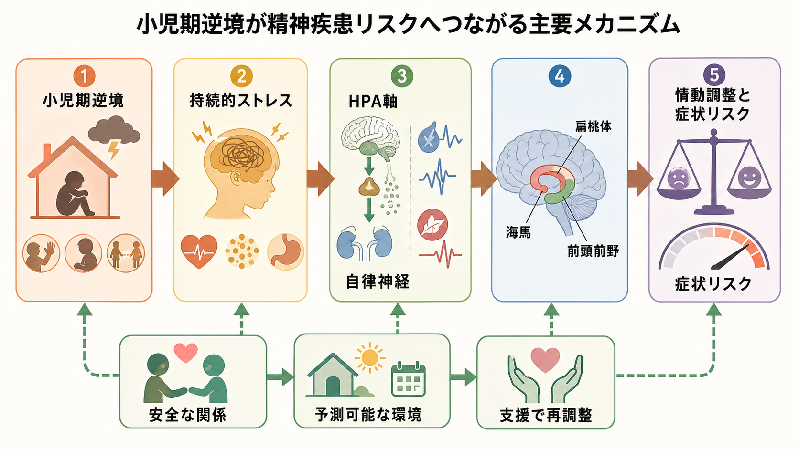
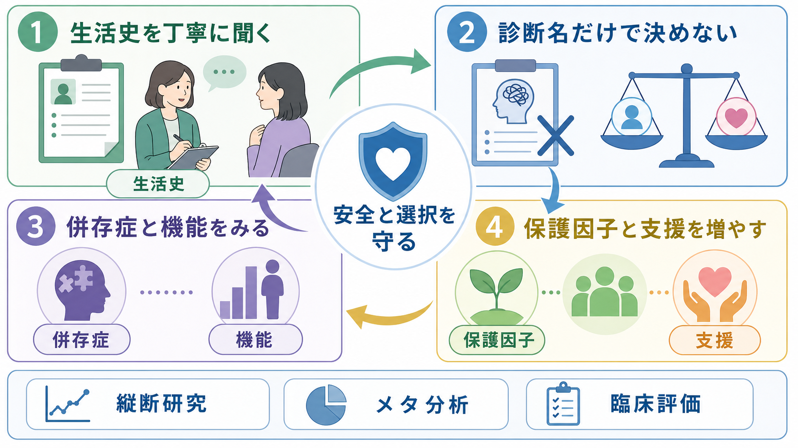

# 精神疾患と虐待歴はどう関係するのか

## 要点

- 虐待歴や[[逆境的小児期体験ACEとは何か|小児期逆境]]は、うつ病、不安症、[[PTSDとは何か|PTSD]]、物質使用、精神病症状など、多くの精神疾患リスクと関連する。ただし、それは「必ず発症する」という意味ではない。
- 重要なのは、単一の出来事よりも、脅威、ネグレクト、家庭内不安定、孤立、貧困、差別などが発達期にどの程度重なり、どの時期に、どれくらい持続したかである。
- 主要な経路は、ストレス反応系、脳発達、[[情動と認知は分けられるのか|情動調整]]、[[愛着とは何か|愛着]]と対人関係、自己理解、社会的機会の制限として整理できる。
- 臨床では、虐待歴を「原因探し」や「本人の説明の正しさの判定」に使うのではなく、現在の症状、生活機能、安全、治療関係、支援ニーズを理解するために扱う。
- 保護因子、安定した関係、心理教育、環境調整、トラウマインフォームドな支援は、リスクの影響を弱めうる。

## この記事で答える問い

1. 虐待歴や小児期逆境は、精神疾患とどのように関連するのか。
2. その関連は、脳、情動調整、対人関係のどの経路で説明できるのか。
3. 「虐待が原因で病気になる」と単純化しないために、何に注意すべきか。
4. 臨床・研究では、虐待歴をどのように扱うべきか。

## まず結論

精神疾患と虐待歴の関係は、単純な一対一の因果関係ではない。小児期の虐待、ネグレクト、家庭内暴力、保護者の精神疾患や物質使用、いじめ、貧困などは、発達中のストレス反応、脳ネットワーク、情動調整、対人信頼、学習機会に影響し、複数の精神疾患への脆弱性を高める。[1][2][3]

しかし、虐待歴は診断名を決めるラベルではない。同じ経験をしても、症状が出る人、出ない人、時期をおいて出る人、支援によって回復する人がいる。したがって、臨床的には「過去に何があったか」だけでなく、「現在の安全はどうか」「どの症状が生活を妨げているか」「どの関係や環境が回復を支えるか」を同時に見る必要がある。[1][8]

## 背景

WHO は、児童虐待を 18 歳未満の子どもに対する身体的・情緒的な不適切処遇、性的虐待、ネグレクト、搾取など、健康・生存・発達・尊厳に実際または潜在的な害をもたらす行為として整理している。虐待の帰結には、PTSD、不安、抑うつ、物質使用、教育・職業上の不利益、対人暴力のリスクなどが含まれる。[1]

ACE 研究は、小児期の虐待や家庭機能不全が、成人期の健康リスク行動、身体疾患、精神的健康問題と段階的に関連することを示した代表的研究である。[2] その後の国際疫学研究でも、小児期逆境は 20 種類の DSM-IV 精神疾患の初発と広く関連し、特に虐待・ネグレクト・家庭内機能不全のような経験は特定の疾患だけでなく多領域のリスクと関連した。[4]

系統的レビューとメタ分析でも、身体的虐待、情緒的虐待、ネグレクトは、抑うつ、不安、薬物使用、自殺関連行動などの長期的な健康アウトカムと関連する。[3] 精神病症状についても、小児期逆境との関連を示すメタ分析がある。[7] ただし、これらの研究は多くが観察研究であり、逆境の測定、記憶バイアス、社会経済的要因、遺伝的脆弱性、併存する逆境を慎重に扱う必要がある。

## 基本概念

### 虐待歴

虐待歴とは、身体的虐待、性的虐待、心理的虐待、ネグレクト、家庭内暴力の目撃など、発達期の安全や尊厳を損なう経験の履歴を指す。臨床で重要なのは、出来事の有無だけではない。年齢、期間、頻度、加害者との関係、逃げ場の有無、周囲の反応、秘密化、本人がどのように意味づけたかが、その後の影響を変える。

### 小児期逆境

小児期逆境は、虐待より広い概念である。保護者の精神疾患や物質使用、家庭内不和、貧困、差別、いじめ、親との分離、慢性疾患、地域暴力なども含まれる。[[逆境的小児期体験ACEとは何か]]は、公衆衛生研究でリスクの集積を捉えるために使われるが、個人の将来を決定するスコアではない。

### 脅威と剥奪

近年の発達神経科学では、小児期逆境を「脅威」と「剥奪」に分けて考える枠組みが用いられる。脅威は、暴力や恐怖のように身体的・心理的安全を脅かす経験であり、扁桃体、海馬、前頭前野、サリエンス処理に関わる。剥奪は、認知的・社会的・情緒的入力の不足であり、言語、実行機能、前頭頭頂ネットワーク、学習機会に影響しやすい。[6]

## 仕組み

### 1. ストレス反応系が長く警戒状態になる

虐待やネグレクトが持続すると、子どもは「何が起きるか分からない環境」に適応しようとする。HPA 軸、自律神経、免疫・炎症系は、危険検出と回避に役立つ一方、長期的には睡眠、注意、身体感覚、疲労、過覚醒、回避に影響しうる。[5]

この変化は「壊れた反応」とだけ見るより、「危険な環境で生き延びるための適応が、安全な環境では過剰に働く」と捉える方が臨床的に有用である。例えば、怒られそうな表情に敏感、相手の沈黙を拒絶と読む、少しの失敗で強い恥や恐怖が出る、といった反応は、過去の環境では意味を持っていた可能性がある。

### 2. 脳発達の軌道が変わる

小児期虐待は、海馬、扁桃体、前頭前野、前帯状皮質、脳梁、報酬系などの構造・機能差と関連することが報告されている。[5] [[扁桃体過活動は不安症やPTSDにどう関わるのか|扁桃体]]は脅威検出、海馬は文脈記憶、[[前頭前野は情動制御にどう関わるのか|前頭前野]]は情動制御や行動選択に関わるため、このネットワークの変化は PTSD、不安、抑うつ、衝動性、解離、対人警戒に関係しうる。

ただし、脳画像所見は個人の診断を直接決めるものではない。レビューでは、虐待歴のある人に見られる脳変化は、精神疾患そのものの所見というより、小児期逆境への適応や発達経路の違いを反映する可能性も指摘されている。[5]

### 3. 情動調整が難しくなる

小児期逆境は、情動調整困難、反すう、抑制、再評価のしにくさと関連し、それらが精神病理との関連を部分的に媒介することがメタ分析で示されている。[8] つまり、虐待歴は特定の診断だけでなく、「強い感情が出たときに、注意を戻す、意味づけ直す、他者に頼る、身体を落ち着かせる」といった基本的な調整過程に影響しうる。

情動調整の困難は、うつ病では反すうや自己批判、不安症では過剰な脅威予測、PTSD では侵入記憶と回避、摂食障害や物質使用では苦痛の調整手段、パーソナリティ病理では対人場面での急激な感情変動として現れうる。

### 4. 対人関係の予測モデルが変わる

養育者が安全基地にならない環境では、子どもは「助けを求めても無駄」「親しい人ほど危険」「自分は守られる価値がない」といった対人予測を学びやすい。これは[[愛着スタイルにはどのような種類があるのか|愛着スタイル]]、自己概念、信頼、境界設定、孤立、依存、過剰適応に影響する。

対人関係の困難は、精神疾患の結果であるだけでなく、症状を維持する条件にもなる。孤立は抑うつを強め、対人警戒は治療関係を難しくし、親密さへの恐怖は支援へのアクセスを妨げる。逆に、安全で予測可能な関係は、情動調整の外部足場として働く。

### 5. 社会的機会が制限される

虐待歴の影響は脳や心理だけではない。学業の中断、睡眠不足、家庭内責任、経済的困難、医療アクセスの低下、いじめ、住居不安定などが重なると、学習、就労、友人関係、受診、セルフケアの機会が減る。これは[[ストレス脆弱性モデルとは何か|脆弱性]]を増すだけでなく、回復資源へのアクセスも狭める。

## 図解

3 枚の図は、この記事の論点を別々の粒度で示している。

| 図 | 位置づけ | 読み方 |
|---|---|---|
| 図1 | 全体像 | 虐待歴は、発達、情動調整、対人関係、精神疾患リスクにまたがる。保護因子と回復支援も同じ図の中で見る。 |
| 図2 | メカニズム | 持続的ストレス、HPA 軸・自律神経、扁桃体・海馬・前頭前野、情動調整をつなげて読む。 |
| 図3 | 臨床・研究接続 | 生活史を聞く、診断名だけで決めない、併存症と機能を見る、保護因子を増やす、という実践上の流れを示す。 |

## 臨床・研究との接続

臨床では、虐待歴を確認することは重要だが、急いで詳細を聞き出すことが支援になるとは限らない。[[トラウマ歴はどのように聞くべきか]]で扱うように、目的、同意、答えない権利、中断できること、安全確認を明確にする必要がある。現在も危険が続いている場合は、症状理解よりも安全確保と保護が優先される。

診断面では、虐待歴は PTSD や[[複雑性PTSDとは何か|複雑性PTSD]]だけでなく、うつ病、不安症、物質使用、摂食障害、身体症状、解離、精神病症状、パーソナリティ機能の問題と重なりうる。[3][4][7] そのため、「虐待歴があるからこの診断」と決めるのではなく、症状クラスター、発症時期、持続、併存症、機能障害、危険性を丁寧に評価する。

研究では、虐待歴は交絡因子であると同時に、精神疾患の異質性を理解する手がかりでもある。例えば、同じ大うつ病という診断でも、小児期虐待歴を伴う群と伴わない群では、ストレス反応、脳画像、症状経過、治療反応が異なる可能性がある。[5] ただし、個人の診療では、集団平均の知見をそのまま予後判定に使ってはいけない。

支援の実践では、トラウマインフォームドな考え方、すなわち安全、信頼、選択、協働、エンパワメント、文化的背景への配慮が重要である。これは特定の心理療法名ではなく、面接、入院環境、学校、福祉、司法、家族支援にまたがる態度である。

## よくある誤解

### 誤解1: 虐待歴があれば精神疾患になる

虐待歴はリスクを高めるが、発症を決定しない。保護的な大人、友人、学校、地域資源、治療、本人の強み、時間経過によって経路は変わる。重要なのは「過去がすべてを決める」と考えないことである。

### 誤解2: 精神疾患の原因は虐待だけで説明できる

精神疾患は、遺伝、発達、身体疾患、睡眠、物質使用、社会経済的条件、現在のストレス、文化的背景などが重なって生じる。虐待歴は重要な要因だが、唯一の原因ではない。

### 誤解3: 本人が覚えていなければ影響はない

明確な言語記憶がなくても、身体反応、対人予測、感情調整、回避、睡眠、警戒に影響が残ることがある。一方で、記憶の空白を外部から決めつけることも避けるべきである。

### 誤解4: 詳しく語らせるほど治療的である

詳細な想起は、準備や安全がないと再体験や解離を強めることがある。初期には、詳細よりも現在の安全、症状、生活、支援資源を確認する方が有用な場合が多い。

### 誤解5: 虐待歴を聞くことは加害者探しである

臨床で虐待歴を聞く目的は、責任追及ではなく、現在の困難を理解し、安全と支援を設計することである。もちろん、未成年者や高齢者、障害者などへの現在進行形の虐待が疑われる場合は、法的・制度的な保護対応が必要になる。

## 関連ノート

- [[逆境的小児期体験ACEとは何か]]
- [[トラウマは発達にどう影響するのか]]
- [[愛着とは何か]]
- [[愛着スタイルにはどのような種類があるのか]]
- [[情動と認知は分けられるのか]]
- [[前頭前野は情動制御にどう関わるのか]]
- [[扁桃体過活動は不安症やPTSDにどう関わるのか]]
- [[PTSDとは何か]]
- [[複雑性PTSDとは何か]]
- [[トラウマ歴はどのように聞くべきか]]
- [[虐待リスクを精神科でどう評価するか]]
- [[ストレス脆弱性モデルとは何か]]

MOC 更新候補: `content/00_MOC/` 配下の精神医学、トラウマ、発達・愛着、臨床面接関連 MOC。並列ジョブとの競合を避けるため、本記事では MOC 本体は更新しない。

## 理解チェック

1. 虐待歴と精神疾患の関係を「決定論」として扱ってはいけない理由は何か。
2. 脅威と剥奪は、発達や脳機能にどのように異なる影響を持ちうるか。
3. 情動調整は、小児期逆境と精神病理のあいだでどのような役割を持つか。
4. 臨床面接で虐待歴を聞くとき、最初に守るべき条件は何か。
5. 保護因子や回復支援を、診断名とは別に評価する必要がある理由は何か。

## 参考文献

[1] World Health Organization. (2024). *Child maltreatment*. https://www.who.int/news-room/fact-sheets/detail/child-maltreatment

[2] Felitti, V. J., Anda, R. F., Nordenberg, D., Williamson, D. F., Spitz, A. M., Edwards, V., Koss, M. P., & Marks, J. S. (1998). Relationship of childhood abuse and household dysfunction to many of the leading causes of death in adults: The Adverse Childhood Experiences Study. *American Journal of Preventive Medicine, 14*(4), 245-258. https://doi.org/10.1016/S0749-3797(98)00017-8

[3] Norman, R. E., Byambaa, M., De, R., Butchart, A., Scott, J., & Vos, T. (2012). The long-term health consequences of child physical abuse, emotional abuse, and neglect: A systematic review and meta-analysis. *PLoS Medicine, 9*(11), e1001349. https://doi.org/10.1371/journal.pmed.1001349

[4] Kessler, R. C., McLaughlin, K. A., Green, J. G., Gruber, M. J., Sampson, N. A., Zaslavsky, A. M., et al. (2010). Childhood adversities and adult psychopathology in the WHO World Mental Health Surveys. *The British Journal of Psychiatry, 197*(5), 378-385. https://doi.org/10.1192/bjp.bp.110.080499

[5] Teicher, M. H., & Samson, J. A. (2016). Annual Research Review: Enduring neurobiological effects of childhood abuse and neglect. *Journal of Child Psychology and Psychiatry, 57*(3), 241-266. https://doi.org/10.1111/jcpp.12507

[6] McLaughlin, K. A., Sheridan, M. A., & Lambert, H. K. (2014). Childhood adversity and neural development: Deprivation and threat as distinct dimensions of early experience. *Neuroscience and Biobehavioral Reviews, 47*, 578-591. https://doi.org/10.1016/j.neubiorev.2014.10.012

[7] Varese, F., Smeets, F., Drukker, M., Lieverse, R., Lataster, T., Viechtbauer, W., Read, J., van Os, J., & Bentall, R. P. (2012). Childhood adversities increase the risk of psychosis: A meta-analysis of patient-control, prospective- and cross-sectional cohort studies. *Schizophrenia Bulletin, 38*(4), 661-671. https://doi.org/10.1093/schbul/sbs050

[8] Miu, A. C., Szentagotai-Tatar, A., Balazsi, R., Nechita, D., Bunea, I., & Pollak, S. D. (2022). Emotion regulation as mediator between childhood adversity and psychopathology: A meta-analysis. *Clinical Psychology Review, 93*, 102141. https://doi.org/10.1016/j.cpr.2022.102141

## 未解決問題

- 虐待の種類、時期、頻度、慢性度、加害者との関係を、どの粒度で精神疾患リスクと結びつけるべきか。
- 逆境後に精神疾患を発症しない人の保護因子を、臨床支援にどう翻訳できるか。
- 脳画像、炎症、睡眠、身体反応、対人行動の指標を、個人の診断や治療選択にどこまで使えるか。
- 日本の文化、家族構造、学校制度、福祉制度に即したトラウマインフォームドケアをどう設計するか。
