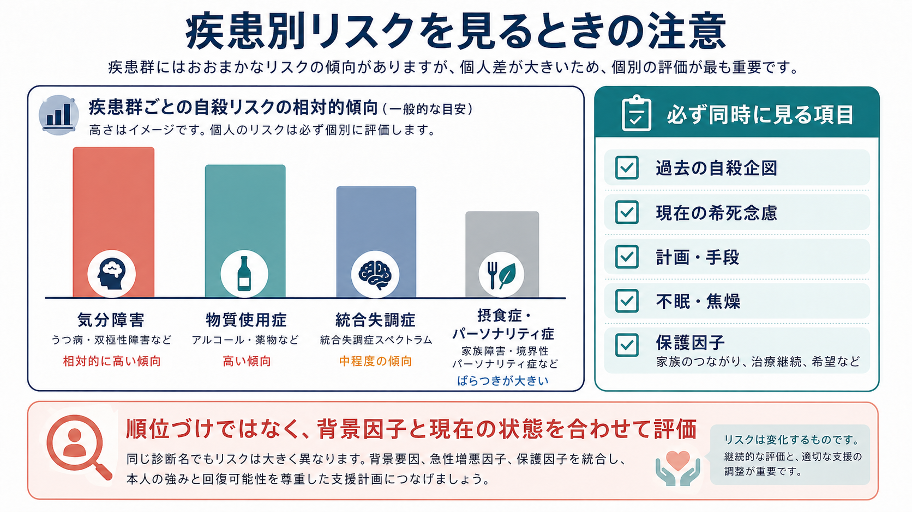
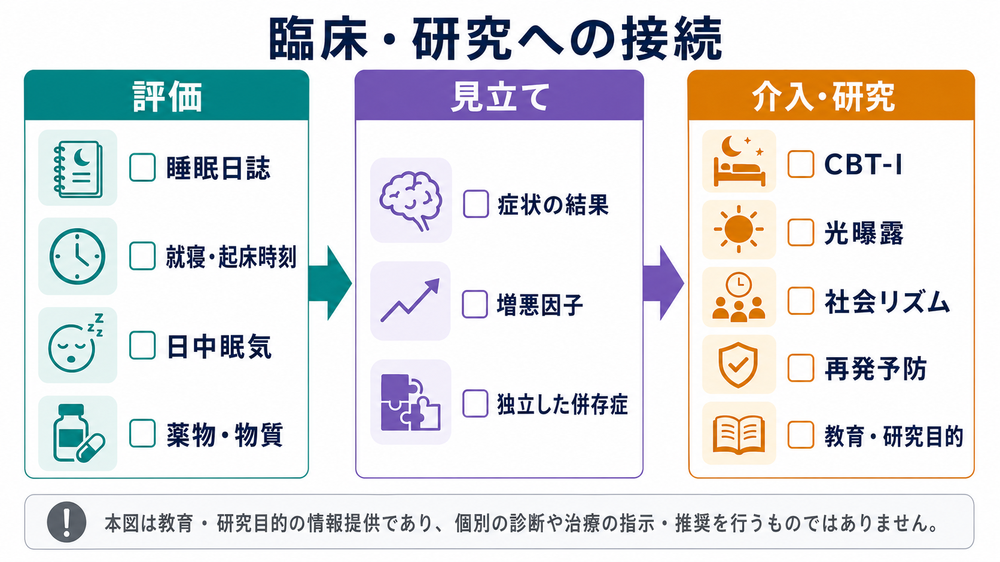
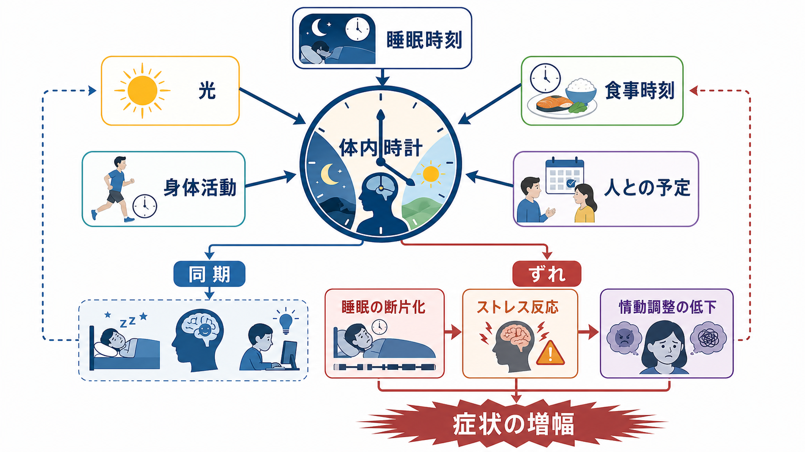

# 精神疾患と認知機能障害はどう関係するのか

## 要点

- 認知機能障害は、[[うつ病とは何か|うつ病]]、[[統合失調症とは何か|統合失調症]]、[[双極性障害とは何か|双極性障害]]でしばしばみられる。症状の「気分」「幻覚・妄想」「躁うつ」だけでは説明しきれない、注意、処理速度、作業記憶、実行機能、学習・記憶、社会的認知の問題として現れる。
- 認知機能障害は検査点数だけの問題ではなく、服薬管理、買い物、金銭管理、会話、就労・学業、対人関係などの生活機能に波及する。とくに統合失調症では、神経認知と社会的認知が機能転帰と強く関連することが繰り返し示されている[1][2]。
- うつ病では、気分症状が改善しても注意、記憶、実行機能、処理速度の低下が残ることがある[3]。双極性障害でも、気分安定期に認知機能低下が残る例があり、病相間欠期の生活機能を考えるうえで重要である[4]。
- 認知機能障害は「本人の努力不足」ではない。症状、睡眠、薬剤、身体疾患、ストレス、教育歴、環境負荷、支援資源を合わせて評価する必要がある。

## この記事で答える問い

この記事では、次の問いに答える。

1. 精神疾患でいう「認知機能障害」は、[[認知症とは何か|認知症]]や[[高次脳機能障害とは何か|高次脳機能障害]]とどう違うのか。
2. うつ病、統合失調症、双極性障害では、どの認知ドメインが問題になりやすいのか。
3. 認知機能障害は、生活機能や臨床支援とどう接続するのか。

## まず結論

精神疾患における認知機能障害は、疾患ごとに表れ方が違うが、「情報を受け取り、保ち、選び、行動に変換する力の低下」として横断的に理解できる。統合失調症では早期から広範な認知低下がみられやすく、MATRICSでは処理速度、注意・覚醒、作業記憶、言語学習、視覚学習、推論・問題解決、社会的認知が主要領域として整理された[5]。うつ病では注意・集中、記憶、実行機能、処理速度の低下が、抑うつ症状の一部としても、寛解後の残遺症状としても問題になる[3]。双極性障害では、躁・うつの急性期だけでなく、気分安定期にも記憶、注意、実行機能の弱さが残ることがある[4]。

ただし、検査上の低下がそのまま生活能力の低さを意味するわけではない。本人の強み、環境調整、代償手段、支援者の理解、身体疾患や薬剤の影響によって、同じ認知プロファイルでも生活上の困難は大きく変わる。

## 背景

精神医学では長く、統合失調症なら陽性症状、うつ病なら抑うつ気分、双極性障害なら躁とうつの病相が中心に語られてきた。しかし研究と臨床の両方で、症状が軽くなっても学業・就労・対人関係が回復しきらない人がいることが問題になった。その橋渡し概念の一つが認知機能障害である。

NIMHのRDoCでは、認知システムを注意、知覚、宣言的記憶、言語、認知制御、作業記憶などの機能単位として扱う[6]。この見方は、診断名だけでなく、どの情報処理過程が弱くなっているかを見るために役立つ。たとえば「会話が続かない」という困りごとは、注意の持続、処理速度、作業記憶、社会的認知、不安、疲労、薬剤性眠気が重なって起きるかもしれない。

## 基本概念

### 認知機能障害

認知機能障害とは、知能全体が一様に低いという意味ではない。情報処理の特定領域が、本人の年齢、教育歴、病前機能、生活上の要求に比べてうまく働きにくい状態を指す。代表的な領域は次の通りである。

| 領域 | 生活での見え方 |
|---|---|
| 注意 | 話を聞き落とす、刺激が多い場所で混乱する |
| 処理速度 | 返答や作業が遅くなる、急かされるとミスが増える |
| 作業記憶 | 途中で用件を忘れる、複数手順を保てない |
| 実行機能 | 段取り、切り替え、抑制、優先順位づけが難しい |
| 学習・記憶 | 新しい情報を覚えにくい、思い出しにくい |
| 社会的認知 | 相手の意図、表情、文脈を読み取りにくい |

### 認知症との違い

精神疾患に伴う認知機能障害は、[[神経認知障害群とは何か|神経認知障害群]]や認知症と重なる部分をもつが、同じではない。認知症では進行性の神経変性や脳血管障害などを背景に、生活自立に関わる認知低下が中心となる。一方、精神疾患では病相、睡眠、意欲、精神運動制止、薬剤、ストレス、社会的孤立が認知成績に影響しやすい。したがって、1回の検査で「認知症か精神疾患か」を単純に決めるのではなく、経過、日内変動、病前機能、身体疾患、画像・血液検査、生活場面の観察を合わせて考える。

## 仕組み

認知機能障害は、単一の脳部位や単一の神経伝達物質だけで説明できない。前頭前野を中心とする実行制御、海馬を含む記憶系、顕著性ネットワーク、デフォルトモードネットワーク、報酬系、睡眠・概日リズム、炎症、ストレス反応、薬剤作用が重なって、情報処理の効率を変える。

統合失調症では、認知機能低下は陽性症状の強さだけでは説明できず、発症前後から比較的安定してみられ、機能転帰と関連する[1][2]。うつ病では、抑うつ気分、反すう、睡眠障害、精神運動制止、意欲低下が注意や実行機能を圧迫する。さらに寛解後にも認知低下が残る例があり、再発予防や職場復帰を考える際の評価対象になる[3]。双極性障害では、急性躁・うつ状態の影響に加え、病相回数、精神病症状の既往、薬剤、睡眠リズムの乱れなどが認知と生活機能に関わる[4]。

## 図解

| 疾患 | 目立ちやすい認知領域 | 経過の特徴 | 臨床で見るポイント |
|---|---|---|---|
| [[大うつ病性障害とは何か|大うつ病性障害]] | 注意、記憶、実行機能、処理速度 | 急性期に目立ち、寛解後も残ることがある | 気分症状、睡眠、反すう、復職負荷を一緒に見る |
| [[統合失調症とは何か|統合失調症]] | 処理速度、作業記憶、言語学習、問題解決、社会的認知 | 発症早期から広範にみられやすく、比較的持続する | 陽性症状だけでなく陰性症状、社会的認知、生活技能を評価する |
| [[双極性障害とは何か|双極性障害]] | 記憶、注意、実行機能、処理速度 | 気分安定期にも低下が残ることがある | 病相、睡眠、薬剤、病相回数、職業機能を合わせて見る |

## 臨床・研究との接続

臨床では、認知機能障害を「検査で測るもの」と「生活で観察するもの」の両方として扱う。神経心理検査は注意、記憶、処理速度などの弱さを見つける手がかりになるが、本人が実際に困っている場面は検査室より複雑である。仕事では同時並行の作業、予期しない中断、対人緊張、時間制限が加わる。家庭では服薬、家事、金銭管理、予定管理が重なる。

研究では、統合失調症のMATRICSのように認知評価を標準化する試みが進められた[5]。また、認知リメディエーションは統合失調症を中心に検討され、認知成績だけでなく心理社会的リハビリテーションと組み合わせたときに機能面の改善が期待されると報告されている[7]。ただし、認知訓練だけで生活が自動的に変わるわけではない。環境調整、作業の外在化、チェックリスト、支援者との共有、睡眠・身体疾患の管理、再発予防と組み合わせることが重要である。

薬剤の影響も見逃せない。抗コリン作用、鎮静、睡眠薬、抗精神病薬の用量、気分安定薬、身体疾患治療薬は、注意や処理速度に影響することがある。一方で、症状が不安定なまま薬剤を減らせば、再発や睡眠悪化を通じて認知機能がさらに悪く見えることもある。個別の薬剤調整は主治医と相談する領域であり、この記事は教育・研究目的の整理に留まる。

## よくある誤解

### 誤解1: 認知機能障害は知能が低いという意味である

認知機能障害は、知能や人格の評価ではない。特定の情報処理過程が、病相、疲労、睡眠、薬剤、環境負荷によって働きにくくなる状態である。得意な領域が保たれている人も多い。

### 誤解2: 症状がよくなれば認知機能も必ず元に戻る

急性症状の改善で認知機能がよくなることはある。しかし、うつ病、統合失調症、双極性障害のいずれでも、寛解後や気分安定期に認知機能低下が残る例が報告されている[3][4]。復職・復学の時期には、症状評価だけでなく、持続注意、疲労、段取り、対人負荷を確認する必要がある。

### 誤解3: 検査で低ければ生活は必ず破綻する

検査成績は重要な手がかりだが、生活機能は環境と支援に強く左右される。予定を外在化する、刺激を減らす、作業を小分けにする、休憩を先に組み込む、重要な説明を書面化するだけでも、同じ認知特性の生活上の影響は変わる。

### 誤解4: 認知機能障害は本人に直接指摘すれば改善する

「集中して」「ちゃんと覚えて」という指示は、多くの場合役に立たない。問題は努力量ではなく、情報処理の負荷と環境要求の不一致である。支援では、失敗を責めるより、課題を分け、手がかりを増やし、疲労しにくい手順を設計するほうが実用的である。

## 関連ノート

- [[統合失調症の認知機能障害とは何か]]
- [[統合失調症とは何か]]
- [[うつ病とは何か]]
- [[大うつ病性障害とは何か]]
- [[双極性障害とは何か]]
- [[双極I型障害とは何か]]
- [[双極II型障害とは何か]]
- [[神経認知障害群とは何か]]
- [[認知症とは何か]]
- [[高次脳機能障害とは何か]]

## MOC更新候補

- `content/00_MOC/` 配下の精神医学、統合失調症、気分障害、認知機能に関するMOCへ追加候補。
- 並列ジョブとの衝突を避けるため、本記事ではMOC本体は更新しない。

## 理解チェック

1. 精神疾患における認知機能障害は、なぜ症状の重さだけでは説明しきれないのか。
2. 処理速度、作業記憶、実行機能の低下は、日常生活ではどのように現れうるか。
3. うつ病、統合失調症、双極性障害で、認知機能障害の経過はどのように違うか。
4. 認知機能障害を支援するとき、検査成績だけでなく生活場面を見る必要があるのはなぜか。

## 未解決問題

- 疾患横断的な認知ドメインと、診断特異的な認知プロファイルをどこまで分けられるか。
- 認知機能の改善が、どの条件で就労・学業・対人関係の改善へつながるか。
- 薬剤、睡眠、炎症、身体疾患、社会的孤立の影響を、個人レベルでどのように見積もるか。
- デジタル認知評価や日常生活データを、臨床的に安全で有用な形にできるか。

## 参考文献

[1] Fett AKJ, Viechtbauer W, Dominguez MD, Penn DL, van Os J, Krabbendam L. The relationship between neurocognition and social cognition with functional outcomes in schizophrenia: a meta-analysis. *Neuroscience & Biobehavioral Reviews*. 2011;35(3):573-588. https://doi.org/10.1016/j.neubiorev.2010.07.001

[2] Bowie CR, Harvey PD. Cognitive deficits and functional outcome in schizophrenia. *Neuropsychiatric Disease and Treatment*. 2006;2(4):531-536. https://pmc.ncbi.nlm.nih.gov/articles/PMC2671937/

[3] Rock PL, Roiser JP, Riedel WJ, Blackwell AD. Cognitive impairment in depression: a systematic review and meta-analysis. *Psychological Medicine*. 2014;44(10):2029-2040. https://doi.org/10.1017/S0033291713002535

[4] Robinson LJ, Thompson JM, Gallagher P, et al. A meta-analysis of cognitive deficits in euthymic patients with bipolar disorder. *Journal of Affective Disorders*. 2006;93(1-3):105-115. https://doi.org/10.1016/j.jad.2006.02.016

[5] Nuechterlein KH, Green MF, Kern RS, et al. The MATRICS Consensus Cognitive Battery, part 1: test selection, reliability, and validity. *American Journal of Psychiatry*. 2008;165(2):203-213. https://doi.org/10.1176/appi.ajp.2007.07010042

[6] National Institute of Mental Health. RDoC Matrix: Cognitive Systems. https://www.nimh.nih.gov/research/research-funded-by-nimh/rdoc/constructs/cognitive-systems

[7] Wykes T, Huddy V, Cellard C, McGurk SR, Czobor P. A meta-analysis of cognitive remediation for schizophrenia: methodology and effect sizes. *American Journal of Psychiatry*. 2011;168(5):472-485. https://doi.org/10.1176/appi.ajp.2010.10060855

[8] Bora E, Yucel M, Pantelis C. Cognitive impairment in schizophrenia and affective psychoses: implications for DSM-V criteria and beyond. *Schizophrenia Bulletin*. 2010;36(1):36-42. https://doi.org/10.1093/schbul/sbp094
