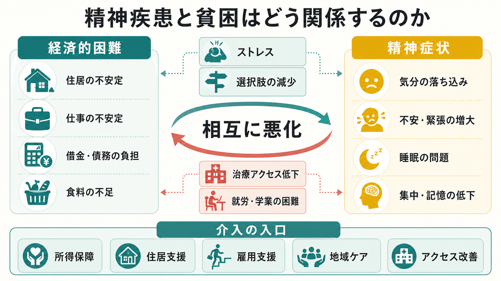
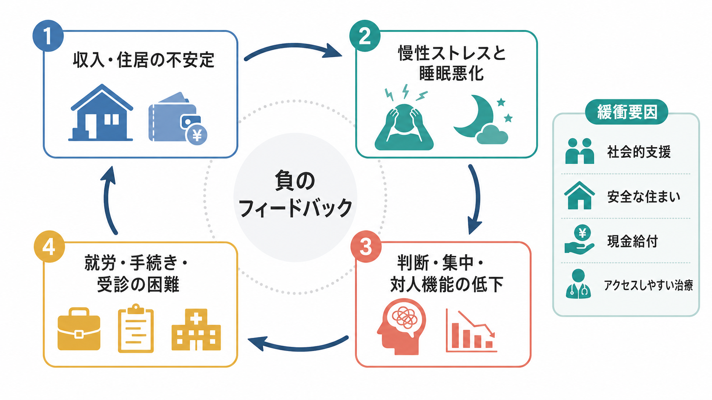
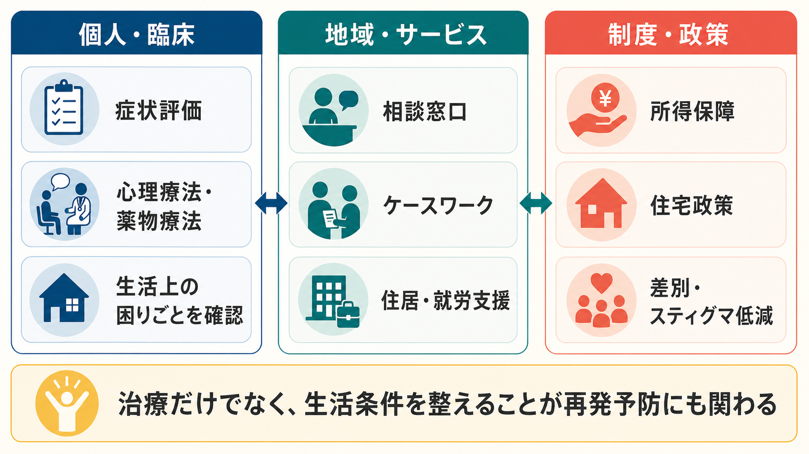

# 精神疾患と貧困はどう関係するのか

## 要点

- 貧困と精神疾患の関係は「貧困が症状を生む」だけでも「症状が貧困を生む」だけでもなく、双方向の負のフィードバックとして理解する必要がある。
- 経済的困難は、住居不安、借金、食料不安、暴力・トラウマ、慢性ストレス、治療アクセスの低下を通じて、[[うつ病とは何か|うつ病]]、不安、睡眠問題、物質使用、PTSD などのリスクを高める。
- 逆に精神症状は、就労・学業・対人関係・行政手続き・受診継続を難しくし、所得低下や孤立を強める。
- 臨床では、症状評価だけでなく生活条件、借金、住まい、仕事、社会的支援、制度利用の障壁を確認することが重要である。
- 所得保障、住居支援、雇用支援、地域ケア、治療アクセス改善は、医療の外側に見えても精神症状の再発予防に関わる。

## この記事で答える問い

1. なぜ経済的困難は精神症状を悪化させやすいのか。
2. なぜ精神疾患は貧困を長引かせやすいのか。
3. この関係を、個人の責任論ではなく、臨床・社会・政策の接点としてどう理解できるのか。

## まず結論

精神疾患と貧困は、単純な一方向の因果ではなく、社会的条件と症状が互いに増幅する関係にある。WHO は、貧困、暴力、障害、不平等などの不利な状況にさらされる人ほどメンタルヘルス上の問題を経験しやすいと整理している[1]。また、貧困とうつ・不安の関係についての経済学・精神医学のレビューは、負の経済ショックが精神症状を悪化させる一方、精神症状も就労や所得を低下させるという双方向性を示している[2]。

したがって「本人が弱いから貧困になる」「貧困なら必ず精神疾患になる」とは言えない。より正確には、生活の選択肢が狭まり、慢性ストレスが高まり、支援や治療に届きにくくなる条件が重なるほど、精神症状が起こりやすく、また回復しにくくなる、という理解が必要である。

## 背景

精神疾患は個人の脳・心理だけで完結する現象ではない。遺伝的脆弱性、発達歴、身体疾患、トラウマ、家族関係、地域環境、雇用、住宅、差別、社会保障制度が重なって発症や経過に影響する。これは[[素因ストレスモデルとは何か|素因ストレスモデル]]とも接続できるが、ここでの「ストレス」は個人が感じる心理的負担に限られない。家賃を払えない、仕事を失う、食事を減らす、受診費用を捻出できない、支援窓口まで行く余裕がない、といった構造的なストレスも含まれる。

低・中所得国を対象とした系統的レビューでは、貧困と common mental disorders の関連が繰り返し確認され、特に教育、食料不安、住居、金融ストレス、社会階層などが重要な経路として挙げられている[3]。この知見は低・中所得国に限定されるものではなく、高所得国でも失業、債務、住宅不安定、孤立は精神的苦痛と関連する。

## 基本概念

### 社会的決定要因

社会的決定要因とは、健康や疾患の分布に影響する生活・労働・教育・住居・所得・差別・制度などの条件を指す。メンタルヘルスに関しても、個人の症状だけを見ても全体像はつかめない。WHO と Calouste Gulbenkian Foundation の報告は、精神的健康と common mental disorders が、ライフコースを通じた社会的・経済的・物理的環境によって形づくられると整理している[4]。

### 社会的因果と社会的選択

貧困と精神疾患の関係には、少なくとも二つの方向がある。

- 社会的因果: 貧困、失業、借金、住居不安定、差別、暴力などが精神症状のリスクを高める。
- 社会的選択: 精神症状により就労、学業、対人関係、制度利用が難しくなり、所得や住居の安定が損なわれる。

重要なのは、この二つを対立させないことである。実際の生活では、社会的因果と社会的選択が同じ人のなかで時間差をもって重なり、悪循環を作る。

## 仕組み

### 1. 慢性ストレスと睡眠の悪化

経済的困難は、短期の不安だけでなく、終わりが見えにくい慢性ストレスを作る。家賃、光熱費、食料、借金、家族のケア、雇用不安が同時にのしかかると、休息や睡眠の質が下がりやすい。睡眠悪化は[[抑うつ気分とは何か|抑うつ気分]]、不安、焦燥、注意集中の低下を強め、日中の問題解決能力をさらに下げる。

### 2. 認知負荷と選択肢の減少

貧困は単に「お金が少ない」状態ではなく、考えなければならない問題が過密になる状態でもある。支払い期限、制度申請、職探し、受診、家族の調整が同時に起こると、判断や計画に使える余力が減る。うつ病や不安症ではもともと集中、意思決定、将来見通しが低下しやすいため、この負荷は症状と生活困難をつなぐ重要な経路になる[2]。

### 3. 住居・失業・借金の具体的リスク

失業はメンタルヘルスに明確な悪影響をもつ。失業とメンタルヘルスに関するメタ分析では、失業者は就業者より心理的苦痛が高く、抑うつ、不安、主観的ウェルビーイング、自尊感情など広い指標で差が示された[5]。また、無担保債務と健康に関する系統的レビュー・メタ分析では、借金は特に抑うつなどのメンタルヘルス指標と強く関連していた[6]。住宅の不安定さも同様に、長期的な精神的健康の悪化と関連することが示されている[7]。

### 4. 治療アクセスの低下

貧困は、受診料や交通費だけでなく、予約を取る時間、スマートフォンや書類へのアクセス、保険・福祉制度の理解、職場を休む余地にも影響する。症状が重いほど手続きや予約維持は難しくなり、治療が途切れるほど症状は慢性化しやすい。ここにスティグマや差別が加わると、支援を求める行動そのものが遅れやすい。

### 5. トラウマ、孤立、物質使用

貧困は、暴力、虐待、地域の危険、住居喪失、被害体験からの逃げにくさとも関係する。トラウマは[[PTSDとうつ病はどう併存するのか|PTSDとうつ病の併存]]、過覚醒、回避、睡眠問題を通じて生活機能を下げることがある。さらに、孤立が強まると[[孤独と精神疾患はどう関係するのか|孤独と精神疾患]]の相互作用が起こりやすく、苦痛への短期的対処として物質使用が増える場合もある。これは[[依存症とうつ病はどう併存するのか|依存症とうつ病の併存]]とも接続する。

## 図解

上の 2 枚は、貧困と精神症状の相互関係を「概念地図」と「負のフィードバック」として示したものである。重要なのは、悪循環のどこか一箇所だけを本人の努力で断ち切る、という発想では不十分な点である。所得、住居、支援者、治療、地域サービスのどこかに介入点ができると、循環全体の圧力が下がる。

## 臨床・研究との接続

### 臨床で確認したいこと

精神症状を評価するとき、貧困を「背景情報」としてだけ扱うと、治療継続を妨げている条件を見落とす。問診では、診断名や症状尺度に加えて、住居、食事、光熱費、借金、失業、家族の扶養、暴力被害、社会的孤立、通院手段、服薬費用、行政手続きの困難を確認する価値がある。

これは個別診断や治療指示ではなく、教育・研究上の整理である。実臨床では、本人の同意と安全を前提に、医療、福祉、法律相談、就労支援、住宅支援、地域の相談窓口を組み合わせる必要がある。

### 研究で問われること

研究上は、単なる相関ではなく、どの経路がどの集団で強いのかを分けて考える必要がある。たとえば、失業の影響、借金の影響、住居不安の影響、食料不安の影響は重なるが同一ではない。また、現金給付のメンタルヘルス効果を検討した系統的レビュー・メタ分析では、現金給付が主観的ウェルビーイングやメンタルヘルスに影響しうることが示されており、貧困対策を精神保健介入としても評価する視点が重要になる[8]。

## よくある誤解

### 誤解1: 貧困は精神疾患の「原因」だから、個人の治療は不要である

社会的要因が重要でも、個人への治療が不要になるわけではない。[[大うつ病性障害とは何か|大うつ病性障害]]、不安症、PTSD、依存症などには、それぞれ有効性が検討されてきた心理療法、薬物療法、危機介入、リハビリテーションがある。むしろ、生活条件の支援と治療を分けすぎないことが重要である。

### 誤解2: 精神疾患がある人は働けないので、経済支援だけでよい

症状が重い時期には休養や所得保障が必要になることがある。しかし、回復過程では、本人の希望に沿った就労・学業・社会参加の支援が重要になる。支援の目標は「働かせること」ではなく、症状、生活、尊厳、選択肢を同時に守ることである。

### 誤解3: 貧困と精神疾患の関係は本人の自己管理の問題である

自己管理は役に立つことがあるが、自己管理だけでは住居不安、債務、失業、差別、治療アクセスの問題は解決しない。個人の努力を求める前に、努力が機能するための生活条件があるかを確認する必要がある。

## 関連ノート

- [[うつ病とは何か]]
- [[大うつ病性障害とは何か]]
- [[不安症とうつ病はどう併存するのか]]
- [[PTSDとうつ病はどう併存するのか]]
- [[孤独と精神疾患はどう関係するのか]]
- [[依存症とうつ病はどう併存するのか]]
- [[素因ストレスモデルとは何か]]

## 関連ノート候補

- 社会的決定要因とメンタルヘルス
- 失業とうつ病はどう関係するのか
- 住居不安と精神疾患
- 借金とメンタルヘルス
- 所得保障は精神保健にどう影響するのか

## MOC 更新候補

- `content/00_MOC/` 配下の精神医学・社会的決定要因・公衆衛生系 MOC に、バッチ統合時に本記事へのリンクを追加する。

## 理解チェック

1. 貧困と精神疾患の関係を、社会的因果と社会的選択に分けて説明できるか。
2. 経済的困難が精神症状を悪化させる経路を、少なくとも三つ挙げられるか。
3. 臨床で「症状」だけでなく「生活条件」を確認する理由を説明できるか。
4. 所得保障や住居支援が、なぜ精神保健の介入にもなりうるのか説明できるか。

## 未解決問題

- 貧困対策のどの要素が、どの精神症状に最も効くのかは、制度設計、地域、年齢、家族構成によって異なる。
- 現金給付、住居支援、雇用支援、心理療法、薬物療法、ケースワークをどう組み合わせると最も効果的かは、今後も実装研究が必要である。
- 貧困、差別、移民・難民経験、障害、ジェンダー、介護責任などが重なる場合のリスク評価は、単一要因モデルでは捉えにくい。

## 参考文献

[1] World Health Organization. (2022). *World mental health report: Transforming mental health for all*. https://www.who.int/teams/mental-health-and-substance-use/world-mental-health-report

[2] Ridley, M., Rao, G., Schilbach, F., & Patel, V. (2020). Poverty, depression, and anxiety: Causal evidence and mechanisms. *Science, 370*(6522), eaay0214. https://doi.org/10.1126/science.aay0214

[3] Lund, C., Breen, A., Flisher, A. J., Kakuma, R., Corrigall, J., Joska, J. A., Swartz, L., & Patel, V. (2010). Poverty and common mental disorders in low and middle income countries: A systematic review. *Social Science & Medicine, 71*(3), 517-528. https://doi.org/10.1016/j.socscimed.2010.04.027

[4] World Health Organization & Calouste Gulbenkian Foundation. (2014). *Social determinants of mental health*. https://gulbenkian.pt/wp-content/uploads/2016/03/SocialDeterminantsMentalHealth.pdf

[5] Paul, K. I., & Moser, K. (2009). Unemployment impairs mental health: Meta-analyses. *Journal of Vocational Behavior, 74*(3), 264-282. https://doi.org/10.1016/j.jvb.2009.01.001

[6] Richardson, T., Elliott, P., & Roberts, R. (2013). The relationship between personal unsecured debt and mental and physical health: A systematic review and meta-analysis. *Clinical Psychology Review, 33*(8), 1148-1162. https://doi.org/10.1016/j.cpr.2013.08.009

[7] Singh, A., Daniel, L., Baker, E., & Bentley, R. (2019). Housing disadvantage and poor mental health: A systematic review. *American Journal of Preventive Medicine, 57*(2), 262-272. https://doi.org/10.1016/j.amepre.2019.03.018

[8] McGuire, J., Kaiser, C., & Bach-Mortensen, A. M. (2022). A systematic review and meta-analysis of the impact of cash transfers on subjective well-being and mental health in low- and middle-income countries. *Nature Human Behaviour, 6*, 359-370. https://doi.org/10.1038/s41562-021-01252-z
