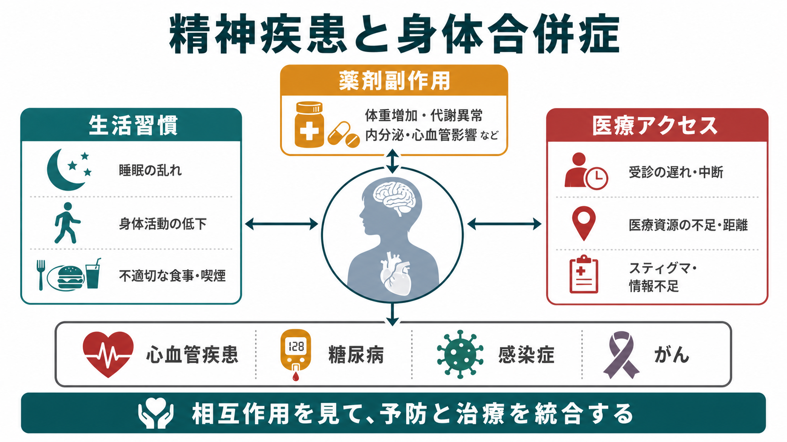
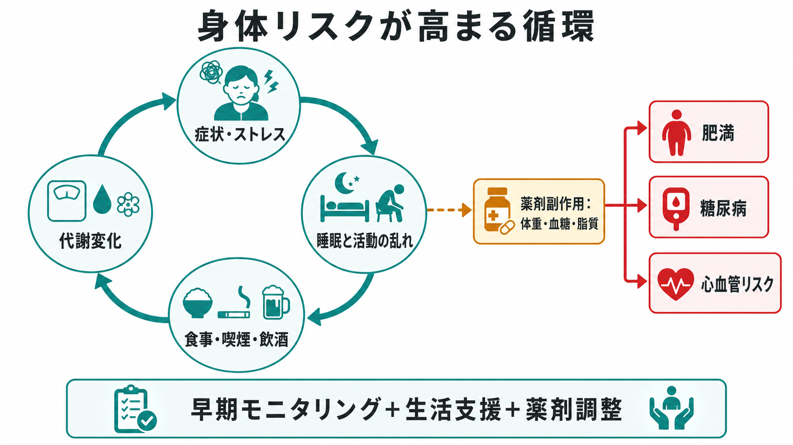
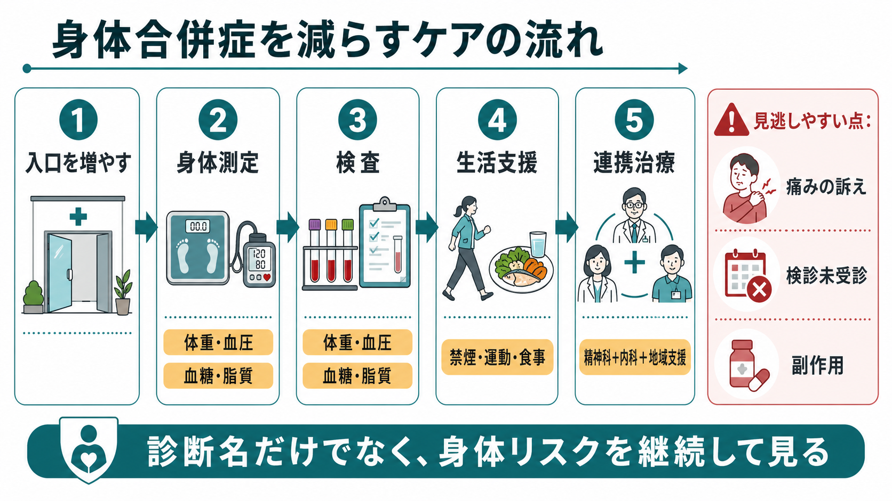

# 精神疾患と身体合併症はどう関係するのか

## 要点

- [[統合失調症とは何か]]、[[双極性障害とは何か]]、中等症以上の[[うつ病とは何か|うつ病]]などの重い精神疾患では、平均寿命が一般人口より短く、その多くは自殺だけでなく、心血管疾患、糖尿病、呼吸器疾患、感染症、がんなどの身体疾患に関係する[1][3]。
- 身体合併症は「本人の生活習慣だけ」で説明できない。症状による活動低下、睡眠の乱れ、喫煙・飲酒、貧困や孤立、スティグマ、医療機関への行きにくさ、診療の分断、薬剤副作用が重なって生じる[2][3]。
- 抗精神病薬など一部の向精神薬は、体重増加、脂質異常、血糖上昇、QT延長などを通じて身体リスクに関与しうるため、開始前と治療中の身体モニタリングが重要になる[5][6]。
- 身体健康を守るには、精神科だけでも内科だけでも不十分で、生活支援、検査、予防、薬剤調整、プライマリケア、地域支援をつなぐ必要がある[1][2][8]。

## この記事で答える問い

1. 精神疾患のある人で身体合併症が多いのはなぜか。
2. 生活習慣、薬剤副作用、医療アクセスはどのように重なり合うのか。
3. 臨床や研究では、どのように身体リスクを見逃さず扱えばよいのか。

## まず結論

精神疾患と身体合併症の関係は、単純な「心が体に悪い影響を与える」という話ではない。より正確には、症状、生活リズム、薬剤、社会的条件、医療制度が互いに影響し合い、身体疾患の発症・悪化・発見の遅れを起こしやすくする、という関係である。

たとえば、陰性症状や抑うつによって活動量が下がる。[[不眠障害とは何か|不眠]]や昼夜逆転が食事や運動を乱す。喫煙や飲酒が増えることもある。そこに抗精神病薬による体重・血糖・脂質への影響が重なる。さらに、スティグマ、経済的困難、受診予約の維持の難しさ、精神科と身体科の連携不足があると、糖尿病や心血管リスク、がん検診未受診が見逃されやすくなる[2][3][7]。

## 背景

WHOのガイドラインは、重い精神疾患をもつ人では予防可能な身体疾患が早期死亡に大きく関与し、寿命が10-20年短くなることがあると整理している[1]。Lancet Psychiatry Commission も、身体健康の格差は国や診断名を超えてみられ、身体疾患のリスク増加と医療アクセスの不足が重なると述べている[2]。

この問題は、精神疾患の診断名ごとに分けても、横断的にみても重要である。[[統合失調症とは何か|統合失調症]]、[[双極性障害とは何か|双極性障害]]、重いうつ病では、心血管疾患の罹患・死亡リスクが高いことが大規模メタ解析で示されている[4]。また、がんについては発症率だけでなく、検診参加、診断後の治療アクセス、併存症管理が予後に影響する可能性がある[7]。

## 基本概念

### 身体合併症

身体合併症とは、精神疾患と併存する身体疾患や身体リスクを指す。代表例は、肥満、糖尿病、脂質異常症、高血圧、心血管疾患、呼吸器疾患、感染症、肝疾患、がん、慢性疼痛などである。精神疾患に伴う身体症状や、[[身体症状症とは何か]]、[[身体疾患による気分障害とは何か]]とは重なる部分があるが、ここでは「精神疾患のある人の身体健康全体」を扱う。

### 重い精神疾患

文献でいう severe mental illness は、統合失調症スペクトラム、双極性障害、重症または持続的なうつ病などを含むことが多い[1][3]。ただし、身体合併症のリスクは診断名だけで決まらない。症状の重症度、生活機能、薬剤、住居、収入、支援者の有無、受診継続のしやすさが大きく関係する。

### 医療アクセス

医療アクセスとは、単に病院が近くにあることではない。予約を取れるか、移動できるか、費用を負担できるか、医療者に症状を伝えられるか、精神症状を理由に身体症状が軽視されないか、検査結果が精神科と内科で共有されるか、という実際の利用可能性を含む。

## 仕組み

### 生活習慣は原因であると同時に結果でもある

精神疾患では、睡眠の乱れ、活動量低下、食生活の乱れ、喫煙、飲酒、物質使用が身体リスクを高めることがある。[[ニコチン使用障害とは何か]]や[[アルコール使用障害とは何か]]が併存すると、心血管疾患、呼吸器疾患、肝疾患、感染症リスクも高まりやすい[1][3]。

ただし、ここで重要なのは、生活習慣を本人の意志の弱さとして読まないことである。抑うつ、陰性症状、不安、認知機能低下、貧困、孤立、住環境、職場や学校からの排除が、健康行動を難しくする。したがって介入も「説明する」だけでは足りず、買い物、調理、睡眠、移動、禁煙、運動、通院を実行しやすくする支援が必要になる[2][8]。

### 薬剤副作用はリスクとベネフィットを同時に見る

抗精神病薬は精神病症状、躁状態、再発予防に重要な役割をもつ。一方で、薬剤によっては体重増加、食欲増加、血糖上昇、脂質異常、血圧、心電図変化などに関与する[5]。NICEは抗精神病薬開始前に体重、腹囲、脈拍、血圧、血糖またはHbA1c、脂質、プロラクチン、運動症状、栄養・食事・活動量を確認し、治療中も体重、血圧、血糖、脂質などを定期的に見ることを推奨している[6]。

これは「薬を避けるべき」という意味ではない。精神症状の再発そのものも、生活機能の低下、入院、身体健康の悪化を招く。実務上の焦点は、薬剤の利益を保ちながら、測定、早期介入、薬剤選択、用量調整、身体疾患治療を組み合わせることである。[[薬剤性うつ症状とは何か]]や[[内分泌疾患に伴う精神症状とは何か]]のように、薬剤・身体疾患・精神症状が相互に見える領域では、とくに時間経過を追った評価が重要になる。

### 医療アクセスの不足が「発見の遅れ」を生む

身体疾患のリスクが高いだけでなく、発見されにくいことも問題である。精神症状が目立つと、胸痛、息切れ、倦怠感、体重変化、疼痛、発熱、消化器症状が心理的問題として処理されることがある。逆に、本人が身体症状をうまく説明できない、受診予約を維持しにくい、検査の意味が伝わりにくい、移動手段がない、費用が負担になる、という事情もある[2][3]。

がん検診では、精神疾患のある人、とくに重い精神疾患のある人で検診参加が低いことがメタ解析で報告されている[7]。これは、がんの発症率だけでなく、早期発見と治療導入の格差として読む必要がある。

## 図解

以下の図は、身体合併症を減らすケアの流れを、臨床で確認しやすい順番に整理したものである。図中の「入口を増やす」は、精神科受診、内科受診、訪問支援、地域支援、家族・支援者からの気づきなど、身体健康を確認する機会を複数つくることを意味する。

## 臨床・研究との接続

臨床では、精神疾患の治療計画に身体健康の計画を最初から含める。具体的には、体重、腹囲、血圧、血糖またはHbA1c、脂質、喫煙、飲酒、睡眠、活動量、食事、疼痛、感染症リスク、検診状況を定期的に確認する。異常値が見つかった場合には、精神科内で抱え込まず、プライマリケア、内科、栄養、運動支援、薬剤師、地域支援とつなぐ[1][6][8]。

研究では、身体合併症を単一のアウトカムだけで扱うと、実態を取り逃がす。心血管イベント、糖尿病、死亡率、検診参加、生活機能、医療アクセス、薬剤曝露、社会経済的条件を同時に見る必要がある。とくに、薬剤の影響を評価する研究では、処方される理由、疾患重症度、生活習慣、併存症、医療利用頻度という交絡を慎重に扱う必要がある。

教育・研究目的でこのテーマを扱うときは、身体合併症を「精神疾患の人は不健康になりやすい」と一般化しすぎない。むしろ、どのリスクが修正可能で、どの支援がアクセスを改善し、どの検査や連携が見逃しを減らすのかを問うほうが実践的である。

## よくある誤解

### 誤解1: 身体合併症は生活習慣の問題である

生活習慣は重要だが、それだけでは説明できない。症状、薬剤、貧困、孤立、医療アクセス、スティグマ、診療の分断が重なる。生活習慣支援は、自己責任を強めるためではなく、実行しやすい環境を作るために行う。

### 誤解2: 向精神薬は身体に悪いので使わないほうがよい

薬剤には副作用があり、測定と対策が必要である。一方で、未治療の精神症状や再発も身体健康を悪化させうる。薬剤の利益とリスクを同じ表に置き、モニタリング、薬剤選択、生活支援、身体疾患治療を組み合わせて考える。

### 誤解3: 精神科では身体疾患まで見なくてよい

精神科だけで身体疾患をすべて診る必要はない。しかし、身体リスクを見つけ、検査し、共有し、必要な医療につなぐ責任はある。身体健康の見逃しは、精神症状の悪化、生活機能低下、早期死亡に直結しうる[1][2]。

## 関連ノート

- [[統合失調症とは何か]]
- [[双極性障害とは何か]]
- [[うつ病とは何か]]
- [[不眠障害とは何か]]
- [[ニコチン使用障害とは何か]]
- [[アルコール使用障害とは何か]]
- [[薬剤性うつ症状とは何か]]
- [[身体疾患による気分障害とは何か]]
- [[身体症状症とは何か]]
- [[内分泌疾患に伴う精神症状とは何か]]

### 関連ノート候補

- 重い精神疾患における身体健康モニタリング
- 抗精神病薬とメタボリックシンドローム
- 精神疾患とがん検診
- 精神科とプライマリケアの連携
- スティグマと診断の陰に隠れる身体疾患

### MOC更新候補

- `content/00_MOC/` 配下の精神医学、臨床精神医学、身体疾患・精神疾患連携に関する MOC に `[[精神疾患と身体合併症はどう関係するのか]]` を追加する候補。
- 並列ジョブとの競合を避けるため、このタスクでは MOC 本体は更新しない。

## 理解チェック

1. 精神疾患と身体合併症の関係を、生活習慣だけで説明すると何を見落とすか。
2. 抗精神病薬の身体副作用を考えるとき、薬剤中止だけを結論にしてはいけない理由は何か。
3. 医療アクセスの不足は、身体疾患の発症ではなく、発見や治療のどの段階に影響するか。
4. 身体健康モニタリングでは、体重・血圧・血糖・脂質以外に何を確認すべきか。

## 参考文献

[1] World Health Organization. (2018). *Management of physical health conditions in adults with severe mental disorders: WHO guidelines*. https://www.who.int/publications/i/item/9789241550383

[2] Firth, J., Siddiqi, N., Koyanagi, A., Siskind, D., Rosenbaum, S., Galletly, C., et al. (2019). The Lancet Psychiatry Commission: a blueprint for protecting physical health in people with mental illness. *The Lancet Psychiatry, 6*(8), 675-712. https://doi.org/10.1016/S2215-0366(19)30132-4

[3] Liu, N. H., Daumit, G. L., Dua, T., Aquila, R., Charlson, F., Cuijpers, P., et al. (2017). Excess mortality in persons with severe mental disorders: a multilevel intervention framework and priorities for clinical practice, policy and research agendas. *World Psychiatry, 16*(1), 30-40. https://doi.org/10.1002/wps.20384

[4] Correll, C. U., Solmi, M., Veronese, N., Bortolato, B., Rosson, S., Santonastaso, P., et al. (2017). Prevalence, incidence and mortality from cardiovascular disease in patients with pooled and specific severe mental illness: a large-scale meta-analysis. *World Psychiatry, 16*(2), 163-180. https://doi.org/10.1002/wps.20420

[5] De Hert, M., Detraux, J., van Winkel, R., Yu, W., & Correll, C. U. (2012). Metabolic and cardiovascular adverse effects associated with antipsychotic drugs. *Nature Reviews Endocrinology, 8*, 114-126. https://doi.org/10.1038/nrendo.2011.156

[6] National Institute for Health and Care Excellence. (2014, amended 2021). *Psychosis and schizophrenia in adults: prevention and management* (CG178), recommendations on antipsychotic medication and physical health monitoring. https://www.nice.org.uk/guidance/cg178/chapter/Recommendations

[7] Solmi, M., Firth, J., Miola, A., Fornaro, M., Frison, E., Fusar-Poli, P., et al. (2020). Disparities in cancer screening in people with mental illness across the world versus the general population: prevalence and comparative meta-analysis including 4,717,839 people. *The Lancet Psychiatry, 7*(1), 52-63. https://doi.org/10.1016/S2215-0366(19)30414-6

[8] Gronholm, P. C., Chowdhary, N., Barbui, C., Das-Munshi, J., Kolappa, K., Thornicroft, G., et al. (2021). Prevention and management of physical health conditions in adults with severe mental disorders: WHO recommendations. *International Journal of Mental Health Systems, 15*, 22. https://doi.org/10.1186/s13033-021-00444-4

## 未解決問題

- 身体合併症を減らす介入のうち、どの組み合わせが最も実装しやすく、長期的に持続するのか。
- 薬剤副作用、疾患重症度、生活習慣、医療アクセスの影響を、個人レベルでどこまで分離して評価できるのか。
- 精神科、内科、地域支援、家族支援の連携を、医療制度としてどう測定し改善するのか。
- がん検診、糖尿病管理、心血管予防の格差を減らすために、どのようなリマインダー、同行支援、意思決定支援が有効なのか。
