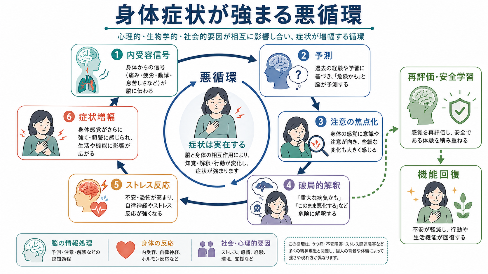
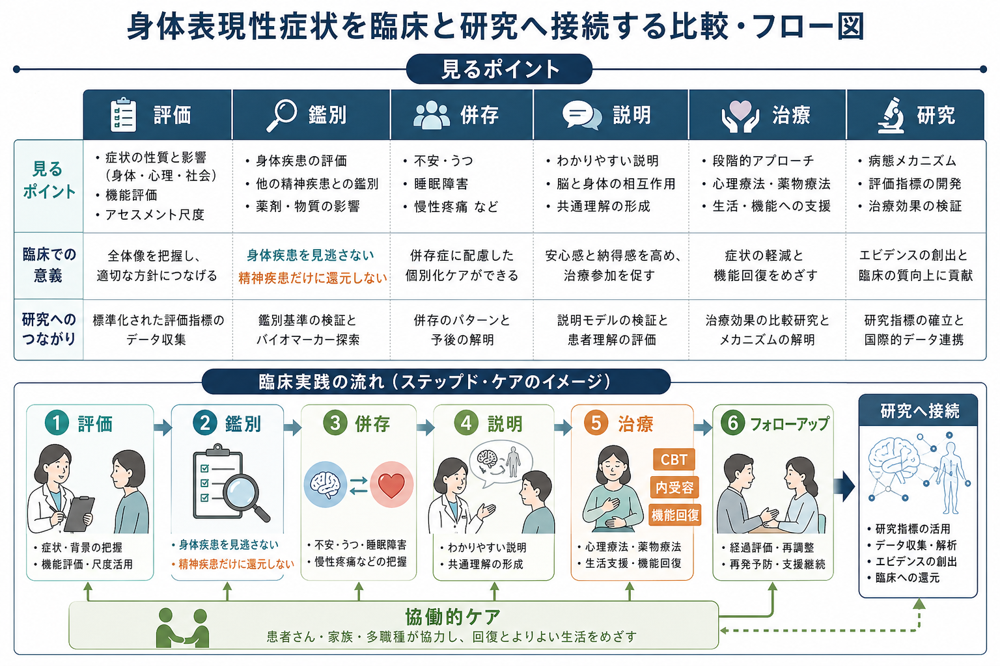

# 精神疾患と身体表現性症状はどう関係するのか

## 要点

- 身体表現性症状とは、痛み、疲労、動悸、息苦しさ、胃腸症状、しびれなどの身体症状が、心理的苦痛、注意、解釈、行動、生活機能と強く結びついて持続する状態を指す。症状は「作りもの」ではなく、本人にとって実在する身体経験である[1][2]。
- DSM-5以降の「身体症状症」は、症状が医学的に説明不能かどうかだけでなく、症状に関連する過度の思考・感情・行動と機能障害を重視する[1]。ICD-11の「bodily distress disorder」も、苦痛を伴う身体症状、過度の注意、持続、機能障害を中心に定義する[2]。
- うつ病、不安症、PTSD、パニック症などでは、気分や恐怖だけでなく身体症状が前景に出ることが多い。身体症状の数が多いほど、気分・不安障害や機能障害の可能性が高まることが示されている[4]。
- 仕組みは一方向ではない。内受容、予測、注意の焦点化、破局的解釈、自律神経・ストレス反応、回避行動が循環し、症状の強さと生活上の障害を増幅しうる[3][5]。
- 臨床では、身体疾患を見逃さない評価と、精神疾患だけに還元しない説明がどちらも必要である。治療は、安心させるだけでなく、機能回復、再評価、安全学習、併存するうつ・不安への介入を組み合わせる[6][7]。

## この記事で答える問い

1. 身体表現性症状は、精神疾患の「結果」なのか、それとも別の病態なのか。
2. なぜ心理的苦痛が痛み、疲労、動悸、息苦しさのような身体症状として現れるのか。
3. うつ病・不安症・PTSD・パニック症などと、身体症状症やICD-11のbodily distress disorderはどう重なるのか。
4. 臨床や研究では、どのように評価し、どのような誤解を避けるべきか。

## まず結論

精神疾患と身体表現性症状の関係は、「心が原因で身体に症状が出る」という単純な図式ではない。より正確には、身体からの信号、脳の予測、注意、感情、記憶、ストレス反応、受診行動、回避行動、社会的文脈が相互作用し、症状と苦痛が持続する状態として理解するのがよい[3][5]。

この観点では、身体症状を「本物か偽物か」で分けない。本人の症状は実在し、生活機能を損ないうる。一方で、症状の持続や増幅には、[[うつ病とは何か]]、[[不安症群とは何か]]、[[PTSDとは何か]]、[[パニック症とは何か]]のような精神疾患が関与することがある。したがって、身体疾患、薬剤・物質、睡眠、疼痛、生活環境、精神症状を同時に評価する必要がある。

## 背景

従来の「身体表現性障害」や「医学的に説明困難な症状」という言い方は、しばしば「検査で異常がないから心理的なもの」と受け取られた。しかし、現在の分類や臨床実践では、この二分法は不十分だと考えられている。DSM-5の身体症状症では、身体症状そのものが医学的に説明できるかどうかよりも、症状に関連する苦痛、過度の心配、健康不安、受診行動、回避、生活機能障害を重視する[1]。

ICD-11のbodily distress disorderも、苦痛を伴う身体症状と、それに向けられる過度の注意、持続、機能障害を中心に置く。ここで重要なのは、身体疾患がある場合でも、その疾患の性質や重症度に比べて症状への注意や苦痛が過度で、生活機能を大きく損なう場合がありうる点である[2]。つまり、「身体疾患が見つかったら心理的要因は関係ない」「精神疾患があるなら身体評価は不要」という両極端を避ける必要がある。

この話題は、[[DSMとICDは何が違うのか]]とも関係する。DSM-5は「身体症状症」、ICD-11は「bodily distress disorder」という名称を使い、旧来の身体表現性障害やsomatoform disorderから、症状と苦痛の相互作用を重視する方向へ移っている。

## 基本概念

### 身体表現性症状

身体表現性症状は、心理的苦痛が身体を通じて表現されるように見える症状群を指す広い言葉である。痛み、疲労、めまい、動悸、息切れ、胃腸症状、しびれ、脱力、体の違和感などが含まれる。症状の一部は身体疾患、睡眠不足、薬剤、慢性疼痛、ストレス反応で説明できることもあり、完全に説明できないこともある。

重要なのは、症状の医学的説明可能性と、本人の苦痛・機能障害は同じではないという点である。検査値が軽微でも苦痛が大きい人もいれば、明らかな身体疾患があっても不安や回避が症状体験をさらに強める人もいる。

### 身体症状症とbodily distress disorder

身体症状症では、1つ以上の苦痛を伴う身体症状に加えて、症状に関連する過度の思考、強い不安、症状や健康への過度な時間・エネルギーの投入が重視される[1]。ICD-11のbodily distress disorderでは、苦痛を伴う身体症状、症状への過度の注意、適切な評価や説明後も続く懸念、数か月以上の持続、生活機能障害が中心となる[2]。

この分類は、身体症状を「心因性」と断定するためのラベルではない。むしろ、症状、注意、感情、行動、機能障害をまとめて評価し、治療可能な悪循環を見つけるための枠組みである。

### 精神疾患との重なり

うつ病では、抑うつ気分だけでなく、疲労、睡眠障害、食欲変化、疼痛、集中困難が目立つことがある。不安症では、動悸、息苦しさ、発汗、震え、胃腸症状、筋緊張が前景化する。PTSDでは、過覚醒、身体の緊張、睡眠障害、痛み、解離が重なることがある。パニック症では、動悸や息苦しさを「危険な身体変化」と解釈することで発作への恐怖が強まる。

このため、身体症状が多い人を診るときには、[[不安症とうつ病はどう併存するのか]]のような併存の視点が欠かせない。身体症状は精神疾患の副産物であるだけでなく、精神疾患を維持する要因にもなる。

## 仕組み

### 1. 内受容と予測

内受容とは、心拍、呼吸、胃腸の動き、痛み、体温、疲労、息苦しさなど、身体内部からの信号を脳が検出し、統合し、解釈する過程である[5]。[[島皮質は内受容感覚ネットワークで何をしているのか]]や[[体性感覚ネットワークは身体情報をどう表現するのか]]で扱うように、身体感覚は末梢から来る信号だけで決まるのではなく、脳の予測や注意によっても形づくられる。

[[予測処理とは何か]]の観点では、脳は身体からの信号を受動的に読むだけでなく、「これは危険かもしれない」「また悪化するかもしれない」という予測を使って感覚を解釈する。過去の病気、トラウマ、医療体験、家族の病歴、健康不安があると、曖昧な身体感覚が危険信号として読み取られやすくなる。

### 2. 注意の焦点化と破局的解釈

不安が高いと、身体感覚への注意が狭く強く向く。小さな動悸、胃の違和感、息苦しさが繰り返し監視されると、感覚はより目立つ。そこに「重大な病気かもしれない」「このまま悪化する」「自分では制御できない」という破局的解釈が加わると、自律神経反応が強まり、実際に動悸、発汗、筋緊張、息苦しさが増える。

この循環は、症状が「気のせい」という意味ではない。注意、予測、自律神経、筋緊張、痛覚調節、睡眠、活動量が身体反応を変えるため、本人の体験としては実際に症状が強まる。

### 3. 回避と安全行動

症状が怖くなると、運動、外出、仕事、学校、人との交流、食事、入浴などを避けることがある。短期的には不安が下がるが、長期的には体力低下、睡眠リズムの乱れ、孤立、自己効力感の低下を招き、症状への脆弱性を高める。過剰な受診や検査反復も、安心が長続きしない場合には「まだ見つかっていない病気がある」という予測を強めることがある[6]。

### 4. 併存する精神疾患

身体表現性症状は、うつ病、不安症、PTSD、パニック症、摂食症、物質使用、睡眠障害などと重なりやすい。一次医療の研究では、身体症状の数が増えるほど気分障害・不安障害と機能障害の頻度が高くなることが報告されている[4]。したがって、身体症状を訴える人に精神症状を尋ねることは、症状を心理化して軽視することではなく、治療可能な併存を見逃さないための評価である。

## 図解

1枚目は、内受容信号、予測、注意の焦点化、破局的解釈、ストレス反応、症状増幅の循環を示している。右側の「再評価・安全学習」と「機能回復」は、悪循環を断ち切る方向を表す。

2枚目は、臨床と研究への接続である。評価、鑑別、併存、説明、治療、研究は別々の作業ではなく、患者との協働的ケアの中でつながる。

## 臨床・研究との接続

### 評価では何を見るか

臨床では、まず危険な身体疾患、薬剤・物質、神経疾患、内分泌疾患、感染症、慢性疼痛、睡眠障害を見逃さない。次に、症状の持続期間、日内変動、誘因、生活機能、受診歴、検査歴、本人の病気理解、不安、抑うつ、トラウマ、回避行動、家族・職場・学校環境を確認する。

機能評価には、[[GAFやWHODASは何を評価するのか]]のような生活機能の視点が役立つ。症状の有無だけでは、どれほど生活が狭まり、何を取り戻す必要があるのかが見えにくい。

### 説明は治療の一部である

「検査で異常がないから大丈夫」と言うだけでは、多くの場合十分ではない。本人は症状を体験しており、苦痛と生活上の損失があるからである。より有用なのは、身体信号、脳の予測、ストレス反応、注意、回避、睡眠、活動量が互いに影響することを説明し、「症状は実在するが、悪循環は変えられる」と共有することである[6]。

これは[[5Pモデルとは何か]]とも相性がよい。素因、誘因、維持因子、保護因子、現在の問題を分けると、「原因探し」だけでなく「何が今の症状を維持しているか」に焦点を移しやすい。

### 治療は機能回復を軸にする

非薬物療法では、認知行動療法、段階的な活動再開、症状への注意の向け方の調整、睡眠・生活リズムの整備、ストレス対処、家族や職場・学校との調整が使われる。Cochraneレビューでは、身体表現性障害や医学的に説明困難な身体症状に対する心理療法、とくに認知行動療法を含む介入が検討されているが、研究の質や効果の大きさには限界もある[7]。

薬物療法は、身体症状そのものを単純に消すためというより、併存するうつ病、不安症、睡眠障害、疼痛などに応じて検討される。薬だけで十分なことは少なく、説明、活動、再評価、安全学習、身体疾患の継続的評価を組み合わせる必要がある。

### 研究では何が課題か

研究上の課題は、症状の分類が診療科ごとに分断されやすいことである。線維筋痛症、過敏性腸症候群、慢性疲労、機能性神経症状、慢性疼痛などは、各専門領域で別々に扱われる一方、症状の維持機構には共通点もある[3][8]。そのため、分類、尺度、内受容指標、脳画像、ストレス生理、生活機能、治療反応を横断的に結びつける研究が求められる。

## よくある誤解

### 「身体疾患がないなら精神疾患である」

これは誤りである。検査で説明できない症状は多く、医学的評価には限界もある。精神疾患が併存していても、身体疾患、薬剤、睡眠、疼痛、生活環境を評価する必要がある。

### 「精神疾患なら身体症状は偽物である」

これも誤りである。身体症状は本人にとって実在する。注意、予測、自律神経、筋緊張、痛覚処理、疲労、睡眠は身体反応そのものを変える。したがって、症状を否定するのではなく、症状が強まる条件と弱まる条件を一緒に探す。

### 「説明して安心させれば治る」

説明は重要だが、それだけでは不十分なことが多い。回避行動、活動低下、睡眠の乱れ、医療への過度な依存、家族・職場・学校の問題が残ると、症状は再燃しやすい。安心ではなく、安全学習と機能回復を目標にする。

### 「身体表現性症状は精神科だけの問題である」

身体表現性症状は、一次医療、内科、神経内科、疼痛診療、リハビリテーション、精神科、心理支援にまたがる。精神科だけで完結する問題ではなく、身体評価と心理社会的支援を橋渡しする協働的ケアが必要である。

## 関連ノート

- [[DSMとICDは何が違うのか]]
- [[うつ病とは何か]]
- [[不安症群とは何か]]
- [[不安症とうつ病はどう併存するのか]]
- [[PTSDとは何か]]
- [[パニック症とは何か]]
- [[5Pモデルとは何か]]
- [[GAFやWHODASは何を評価するのか]]
- [[予測処理とは何か]]
- [[島皮質は内受容感覚ネットワークで何をしているのか]]
- [[体性感覚ネットワークは身体情報をどう表現するのか]]

## 理解チェック

1. 身体症状症やbodily distress disorderは、なぜ「医学的に説明不能かどうか」だけで定義しないのか。
2. 身体症状が多い人で、うつ病や不安症を評価することは、なぜ症状を軽視することではないのか。
3. 内受容、予測、注意、破局的解釈、ストレス反応は、どのように悪循環を作るのか。
4. 「症状は実在するが、悪循環は変えられる」という説明は、どのような臨床的利点を持つか。

## 参考文献

[1] D'Souza, R. S., & Hooten, W. M. (2024). *Somatic Symptom Disorder*. StatPearls. https://www.ncbi.nlm.nih.gov/books/NBK532253/

[2] World Health Organization. (2025). *ICD-11 for Mortality and Morbidity Statistics: 6C20 Bodily distress disorder*. https://icd.who.int/browse/2025-01/mms/en#767044268

[3] Burton, C., Fink, P., Henningsen, P., Löwe, B., & Rief, W. (2020). Functional somatic disorders: discussion paper for a new common classification for research and clinical use. *BMC Medicine, 18*, 34. https://doi.org/10.1186/s12916-020-1505-4

[4] Kroenke, K., Spitzer, R. L., Williams, J. B. W., Linzer, M., Hahn, S. R., deGruy, F. V., & Brody, D. (1994). Physical symptoms in primary care: predictors of psychiatric disorders and functional impairment. *Archives of Family Medicine, 3*(9), 774-779. https://doi.org/10.1001/archfami.3.9.774

[5] Khalsa, S. S., Adolphs, R., Cameron, O. G., Critchley, H. D., Davenport, P. W., Feinstein, J. S., Feusner, J. D., Garfinkel, S. N., Lane, R. D., Mehling, W. E., Meuret, A. E., Nemeroff, C. B., Oppenheimer, S., Petzschner, F. H., Pollatos, O., Rhudy, J. L., Schramm, L. P., Simmons, W. K., Stein, M. B., Stephan, K. E., & others. (2018). Interoception and mental health: a roadmap. *Biological Psychiatry: Cognitive Neuroscience and Neuroimaging, 3*(6), 501-513. https://doi.org/10.1016/j.bpsc.2017.12.004

[6] Husain, M., & Chalder, T. (2021). Medically unexplained symptoms: assessment and management. *Clinical Medicine, 21*(1), 13-18. https://doi.org/10.7861/clinmed.2020-0947

[7] van Dessel, N., den Boeft, M., van der Wouden, J. C., Kleinstäuber, M., Leone, S. S., Terluin, B., Numans, M. E., van der Horst, H. E., & van Marwijk, H. (2014). Non-pharmacological interventions for somatoform disorders and medically unexplained physical symptoms in adults. *Cochrane Database of Systematic Reviews*, CD011142. https://doi.org/10.1002/14651858.CD011142.pub2

[8] Rosendal, M., Olde Hartman, T. C., Aamland, A., van der Horst, H., Lucassen, P., Budtz-Lilly, A., Burton, C., Fink, P., & others. (2017). “Medically unexplained” symptoms and symptom disorders in primary care: prognosis-based recognition and classification. *BMC Family Practice, 18*, 18. https://doi.org/10.1186/s12875-017-0592-6

## 未解決問題

- 身体症状症、bodily distress disorder、機能性身体症候群、慢性疼痛、機能性神経症状を、研究と臨床の両方でどう統合的に分類するか。
- 内受容、予測処理、自律神経、炎症、睡眠、生活機能を結びつける実用的な評価指標をどう作るか。
- どの患者に、心理療法、身体リハビリテーション、薬物療法、協働的ケア、社会的支援のどの組み合わせが最も合うか。

## MOC更新候補

- `content/00_MOC/` 配下の精神医学・臨床実践関連MOCに `[[精神疾患と身体表現性症状はどう関係するのか]]` を追加する候補。
- 並列ジョブとの競合を避けるため、本タスクではMOCファイル自体は更新しない。
