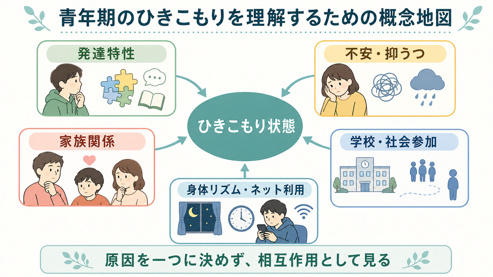
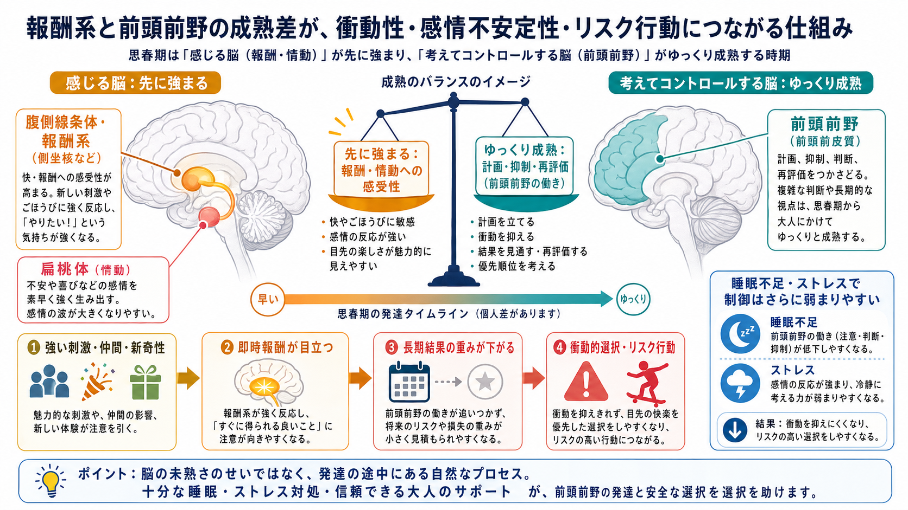
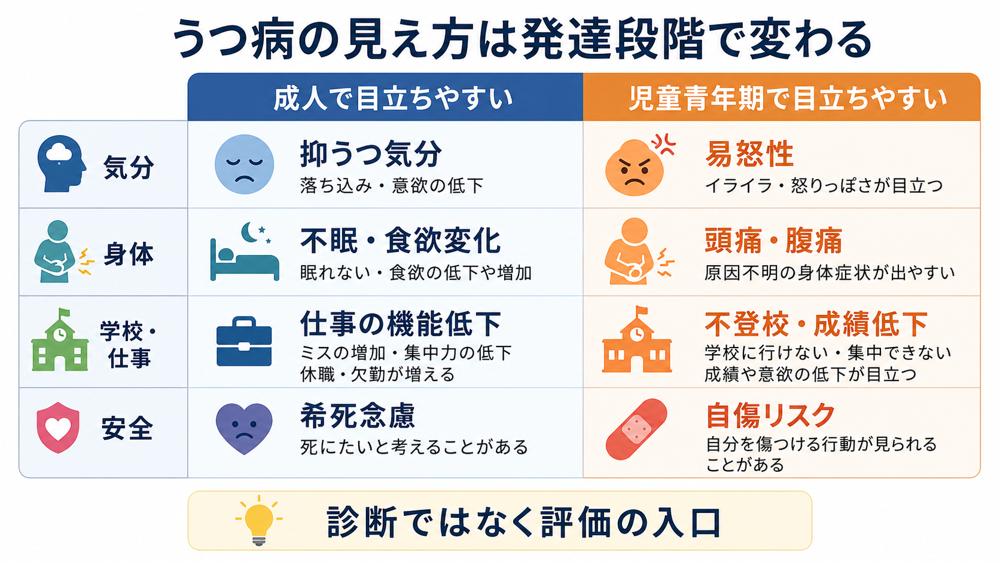

# 精神疾患と過量服薬はどう関係するのか

> このノートは教育・研究目的の整理であり、個別の診断や治療指示ではない。過量服薬、強い希死念慮、意識障害、呼吸抑制、けいれん、混乱がある場合は、地域の救急医療・中毒相談・精神科救急につなぐ必要がある。

## 要点

- [[薬物過量服薬とは何か|過量服薬]]は、意図的な自傷・自殺企図、衝動的な自己調整、物質使用、誤用、身体的依存、混乱状態が重なって起こりうる。
- 精神疾患は「単独の原因」ではなく、抑うつ、絶望感、不眠、焦燥、衝動性、解離、物質使用、孤立、薬剤へのアクセスを通じてリスクを高める。
- 評価では「死ぬつもりだったか」だけでなく、服薬量、薬剤の種類、併用物質、身体毒性、過去の自傷、現在の支援、再入手可能性を分けて確認する。
- リスクスコアや高・中・低の分類だけで退院可否を決めるのは不十分であり、心理社会的評価と安全計画、フォローアップを組み合わせる必要がある[1][4]。

## この記事で答える問い

1. 精神疾患があると、なぜ過量服薬のリスクが高まることがあるのか。
2. 自殺企図、非自殺性自傷、衝動行為、物質使用をどう区別して評価するのか。
3. 救急対応後に、再発予防として何を見落としやすいのか。

## まず結論

過量服薬は、診断名だけから予測できる出来事ではない。[[大うつ病性障害とは何か|うつ病]]、[[双極性障害とは何か|双極性障害]]、[[境界性パーソナリティ障害とは何か|境界性パーソナリティ障害]]、摂食障害、[[物質使用障害とは何か|物質使用障害]]などでは自殺死亡リスクが一般人口より高いことが示されているが[3]、個々の場面では「いま何が危険を作っているか」を評価する必要がある。

中心になるのは、現在の苦痛、意図、計画性、衝動性、薬剤・物質へのアクセス、身体毒性、支援者の有無である。NICE は自傷を「明確な自殺意図の有無にかかわらない意図的な自己中毒または自己損傷」と広く扱い、包括的な心理社会的評価を重視している[1]。したがって、過量服薬を「本気だった／本気ではなかった」と二分するより、身体リスクと再発リスクを同時に評価するほうが臨床的である。

## 背景

過量服薬は[[精神科救急でみる疾患・症候群には何があるのか|精神科救急]]と身体救急の境界で扱われる。まず必要なのは、意識、呼吸、循環、体温、けいれん、せん妄、摂取時刻、薬剤名、推定量、併用物質を確認し、中毒治療を優先することである。その後に、[[自殺関連行動障害とは何か|自殺関連行動]]、[[非自殺性自傷とは何か|非自殺性自傷]]、物質使用、家庭・職場・学校での危機、薬剤管理の問題を評価する。

WHO の自殺予防戦略 LIVE LIFE は、手段へのアクセス制限、早期同定、評価、管理、フォローアップを主要な柱に置いている[2]。これは過量服薬にも直接関係する。薬剤が身近に大量にある、複数医療機関から処方を受けている、眠剤・抗不安薬・鎮痛薬・アルコールを併用している、孤立して発見が遅れる、という条件は、心理的危機を身体的危機へ変換しやすい。

## 基本概念

### 過量服薬

過量服薬は、処方薬、市販薬、違法薬物、アルコールなどを医学的に安全とされる量や治療目的を超えて摂取することである。自殺企図として行われる場合もあれば、眠りたい、感情を切りたい、怒りや恐怖を止めたい、周囲に危機を伝えたい、離脱症状を避けたい、判断が低下していた、という形で起こる場合もある。

### 自殺企図と非自殺性自傷

[[自殺関連行動障害とは何か|自殺企図]]では、少なくとも一部に死ぬ意図が含まれる。[[非自殺性自傷とは何か|非自殺性自傷]]では、主目的が死ではなく、苦痛調整、自己罰、解離からの回復、対人シグナルなどであることが多い。ただし実際の面接では意図が混在し、後から変化し、本人にも説明しにくい。NICE が自傷を意図の有無だけで狭く切らないのは、この臨床的現実を反映している[1]。

### 物質使用

[[アルコール使用障害とは何か|アルコール]]、[[鎮静薬使用障害とは何か|鎮静薬]]、オピオイド、覚醒剤、大麻などの使用は、過量服薬リスクを複数の経路で高める。判断低下、脱抑制、離脱不安、睡眠障害、うつ症状、身体毒性、処方薬との相互作用が重なるからである。精神疾患と物質使用が併存すると、症状の悪化と生活危機が相互に増幅しやすい。

## 仕組み

過量服薬に至る経路は、単純な「精神疾患があるから服薬する」ではない。少なくとも次の層を分けると理解しやすい。

1. 症状の層: 抑うつ、絶望感、不眠、焦燥、幻聴、被害感、強い不安、解離、慢性疼痛が苦痛を増幅する。
2. 行動制御の層: 衝動性、混合性特徴、飲酒、薬物使用、睡眠不足、怒り、混乱が、考える時間を短くする。
3. 手段アクセスの層: 大量の残薬、複数処方、市販薬の買いやすさ、家族の薬、保管の緩さが、危機時の行動を実行可能にする。
4. 支援の層: 孤立、貧困、スティグマ、治療中断、家族負担、退院後の空白が、危機を早く発見しにくくする。

精神疾患と自殺死亡の関連は集団レベルでは明確で、Chesney らのメタレビューでは複数の精神疾患で自殺死亡リスク上昇が報告され、特に境界性パーソナリティ障害、神経性やせ症、うつ病、双極性障害で高い自殺リスクが示された[3]。しかし、これは個人を診断名だけで「危険」と固定する根拠ではない。むしろ、診断横断的にリスクを作る現在の状態を評価する根拠になる。

## 図解

| 評価軸 | 確認すること | 見落としやすい点 |
|---|---|---|
| 身体毒性 | 薬剤名、推定量、摂取時刻、併用物質、意識・呼吸・循環 | 精神科評価より先に中毒治療が必要なことがある |
| 自殺意図 | 死ぬ意図、計画性、準備行動、発見される見込み、後悔 | 「死ぬ気はなかった」だけでは低リスクといえない |
| 衝動性 | 飲酒、不眠、焦燥、怒り、解離、混合状態 | 後から本人が経緯を説明できないことがある |
| 物質使用 | アルコール、鎮静薬、鎮痛薬、違法薬物、離脱 | 判断低下と身体毒性が同時に問題になる |
| 薬剤アクセス | 残薬、処方日数、家族の薬、市販薬、保管方法 | 治療継続を妨げずに安全な管理へ調整する |
| 支援資源 | 同居者、連絡先、通院、福祉、学校・職場 | 支援者がいても実際に連絡できるとは限らない |

## 臨床・研究との接続

### リスク分類の限界

自殺リスク評価では「高リスク」「中リスク」「低リスク」という層別化が使われることがある。しかし Large らは、リスク分類だけで臨床判断を導くことの限界を指摘している。高リスク群とされた人の多くは自殺しない一方で、自殺は低リスク群とされた人の中にも起こるためである[4]。したがって、過量服薬後の評価ではスコアを面接の代替にせず、本人に固有の危機パターンと支援計画を作ることが重要になる。

### 構造化尺度の使い方

C-SSRS は、自殺念慮の重症度、念慮の強さ、自殺行動、致死性を整理する構造化尺度であり、研究と臨床で情報を標準化する助けになる[5]。ただし尺度は「質問漏れを減らす道具」であって、退院可否を自動決定する道具ではない。過量服薬では、C-SSRS で意図と行動を整理しつつ、身体毒性、薬剤アクセス、物質使用、生活危機を別に評価する。

### 安全計画とフォローアップ

救急後の支援では、安全計画とフォローアップが重要である。Stanley らの研究では、救急部門での Safety Planning Intervention と電話フォローアップを受けた群で、6か月以内の自殺行動が少なく、外来治療への接続が多かった[6]。日本の ACTION-J 研究でも、救急搬送された自殺企図者への積極的ケースマネジメントは長期全体では主要アウトカムに有意差がなかったものの、6か月時点までの再企図低下が示唆された[7]。

心理社会的介入のエビデンスは一枚岩ではない。Cochrane レビューでは、成人の自傷に対する CBT ベースの心理療法などに一定の可能性が示される一方、介入種類や研究品質によって不確実性が残ると整理されている[8]。過量服薬後の支援は、「一回の説得」よりも、継続治療、薬剤アクセス調整、危機時連絡、物質使用支援、家族・地域資源を組み合わせる実装問題として考える必要がある。

## よくある誤解

### 「過量服薬は本気ではない」

誤りである。致死性は本人の意図だけで決まらない。薬剤の種類、量、併用物質、発見までの時間、身体状態によって危険性は大きく変わる。また、援助要請の要素がある行為でも、身体的には致命的になりうる。

### 「精神疾患名がわかればリスクはわかる」

不十分である。診断名は背景リスクを考える手がかりになるが、短期リスクは不眠、飲酒、失職、対人危機、退院直後、残薬、孤立、治療中断などで大きく変わる。[[精神疾患と自殺リスクはどう関係するのか]]や[[気分障害における自殺リスクとは何か]]と接続して、診断横断的に見る必要がある。

### 「薬を減らせば再発予防になる」

単純化しすぎである。薬剤アクセスの調整は重要だが、必要な治療薬を急に中断すれば症状悪化や離脱を招くことがある。処方日数、分包、家族・支援者との管理、薬局連携、フォローアップ頻度を、治療継続と安全性の両方から調整する。

### 「退院できるなら安全である」

退院可能な身体状態と、心理社会的に安全な生活再開は同じではない。退院直後は同じ環境に戻る時期であり、孤立、残薬、飲酒、未解決の対人危機が再燃しやすい。安全計画、具体的な受診予約、危機時連絡先、支援者への共有を退院前に確認する。

## 関連ノート

- [[薬物過量服薬とは何か]]
- [[精神疾患と自殺リスクはどう関係するのか]]
- [[自殺関連行動障害とは何か]]
- [[非自殺性自傷とは何か]]
- [[自殺危機症候群とは何か]]
- [[精神科救急でみる疾患・症候群には何があるのか]]
- [[物質使用障害とは何か]]
- [[アルコール使用障害とは何か]]
- [[鎮静薬使用障害とは何か]]
- [[境界性パーソナリティ障害とは何か]]
- [[大うつ病性障害とは何か]]
- [[双極性障害とは何か]]

## MOC更新候補

- `content/00_MOC/` 配下の精神医学、自殺予防、精神科救急、物質使用関連 MOC への追加候補。
- 並列ジョブとの衝突を避けるため、このタスクでは MOC 本体は更新しない。

## 理解チェック

1. 過量服薬の評価で、自殺意図とは別に身体毒性を評価する必要がある理由は何か。
2. 精神疾患の診断名だけで短期リスクを判断できない理由は何か。
3. 物質使用は、判断、衝動性、身体毒性のどの経路でリスクを高めるか。
4. リスクスコアを使う場合、面接と安全計画を置き換えてはいけない理由は何か。
5. 退院前に確認すべき薬剤アクセスとフォローアップの項目は何か。

## 未解決問題

- 過量服薬の再発を、個人レベルでどこまで短期予測できるかには限界がある。
- 薬剤アクセス制限と治療継続のバランスを、本人の自己効力感を損なわずに設計する方法はさらに検討が必要である。
- 物質使用、慢性疼痛、不眠、生活困窮が重なるケースでは、単一の精神療法や薬物療法だけでなく、多職種・地域連携の実装研究が重要になる。

## 参考文献

[1] National Institute for Health and Care Excellence. (2022). *Self-harm: assessment, management and preventing recurrence* (NICE guideline NG225). https://www.nice.org.uk/guidance/ng225

[2] World Health Organization. (2021). *LIVE LIFE: An implementation guide for suicide prevention in countries*. https://www.who.int/publications/i/item/9789240026629

[3] Chesney, E., Goodwin, G. M., & Fazel, S. (2014). Risks of all-cause and suicide mortality in mental disorders: a meta-review. *World Psychiatry*, 13(2), 153-160. https://doi.org/10.1002/wps.20128

[4] Large, M. M., Ryan, C. J., Carter, G., & Kapur, N. (2017). Can we usefully stratify patients according to suicide risk? *BMJ*, 359, j4627. https://doi.org/10.1136/bmj.j4627

[5] Posner, K., Brown, G. K., Stanley, B., Brent, D. A., Yershova, K. V., Oquendo, M. A., Currier, G. W., Melvin, G. A., Greenhill, L., Shen, S., & Mann, J. J. (2011). The Columbia-Suicide Severity Rating Scale: initial validity and internal consistency findings from three multisite studies with adolescents and adults. *American Journal of Psychiatry*, 168(12), 1266-1277. https://doi.org/10.1176/appi.ajp.2011.10111704

[6] Stanley, B., Brown, G. K., Brenner, L. A., Galfalvy, H. C., Currier, G. W., Knox, K. L., Chaudhury, S. R., Bush, A. L., & Green, K. L. (2018). Comparison of the Safety Planning Intervention with follow-up vs usual care of suicidal patients treated in the emergency department. *JAMA Psychiatry*, 75(9), 894-900. https://doi.org/10.1001/jamapsychiatry.2018.1776

[7] Kawanishi, C., Aruga, T., Ishizuka, N., Yonemoto, N., Otsuka, K., Kamijo, Y., Okubo, Y., Ikeshita, K., Sakai, A., Miyaoka, H., Hitomi, Y., Iwakuma, A., Kinoshita, T., Akiyoshi, J., Horikawa, N., Hirotsune, H., Eto, N., Iwata, N., Kohno, M., Iwanami, A., Mimura, M., Asada, T., & Hirayasu, Y. (2014). Assertive case management versus enhanced usual care for people with mental health problems who had attempted suicide and were admitted to hospital emergency departments in Japan (ACTION-J): a multicentre, randomised controlled trial. *The Lancet Psychiatry*, 1(3), 193-201. https://doi.org/10.1016/S2215-0366(14)70259-7

[8] Witt, K. G., Hetrick, S. E., Rajaram, G., Hazell, P., Taylor Salisbury, T. L., Townsend, E., & Hawton, K. (2021). Psychosocial interventions for self-harm in adults. *Cochrane Database of Systematic Reviews*, 4, CD013668. https://doi.org/10.1002/14651858.CD013668.pub2
