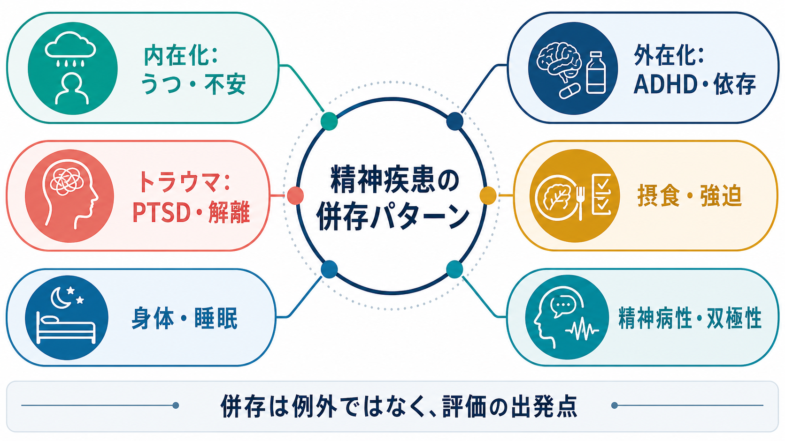
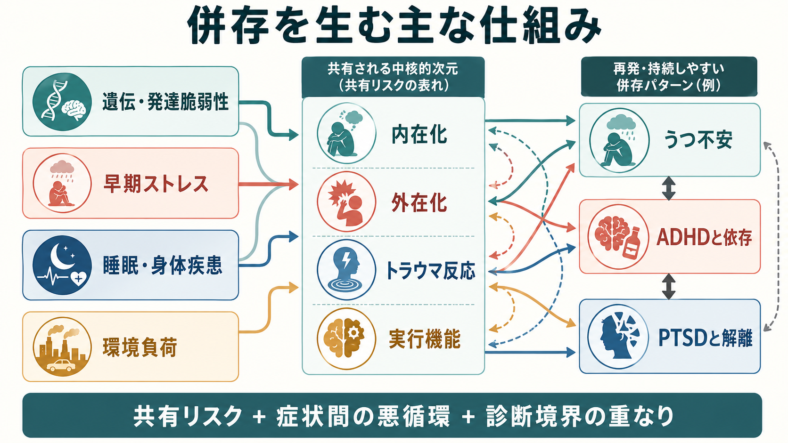
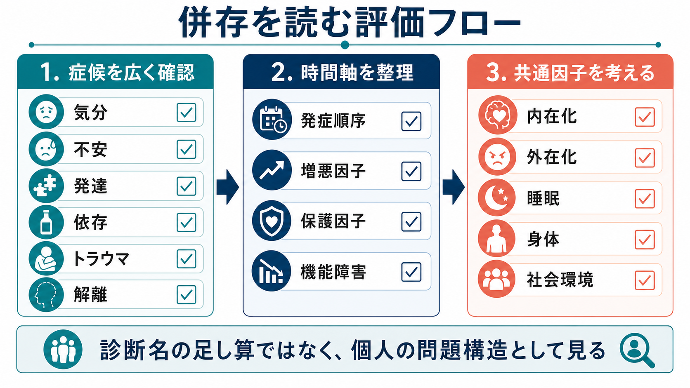

# 精神疾患の併存パターンには何があるのか

## 要点

- 精神疾患の併存は例外的な「診断名の足し算」ではなく、精神病理が内在化、外在化、トラウマ反応、発達特性、睡眠・身体状態などの次元で重なり合うために頻繁に生じる現象である[1][2]。
- 代表的な併存パターンには、[[不安症とうつ病はどう併存するのか|うつ病と不安症]]、[[依存症とADHDはどう関係するのか|ADHDと物質使用障害]]、[[自閉スペクトラム症とは何か|自閉スペクトラム症]]とADHD、[[PTSDとは何か|PTSD]]と[[解離症群とは何か|解離症状]]、[[摂食障害とうつ病はどう併存するのか|摂食障害とうつ病]]、[[慢性疼痛と精神疾患はどう関係するのか|慢性疼痛とうつ不安]]がある。
- 併存がある場合、重症度、慢性化、機能障害、治療反応、安全性評価が変わりやすい。診断名を並べるだけでなく、発症順序、症状間の悪循環、物質・薬剤、身体疾患、睡眠、社会環境を含めて読む必要がある[3][4]。
- 本稿は教育・研究目的の整理であり、個別の診断や治療指示ではない。

## この記事で答える問い

1. 精神疾患では、どのような併存パターンがよく見られるのか。
2. なぜ、うつ不安・発達症依存・PTSD解離のような組み合わせが生じやすいのか。
3. 臨床や研究では、併存をどのように評価し、どのような誤解を避けるべきか。

## まず結論

精神疾患の併存は、単に「診断基準が重なったために増えた見かけの問題」ではない。大規模疫学研究では、1年間に精神疾患を満たす人のうち、複数診断を満たす人が少なくなく、重症例は高併存群に集中しやすいことが示されている[1]。また、HiTOPやp因子の研究は、個別診断の背後に、内在化、外在化、思考障害、全般的精神病理といった広い次元があることを示してきた[2][5]。

したがって、併存パターンを読むときの中心は「どの診断名がいくつあるか」ではなく、「どの症状群がどの順序で生じ、互いに何を強め、本人の生活機能をどこで妨げているか」である。たとえば、[[大うつ病性障害とは何か|大うつ病性障害]]と[[不安症群とは何か|不安症群]]の併存では、心配、回避、不眠、疲労、反すうが互いに悪循環を作る。ADHDと依存では、衝動性、報酬感受性、実行機能の困難、自己治療的使用が接点になる。PTSDと解離では、圧倒的な脅威に対する防衛反応、離人感・現実感消失、感情調整の問題が重要になる[3][4][7]。

## 背景

精神医学の診断分類は、臨床コミュニケーション、研究、保険・制度、治療計画に必要な共通言語である。ICD-11 CDDRなどの診断分類は、症状、持続期間、苦痛・機能障害、除外条件を整理する枠組みを提供する[8]。しかし、精神疾患は多くの場合、自然界に明確な境界線をもつ箱として現れるわけではない。[[不眠障害とは何か|不眠]]、不安、抑うつ、衝動性、回避、注意困難、身体症状は、複数の診断領域にまたがる。

NCS-Rでは、12か月DSM-IV精神疾患を満たす人のうち、単一診断のみの人が55%、2診断が22%、3診断以上が23%と報告された。さらに、重症例は高併存群に偏っていた[1]。この結果は米国成人サンプルに基づくため、国や時代を超えてそのまま一般化することはできないが、「併存は臨床的に珍しい例外ではない」という出発点を与える。

## 基本概念

### 併存と鑑別は別の作業

[[併存症とは何か|併存症]]とは、同じ人に複数の疾患・症候群が同時期または生涯経過の中で存在することである。一方、[[鑑別診断とは何か|鑑別診断]]は、似た症状を示す複数の候補のうち、どれが現在の困りごとを最もよく説明するかを検討する作業である。

たとえば、集中困難は[[ADHDとは何か|ADHD]]、うつ病、不安症、PTSD、不眠、物質使用、甲状腺疾患、薬剤影響のいずれでも起こりうる。集中困難があるからADHDと決めるのでも、うつ病があるからADHDを否定するのでもない。発達歴、発症順序、場面差、持続性、回復時の残存症状を見て、併存なのか、二次的症状なのか、別の説明が適切なのかを分ける。

### よく見る併存パターン

| パターン | 典型的な接点 | 見落としやすい点 |
|---|---|---|
| うつ病 + 不安症 | 心配、反すう、回避、不眠、疲労 | 「抑うつだけ」と見ると不安回避が残る |
| ADHD + 物質使用障害 | 衝動性、報酬感受性、実行機能、自己治療的使用 | 依存の陰に発達歴が隠れる |
| ASD + ADHD | 注意制御、感覚過敏、実行機能、社会適応 | ASD特性とADHD症状の区別が粗くなる |
| PTSD + 解離 | 離人感、現実感消失、感情過覚醒と低覚醒 | 解離を精神病症状や単なる回避と誤読する |
| 摂食障害 + うつ不安/OCD | 完璧主義、身体像、強迫性、回避 | 身体リスクと精神症状を分けすぎる |
| 双極性障害 + 物質使用 | 睡眠減少、衝動性、気分エピソード | 物質誘発性症状との鑑別が必要 |
| 身体疾患・慢性疼痛 + うつ不安 | 痛み、疲労、不眠、活動低下 | 身体か精神かの二分法に陥る |

## 仕組み

併存を生む仕組みは一つではない。少なくとも、次の5つを分けて考えると整理しやすい。

1. 共通リスク: 遺伝的脆弱性、早期逆境、発達特性、気質、睡眠、慢性ストレス、社会的孤立などが複数の症状領域に影響する。
2. 症状の重なり: 不眠、集中困難、疲労、易刺激性、身体緊張、回避は複数診断にまたがる。
3. 症状間の悪循環: 不安が回避を増やし、回避が報酬経験を減らし、抑うつを強める。物質使用が一時的緩和をもたらし、長期的には睡眠や気分を悪化させる。
4. 時間的連鎖: 小児期からの発達特性が学業・対人失敗を介して不安や抑うつを高める、外傷後の回避が孤立を介してうつを強める、といった経過がある。
5. 診断境界の問題: 現在のカテゴリ診断は実用的だが、精神病理の自然な構造を完全に反映するとは限らない。HiTOPやRDoCは、診断横断的な次元や神経行動システムから精神病理を見直そうとする研究枠組みである[2][5]。

### うつ不安

うつ病と不安症は最も頻度の高い併存の一つである。プライマリケアや地域サンプルでは、抑うつと不安が同時に存在する人は珍しくなく、併存例では慢性化、再発、医療利用、機能障害が大きくなりやすい[3]。仕組みとしては、脅威予測、回避、反すう、睡眠障害、身体緊張、自己効力感の低下が互いに強め合う。

臨床的には「不安が強い抑うつ」なのか、「抑うつを伴う不安症」なのかを固定的に決めるより、現在の苦痛を維持している要素を見る。[[全般不安症とは何か|全般不安症]]、[[パニック症とは何か|パニック症]]、[[社交不安症とは何か|社交不安症]]、[[不安抑うつ混合状態とは何か|不安抑うつ混合状態]]のどこに重心があるかで、評価すべき回避行動や安全確保行動が変わる。

### 発達症と依存

ADHDと物質使用障害の併存では、衝動性、報酬遅延への弱さ、実行機能の困難、情動調整の不安定さが接点になりやすい。国際コンセンサスは、SUD患者ではADHDをルーチンにスクリーニングし、物質使用歴、発達歴、断薬・離脱期の症状変化、併存する気分・不安・パーソナリティ症状を含めて評価することを推奨している[4]。

一方で、「ADHDだから依存になる」と単純化してはいけない。物質へのアクセス、家庭・学校・職場環境、外傷体験、睡眠、仲間関係、治療アクセスが経過を大きく変える。[[アルコール使用障害とは何か|アルコール使用障害]]、[[ニコチン使用障害とは何か|ニコチン使用障害]]、[[大麻使用障害とは何か|大麻使用障害]]、[[覚醒剤使用障害とは何か|覚醒剤使用障害]]では、使用物質ごとの急性作用、離脱、精神症状への影響も分けて見る。

ASDとADHDの併存も重要である。ASDとADHDは行動、神経心理、発達経過に重なりがあり、相互に併存しうる[6]。ASDの社会コミュニケーション特性や感覚過敏、ADHDの不注意・衝動性が重なると、学校・職場・家庭での機能障害が増えやすい。ここでも、診断名の数よりも、どの場面でどの支援が必要かを具体化することが大切である。

### PTSDと解離

PTSDと解離の併存では、離人感、現実感消失、意識の狭まり、記憶の断片化、感情の過覚醒と低覚醒の切り替わりが問題になる。DSM-5以降、PTSDの解離性サブタイプは、主に離人感・現実感消失を特徴とする下位分類として注目されてきた。退役軍人や民間サンプルの研究では、PTSDの一部に解離症状が高い群が見られ、VA National Center for PTSDはおおむね15-30%程度のサブグループに言及している[7]。

ただし、解離があるからトラウマ治療が常に禁忌になるわけではない。解離は安全確保、感情調整、現在志向、睡眠、物質使用、対人環境と一緒に評価する必要がある。[[複雑性PTSDとは何か|複雑性PTSD]]、[[パーソナリティ障害と複雑性PTSDはどう関係するのか|パーソナリティ障害との重なり]]、[[解離症と精神病性障害はどう鑑別するのか|精神病性症状との鑑別]]も、症状の意味を誤読しやすい領域である。

### 身体・睡眠・疼痛との併存

精神疾患の併存パターンは精神診断同士だけに限られない。[[睡眠覚醒障害群とは何か|睡眠覚醒障害]]、慢性疼痛、内分泌疾患、心疾患、神経疾患、薬剤性症状は、うつ、不安、認知機能、衝動性、幻覚妄想様症状に影響する。[[身体疾患による気分障害とは何か|身体疾患による気分障害]]や[[薬剤性うつ症状とは何か|薬剤性うつ症状]]を見落とすと、精神疾患の併存として過剰に解釈されることがある。

## 図解

上の1枚目は、頻度の高い併存パターンを概念地図として整理している。中心にあるのは、精神疾患の併存を「評価の出発点」として見る視点である。2枚目は、共通リスク、症状間の悪循環、診断境界の重なりが、うつ不安、ADHDと依存、PTSDと解離などの再発・持続しやすい組み合わせにつながる流れを示している。

3枚目は、併存を評価するときの実践的な読み方である。まず気分、不安、発達、依存、トラウマ、解離を広く確認し、次に発症順序、増悪因子、保護因子、機能障害を時間軸に乗せる。そのうえで、内在化、外在化、睡眠、身体、社会環境といった共通因子を考える。

## 臨床・研究との接続

### 臨床評価で見る順序

併存が疑われるときは、次の順序で整理すると過不足が減る。

1. 安全性: 自殺リスク、自傷、他害、虐待、急性中毒・離脱、せん妄、重い身体疾患を先に見る。
2. 時間軸: 小児期からの発達特性、初発年齢、エピソード性、外傷前後、物質使用前後、睡眠変化を確認する。
3. 症状ネットワーク: どの症状がどの症状を強めるかを見る。例として、不眠が不安を増やし、不安が回避を増やし、回避が抑うつを深める。
4. 機能障害: 仕事、学業、対人関係、家事、セルフケア、地域参加のどこが損なわれているかを見る。
5. 保護因子: 支援者、生活リズム、本人の価値、治療アクセス、環境調整、身体治療を確認する。

### 研究での意味

研究では、併存は「ノイズ」ではなく、精神病理の構造を理解する手がかりになる。p因子研究は、個別診断の背後に全般的な精神病理傾向がある可能性を示した[5]。HiTOPは、従来のカテゴリ診断で問題となる高併存、異質性、診断不安定性を、階層的・次元的な分類で整理しようとする[2]。さらに、診断名ではなく脅威処理、報酬、認知制御、社会過程、覚醒調節などの神経行動システムから研究を組み立てる方向もある。

これらは現在の臨床診断を単純に置き換えるものではない。むしろ、DSM/ICDによる共通言語と、次元モデル・症状ネットワーク・発達経過を組み合わせて、個別ケースをより精密に理解するための補助線である。

## よくある誤解

### 誤解1: 併存が多いほど、必ず重症である

診断数は重症度の一部を反映するが、それだけでは不十分である。単一診断でも急性リスクや機能障害が大きいことはあるし、複数診断があっても安定した生活を維持している人もいる。重症度、持続期間、安全性、生活機能、支援資源を別々に評価する必要がある。

### 誤解2: 併存は診断基準の人工物にすぎない

診断基準の重なりは確かに併存を増やす一因である。しかし、疫学研究、発達研究、遺伝研究、次元モデルの知見は、共通脆弱性や症状間相互作用も重要であることを示している[1][2][5]。人工物だけで説明するのも、完全に独立した疾患の足し算として見るのも、どちらも粗い。

### 誤解3: 主診断を決めれば、併存は後回しでよい

急性期には優先順位をつける必要があるが、併存を後回しにしすぎると、治療反応の乏しさ、再発、安全性リスクの見落としにつながる。特に物質使用、不眠、身体疾患、トラウマ、発達特性は、主診断の経過そのものを変える。

### 誤解4: PTSDと解離は同じもの、または完全に別物である

PTSDと解離は重なりうるが、同一ではない。解離はPTSDの一部として現れることも、解離症群としてより中心的に現れることも、物質・薬剤・身体状態・精神病性障害との鑑別が必要になることもある。離人感や現実感消失を、幻覚妄想、単なる注意散漫、演技として早合点しないことが重要である[7]。

## 関連ノート

既存ノート:

- [[併存症とは何か]]
- [[精神疾患とは何か]]
- [[カテゴリ診断と次元診断は何が違うのか]]
- [[ケースフォーミュレーションとは何か]]
- [[不安症とうつ病はどう併存するのか]]
- [[依存症とADHDはどう関係するのか]]
- [[PTSDとうつ病はどう併存するのか]]
- [[PTSDとは何か]]
- [[解離症群とは何か]]
- [[身体症状症とうつ病はどう関係するのか]]

今後の作成候補:

- 内在化と外在化とは何か
- p因子とは何か
- HiTOPとは何か
- 精神疾患の症状ネットワークとは何か
- 併存症をケースフォーミュレーションでどう扱うか

MOC更新候補:

- `content/00_MOC/MOC・精神医学.md`
- `content/00_MOC/MOC・臨床実践・治療.md`
- `content/00_MOC/MOC・計算論的精神医学.md`

## 理解チェック

1. うつ病と不安症の併存で、診断名だけでなく確認すべき維持因子を3つ挙げられるか。
2. ADHDと物質使用障害の併存を「性格の問題」ではなく、実行機能・報酬・環境の観点から説明できるか。
3. PTSDと解離の関係について、「同じもの」と「完全に別物」のどちらにも寄りすぎず説明できるか。
4. 併存パターンを読むとき、発症順序、増悪因子、保護因子、機能障害を分けて整理できるか。

## 未解決問題

- 併存をカテゴリ診断、次元診断、症状ネットワーク、発達モデルのどの水準で扱うのが、臨床アウトカムに最も役立つのか。
- 高併存群の中で、治療反応や再発リスクを予測する実用的な指標は何か。
- ADHD、ASD、PTSD、物質使用、睡眠障害が重なるケースで、評価順序と支援優先順位をどのように標準化できるか。
- 文化差、医療アクセス、スティグマ、診断制度が併存パターンの見え方にどの程度影響するか。

## 参考文献

[1] Kessler, R. C., Chiu, W. T., Demler, O., & Walters, E. E. (2005). Prevalence, severity, and comorbidity of twelve-month DSM-IV disorders in the National Comorbidity Survey Replication. *Archives of General Psychiatry, 62*(6), 617-627. https://doi.org/10.1001/archpsyc.62.6.617

[2] Kotov, R., Krueger, R. F., Watson, D., et al. (2021). The Hierarchical Taxonomy of Psychopathology (HiTOP): A quantitative nosology based on consensus of evidence. *Annual Review of Clinical Psychology, 17*, 83-108. https://doi.org/10.1146/annurev-clinpsy-081219-093304

[3] Hirschfeld, R. M. A. (2001). The comorbidity of major depression and anxiety disorders: Recognition and management in primary care. *Primary Care Companion to The Journal of Clinical Psychiatry, 3*(6), 244-254. https://doi.org/10.4088/pcc.v03n0609

[4] Crunelle, C. L., van den Brink, W., Moggi, F., et al. (2018). International consensus statement on screening, diagnosis and treatment of substance use disorder patients with comorbid attention deficit/hyperactivity disorder. *European Addiction Research, 24*(1), 43-51. https://doi.org/10.1159/000487767

[5] Caspi, A., Houts, R. M., Belsky, D. W., et al. (2014). The p factor: One general psychopathology factor in the structure of psychiatric disorders? *Clinical Psychological Science, 2*(2), 119-137. https://doi.org/10.1177/2167702613497473

[6] Antshel, K. M., Zhang-James, Y., & Faraone, S. V. (2013). The comorbidity of ADHD and autism spectrum disorder. *Expert Review of Neurotherapeutics, 13*(10), 1117-1128. https://doi.org/10.1586/14737175.2013.840417

[7] VA National Center for PTSD. (2025). Dissociative subtype of PTSD. https://www.ptsd.va.gov/professional/treat/essentials/dissociative_subtype.asp

[8] World Health Organization. (2024). *Clinical descriptions and diagnostic requirements for ICD-11 mental, behavioural and neurodevelopmental disorders*. https://www.who.int/publications/i/item/9789240077263
