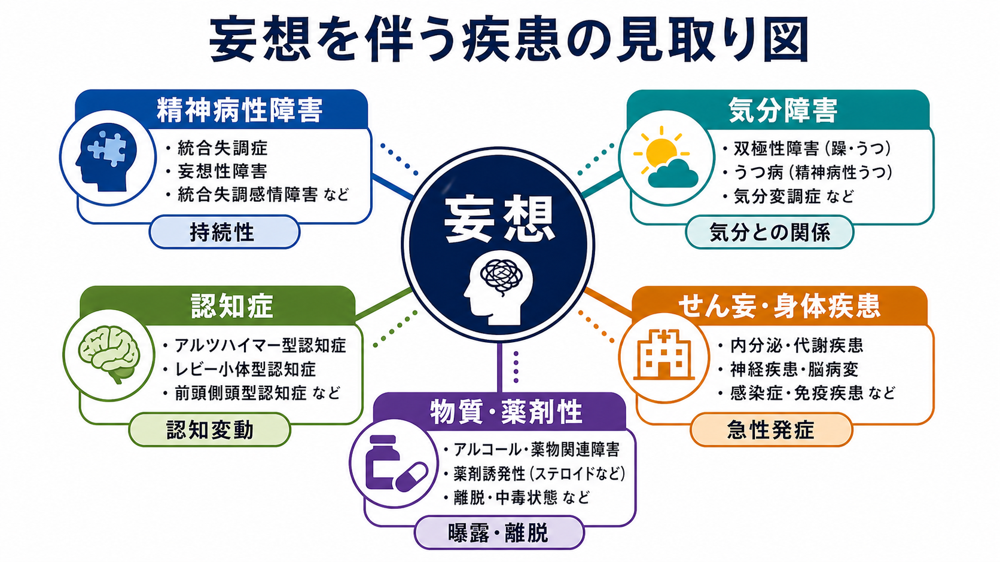
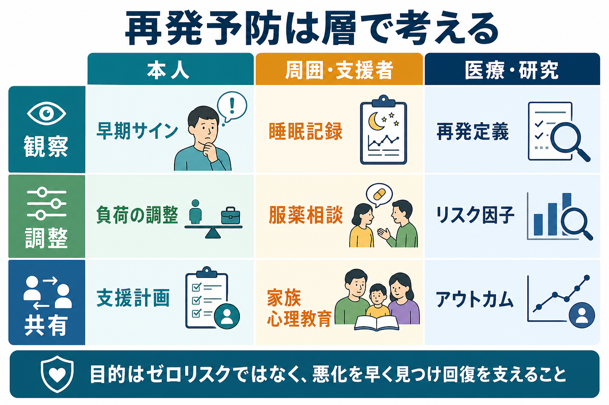
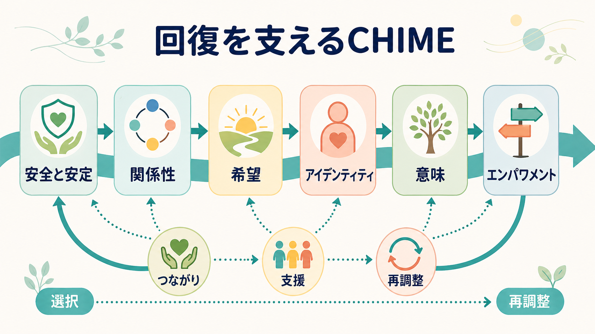

# 精神疾患の再発とは何か

## 要点

- 再発とは、症状が改善・寛解したあとに、同じ疾患や症状群が再び臨床的に問題となる水準まで強まることである。うつ病では「改善後6か月以内の再燃」を再発、より長い回復後の新たなエピソードを再燃・再発とは区別して再発・再発作として扱うことがあるが、疾患や研究により定義は揺れる[1][2]。
- 再発は「本人の意志の弱さ」ではなく、ストレス、睡眠・概日リズム、服薬・治療継続、家族・地域・医療の支援体制が相互作用した結果として起こりやすい[3][4][7][8]。
- 予防の中心は、リスクをゼロにすることではなく、早期サインを見つけ、悪化の連鎖を短くし、回復へ戻る道筋を保つことである。
- この記事は教育・研究目的の整理であり、個別の診断、服薬変更、治療中断の判断を指示するものではない。

## この記事で答える問い

1. 精神疾患の「再発」は、単なる気分の波や一時的な不調と何が違うのか。
2. 症状が改善したあとに、なぜストレスや睡眠の乱れが再発リスクを高めるのか。
3. 服薬・通院・心理社会的支援は、再発予防のどこに効いているのか。
4. 本人、支援者、臨床家、研究者は、再発をどのように扱えばよいのか。

## まず結論

精神疾患の再発は、改善後に症状が「元に戻ってしまう」単純な現象ではない。多くの場合、脆弱性、残存症状、生活上の負荷、睡眠・概日リズムの乱れ、服薬や通院の中断、支援の薄さが重なり、症状を抑えていた調整機構が少しずつ失われる過程として理解できる。

たとえば、強い対人ストレスが続くと、睡眠が浅くなり、日中の疲労や過覚醒が増える。疲労が増えると、通院や服薬、食事、活動、相談のリズムが崩れやすくなる。相談が遅れると、早期サインが見逃され、症状が生活機能に影響する水準まで強まる。この連鎖が「再発」として見える。

## 背景

精神疾患は、急性期の症状が改善したあとも、再び症状が強まることがある。うつ病では再発・再燃が臨床上の大きな課題であり、NICEのうつ病ガイドライン関連レビューは、うつ病がしばしば再発性の経過をとること、改善後の維持治療や心理的再発予防が重要であることを整理している[1]。

統合失調症や精神病性障害でも、再発は症状悪化、入院、生活機能低下、家族負担、スティグマの増大と結びつきやすい[2][5]。双極性障害では、睡眠・概日リズム、服薬継続、心理教育、家族支援が再発予防と密接に関わる[4][8]。この意味で、再発は疾患ごとに異なる一方、[[精神疾患は脳の病気なのか]]で扱うような生物・心理・社会の複数層が交差する現象でもある。

## 基本概念

### 改善、寛解、回復、再発

「改善」は症状が軽くなること、「寛解」は症状が診断閾値や臨床的に問題となる水準を下回ること、「回復」は症状だけでなく生活機能や本人の安定感が一定期間保たれることを指す場合が多い。ただし、研究や診療領域によって用語の境界は異なる。

うつ病の文脈では、改善後6か月以内に同じエピソードが戻るものを relapse、より長い回復後の新しいエピソードを recurrence と区別する説明がよく使われる[1]。統合失調症では、再発の定義が研究間で統一されておらず、症状評価、入院、臨床判断、治療変更などが代理指標として使われることがある[2]。したがって、再発を読むときは「何をもって再発と数えたのか」を確認する必要がある。

### 早期サイン

再発は突然起こるように見えても、その前に小さな変化が出ることが多い。睡眠時間の短縮または過眠、活動量の急変、焦燥、孤立、服薬忘れ、食欲変化、仕事や学業への集中困難、疑い深さ、気分の高揚や落ち込みなどである。これらは疾患特異的な診断基準ではなく、本人ごとの「いつもと違う変化」として捉えるのが実用的である。

## 仕組み

### 1. ストレスは負荷を増やし、調整余力を減らす

ストレスは、再発の唯一原因ではない。しかし、近年のレビューでは、精神病性障害の再発前に成人期のストレスフルな出来事がみられることが多く、23研究中18研究で有意な関連が報告された[3]。

ここで重要なのは、ストレスを「出来事の大きさ」だけで見ないことである。失業、喪失、対人葛藤、経済的困難のような大きな出来事だけでなく、慢性的な緊張、睡眠不足、孤立、役割過多も負荷になる。[[レジリエンスは脳内でどう支えられているのか]]と接続して考えると、再発リスクはストレスの量だけでなく、休息、予測可能性、相談先、回復資源とのバランスで変わる。

### 2. 睡眠と概日リズムは早期警報になる

睡眠は、精神疾患の結果であると同時に、再発の前段階にもなりうる。双極性障害では、睡眠・概日リズムの乱れが広く報告されており、睡眠変化が気分エピソードの前兆や誘因として働く可能性がある[4]。大うつ病でも、改善後に残る睡眠問題や生活リズムの乱れは、再発予防計画で見落としにくい要素である[1]。

睡眠が崩れると、感情調整、注意、記憶、身体疲労、社会的判断が影響を受ける。夜更かし、交代勤務、過度なスマートフォン使用、昼夜逆転、寝だめは、それぞれ単独では小さく見えても、[[概日リズムの乱れは精神疾患にどう関わるのか]]や[[睡眠障害は脳機能にどのような影響を与えるのか]]で扱うように、覚醒系と情動系の調整を揺らしうる。

### 3. 服薬と治療継続は「再発しない力」の一部である

薬物療法は、すべての精神疾患で同じ意味をもつわけではない。それでも、統合失調症では抗精神病薬の維持治療が再発と再入院を大きく減らすことが、Cochraneレビューで示されている。7〜12か月時点の再発は、維持治療群24%、中止・プラセボ群61%であり、相対リスクは0.38だった[5]。これは副作用や本人の希望を無視してよいという意味ではなく、服薬中断が再発リスクに強く関わる領域があるという意味である。

服薬アドヒアランスは、単に「言われた通りに飲む」ことではない。NICEの服薬アドヒアランス指針は、患者が処方薬に関する意思決定へ参加し、合意された推奨に沿って行動できるよう支えることを重視している[6]。副作用、費用、飲み忘れ、病識の揺らぎ、薬への不安、生活リズムの乱れは、どれも継続を難しくする。[[薬物療法は神経回路にどう作用するのか]]の知識は、この相談を「説得」ではなく「共同意思決定」に近づける。

### 4. 支援体制は再発を早く見つけるセンサーになる

再発予防は本人だけの作業ではない。統合失調症の家族介入に関するネットワークメタ解析では、多くの家族介入モデルが通常治療より再発率を下げ、特に家族心理教育が有効であることが示された[7]。双極性障害でも、心理教育は再発予防、とくに躁・軽躁エピソードの再発予防、服薬理解やアドヒアランス改善と関連する[8]。

支援体制の役割は、本人を監視することではない。むしろ、早期サインを共有できる言葉を作ること、悪化時に連絡する順番を決めること、生活上の負荷を調整すること、本人が孤立しないようにすることにある。支援が「症状が悪くなってから動く仕組み」だけだと遅れやすい。再発予防では、安定している時期にこそ支援計画を作る。

## 図解

次の図は、再発予防を本人、周囲・支援者、医療・研究の三層で整理したものである。重要なのは、どの層も単独では完結しないことである。

| 層 | 観察するもの | 調整するもの | 共有するもの |
|---|---|---|---|
| 本人 | 睡眠、気分、活動量、違和感 | 休息、予定、相談、受診 | 早期サイン、困りごと |
| 周囲・支援者 | 孤立、疲労、言動の変化 | 家事・仕事・学校の負荷 | 声かけの仕方、緊急連絡 |
| 医療・研究 | 症状、機能、治療反応 | 薬物療法、心理社会的支援 | 再発定義、アウトカム、リスク因子 |

## 臨床・研究との接続

臨床では、再発予防は「悪くならないように我慢する」ことではなく、早期サイン、支援計画、治療継続、生活調整を組み合わせる実践である。特に、過去の再発前に何が変わったかを本人と支援者が一緒に振り返ると、個人化された再発予防計画を作りやすい。

研究では、再発の定義が大きな課題になる。入院を再発の代理指標にすると、重い再発は拾いやすいが、外来で対応できた再燃や生活機能の低下を見落とすことがある[2]。一方で、症状スコアだけを見ると、本人の生活上の困難や支援負担を十分に捉えられない。再発研究では、症状、機能、生活の質、入院、治療変更、本人報告アウトカムをどう組み合わせるかが重要である。

## よくある誤解

**誤解1: 再発は本人が努力しなかった結果である。**  
再発は、脆弱性、ストレス、睡眠、治療継続、支援体制が重なって生じる。本人の責任だけにすると、早期相談が遅れ、かえって悪化しやすい。

**誤解2: 症状が消えたら治療や支援は不要である。**  
急性期症状が軽くなっても、残存症状や生活リズムの乱れが残ることがある。維持治療や心理社会的支援は、安定期にこそ意味をもつ場合がある[1][5][8]。

**誤解3: 服薬継続だけで再発は防げる。**  
服薬は重要な要素だが、睡眠、ストレス、心理教育、家族・地域支援、社会的役割の調整も必要である。薬だけ、心理療法だけ、家族だけに役割を押し付けると、再発予防は脆くなる。

**誤解4: 再発したらすべて最初からやり直しである。**  
再発はつらい経験だが、そこから早期サイン、支援の穴、治療上の課題を学べる。目的は「二度と揺らがない人」になることではなく、揺らぎを早く見つけて回復へ戻る力を増やすことである。

## 関連ノート

- [[精神疾患は脳の病気なのか]]
- [[うつ病とは何か]]
- [[双極性障害は情動ネットワークの異常として説明できるのか]]
- [[概日リズムの乱れは精神疾患にどう関わるのか]]
- [[睡眠障害は脳機能にどのような影響を与えるのか]]
- [[薬物療法は神経回路にどう作用するのか]]
- [[レジリエンスは脳内でどう支えられているのか]]

MOC更新候補: [[MOC｜精神医学]], [[MOC｜臨床実践・治療]], [[MOC｜神経科学と精神疾患]]

## 理解チェック

1. 再発と一時的な不調を区別するとき、どのような情報を確認する必要があるか。
2. ストレスが再発に関わるとき、出来事そのもの以外に何を見るべきか。
3. 睡眠の乱れが、なぜ気分・認知・服薬継続・支援利用に波及しうるのか。
4. 服薬アドヒアランスを「本人の従順さ」ではなく「共同意思決定」として捉える利点は何か。
5. 家族や支援者が再発予防に関わるとき、監視ではなく支援にするには何が必要か。

## 参考文献

[1] National Institute for Health and Care Excellence. (2022). *Depression in adults: treatment and management. Evidence review C: preventing relapse*. NICE Guideline NG222. https://www.ncbi.nlm.nih.gov/books/n/niceng222er3/

[2] Olivares, J. M., Sermon, J., Hemels, M., & Schreiner, A. (2013). Definitions and drivers of relapse in patients with schizophrenia: a systematic literature review. *Annals of General Psychiatry, 12*, 32. https://doi.org/10.1186/1744-859X-12-32

[3] Martland, N., Martland, R., Cullen, A. E., & Bhattacharyya, S. (2020). Are adult stressful life events associated with psychotic relapse? A systematic review of 23 studies. *Psychological Medicine, 50*(14), 2302-2316. https://doi.org/10.1017/S0033291720003554

[4] Ulrichsen, A., et al. (2025). Do sleep variables predict mood in bipolar disorder: A systematic review. *Journal of Affective Disorders*. https://doi.org/10.1016/j.jad.2024.12.098

[5] Ceraso, A., Lin, J. J., Schneider-Thoma, J., Siafis, S., Tardy, M., Komossa, K., Heres, S., Kissling, W., Davis, J. M., & Leucht, S. (2020). Maintenance treatment with antipsychotic drugs for schizophrenia. *Cochrane Database of Systematic Reviews*, CD008016. https://doi.org/10.1002/14651858.CD008016.pub3

[6] National Institute for Health and Care Excellence. (2009). *Medicines adherence: involving patients in decisions about prescribed medicines and supporting adherence*. NICE Clinical Guideline CG76. https://www.nice.org.uk/guidance/cg76

[7] Rodolico, A., Bighelli, I., Avanzato, C., et al. (2022). Family interventions for relapse prevention in schizophrenia: a systematic review and network meta-analysis. *The Lancet Psychiatry, 9*(3), 211-221. https://doi.org/10.1016/S2215-0366(21)00437-5

[8] Bond, K., & Anderson, I. M. (2015). Psychoeducation for relapse prevention in bipolar disorder: a systematic review of efficacy in randomized controlled trials. *Bipolar Disorders, 17*(4), 349-362. https://doi.org/10.1111/bdi.12287

## 未解決問題

- 再発定義が疾患・研究・医療制度によって異なるため、研究結果を単純比較しにくい。
- 睡眠、活動量、ストレス、服薬状況をデジタル指標で追跡する研究は増えているが、プライバシー、本人の負担、偽陽性への対応が課題である。
- 再発予防の支援は、家族がいる人を前提にしすぎると、単身者、若年者、高齢者、社会的孤立のある人を取り残す可能性がある。
- 文化、雇用、貧困、差別、地域資源の差が再発リスクと支援利用に与える影響を、個人要因だけに還元しない研究が必要である。
