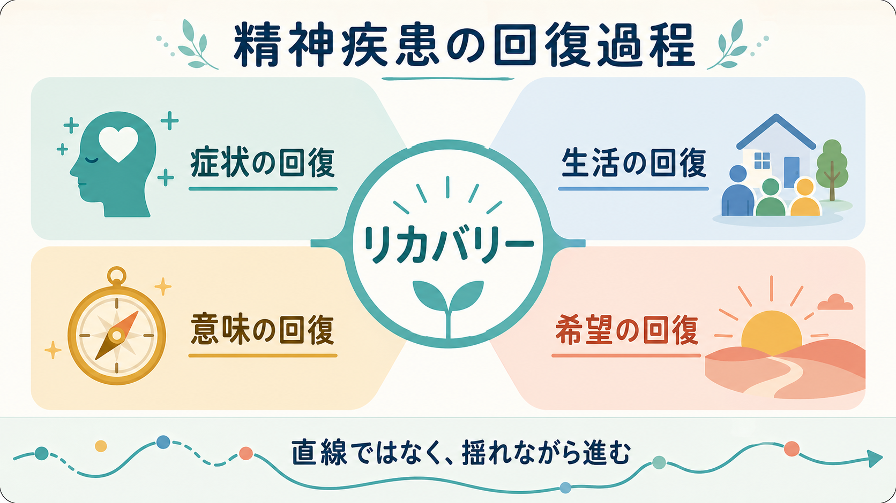
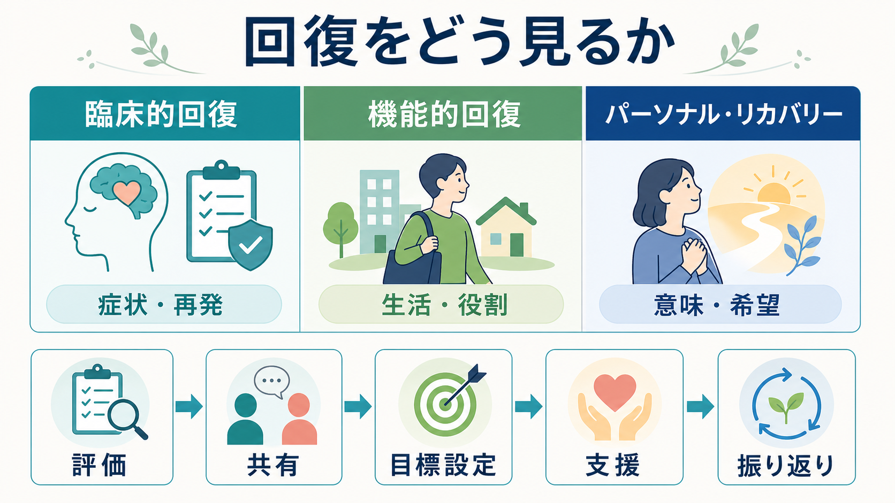

# 精神疾患の回復過程とは何か

## 要点

- 精神疾患の回復は、症状が消えることだけではない。症状の軽減、再発リスクの低下、生活機能の回復、役割の再獲得、意味や希望の再構築が重なって進む過程である[1][2]。
- リカバリーには、専門職が観察しやすい「臨床的回復」と、本人の人生のなかで経験される「パーソナル・リカバリー」がある[3]。
- パーソナル・リカバリーを説明する代表的枠組みが CHIME、すなわちつながり、希望、アイデンティティ、意味、エンパワメントである[4]。
- 回復は直線ではない。悪化、停滞、再発、支援の再調整を含むため、[[精神疾患の再発とは何か|再発]]を「失敗」とみなすより、回復過程の一部として安全に扱う必要がある。
- 医療者の役割は、症状を評価するだけでなく、本人の目標、生活、関係性、権利、選択を支える環境を整えることである[2][6]。

## この記事で答える問い

1. 精神疾患における「回復」とは、症状がなくなることと同じなのか。
2. 臨床的回復、機能的回復、パーソナル・リカバリーはどう違うのか。
3. 回復過程を支える心理社会的メカニズムは何か。
4. 臨床や研究では、回復をどのように評価し、支援につなげるのか。

## まず結論

精神疾患の回復過程とは、「病気になる前に完全に戻る」ことではなく、症状や脆弱性が残る場合も含めて、本人が生活、関係、役割、価値、希望を再構成していく過程である。Anthony は、リカバリーを精神保健サービスの中心的な理念として位置づけ、疾患による制約があっても人生の新しい意味と目的を築けることを強調した[1]。この考え方は、症状消失を否定するものではない。症状の安定は重要だが、それだけで本人の人生が回復したとは限らない、という整理である。

そのため、回復を考えるときは、少なくとも次の四層を分けて見るとよい。

| 層 | 見るもの | 典型的な問い |
|---|---|---|
| 症状の回復 | 幻覚妄想、抑うつ、不安、睡眠、再発リスク | 症状はどの程度生活を妨げているか |
| 生活の回復 | 家事、学業、就労、対人関係、地域生活 | どの活動を再開したいか |
| 意味の回復 | 病いの経験の理解、価値、役割、物語 | この経験をどう位置づけているか |
| 希望の回復 | 未来への見通し、選択可能性、自己効力感 | 何なら少し試せそうか |

## 背景

精神医学では長く、回復は「症状が寛解し、機能が戻ること」として扱われてきた。これは現在も重要であり、[[統合失調症とは何か|統合失調症]]、[[双極性障害とは何か|双極性障害]]、[[うつ病とは何か|うつ病]]、[[PTSDとは何か|PTSD]]などで、再発予防、重症度評価、生活機能評価は欠かせない。

一方で、当事者運動、精神科リハビリテーション、地域精神保健の発展のなかで、「症状が残っていても、自分らしく、希望をもって、社会の一員として生きる」という意味でのリカバリーが重視されるようになった[1][3]。SAMHSA はリカバリーを、健康、住まい、目的、コミュニティを土台に、個人が自分の可能性を実現しようとする変化の過程として整理している[2]。

この転換は、診断や治療を軽視するものではない。むしろ、診断、薬物療法、心理療法、危機介入、福祉、就労支援、家族支援、ピアサポートを、本人の人生の文脈に戻して組み合わせる視点である。WHO の地域精神保健サービスに関するガイダンスも、回復志向、本人中心、権利ベース、地域生活支援を重視している[6]。

## 基本概念

### 臨床的回復

臨床的回復は、症状の寛解、再発の減少、入院の回避、認知機能や生活機能の改善など、専門職が比較的評価しやすい指標に基づく。[[精神科で重症度をどう判断するか|重症度評価]]、[[精神科で生活機能をどう評価するか|生活機能評価]]、[[再発予防計画とは何か|再発予防計画]]はこの層に関わる。

ただし、症状が軽いことと、本人が回復を感じていることは同じではない。症状が落ち着いていても、孤立、[[スティグマとは何か|スティグマ]]、役割喪失、将来への諦めが強ければ、本人にとっては回復していないと感じられることがある。

### 機能的回復

機能的回復は、学校、仕事、家事、対人関係、セルフケア、余暇、地域生活などの活動が再び可能になることを指す。ここで重要なのは、「標準的な生活に戻す」ことではなく、本人が望む生活機能をどの順番で取り戻すかである。

たとえば就労だけを成果にすると、回復が狭くなる。短時間の外出、生活リズムの安定、家族との衝突の減少、相談できる相手の増加も、重要な回復のサインである。

### パーソナル・リカバリー

パーソナル・リカバリーは、本人が病いの経験を抱えながら、希望、意味、アイデンティティ、自己決定を取り戻していく過程である[3][4]。これは「主観的だから測れない」という意味ではない。Recovery Assessment Scale などの尺度は、回復を心理的構成概念として扱い、希望、目標、他者への信頼、症状に支配されない自己像などを測定しようとしてきた[7]。また、回復尺度をめぐる系統的レビューでは、尺度が CHIME の各プロセスをどの程度捉えるか、心理測定上の妥当性が検討されている[5]。

## 仕組み

### CHIME は何を説明するか

Leamy らの系統的レビューは、パーソナル・リカバリーを支える中核過程として CHIME を提示した[4]。

| 要素 | 日本語での意味 | 回復過程での働き |
|---|---|---|
| Connectedness | つながり | 孤立を弱め、支援を受け取れる関係を作る |
| Hope | 希望 | 未来への見通しと「試してみる力」を支える |
| Identity | アイデンティティ | 「病気だけの自分」から離れ、自己像を再構成する |
| Meaning | 意味 | 病いの経験を人生の文脈に位置づける |
| Empowerment | エンパワメント | 選択、自己決定、権利、主体性を回復する |

CHIME は、症状を直接消すメカニズムというより、症状があっても人生を狭めすぎないための心理社会的な足場である。たとえば、つながりが増えると危機時に相談しやすくなる。希望が少し戻ると、通院、睡眠調整、就労準備、対人練習などに取り組みやすくなる。アイデンティティが回復すると、「自分は患者でしかない」という固定化から離れられる。

### 回復は直線ではない

回復過程では、改善と悪化が交互に起こる。再発、入院、休職、対人関係の破綻があっても、それがただちに回復の失敗を意味するわけではない。むしろ、何が負荷になったのか、どの支援が足りなかったのか、本人が何を望んでいるのかを再評価する機会になる。

ここで重要なのは、[[共同意思決定とは何か|共同意思決定]]である。本人の選択を尊重することと、安全性を確保することは対立しない。危機時にはリスク評価や保護が必要になるが、その後には本人が何を失い、何を取り戻したいのかを一緒に整理する必要がある。

### 環境が回復を早めることも妨げることもある

回復は本人の努力だけで決まらない。住まい、収入、学校・職場、家族、地域資源、医療アクセス、差別、制度上の制約が大きく関わる[6]。したがって、支援は「症状を治してから生活へ」ではなく、症状支援と生活支援を並行させる必要がある。

たとえば、睡眠と服薬を調整しながら、家族との連絡方法を整え、短時間の外出を再開し、福祉サービスや就労支援につなぐ。こうした組み合わせが、回復の足場を広げる。

## 図解

上の 3 枚の図は、回復過程を次のように読むための補助である。

| 図 | 読み方 |
|---|---|
| 四つの側面 | 回復を「症状」「生活」「意味」「希望」に分けて見る |
| CHIME | 回復を支える心理社会的プロセスを見る |
| 評価と支援 | 臨床的回復、機能的回復、パーソナル・リカバリーを混同せず、支援計画へ接続する |

## 臨床・研究との接続

### 評価では複数の軸を並べる

臨床では、症状尺度だけで回復を判断しないほうがよい。症状、生活機能、リスク、身体疾患、物質使用、家族関係、住まい、仕事・学業、本人の価値、支援へのアクセスを並べて見る。[[精神科診断面接で尺度をどう使うか|尺度]]は有用だが、尺度の点数だけで本人の回復を代表させると、本人の希望や意味が見えなくなる。

研究では、回復尺度、QOL、社会機能、再発率、入院率、就労・就学、主観的ウェルビーイングなどを組み合わせる必要がある[5][7]。特にパーソナル・リカバリーは文化、年齢、社会資源、スティグマの影響を受けるため、単一の尺度で普遍的に測れると考えすぎないほうがよい。

### 支援では「本人の目標」を治療計画に入れる

回復志向の支援では、治療目標を専門職だけで決めない。本人が望む生活を聞き、短期目標と長期目標を分ける。たとえば「再発しない」だけでなく、「朝に起きる」「友人に返信する」「週 1 回外に出る」「家族と話す時間を短く区切る」「作業所を見学する」など、本人にとって意味のある行動目標へ落とし込む。

病院や急性期の場でも、回復志向実践は不可能ではない。ただし、急性期医療では安全確保と生物医学モデルが前面に出やすく、スタッフの理解、組織的支援、当事者参加が実装上の課題になる[8]。したがって、退院支援、地域連携、ピアサポート、家族支援を早期から接続することが重要である。

### 医療安全とリカバリーを対立させない

希死念慮、暴力リスク、セルフネグレクト、急性精神病状態などがある場合、安全確保は優先される。これはリカバリー概念と矛盾しない。むしろ、安全が確保されてはじめて、本人が選択し、関係を作り、意味を考える余地が生まれる。[[希死念慮とは何か|希死念慮]]や[[自殺念慮と自殺企図は何が違うのか|自殺リスク]]を扱うときも、危機対応の後に希望と生活をどう回復するかを見失わないことが大切である。

## よくある誤解

### 誤解1: 回復とは症状が完全になくなることである

症状の軽減は重要だが、回復はそれだけではない。症状が残っていても、生活、役割、関係、意味が再構成されることがある。逆に、症状が軽くても、孤立や絶望が強ければ、本人にとっては回復していない。

### 誤解2: リカバリーは薬物療法や診断を軽視する考え方である

リカバリーは治療を否定しない。薬物療法、心理療法、危機介入、身体管理、福祉支援を、本人の人生目標と結びつける考え方である。問題は治療の有無ではなく、本人の選択や意味を置き去りにしていないかである。

### 誤解3: 本人の希望を尊重するなら、専門職は介入しないほうがよい

尊重は放任ではない。安全性、情報提供、選択肢の提示、共同意思決定、環境調整を通じて、本人が選びやすい条件を作ることが支援である。[[インフォームドコンセントは精神科でどう行うのか|インフォームドコンセント]]や共同意思決定は、リカバリーの実践的な基盤になる。

### 誤解4: 再発したら回復は振り出しに戻る

再発は苦痛であり、早期対応が必要である。しかし、再発を通じて早期サイン、支援の不足、生活上の負荷が見えることがある。回復過程では、再発後に支援計画を更新し、次の危機を小さくすることが重要である。

## 関連ノート

- [[精神疾患の再発とは何か]]
- [[再発予防計画とは何か]]
- [[共同意思決定とは何か]]
- [[患者中心の精神科診療とは何か]]
- [[精神科で生活機能をどう評価するか]]
- [[精神科で多職種連携はなぜ重要なのか]]
- [[精神科におけるスティグマをどう扱うか]]
- [[地域連携は精神科診療で何を意味するのか]]
- [[うつ病とは何か]]
- [[統合失調症とは何か]]
- [[双極性障害とは何か]]
- [[PTSDとは何か]]

## MOC更新候補

- `content/00_MOC/` 配下の精神医学・臨床実践系 MOC に、本記事へのリンク追加を検討する。
- 並列実行時の競合を避けるため、本タスクでは MOC 本体は更新していない。

## 理解チェック

1. 臨床的回復とパーソナル・リカバリーはどの点で違うか。
2. CHIME の五つの要素を、日本語で説明できるか。
3. 症状が改善しているのに本人が回復を感じていない場合、何を追加で評価するべきか。
4. 再発を「失敗」とみなすことには、どのような臨床上の問題があるか。

## 参考文献

[1] Anthony, W. A. (1993). Recovery from mental illness: The guiding vision of the mental health service system in the 1990s. *Psychosocial Rehabilitation Journal, 16*(4), 11-23. https://doi.org/10.1037/h0095655

[2] Substance Abuse and Mental Health Services Administration. (2012). *SAMHSA's Working Definition of Recovery*. https://library.samhsa.gov/product/samhsas-working-definition-recovery/pep12-recdef

[3] Slade, M., Amering, M., & Oades, L. (2008). Recovery: an international perspective. *Epidemiologia e Psichiatria Sociale, 17*(2), 128-137. https://doi.org/10.1017/S1121189X00002827

[4] Leamy, M., Bird, V., Le Boutillier, C., Williams, J., & Slade, M. (2011). Conceptual framework for personal recovery in mental health: systematic review and narrative synthesis. *The British Journal of Psychiatry, 199*(6), 445-452. https://doi.org/10.1192/bjp.bp.110.083733

[5] Shanks, V., Williams, J., Leamy, M., Bird, V. J., Le Boutillier, C., & Slade, M. (2013). Measures of personal recovery: a systematic review. *Psychiatric Services, 64*(10), 974-980. https://doi.org/10.1176/appi.ps.005012012

[6] World Health Organization. (2021). *Guidance on community mental health services: promoting person-centred and rights-based approaches*. https://iris.who.int/handle/10665/341648

[7] Corrigan, P. W., Giffort, D., Rashid, F., Leary, M., & Okeke, I. (1999). Recovery as a psychological construct. *Community Mental Health Journal, 35*(3), 231-239. https://doi.org/10.1023/A:1018741302682

[8] Lorien, L., Blunden, S., & Madsen, W. (2020). Implementation of recovery-oriented practice in hospital-based mental health services: A systematic review. *International Journal of Mental Health Nursing, 29*(6), 1035-1048. https://doi.org/10.1111/inm.12794
