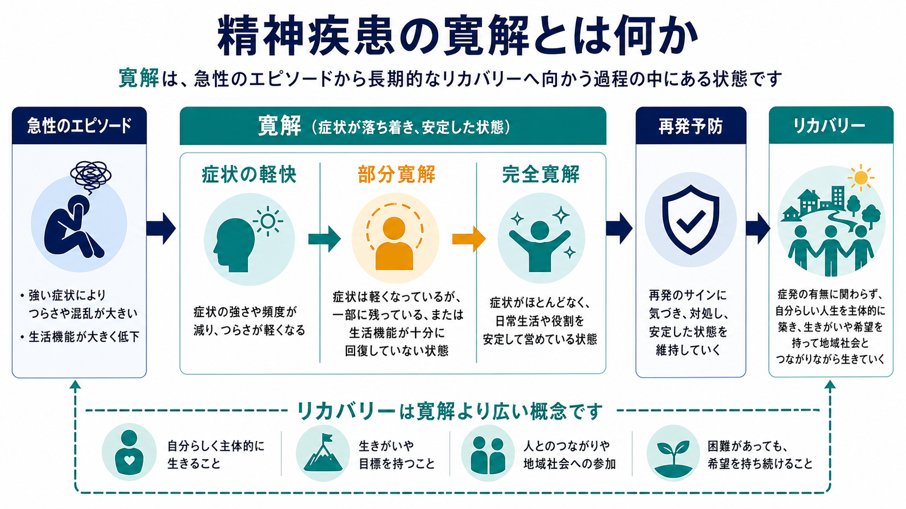
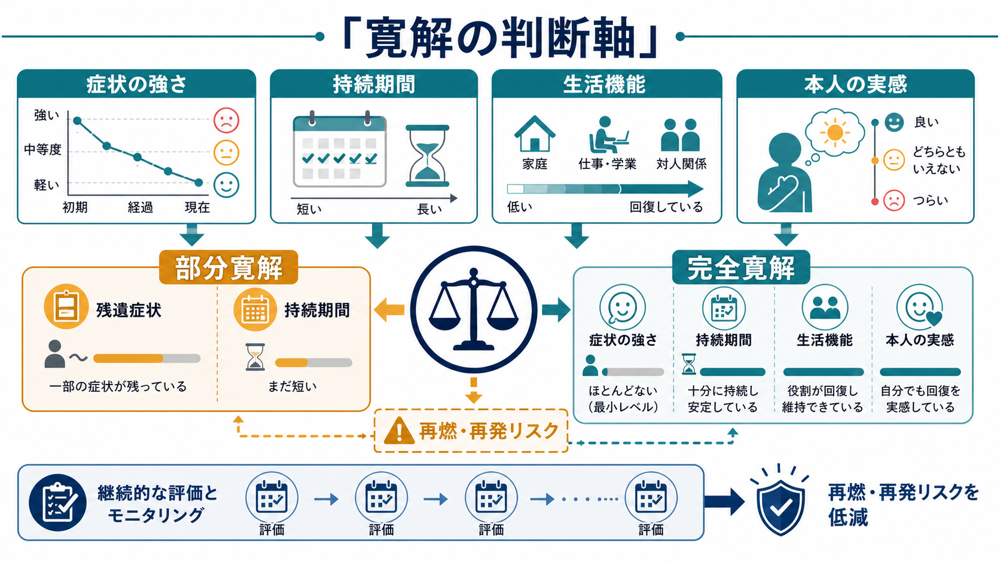

# 精神疾患の寛解とは何か

## 要点

- 寛解とは、精神疾患の症状が十分に軽快し、日常生活・対人関係・学業や仕事などの生活機能が安定している状態を指す。
- 完全寛解は「症状がほとんどない」だけでなく、その状態が一定期間続き、役割や生活機能が回復していることまで含めて考える。
- 部分寛解は、症状は明らかに軽くなったが、残遺症状、短い安定期間、生活機能の不十分な回復が残る状態である。
- 寛解は「治療終了」や「再発しない保証」ではない。残遺症状がある場合、再燃・再発リスクの評価と予防が重要になる。
- リカバリーは寛解より広く、症状の有無だけでなく、本人が意味・希望・つながりをもって生活を再構築する過程を含む。

## この記事で答える問い

1. 精神疾患でいう「寛解」は、単なる「症状が少し楽になった」と何が違うのか。
2. 部分寛解と完全寛解は、どのように分けて考えるのか。
3. 寛解、回復、リカバリー、再発予防はどう関係するのか。
4. 臨床や研究では、寛解をどのように測るのか。

## まず結論

精神疾患の寛解は、急性期の強い症状が落ち着き、本人が生活を再び組み立てられる程度まで安定した状態である。診断分類では疾患ごとに「部分寛解」「完全寛解」「早期寛解」「持続寛解」などの指定が使われることがあり、DSM-5-TR でも疾患ごとに経過指定や寛解指定が整理されている[1]。

ただし、寛解は単一の物差しで決まるものではない。[[うつ病とは何か]]では抑うつ気分や興味・喜びの低下が軽くなることが中心になるが、[[統合失調症とは何か]]では陽性症状・陰性症状・解体症状が一定以下で続くことが問題になる。[[アルコール使用障害とは何か]]などの物質使用症では、一定期間、診断基準を満たさない状態が寛解指定の中心になる[4][8]。

## 背景

精神疾患の経過を記述するとき、「改善」「反応」「寛解」「回復」「再燃」「再発」が混同されやすい。うつ病研究では、Frank らが寛解、回復、再燃、再発を区別する概念枠組みを提案し、研究間でアウトカムを比較するためには経過用語の一貫性が必要だと論じた[2]。

この区別が重要なのは、症状が半分くらい軽くなった状態と、ほとんど症状がなく生活機能も戻った状態では、その後の支援方針が違うからである。NICE の成人うつ病ガイドラインでも、急性期治療だけでなく、慢性化、再発予防、本人の選好を含めた継続的な管理が重視されている[3]。

医療・研究の文脈では、寛解は「治療効果を測る基準」として使われる。一方、本人や家族の文脈では、「元の生活に戻れたか」「自分らしく生活できるか」「再び悪くなる不安とどう付き合うか」という実感を含む。そのため、[[精神科診断は何のためにあるのか]]や[[GAFやWHODASは何を評価するのか]]で扱うような、症状評価と生活機能評価の両方が必要になる。

## 基本概念

### 改善・反応・寛解

改善は、症状や苦痛が以前より軽くなることを広く指す。反応は、治療研究で「症状尺度が一定割合以上低下した」など、量的な改善として定義されることが多い。寛解はさらに踏み込み、症状が臨床的に問題にならない水準まで下がり、その状態が安定していることを意味する。

たとえば、うつ病で症状が 50% 減っても、睡眠障害、疲労、集中困難、希死念慮、仕事や家事の困難が残っていれば、反応はしていても完全寛解とは言いにくい。うつ病の寛解を患者の視点から調べた研究では、症状の消失だけでなく、楽観性、通常の自己感、生活への参加、機能回復が重要視されることが示されている[6]。

### 部分寛解

部分寛解とは、急性期より症状は明らかに軽くなったが、完全には落ち着いていない状態である。典型的には、次のような状態を含む。

| 観点 | 部分寛解で残りやすいもの |
|---|---|
| 症状 | 不眠、不安、疲労、意欲低下、軽い幻聴、回避、渇望など |
| 持続期間 | 良い状態がまだ短く、安定性を判断しにくい |
| 生活機能 | 家事、学業、仕事、対人関係への復帰が不十分 |
| 本人の実感 | 「前より楽だが、まだ戻っていない」という感覚 |

うつ病では、残遺症状を伴う部分寛解が再発リスクや慢性化と関係することが繰り返し指摘されている[5]。つまり部分寛解は「失敗」ではないが、支援を終える合図でもない。

### 完全寛解

完全寛解とは、主要な症状がほとんど認められず、その状態が一定期間続き、日常生活の役割を安定して営める状態である。疾患によって必要な期間や基準は異なるが、一般には次の 4 点を合わせて見る。

1. 症状が最小レベルまで軽くなっている。
2. その状態が一定期間続いている。
3. 生活機能が本人の文脈に照らして回復している。
4. 本人も「回復してきた」と実感できている。

完全寛解でも、将来の再発がゼロになるわけではない。むしろ完全寛解を維持するために、睡眠、ストレス、服薬・心理療法の継続、家族や支援者との連携、早期サインへの気づきが重要になる。

## 仕組み

寛解の判断は、単なる症状数ではなく「症状の強さ」「持続期間」「生活機能」「本人の実感」を合わせた臨床的判断である。

### 症状の強さ

寛解では、症状が診断閾値を下回るか、臨床的に問題にならない程度まで弱くなっているかを確認する。[[PTSDとは何か]]であれば侵入症状、回避、認知と気分の変化、過覚醒がどの程度残るかが問題になる。[[統合失調症の陽性症状とは何か]]や[[統合失調症の陰性症状とは何か]]では、妄想・幻覚・思考のまとまり・意欲低下などが評価される。

### 持続期間

一時的に調子が良いだけでは、寛解とは言いにくい。統合失調症の寛解基準を提案した Andreasen らは、陽性症状、陰性症状、解体症状などの中核症状が軽度以下で、少なくとも 6 か月続くことを操作的基準として提案した[4]。物質使用症でも、DSM-5 系の寛解指定では、一定期間、診断基準を満たさないことが重視される[8]。

### 生活機能

症状が少なくても、生活が戻っていなければ「臨床的には寛解に近いが、機能的には未回復」と考える必要がある。たとえば、不安や抑うつが軽い一方で外出できない、仕事に戻れない、家族との関係が不安定、睡眠リズムが崩れている、といった場合である。

ここで重要なのは、生活機能を「元どおり働けるか」だけに狭めないことである。年齢、身体疾患、家族役割、文化、支援資源によって、回復すべき機能は異なる。[[GAFやWHODASは何を評価するのか]]で扱うように、機能評価は症状評価とは別の補助線になる。

### 本人の実感

本人が「まだ危うい」「元の自分ではない」「生活はできるが喜びが戻らない」と感じている場合、症状尺度だけで完全寛解とみなすと支援の焦点を見落とす。うつ病患者の視点を扱った研究では、患者は症状の消失だけでなく、通常の自己感、楽観性、生活への参加を寛解の要素として重視していた[6]。

## 図解

この記事の 2 枚の図は、寛解を次のように整理する。

| 図 | 見るポイント |
|---|---|
| 全体像 | 急性エピソード、症状軽快、部分寛解、完全寛解、再発予防、リカバリーの関係 |
| 判断軸 | 症状の強さ、持続期間、生活機能、本人の実感を組み合わせて寛解を判断すること |

図で示したように、部分寛解と完全寛解の違いは「良いか悪いか」ではなく、残っている症状や機能障害、安定期間、再発リスクを見積もるための区別である。

## 臨床・研究との接続

### 臨床では何に使うか

臨床では、寛解という言葉は次の判断に関わる。

- 急性期治療から維持期治療へ移るか。
- 通院間隔、心理療法、薬物療法、家族支援、職場・学校調整をどう変えるか。
- 再燃・再発の早期サインをどのように共有するか。
- 本人が「回復した」と感じる生活目標をどう支えるか。

ここでの記述は教育・研究目的であり、個別の治療中止や薬剤調整の指示ではない。寛解に見えても、治療の終了や変更は診断、既往歴、再発歴、副作用、生活状況、本人の希望を含めて専門家と検討する必要がある。

### 研究では何に使うか

研究では、寛解はアウトカム指標として使われる。うつ病研究では、症状尺度の閾値、残遺症状、再発までの期間が重要な指標になる。統合失調症研究では、症状領域ごとの重症度と持続期間をそろえることで、治療効果や長期転帰を比較しやすくなる[4]。

ただし、研究上の寛解は、本人のリカバリー全体を代替しない。SAMHSA はリカバリーを、健康とウェルネスを改善し、自分で方向づけた生活を送り、可能性を追求する変化の過程として定義し、健康、住まい、目的、コミュニティを主要次元としている[7]。したがって、寛解はリカバリーの重要な一部だが、リカバリーそのものではない。

## よくある誤解

### 「寛解したなら、もう精神疾患ではない」

寛解は現在の状態を表す言葉であり、過去のエピソードや再発リスクが消えるという意味ではない。特に反復性のうつ病、双極症、統合失調症、物質使用症では、寛解後も維持期支援や再発予防が重要になる。

### 「症状が少し残っていたら寛解ではない」

完全寛解では症状がほとんどないことが重視されるが、部分寛解では残遺症状がありうる。重要なのは、残っている症状が生活機能や安全性にどの程度影響しているか、その状態が安定しているか、悪化の早期サインがあるかを評価することである。

### 「生活機能が戻れば、症状は見なくてよい」

生活機能の回復は重要だが、睡眠障害、不安、渇望、軽い精神病症状、希死念慮などが残っていれば、再燃・再発の手がかりになることがある。症状と機能は片方だけで判断しない。

### 「寛解とリカバリーは同じ」

寛解は主に症状と機能の安定を指す臨床・研究上の概念である。リカバリーは、本人が希望、意味、つながり、自己決定を取り戻していく生活過程まで含む。寛解していてもリカバリーの課題が残ることがあり、逆に症状が残っていても本人がリカバリーの過程を進んでいることがある。

## 関連ノート

- [[うつ病とは何か]]
- [[統合失調症とは何か]]
- [[PTSDとは何か]]
- [[アルコール使用障害とは何か]]
- [[DSMとICDは何が違うのか]]
- [[GAFやWHODASは何を評価するのか]]
- [[精神科診断は何のためにあるのか]]

### 関連ノート候補

- リカバリーとは何か
- 再発と再燃はどう違うのか
- 残遺症状とは何か
- 維持療法とは何か
- 部分寛解の臨床的意味

## 理解チェック

1. 寛解と単なる改善は、どの点で違うか。
2. 部分寛解では、どのような残遺症状や生活機能の問題が残りうるか。
3. 完全寛解を判断するとき、症状以外に何を見るべきか。
4. 寛解とリカバリーを同一視すると、どのような見落としが起こるか。
5. 再発予防のために、本人・支援者・医療者で共有すべき早期サインは何か。

## 参考文献

[1] American Psychiatric Association. (2022). *Diagnostic and Statistical Manual of Mental Disorders, Fifth Edition, Text Revision (DSM-5-TR).* https://doi.org/10.1176/appi.books.9780890425787

[2] Frank, E., Prien, R. F., Jarrett, R. B., Keller, M. B., Kupfer, D. J., Lavori, P. W., Rush, A. J., & Weissman, M. M. (1991). Conceptualization and rationale for consensus definitions of terms in major depressive disorder: Remission, recovery, relapse, and recurrence. *Archives of General Psychiatry, 48*(9), 851-855. https://doi.org/10.1001/archpsyc.1991.01810330075011

[3] National Institute for Health and Care Excellence. (2022). *Depression in adults: treatment and management* (NICE Guideline NG222). https://www.ncbi.nlm.nih.gov/books/NBK583074/

[4] Andreasen, N. C., Carpenter, W. T., Jr., Kane, J. M., Lasser, R. A., Marder, S. R., & Weinberger, D. R. (2005). Remission in schizophrenia: Proposed criteria and rationale for consensus. *American Journal of Psychiatry, 162*(3), 441-449. https://doi.org/10.1176/appi.ajp.162.3.441

[5] Paykel, E. S. (2008). Partial remission, residual symptoms, and relapse in depression. *Dialogues in Clinical Neuroscience, 10*(4), 431-437. https://doi.org/10.31887/DCNS.2008.10.4/espaykel

[6] Zimmerman, M., McGlinchey, J. B., Posternak, M. A., Friedman, M., Attiullah, N., & Boerescu, D. (2006). How should remission from depression be defined? The depressed patient's perspective. *American Journal of Psychiatry, 163*(1), 148-150. https://doi.org/10.1176/appi.ajp.163.1.148

[7] Substance Abuse and Mental Health Services Administration. (2025). *Recovery and Recovery Support.* https://www.samhsa.gov/recovery

[8] National Institute on Alcohol Abuse and Alcoholism. (n.d.). *NIAAA Recovery Research Definitions.* https://www.niaaa.nih.gov/research/niaaa-recovery-from-alcohol-use-disorder/definitions

## 未解決問題

- 疾患横断的に使える「完全寛解」の共通基準をどこまで作れるか。
- 症状尺度、生活機能尺度、本人の主観的回復感をどの重みで統合すべきか。
- 部分寛解の段階で、どの介入が再発予防に最も有効か。
- 寛解を重視する臨床評価と、本人中心のリカバリー志向をどう両立するか。

