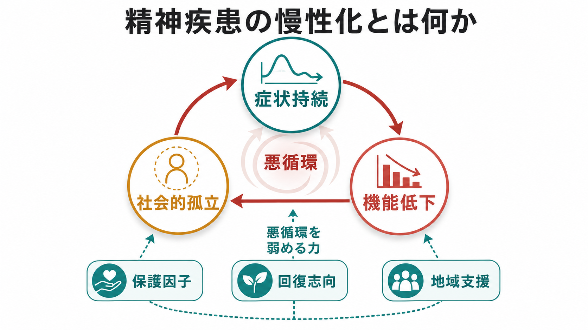
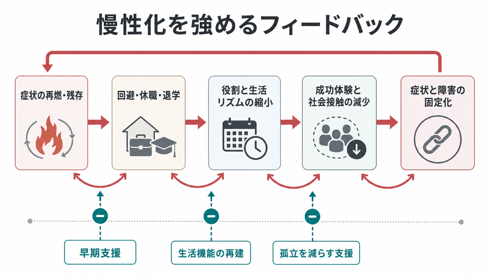
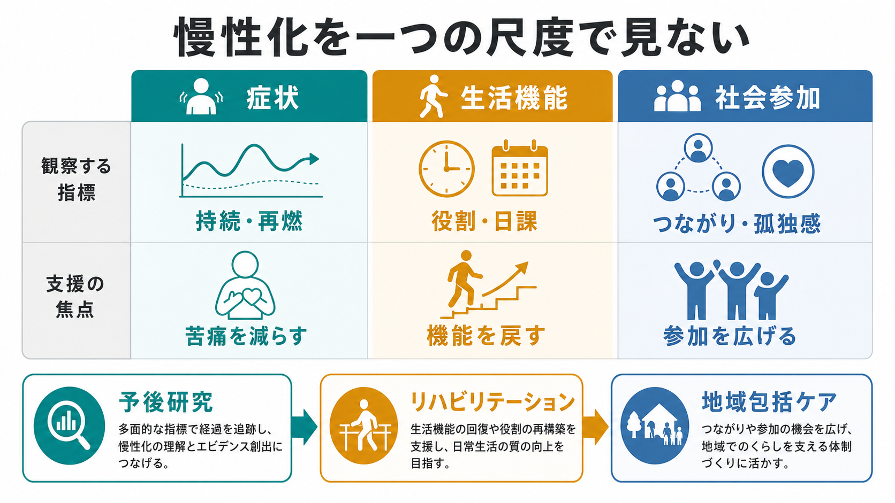

# 精神疾患の慢性化とは何か

## 要点

- 精神疾患の慢性化とは、単に「症状が長く続くこと」ではなく、症状持続、生活機能の低下、社会的孤立、役割喪失、スティグマ、身体健康問題などが絡み合い、回復の機会が狭くなる過程である[1][2]。
- 慢性化は病名だけで決まらない。[[うつ病とは何か]]、[[双極性障害とは何か]]、[[統合失調症とは何か]]、[[不安症群とは何か]]など、異なる診断でも「症状、機能、社会参加の悪循環」は共通して観察される[2][3]。
- 研究・臨床では、症状の寛解だけでなく、学業・就労、家事、対人関係、日課、本人の希望、孤独感、地域での参加を同時に見る必要がある[4][5]。
- この記事は教育・研究目的の整理であり、個別の診断や治療方針の指示ではない。自傷他害の危険、強い希死念慮、急激な悪化がある場合は、地域の救急・医療機関・信頼できる支援者につながることが優先される。

## この記事で答える問い

1. 精神疾患が「慢性化する」とは、何が慢性化するという意味なのか。
2. 症状持続、機能低下、社会的孤立はどのように互いを強めるのか。
3. 慢性化を「本人の弱さ」や「治らない病気」と誤解しないために、どの視点が必要か。
4. 研究・臨床・地域支援では、何を評価し、どこに介入点を置けるのか。

## まず結論

精神疾患の慢性化は、病気が時間とともに自動的に固定するというより、「症状が残るために生活が狭まり、生活が狭まるために症状が残りやすくなる」循環として理解するとわかりやすい。たとえば抑うつ、不安、幻聴、意欲低下、睡眠障害、認知機能の困難が続くと、学校・仕事・家事・人間関係への参加が難しくなる。参加が減ると、成功体験、社会的支え、日課、身体活動、将来見通しが減り、さらに症状や障害が固定されやすくなる[2][3][6]。

したがって、慢性化を考えるときの単位は「診断名」だけではない。症状の強さ、持続期間、再燃頻度、生活機能、社会参加、本人の回復感、支援へのアクセス、差別や貧困などの環境要因を組み合わせて見る必要がある[1][5]。回復とは、症状が完全に消えることだけではなく、つながり、希望、アイデンティティ、意味、エンパワメントを回復していく過程でもある[4][5]。

## 背景

精神疾患は世界的に障害負荷の大きい健康問題であり、WHOは、精神保健を個人の問題だけでなく、公衆衛生、人権、社会参加、地域サービスの問題として扱う必要を強調している[1]。この見方では、慢性化は「医療の中で症状が続くこと」だけでなく、教育、就労、住まい、家族関係、地域の偏見、身体疾患、経済的困難を含む生活全体の問題になる。

精神医学では、慢性化や進行を理解するために「臨床ステージング」という考え方も提案されてきた。これは、早期の軽い状態から、再燃を繰り返し機能低下が目立つ状態までを連続的に捉え、より早い段階でリスクを小さくしようとする枠組みである[2]。ただし、ステージングは人を固定的な段階に分類するためだけのものではない。むしろ、どの時点で、どの機能や支援環境が変えられるかを考えるための地図である。

## 基本概念

### 症状持続

症状持続とは、抑うつ気分、不安、強迫、幻覚妄想、気分変動、不眠、疲労、意欲低下、認知機能の困難などが、生活に影響する水準で残ることである。重要なのは、症状が完全に消えないこと自体よりも、その症状が日課、対人関係、学業・就労、セルフケアをどの程度制限しているかである。

### 機能低下

機能低下とは、本人が価値を置く生活行為が縮小することである。仕事に行けない、学校に通えない、家事ができない、予定を立てられない、人と会う負荷が高い、身体疾患の管理が難しい、といった形で現れる。大うつ病の縦断研究でも、症状だけでなく機能障害を追跡することの重要性が示されている[7]。

### 社会的孤立

社会的孤立とは、単に一人でいる時間が長いことではない。支援を頼める相手、役割、所属、相互性、参加機会が失われることを含む。社会的排除の研究では、精神疾患をもつ人の経験を理解するには、参加の欠如、資源へのアクセス、差別、制度的障壁を含めて考える必要があるとされる[3]。重い精神疾患では孤独や孤立が高頻度に問題となることも、近年の系統的レビューで整理されている[6]。

## 仕組み

慢性化を強める典型的な流れは、次のように整理できる。

1. 症状の再燃・残存により、外出、対人接触、学業・就労への参加が難しくなる。
2. 回避、休職、退学、退職、家族内役割の縮小が起こる。
3. 生活リズム、身体活動、成功体験、社会的フィードバックが減る。
4. 孤立、自己効力感の低下、スティグマ、貧困、身体健康問題が重なる。
5. その結果、症状と機能低下がさらに固定されやすくなる。

この循環は、本人の努力不足では説明できない。精神症状は注意、記憶、意欲、感情調整、睡眠、身体活動を変化させる。さらに、社会側の偏見、支援の不足、雇用や教育の硬直性、家族の疲弊、経済的困難が、本人の選択肢を狭める。慢性化とは、個人内の病理と生活環境の相互作用である[1][3]。

## 図解

上の図は、慢性化を「症状」「生活機能」「社会参加」の3軸で見るためのものである。1枚目は全体像、2枚目は悪循環のメカニズムを示す。3枚目は、評価や支援を一つの尺度に閉じ込めないための整理である。

図の要点は、症状が軽くなっても生活機能が戻っていない場合があり、逆に症状が残っていても本人にとって意味のある役割やつながりが回復している場合がある、という点である。臨床的回復、機能的回復、個人的リカバリーは重なるが、同じものではない[4][5]。

## 臨床・研究との接続

臨床では、症状評価だけでなく、日課、睡眠、身体健康、服薬や心理社会的支援へのアクセス、家族・学校・職場との関係、孤独感、自殺リスク、本人の希望を同時に確認する。慢性化を防ぐ支援は「症状を消す」だけでは不十分で、生活機能の再建、社会参加の回復、スティグマの低減、地域での支援ネットワークの形成を含む[1][5]。

研究では、診断名ごとの平均的な経過だけでなく、症状軌跡、再燃、機能障害、社会的孤立、身体疾患、サービス利用、貧困や差別を含む多面的な縦断データが必要になる。臨床ステージングの発想は、早期介入や再発予防を検討するうえで有用だが、個人の将来を決定論的に予測するものとして扱うべきではない[2]。

回復志向の実践では、本人が何を取り戻したいのかを中心に置く。CHIME枠組みでは、Connectedness、Hope、Identity、Meaning、Empowermentが個人的リカバリーの主要要素として整理されている[4]。慢性化を弱める支援は、この5要素を生活の中で再び増やす支援でもある。

## よくある誤解

### 誤解1: 慢性化は「治らない」という意味である

慢性化は回復不能を意味しない。症状が長く続いても、生活機能、社会参加、本人の希望、苦痛への対処、関係性は変化しうる。回復を「完全寛解」だけで定義すると、本人が実際に取り戻している生活の意味や役割を見落とす[4][5]。

### 誤解2: 慢性化は本人の性格や努力不足で起こる

慢性化は、症状、認知機能、身体健康、支援アクセス、スティグマ、家族・職場・学校・地域環境の相互作用で起こる。本人の意思だけで説明することは、必要な支援と環境調整を見えにくくする[1][3]。

### 誤解3: 症状が軽くなれば機能も自動的に戻る

症状改善と機能回復は関連するが、同一ではない。長く休職・退学・孤立が続いた場合、生活リズム、技能、自己効力感、社会的機会の再建には別の支援が必要になる。したがって、治療効果を見るときも、症状尺度だけでなく機能と参加を合わせて評価する必要がある[7]。

## 関連ノート

- [[うつ病とは何か]]
- [[双極性障害とは何か]]
- [[統合失調症とは何か]]
- [[不安症群とは何か]]
- [[ひきこもりとは何か]]

### 関連ノート候補

- 精神科リハビリテーションとは何か
- リカバリーとは何か
- 社会的孤立と精神健康
- 精神疾患における機能的回復とは何か
- 臨床ステージングとは何か

### MOC更新候補

- `content/00_MOC/` 配下の精神医学・臨床実践・リカバリー関連MOCに、本記事 `[[精神疾患の慢性化とは何か]]` を追加する候補。
- 並列ジョブとの競合を避けるため、この作業ではMOC本体は更新しない。

## 理解チェック

1. 精神疾患の慢性化を「症状が長いこと」だけで捉えると、何を見落とすか。
2. 症状持続、機能低下、社会的孤立は、どの順番で悪循環を作りやすいか。
3. 回復を「症状がゼロになること」だけでなく見ると、支援目標はどう変わるか。
4. 研究で慢性化を扱うとき、症状尺度以外にどの指標を追うべきか。

## 参考文献

[1] World Health Organization. (2022). *World mental health report: transforming mental health for all*. WHO. https://iris.who.int/handle/10665/356119

[2] McGorry, P. D., Hickie, I. B., Yung, A. R., Pantelis, C., & Jackson, H. J. (2006). Clinical staging of psychiatric disorders: a heuristic framework for choosing earlier, safer and more effective interventions. *Australian & New Zealand Journal of Psychiatry, 40*(8), 616-622. https://doi.org/10.1080/j.1440-1614.2006.01860.x

[3] Morgan, C., Burns, T., Fitzpatrick, R., Pinfold, V., & Priebe, S. (2007). Social exclusion and mental health: conceptual and methodological review. *British Journal of Psychiatry, 191*, 477-483. https://doi.org/10.1192/bjp.bp.106.034942

[4] Leamy, M., Bird, V., Le Boutillier, C., Williams, J., & Slade, M. (2011). Conceptual framework for personal recovery in mental health: systematic review and narrative synthesis. *British Journal of Psychiatry, 199*(6), 445-452. https://doi.org/10.1192/bjp.bp.110.083733

[5] van Weeghel, J., van Zelst, C., Boertien, D., & Hasson-Ohayon, I. (2019). Conceptualizations, assessments, and implications of personal recovery in mental illness: a scoping review of systematic reviews and meta-analyses. *Psychiatric Rehabilitation Journal, 42*(2), 169-181. https://doi.org/10.1037/prj0000356

[6] Hajek, A., Gyasi, R. M., Pengpid, S., Peltzer, K., Kostev, K., Soysal, P., Smith, L., Jacob, L., Veronese, N., & König, H. H. (2025). Prevalence of loneliness and social isolation amongst individuals with severe mental disorders: a systematic review and meta-analysis. *Epidemiology and Psychiatric Sciences, 34*, e25. https://doi.org/10.1017/S2045796025000228

[7] Hammer-Helmich, L., Haro, J. M., Jönsson, B., Tanguy Melac, A., Di Nicola, S., Chollet, J., Milea, D., & Saragoussi, D. (2018). Functional impairment in patients with major depressive disorder: the 2-year PERFORM study. *Neuropsychiatric Disease and Treatment, 14*, 239-249. https://doi.org/10.2147/NDT.S146098

## 未解決問題

- 慢性化をどの時点で「状態」ではなく「過程」として評価するか。
- 診断横断的な慢性化指標を、臨床で負担なく測定する方法。
- 孤独、貧困、スティグマ、身体健康問題を含む支援効果を、どのアウトカムで評価するか。
- 本人のリカバリー感と、医療側の症状評価・機能評価をどう統合するか。
