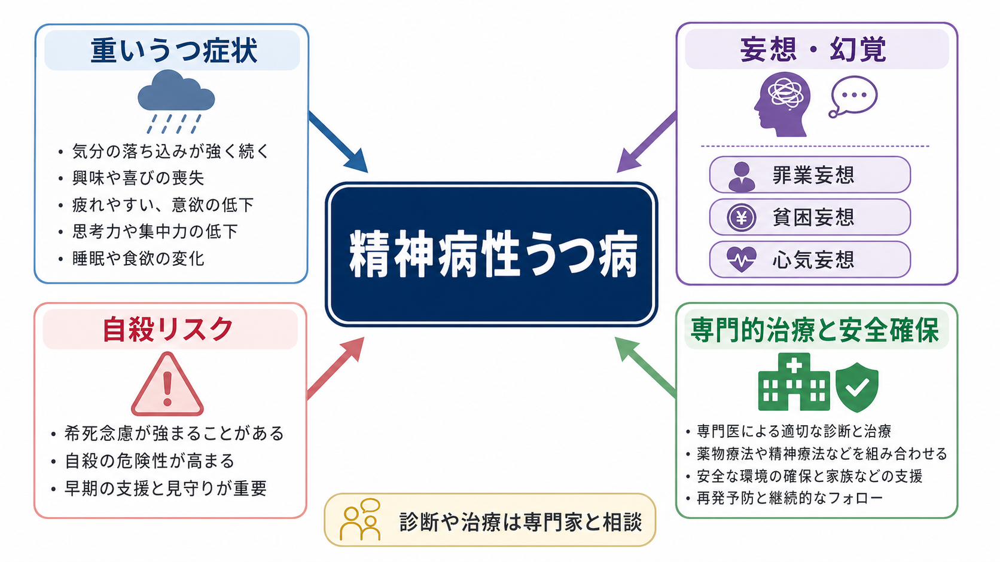
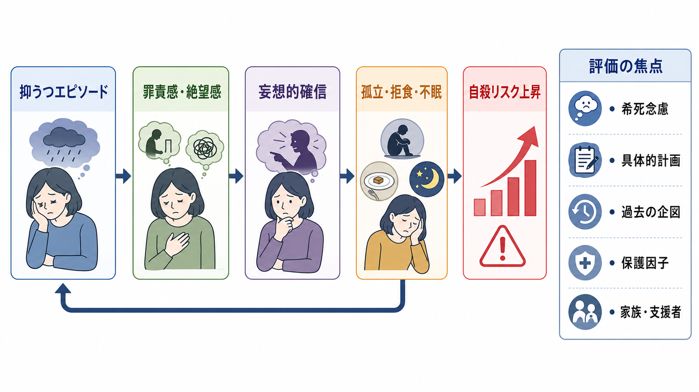
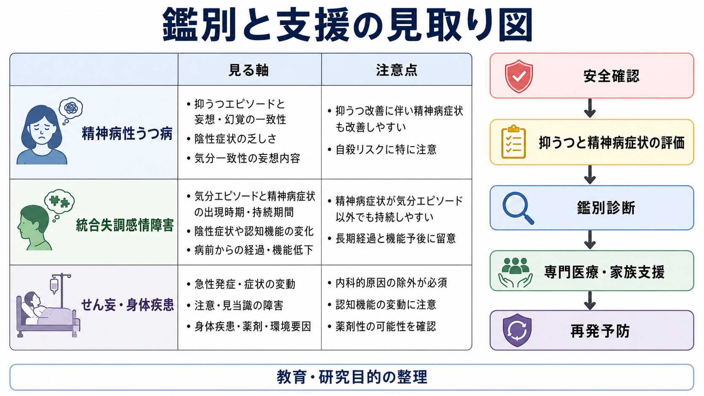

# 精神病性うつ病とは何か

## 要点

- 精神病性うつ病は、抑うつエピソードの中で[[妄想とは何か|妄想]]や[[幻覚とは何か|幻覚]]が出現する状態である。ICD-11 では「うつ病エピソードに精神病症状を伴う」形で分類され、DSM 系では major depressive disorder with psychotic features として扱われる[1]。
- 典型的には、[[罪業妄想とは何か|罪業妄想]]、貧困妄想、心気妄想、虚無妄想、非難・懲罰的な幻聴など、抑うつ気分と主題が一致する精神病症状がみられる[2]。
- 非精神病性うつ病より重症で、精神運動制止・焦燥、生活機能低下、入院治療の必要性、自殺死亡や身体死亡のリスクが高い群として扱われる[2][7]。
- 治療研究では、急性期には抗うつ薬と抗精神病薬の併用、または ECT が重要な選択肢として検討されてきた。ただし薬物療法のエビデンスは限られ、個別の治療方針は専門的評価を要する[3][4][8]。
- 本記事は教育・研究目的の整理であり、個別の診断や治療指示ではない。希死念慮、具体的計画、拒食・脱水、昏迷、強い焦燥がある場合は、診断名より先に安全確保と専門的支援を考える。

## この記事で答える問い

1. 精神病性うつ病は、通常の重いうつ病や統合失調症スペクトラムと何が違うのか。
2. 罪業妄想、貧困妄想、心気妄想は、なぜ自殺リスク評価と切り離せないのか。
3. 臨床ではどのように安全評価、鑑別、治療・支援につなげるのか。

## まず結論

精神病性うつ病は、「うつ病が重い」だけでも、「妄想がある」だけでも説明しきれない。中核は、抑うつ気分、絶望感、自己価値の低下、食欲・睡眠・精神運動の変化に、妄想や幻覚が結びつく点にある[1][2]。妄想内容はしばしば気分に一致し、「自分は取り返しのつかない罪を犯した」「家族を破滅させた」「財産が尽きた」「体が腐っている」「助かる価値がない」といった確信として表れる。

この確信は、単なる悲観や心配より訂正されにくい。本人にとっては「苦しい考え」ではなく「現実そのもの」と感じられることがある。そのため、精神病性うつ病では自殺リスクを、希死念慮の有無だけでなく、妄想内容、絶望感、焦燥、拒食、服薬拒否、孤立、家族・支援者との接触可能性まで含めて評価する必要がある[2][7]。

## 背景

うつ病の診断分類では、抑うつ気分または興味・喜びの低下に加えて、睡眠、食欲、集中、罪責感、希死念慮、精神運動、疲労などの症状が一定期間続くことが重視される。ICD-11 の分類では、単回性うつ病や反復性うつ病の現在エピソードについて、重症度と精神病症状の有無を指定できる[1]。精神病症状を伴う場合、妄想や幻覚がうつ病エピソードの中に現れる。

NICE のエビデンスレビューは、うつ病における精神病症状として、虚無妄想、罪業妄想、不全感・病気に関する妄想、非難的な幻聴を挙げている。また精神病性うつ病では、非精神病性うつ病に比べて精神運動障害と心理社会的機能障害が目立ち、入院治療を要しやすく、退院後の自殺死亡や身体疾患による死亡にも注意が必要だと整理している[2]。

## 基本概念

### 精神病症状は「現実検討の変化」である

精神病症状とは、広くは妄想、幻覚、まとまりにくい思考・行動などを含む。精神病性うつ病で中心になりやすいのは、抑うつ気分に一致した妄想である。典型例は次のように整理できる。

| 症状 | 典型的な内容 | 臨床上の焦点 |
|---|---|---|
| 罪業妄想 | 自分が重大な罪を犯した、罰を受けるべきだ | 羞恥、絶望、希死念慮、家族への巻き込み |
| 貧困妄想 | 財産が尽きた、家族が路頭に迷う | 経済状況の現実、拒食、支援拒否 |
| 心気妄想 | 重い病気で助からない、体が壊れている | 身体疾患の除外、医療不信、過剰受診または受診拒否 |
| 虚無妄想 | 自分や世界が存在しない、体が腐っている | 極度の重症度、拒食・脱水、昏迷 |
| 幻聴 | 自分を責める声、罰を命じる声 | 命令性、切迫感、行動化の危険 |

重要なのは、内容の奇妙さだけで診断しないことである。うつ病の重症度、確信度、訂正可能性、生活機能への影響、精神病症状が気分エピソードの中だけに出ているか、身体疾患や物質・薬剤で説明できないかを合わせて見る。

### 気分一致性と気分不一致性

精神病性うつ病では、妄想や幻覚の主題が抑うつ気分に一致することが多い。罪、罰、破滅、無価値、病気、死、経済的破綻は、抑うつの自己評価低下や絶望感と結びつきやすい[2]。一方で、被害妄想や関係妄想のように見える内容でも、「自分が罰せられるべきだから監視されている」という形で抑うつ主題と結びつくことがある。

気分不一致の精神病症状が目立つ場合、[[統合失調感情障害とは何か|統合失調感情障害]]、統合失調症スペクトラム、双極症、物質・薬剤性精神病、[[せん妄とは何か|せん妄]]などとの鑑別がより重要になる。

## 仕組み

精神病性うつ病の単一の機序は確立していない。臨床的には、次のような悪循環として理解すると見通しがよい。

1. 抑うつエピソードにより、自己評価低下、罪責感、絶望感、睡眠・食欲の低下が強まる。
2. その認知内容が、反証で揺らぎにくい妄想的確信へ固定される。
3. 妄想的確信が、孤立、拒食、服薬拒否、受診拒否、家族への過度な謝罪や回避を生む。
4. 孤立と身体状態の悪化が、さらに抑うつ、焦燥、絶望感を強める。
5. その結果、自殺リスクやセルフネグレクトのリスクが上がる。

この悪循環は、本人の「考え方の癖」だけで説明すべきではない。重症の気分エピソード、睡眠・食欲の破綻、精神運動制止または[[焦燥とは何か|焦燥]]、身体疾患、薬剤、物質使用、社会的孤立、過去のトラウマや喪失が重なって、妄想内容と行動リスクを形づくる。

## 図解

1枚目の図は、精神病性うつ病を「重いうつ症状」「妄想・幻覚」「自殺リスク」「専門的治療と安全確保」の4要素から整理している。精神病性うつ病では、妄想だけを切り離して扱うのではなく、うつ病エピソード全体の重症度と生活機能を一緒に見る必要がある。

2枚目の図は、抑うつエピソードから罪責感・絶望感、妄想的確信、孤立・拒食・不眠、自殺リスク上昇へ進む流れを示している。右側の「評価の焦点」は、[[自殺リスク評価では何を聞くべきか|自殺リスク評価]]と接続する。

3枚目の図は、鑑別と支援への接続である。精神病性うつ病を疑う場合でも、統合失調感情障害、せん妄・身体疾患、双極症、物質・薬剤性の可能性を同時に検討し、安全確認から専門医療・家族支援へつなぐ。

## 臨床・研究との接続

### 安全評価

精神病性うつ病では、自殺リスクを「死にたいと言っているか」だけで判断しない。罪業妄想では「自分は罰を受けるべきだ」、貧困妄想では「家族を破滅から救う方法がない」、心気妄想では「助からないから意味がない」という形で、希死念慮が明示されないまま危険が高まることがある。

評価では、少なくとも次を確認する。

| 評価項目 | 見る理由 |
|---|---|
| 希死念慮と自殺念慮 | 消えたい、死にたい、自分を罰したいという語り |
| 具体的計画 | 時期、場所、方法、準備、手段へのアクセス |
| 過去の企図・自傷 | 反復性、致死性、直近の悪化 |
| 妄想内容 | 罪、破滅、病気、命令性幻聴、家族を巻き込む内容 |
| 身体状態 | 拒食、脱水、不眠、昏迷、焦燥、服薬拒否 |
| 保護因子 | 家族、支援者、治療関係、本人がまだ守りたいもの |

系統的レビューとメタ分析では、単極性の精神病性うつ病は非精神病性うつ病に比べて自殺死亡リスクが高いことが示唆されている。2018年のメタ分析では、9研究 33,873人を対象に、精神病性うつ病で自殺死亡のオッズが高いという結果が報告された[7]。ただし、研究間の診断基準、重症度、追跡期間、気分一致性の扱いにはばらつきがあるため、個人の予測にそのまま使うのではなく、「安全評価を丁寧に行うべき群」として読むのが適切である。

### 鑑別診断

精神病性うつ病を考えるとき、特に次の鑑別が重要である。

| 鑑別 | 区別の軸 |
|---|---|
| 統合失調症スペクトラム | 精神病症状が気分エピソードから独立して持続するか、陰性症状や思考障害の経過 |
| 統合失調感情障害 | 気分症状がない時期にも妄想・幻覚が持続するか、病期全体で気分エピソードがどれほど占めるか |
| 双極症の抑うつエピソード | 躁病・軽躁病エピソード、家族歴、抗うつ薬での躁転、睡眠欲求低下 |
| せん妄・身体疾患 | 注意障害、意識変動、発熱、脱水、内分泌、感染、神経疾患 |
| 物質・薬剤性 | ステロイド、ドパミン作動薬、抗コリン薬、薬物、アルコール離脱など |
| 強迫症・過剰価値観 | 自我違和感、抵抗感、確信度、反証への反応 |

この鑑別は、単に診断名をきれいに分けるためではない。緊急性、身体治療、薬剤調整、入院の必要性、家族支援、長期フォローの組み立てが変わるためである。

### 治療研究

NICE NG222 は、精神病症状を伴ううつ病では専門的精神保健サービスへの紹介を勧め、リスク評価、ニーズ評価、協調的な多職種ケア、急性精神病症状が改善した後の心理療法へのアクセスを含めるとしている[3]。また、抗うつ薬と抗精神病薬の併用を検討すること、反応と異常思考内容・幻覚をモニターすること、寛解後もしばらく抗精神病薬を継続する場合は専門サービスと相談して中止時期を決めることを推奨している[3]。

Cochrane レビューは、精神病性うつ病の薬物療法 RCT は少なく、全体として研究不足だとしながらも、抗うつ薬と抗精神病薬の併用が単剤やプラセボより有効である可能性を示している[4]。STOP-PD 試験では、オランザピン単剤よりセルトラリン併用群で寛解率が高かった[5]。STOP-PD II では、寛解後にセルトラリンを継続したうえでオランザピンを続けた群は、プラセボへ切り替えた群より36週の再発が少なかった一方、体重増加などの代謝面の負担も問題になった[6]。

ECT は、重症うつ病、精神病症状、拒食・脱水、強い自殺リスク、薬物療法が難しい状況で検討される重要な治療選択肢である[8]。ここでも本記事は治療指示を行うものではなく、研究とガイドライン上の位置づけを示すに留める。

## よくある誤解

### 「妄想があれば統合失調症である」

誤りである。妄想や幻覚は統合失調症だけでなく、重いうつ病、双極症、せん妄、認知症、物質・薬剤性、身体疾患でも起こりうる。精神病性うつ病では、精神病症状がうつ病エピソードの中で出現し、抑うつ主題と結びつくことが多い。

### 「罪悪感が強いだけなら危険ではない」

危険な誤解である。罪悪感が妄想的確信となり、「罰を受けるべきだ」「家族のために消えるべきだ」と結びつくと、自殺リスクやセルフネグレクトの評価が必要になる。罪悪感の強さだけでなく、確信度、訂正可能性、絶望感、具体的行動への近さを見る。

### 「治療は抗うつ薬だけで十分である」

単純化しすぎである。抗うつ薬が重要な場合は多いが、精神病症状を伴う場合は抗精神病薬併用や ECT、入院を含む安全確保、多職種支援が検討されることがある[3][4]。副作用や本人の希望、身体疾患、再発リスクを含め、専門的に調整する必要がある。

### 「自殺リスクは質問すると高まる」

一般に、適切な文脈で自殺念慮を直接尋ねることは、危険を増やすためではなく、安全につなぐために行う。精神病性うつ病では、本人が希死念慮を明言しない場合でも、妄想内容や拒食、服薬拒否、孤立からリスクが高まることがある。

## 関連ノート

既存ノート:

- [[うつ病とは何か]]
- [[妄想とは何か]]
- [[幻覚とは何か]]
- [[罪業妄想とは何か]]
- [[精神運動制止とは何か]]
- [[焦燥とは何か]]
- [[統合失調感情障害とは何か]]
- [[せん妄とは何か]]
- [[自殺リスク評価では何を聞くべきか]]
- [[DSMとICDは何が違うのか]]

今後の作成候補:

- 貧困妄想とは何か
- 心気妄想とは何か
- 虚無妄想とは何か
- 精神病性うつ病の治療選択肢
- うつ病における ECT とは何か

MOC更新候補:

- バッチ統合時に、`content/00_MOC/` 配下の精神医学、気分障害、精神病性障害、臨床評価、自殺リスク関連 MOC があれば、本記事へのリンク追加を検討する。
- 並列ジョブとの競合を避けるため、この記事作成時点では MOC 本体を更新しない。

## 理解チェック

1. 精神病性うつ病に典型的な気分一致性妄想を3つ挙げると何か。
2. 罪業妄想があるとき、なぜ希死念慮を明言していなくても安全評価が必要になるのか。
3. 精神病性うつ病と統合失調感情障害を分けるとき、精神病症状と気分エピソードの時間関係をどう見るか。
4. 治療研究で、抗うつ薬と抗精神病薬の併用にはどのような利点と負担が示されているか。
5. せん妄や身体疾患を見落とさないために、どのような所見を確認するべきか。

## 未解決問題

- 精神病性うつ病が、非精神病性うつ病の重症型なのか、部分的に異なる病態群なのかは、診断・生物学・治療反応の各レベルでなお議論が残る。
- 自殺リスクに対する精神病症状の独立寄与は、抑うつ重症度、絶望感、焦燥、過去の自殺企図、社会的孤立と分けて検討する必要がある。
- どの時点まで抗精神病薬を継続するべきか、どの患者で ECT や維持 ECT が最も有用かについて、より大規模で長期の研究が必要である。

## 参考文献

[1] World Health Organization. (2024). *Clinical descriptions and diagnostic requirements for ICD-11 mental, behavioural and neurodevelopmental disorders*. https://iris.who.int/bitstream/handle/10665/375767/9789240077263-eng.pdf

[2] National Institute for Health and Care Excellence. (2022). *Psychotic depression*. In *Depression in adults: Evidence review G* (NICE Guideline, No. 222). NCBI Bookshelf. https://www.ncbi.nlm.nih.gov/books/NBK583078/

[3] National Institute for Health and Care Excellence. (2022). *Depression in adults: treatment and management. Recommendations 1.12.1-1.12.6: Psychotic depression* (NG222). https://www.nice.org.uk/guidance/ng222/chapter/Recommendations

[4] Kruizinga, J., Liemburg, E., Burger, H., Cipriani, A., Geddes, J., Robertson, L., Vogelaar, B., & Nolen, W. A. (2021). Pharmacological treatment for psychotic depression. *Cochrane Database of Systematic Reviews*, 12, CD004044. https://doi.org/10.1002/14651858.CD004044.pub5

[5] Meyers, B. S., Flint, A. J., Rothschild, A. J., Mulsant, B. H., Whyte, E. M., Peasley-Miklus, C., Papademetriou, E., Leon, A. C., Heo, M., & STOP-PD Group. (2009). A double-blind randomized controlled trial of olanzapine plus sertraline vs olanzapine plus placebo for psychotic depression. *Archives of General Psychiatry*, 66(8), 838-847. https://doi.org/10.1001/archgenpsychiatry.2009.79

[6] Flint, A. J., Meyers, B. S., Rothschild, A. J., et al. (2019). Effect of continuing olanzapine vs placebo on relapse among patients with psychotic depression in remission: The STOP-PD II randomized clinical trial. *JAMA*, 322(7), 622-631. https://doi.org/10.1001/jama.2019.10517

[7] Gournellis, R., Tournikioti, K., Touloumi, G., Thomadakis, C., Michalopoulou, P. G., Christodoulou, C., Papadopoulou, A., & Douzenis, A. (2018). Psychotic (delusional) depression and completed suicide: A systematic review and meta-analysis. *Annals of General Psychiatry*, 17, 39. https://doi.org/10.1186/s12991-018-0207-1

[8] Rothschild, A. J. (2016). Treatment for major depression with psychotic features (psychotic depression). *FOCUS*, 14(2), 207-209. https://doi.org/10.1176/appi.focus.20150045
