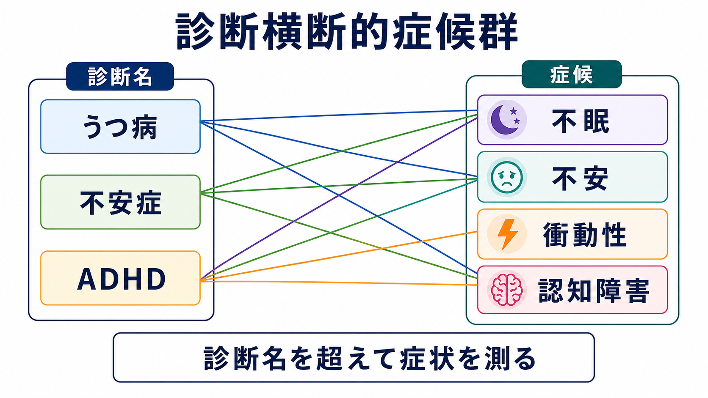
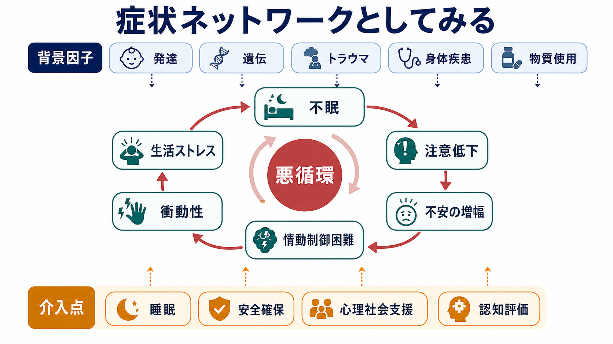
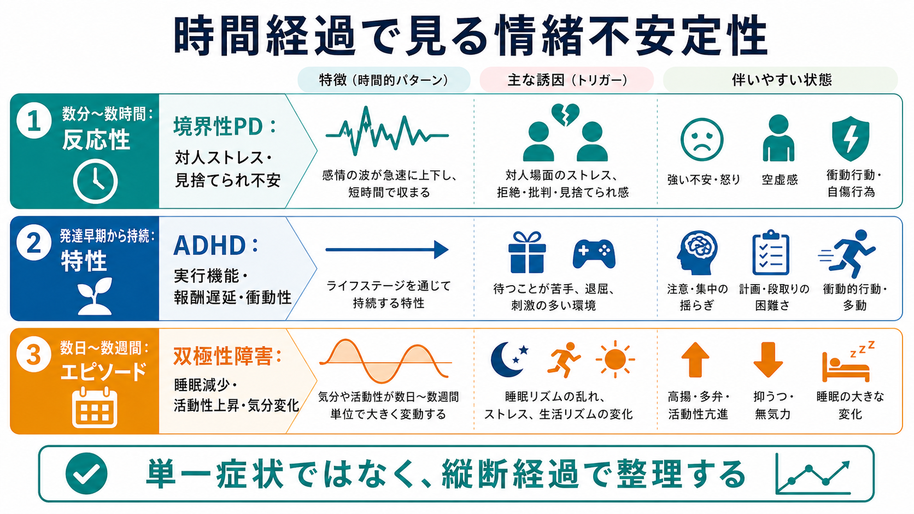

# 精神科における診断横断的症候群とは何か

## 要点

- 診断横断的症候群とは、[[うつ病とは何か|うつ病]]、[[双極性障害とは何か|双極性障害]]、[[不安症群とは何か|不安症]]、[[PTSDとは何か|PTSD]]、[[ADHDとは何か|ADHD]]、[[統合失調症とは何か|統合失調症]]など、複数の診断カテゴリーをまたいで反復して現れる症候のまとまりである。
- 代表例には、不眠、不安、衝動性、認知障害がある。これらは「どの診断名か」だけでは説明しきれず、重症度、持続、機能障害、安全性、生活文脈を含めて測定する必要がある[1][2]。
- 診断横断的な見方は、[[DSMとICDは何が違うのか|DSM・ICD]]のカテゴリー診断を否定するものではない。鑑別診断、重症度評価、治療標的、経過観察を補うための第二の軸である[1][2]。
- 研究では、RDoC、HiTOP、p因子、症状ネットワークなどが、診断名を超えた症候・機能・メカニズムを扱う枠組みとして使われる[2][3][4][5]。
- 医療・精神医学に関する本記事は教育・研究目的の概説であり、個別の診断や治療指示ではない。

## この記事で答える問い

1. 精神科でいう「診断横断的」とは何を意味するのか。
2. 不眠・不安・衝動性・認知障害は、なぜ診断名をまたいで問題になるのか。
3. 診断横断的症候群は、カテゴリー診断、RDoC、HiTOP、p因子、症状ネットワークとどう関係するのか。
4. 臨床評価や研究計画では、どのように使えばよいのか。

## まず結論

診断横断的症候群は、「ある診断名に固有の症状」ではなく、「複数の精神疾患や発達特性、身体疾患、物質使用、生活環境をまたいで現れ、苦痛や機能障害を生む症候のまとまり」である。たとえば不眠は、うつ病だけでなく、不安症、PTSD、双極性障害、ADHD、物質使用、身体疾患でもみられる。不安も、単に不安症群の中だけに閉じず、うつ病、精神病性障害、発達症、認知症、身体疾患への反応としても現れる。

したがって診断横断的な見方では、最初に「診断名を捨てる」のではなく、診断名と並行して「どの症候が、どの程度、どの期間、どの生活機能を障害し、どのリスクにつながっているか」を測る。DSM-5 の Level 1 Cross-Cutting Symptom Measure も、成人で抑うつ、怒り、躁、 anxiety、身体症状、自殺念慮、精神病症状、睡眠、記憶、反復思考・行動、解離、パーソナリティ機能、物質使用などを横断的に確認する道具として位置づけられている[1]。

## 背景

精神医学の診断体系は、診療、研究、行政、保険、コミュニケーションにとって不可欠である。[[DSMとICDは何が違うのか|DSMやICD]]は、症状の組み合わせ、期間、除外条件、機能障害を整理し、臨床家どうしが同じ言葉で話すための共通基盤を提供する。

一方で、精神科診断には三つの難しさがある。第一に、一つの診断名の中に多様な症状プロファイルが含まれる。第二に、複数の診断が併存しやすい。第三に、時間とともに診断名が変わっても、不眠、不安、衝動性、認知障害のような症候は持続することがある。HiTOP は、こうした異質性、併存、境界の曖昧さを、階層的・次元的な精神病理モデルで扱う試みとして提案されている[3]。

RDoC も同じ問題意識を別方向から扱う。RDoC は診断カテゴリーそのものではなく、負の価システム、認知システム、覚醒・調節システムなど、行動と神経生物学の機能次元を、遺伝子、分子、細胞、回路、生理、行動、自己報告など複数の分析単位で研究する枠組みである[2]。この発想は、[[RDoCは精神疾患研究をどう変えたのか]]と接続する。

## 基本概念

### 診断横断的症候群

診断横断的症候群は、単一の疾患名に閉じない症候のまとまりである。ここでいう「症候群」は、厳密な独立疾患というより、評価上まとまりとして扱うと有用な臨床現象を指す。たとえば「不眠」は独立した[[不眠障害とは何か|不眠障害]]として診断される場合もあるが、うつ病、PTSD、双極性障害、慢性疼痛、物質使用、生活リズムの乱れに伴うこともある[6]。

この概念の利点は、診断名の内側に埋もれやすい治療標的を取り出せることである。診断名が「うつ病」であっても、問題の中心が不眠、過覚醒、反すう、注意低下、衝動的な飲酒であれば、評価と支援の優先順位は変わる。

### 症状、症候、症候群

症状は、本人が感じる苦痛や体験である。不眠、不安、焦燥、もの忘れ、集中困難などが含まれる。徴候は、観察者が確認しやすい所見である。症候は、症状と徴候を含む臨床的な現れである。症候群は、それらが一定のまとまりとして反復して現れる状態である。

診断横断的症候群では、このまとまりを「単一の病因で説明できるか」よりも、「複数の診断や文脈にまたがって、評価・予後・介入に役立つか」という観点で扱う。

## 仕組み

診断横断的症候群を理解するには、二つの見方が役に立つ。

第一は、共通因子の見方である。p因子研究は、精神疾患を完全に別々のカテゴリーとしてだけ見るのではなく、併存、持続、再発、重症度の背後に、広い精神病理傾向を想定できる可能性を示した[4]。これは「すべての症状の原因が一つ」という意味ではないが、複数の診断をまたぐ脆弱性や重症度を考える手がかりになる。

第二は、症状ネットワークの見方である。症状ネットワーク理論では、精神疾患を、潜在疾患が症状を一方的に生むモデルだけでなく、症状どうしが直接影響し合うシステムとして捉える[5]。たとえば不眠が注意低下を生み、注意低下が失敗体験を増やし、不安が高まり、情動制御が崩れ、衝動的な行動や対人トラブルが増え、さらに不眠が悪化する、という循環が考えられる。

## 図解

| 見方 | 主な問い | 使いどころ | 注意点 |
|---|---|---|---|
| カテゴリー診断 | どの診断基準を満たすか | 鑑別診断、治療方針、制度上の記録 | 同じ診断名でも症状プロファイルが多様 |
| 診断横断的症候 | どの症候が、どの程度、どの生活機能を障害しているか | 重症度評価、経過観察、治療標的の選択 | 診断名の代替ではない |
| RDoC | どの機能次元と神経・行動指標が関与するか | 研究デザイン、メカニズム仮説 | 臨床診断体系そのものではない |
| HiTOP | 精神病理をどの次元・階層で整理できるか | 併存、異質性、連続性の理解 | 実装と標準化は発展途上 |
| 症状ネットワーク | 症状どうしがどう影響し合うか | 悪循環の同定、介入点の探索 | 因果推論には縦断データや慎重な設計が必要 |

## 臨床・研究との接続

### 不眠

不眠は、診断横断的症候の典型である。従来は「うつ病や不安症の二次症状」とみなされがちだったが、不眠そのものが精神症状の発症、維持、再発に関わる可能性がある。Harvey は、不眠を精神疾患に共通する診断横断的過程として扱う意義を論じ、Dolsen らも不眠が幅広い精神疾患と併存し、経過に関係することを整理している[6]。

臨床的には、診断名にかかわらず、睡眠時間だけでなく、入眠困難、中途覚醒、早朝覚醒、睡眠リズム、昼間の機能、物質使用、身体疾患、薬剤、夜間の安全性を確認する。

### 不安

不安は、[[不安症群とは何か|不安症群]]だけでなく、うつ病、PTSD、精神病性障害、身体疾患、発達特性、認知症、物質使用にまたがって出現する。RDoC では、急性脅威、潜在的脅威、持続的脅威などが負の価システムに含まれ、恐怖や不安を単一診断に閉じずに研究するための軸を提供している[2]。

臨床評価では、「不安があるか」だけでなく、何を脅威として予測しているか、回避行動があるか、身体症状が強いか、安全確認や反すうが維持因子になっているかをみる。

### 衝動性

衝動性は、ADHD、双極性障害、物質使用障害、パーソナリティ障害、神経疾患などで問題になる。Dalley と Robbins は、衝動性を一枚岩ではなく、衝動的選択、反応抑制の困難、待てなさ、リスク選好など複数の神経心理学的過程に分けて考える重要性を論じている[7]。

臨床的には、衝動性を性格特徴として固定的に見るのではなく、睡眠不足、躁状態、離脱、薬物、疼痛、対人ストレス、認知機能低下、希死念慮の切迫など、短期的に高まる要因を評価する。

### 認知障害

認知障害は、統合失調症だけでなく、うつ病、双極性障害、PTSD、ADHD、認知症、物質使用、身体疾患でも問題になる。Millan らは、注意、作業記憶、学習、社会認知、言語、実行機能などの認知機能障害が、多くの精神疾患で生活機能を強く制限しうることを整理している[8]。[[統合失調症の認知機能障害とは何か]]は、この問題の疾患特異的な入口になる。

研究では、認知機能を単なる副次的症状ではなく、生活機能、治療反応、予後と関係するアウトカムとして測る必要がある。臨床では、主観的な「頭が回らない」と、客観的な注意・記憶・遂行機能の問題を分けて確認する。

## よくある誤解

### 誤解1: 診断横断的に見るなら DSM や ICD は不要である

不要ではない。カテゴリー診断は、鑑別診断、安全性評価、治療選択、制度上の記録に必要である。診断横断的症候群は、カテゴリー診断で見落とされやすい症状の重症度、経過、機能障害、治療標的を補う軸である。

### 誤解2: 共通因子があるなら、すべて同じ治療でよい

そうではない。診断横断的な症候が同じでも、背景因子、リスク、発達歴、身体疾患、薬剤、物質使用、社会的文脈は異なる。たとえば不眠がある場合でも、躁状態、PTSDの過覚醒、疼痛、アルコール離脱、睡眠時無呼吸では対応が異なる。

### 誤解3: 症状ネットワークを描けば因果関係が分かる

横断データから描いたネットワークは、症状間の関連を示すにとどまる。因果的な悪循環を検討するには、縦断データ、経験サンプリング、介入研究、時間順序を含む分析が必要である[5]。

### 誤解4: 診断横断的症候群は研究用語で、臨床には使えない

むしろ臨床で役に立つ。初診時に、診断名だけでなく、不眠、不安、衝動性、認知障害、自殺念慮、物質使用、生活機能を横断的に確認すれば、見落としを減らし、経過観察の指標を作りやすくなる[1]。

## 関連ノート

- [[DSMとICDは何が違うのか]]
- [[RDoCは精神疾患研究をどう変えたのか]]
- [[不眠障害とは何か]]
- [[不安症群とは何か]]
- [[ADHDとは何か]]
- [[PTSDとは何か]]
- [[うつ病とは何か]]
- [[双極性障害とは何か]]
- [[統合失調症とは何か]]
- [[統合失調症の認知機能障害とは何か]]

MOC 更新候補: `content/00_MOC/` 配下の精神医学、精神疾患、臨床評価、計算論的精神医学・RDoC 関連 MOC に追加候補。

## 理解チェック

1. 診断横断的症候群は、カテゴリー診断を置き換える概念か、それとも補う概念か。
2. 不眠が診断横断的症候として重要になる理由を、発症・維持・再発の観点から説明できるか。
3. 衝動性を評価するとき、ADHD だけでなく確認すべき背景因子は何か。
4. 症状ネットワークを臨床に使うとき、横断的な相関と因果的な悪循環をどう区別すべきか。

## 未解決問題

- 診断横断的症候を、日常診療で短時間に測定する最適な尺度セットはまだ標準化途上である。
- RDoC、HiTOP、p因子、症状ネットワークは互いに補完的だが、臨床意思決定にどう統合するかは未確立である。
- 症候の改善が、診断カテゴリーをまたいで生活機能や長期予後をどの程度改善するかは、症候ごとに検証が必要である。

## 参考文献

[1] Narrow, W. E., Clarke, D. E., Kuramoto, S. J., et al. (2021). Examining the Factor Structure of the DSM-5 Level 1 Cross-Cutting Symptom Measure. *Psychiatric Services*, 72(5), 558-565. https://pmc.ncbi.nlm.nih.gov/articles/PMC8095225/

[2] National Institute of Mental Health. RDoC Matrix. https://www.nimh.nih.gov/research/research-funded-by-nimh/rdoc/constructs/rdoc-matrix

[3] Kotov, R., Krueger, R. F., Watson, D., et al. (2021). The Hierarchical Taxonomy of Psychopathology (HiTOP): A Quantitative Nosology Based on Consensus of Evidence. *Annual Review of Clinical Psychology*, 17, 83-108. https://doi.org/10.1146/annurev-clinpsy-081219-093304

[4] Caspi, A., Houts, R. M., Belsky, D. W., et al. (2014). The p Factor: One General Psychopathology Factor in the Structure of Psychiatric Disorders? *Clinical Psychological Science*, 2(2), 119-137. https://doi.org/10.1177/2167702613497473

[5] Borsboom, D. (2017). A network theory of mental disorders. *World Psychiatry*, 16(1), 5-13. https://doi.org/10.1002/wps.20375

[6] Dolsen, E. A., Asarnow, L. D., & Harvey, A. G. (2014). Insomnia as a transdiagnostic process in psychiatric disorders. *Current Psychiatry Reports*, 16, 471. https://doi.org/10.1007/s11920-014-0471-y

[7] Dalley, J. W., & Robbins, T. W. (2017). Fractionating impulsivity: neuropsychiatric implications. *Nature Reviews Neuroscience*, 18, 158-171. https://doi.org/10.1038/nrn.2017.8

[8] Millan, M. J., Agid, Y., Brune, M., et al. (2012). Cognitive dysfunction in psychiatric disorders: characteristics, causes and the quest for improved therapy. *Nature Reviews Drug Discovery*, 11, 141-168. https://doi.org/10.1038/nrd3628
