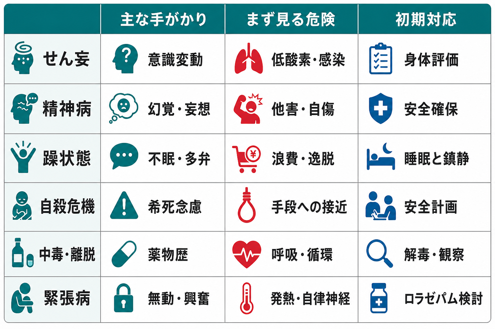
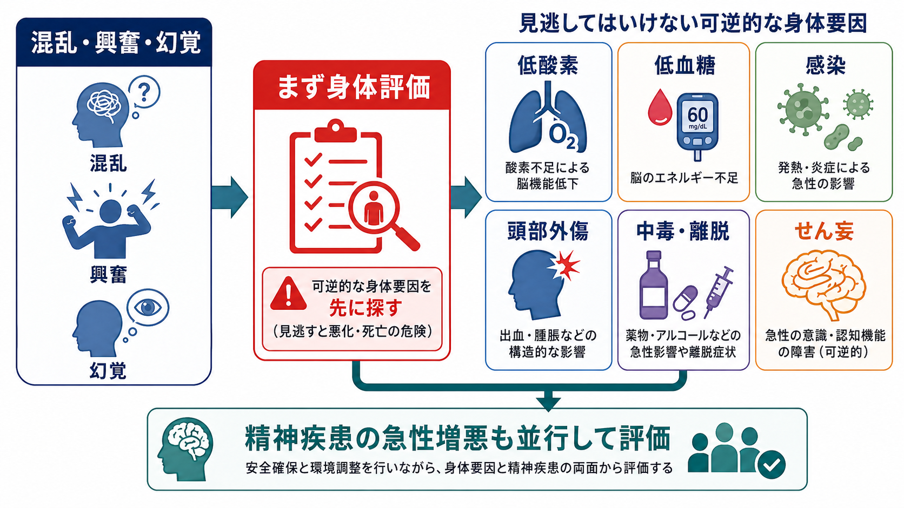

# 精神科救急でみる疾患・症候群には何があるのか

## 要点

- 精神科救急では、診断名を急いで固定する前に、安全確保、意識・バイタル・身体疾患、物質使用、自殺・他害リスクを同時に見る。
- 代表的には、[[せん妄とは何か|せん妄]]、精神病、[[躁状態とは何か|躁状態]]、自殺危機、[[中毒症状とは何か|中毒]]・[[離脱症状とは何か|離脱]]、[[緊張病とは何か|緊張病]]、強い不安・パニック、認知症や身体疾患に伴う精神症状が問題になる。
- とくに新規発症、意識変動、高齢発症、急な認知変化、異常バイタル、頭部外傷、薬物・アルコール使用、発熱、脱水、低酸素、低血糖は、可逆的な身体要因を先に探す手がかりである[1][2]。
- この記事は教育・研究目的の概説であり、個別症例の診断や治療指示ではない。

## この記事で答える問い

1. 精神科救急では、どのような疾患・症候群がよく問題になるのか。
2. せん妄、精神病、躁状態、自殺危機、中毒・離脱は、どの点で見分けるのか。
3. 救急場面で「精神疾患」と「身体疾患・薬物影響」をどう並行して考えるのか。

## まず結論

精神科救急でみるべき対象は、「精神疾患の一覧」ではなく、「いま失うと危険なもの」の一覧として整理するとわかりやすい。失うと危険なものとは、生命、本人と周囲の安全、意識・脳機能、治療機会、退院後の支援である。したがって初期評価では、[[精神科救急では何を優先するべきか|精神科救急の優先順位]]に沿って、症状の名前よりも先に可逆的な身体要因、自殺・他害リスク、物質使用、急性の精神病・躁状態、緊張病やせん妄を拾い上げる[1][3]。

## 背景

精神科救急には、「幻覚がある」「暴れている」「死にたいと言っている」「眠っていない」「薬物を使ったかもしれない」「急にぼんやりした」といった、多様な訴えが同じ入口から入ってくる。ここで重要なのは、精神症状が見えても、それが一次性の精神疾患とは限らないことである。低酸素、低血糖、感染、頭部外傷、脱水、薬剤、アルコール離脱、抗コリン作用、けいれん後、内分泌異常などは、精神症状に似た混乱・幻覚・興奮を起こしうる[1][2]。

一方で、精神疾患の急性増悪も見逃せない。統合失調症や[[初回エピソード精神病とは何か|初回エピソード精神病]]、[[双極I型障害とは何か|双極I型障害]]の躁病エピソード、重いうつ病、[[物質誘発性精神病とは何か|物質誘発性精神病]]、[[アルコール離脱とは何か|アルコール離脱]]、[[振戦せん妄とは何か|振戦せん妄]]、緊張病は、短時間で安全や身体状態に影響することがある[3][4][5]。

## 基本概念

### せん妄

せん妄は、急性に生じる注意・意識・認知の変動を中心とする症候群である。時間帯で悪くなったり良くなったりし、幻覚や妄想、興奮、傾眠、睡眠覚醒リズムの乱れを伴うことがある。救急では「急に精神症状が出た」よりも、「急に注意が保てなくなった」「いつもと違う」「日内変動がある」と捉える方が見逃しにくい[2]。

### 精神病

精神病では、幻覚、妄想、まとまりにくい思考、著しい行動の乱れが中心になる。統合失調症、短期精神病性障害、気分障害に伴う精神病症状、物質誘発性精神病、身体疾患による精神病症状を鑑別する。新規発症、急速な悪化、高齢発症、意識変動、神経学的所見、異常バイタルがあれば、[[器質性精神病とは何か|器質性精神病]]や身体疾患を優先して考える。

### 躁状態

躁状態では、気分高揚または易怒性、多弁、観念奔逸、睡眠欲求の減少、活動性の増加、浪費や危険行動が目立つ。救急では「明るい」よりも、「眠らずに活動が止まらない」「判断が逸脱して安全が崩れている」「精神病症状や混合性特徴を伴うか」に注目する。躁病の初期対応では、睡眠、刺激量、安全、身体状態、物質使用を同時に評価する[6]。

### 自殺危機

自殺危機では、[[自殺念慮と自殺企図は何が違うのか|自殺念慮と自殺企図]]、計画、手段への接近、切迫度、過去の企図、物質使用、精神症状、孤立、保護因子、退院後の支援を具体的に聞く。リスク尺度だけで退院可否を決めるのではなく、本人のニーズ、安全、支援計画を組み合わせて評価することが推奨される[7][8]。

### 中毒・離脱

中毒・離脱では、薬物やアルコールが気分、知覚、意識、自律神経、呼吸・循環に影響する。覚醒剤やコカインでは精神病症状や興奮、アルコール離脱では振戦、発汗、不眠、せん妄、けいれんが問題になる。ベンゾジアゼピンやオピオイド、抗コリン薬、睡眠薬、市販薬も救急では重要であり、[[物質使用歴はどのように聞くべきか|物質使用歴]]と身体評価を切り離さない。

### 緊張病

緊張病では、昏迷、無言、拒絶、蝋屈、常同、興奮、反響言語・反響動作などがみられる。悪性緊張病では発熱、自律神経不安定、筋強剛、CK上昇などを伴い、神経遮断薬悪性症候群やせん妄との鑑別が重要になる。緊張病は統合失調症だけでなく、気分障害、身体疾患、自己免疫性脳炎、薬物関連状態でも起こりうる[5]。

## 仕組み

精神科救急の見立ては、単一の診断名を当てる作業ではなく、複数の危険経路を同時に狭める作業である。混乱・興奮・幻覚が見えるとき、少なくとも次の3層を並行して考える。

1. 身体・神経・薬物の急性変化: 低酸素、低血糖、感染、頭部外傷、中毒、離脱、せん妄。
2. 精神疾患の急性増悪: 精神病、躁状態、重いうつ病、緊張病、強い不安やパニック。
3. リスクと生活機能: 自殺・他害、セルフネグレクト、判断能力の低下、退院後の支援不足。

この枠組みは、精神科診断を軽視するためではない。むしろ、[[鑑別診断とは何か|鑑別診断]]を急性期の時間幅に合わせて行うためのものだ。初期評価で身体要因を除外しながら、精神病や躁状態、自殺危機を同時に評価することで、治療の遅れと過剰な制限の両方を減らせる。

## 図解

図1は、精神科救急でよく問題になる疾患・症候群を、主な手がかり、まず見る危険、初期対応の視点で並べたものである。図2は、混乱・興奮・幻覚をすぐに「精神疾患」と決めつけず、可逆的な身体要因を先に探す流れを示している。どちらの図も、診断名を確定するためではなく、初期評価で見落としやすい危険を整理する補助として読む。

## 臨床・研究との接続

臨床では、同じ「興奮」でも、せん妄、躁状態、覚醒剤中毒、アルコール離脱、精神病、認知症の行動・心理症状、疼痛、低酸素で対応が変わる。研究では、救急場面のアウトカムを「鎮静できたか」だけで測ると不十分であり、身体疾患の見逃し、再受診、自殺関連行動、拘束や隔離の使用、本人の体験、地域支援への接続を含めて評価する必要がある[3][7]。

精神科救急は、精神医学、救急医学、毒性学、神経内科、地域精神保健が重なる領域である。そのため、[[精神状態診察MSEとは何か|MSE]]だけでなく、バイタルサイン、身体診察、薬歴、家族・支援者からの情報、環境調整、退院後の安全計画を組み合わせる実践知が重要になる。

## よくある誤解

### 精神科救急では、まず精神科診断を確定するべきである

診断は重要だが、初期対応では安全、生命、可逆的な身体要因、自殺・他害リスクが先にくる。診断名は、その後の評価と経過観察で更新される。

### 幻覚や妄想があれば統合失調症である

幻覚や妄想は、躁状態、重いうつ病、せん妄、物質誘発性精神病、神経疾患、内分泌疾患でも起こりうる。意識変動、時間経過、身体所見、物質使用歴を合わせて判断する。

### 自殺リスクはスコアで低・中・高に分ければよい

リスク尺度は補助になるが、支援計画や退院判断を単独で決めるものではない。具体的な計画、手段、切迫度、保護因子、支援者、フォローアップ可能性を統合して考える[7][8]。

### 緊張病はまれな統合失調症の症状である

緊張病は気分障害や身体疾患でも起こる。悪性緊張病では生命に関わるため、発熱、自律神経不安定、筋強剛、脱水、CK上昇などを確認する[5]。

## 関連ノート

- [[精神科救急では何を優先するべきか]]
- [[せん妄とは何か]]
- [[器質性精神障害を見逃さないためには何を見るべきか]]
- [[初回エピソード精神病とは何か]]
- [[躁状態とは何か]]
- [[自殺リスク評価では何を聞くべきか]]
- [[自殺念慮と自殺企図は何が違うのか]]
- [[物質誘発性精神病とは何か]]
- [[物質使用障害とは何か]]
- [[緊張病とは何か]]

## 関連ノート候補

- 精神科救急におけるせん妄評価とは何か
- 精神科救急における中毒・離脱の初期評価とは何か
- 精神科救急でみる躁状態と精神病の違いとは何か
- 精神科救急における緊張病の見逃しを防ぐには何を見るべきか

## MOC更新候補

- `content/00_MOC/` 配下の精神医学または精神科救急関連MOCに、本記事へのリンクを追加する候補。
- 並列実行時の競合を避けるため、本ジョブではMOCファイルを直接更新しない。

## 理解チェック

1. 精神科救急で、診断名の前に確認すべき危険は何か。
2. せん妄を疑う手がかりを3つ挙げられるか。
3. 幻覚や妄想があるとき、統合失調症以外にどのような鑑別を考えるか。
4. 自殺危機の評価で、希死念慮の有無だけでは不十分な理由は何か。
5. 緊張病や悪性緊張病を疑う身体所見には何があるか。

## 未解決問題

- 精神科救急の標準的評価は国や地域の制度に強く依存するため、日本の地域精神科救急システムに即した実装研究が必要である。
- 身体疾患の見逃しを減らしつつ、過剰な検査や過剰な制限を避ける最適な評価プロトコルは、対象集団によって変わりうる。
- 自殺危機の短期予測は限界があり、予測よりも安全計画、フォローアップ、手段へのアクセス低減、地域支援の実装が重要な課題である。

## 参考文献

[1] American College of Emergency Physicians Clinical Policies Subcommittee, Nazarian, D. J., Broder, J. S., Thiessen, M. E. W., Wilson, M. P., Zun, L. S., & Brown, M. D. (2017). Clinical policy: Critical issues in the diagnosis and management of the adult psychiatric patient in the emergency department. *Annals of Emergency Medicine, 69*(4), 480-498. https://doi.org/10.1016/j.annemergmed.2017.01.036

[2] National Institute for Health and Care Excellence. (2023). *Delirium: prevention, diagnosis and management in hospital and long-term care* (Clinical guideline CG103). https://www.nice.org.uk/guidance/cg103

[3] Nordstrom, K., Zun, L. S., Wilson, M. P., Stiebel, V., Ng, A. T., Bregman, B., & Anderson, E. L. (2012). Medical evaluation and triage of the agitated patient: Consensus statement of the American Association for Emergency Psychiatry Project BETA Medical Evaluation Workgroup. *Western Journal of Emergency Medicine, 13*(1), 3-10. https://pmc.ncbi.nlm.nih.gov/articles/PMC3298208/

[4] Wilson, M. P., Pepper, D., Currier, G. W., Holloman, G. H., Jr., & Feifel, D. (2012). The psychopharmacology of agitation: Consensus statement of the American Association for Emergency Psychiatry Project BETA Psychopharmacology Workgroup. *Western Journal of Emergency Medicine, 13*(1), 26-34. https://pmc.ncbi.nlm.nih.gov/articles/PMC3298219/

[5] Rogers, J. P., Oldham, M. A., Fricchione, G., et al. (2023). Evidence-based consensus guidelines for the management of catatonia: Recommendations from the British Association for Psychopharmacology. *Journal of Psychopharmacology, 37*(4), 327-369. https://doi.org/10.1177/02698811231158232

[6] National Institute for Health and Care Excellence. (2025). *Bipolar disorder: assessment and management* (Clinical guideline CG185). https://www.nice.org.uk/guidance/cg185

[7] National Institute for Health and Care Excellence. (2022). *Self-harm: assessment, management and preventing recurrence* (NICE guideline NG225). https://www.nice.org.uk/guidance/ng225

[8] Department of Veterans Affairs & Department of Defense. (2024). *VA/DoD Clinical Practice Guideline for Assessment and Management of Patients at Risk for Suicide*. https://www.healthquality.va.gov/guidelines/mh/srb/
