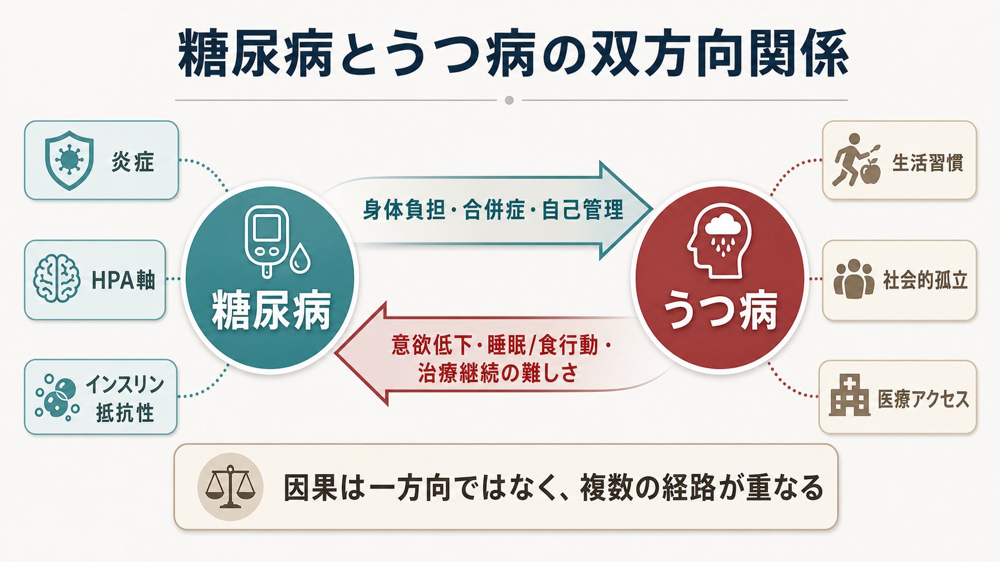
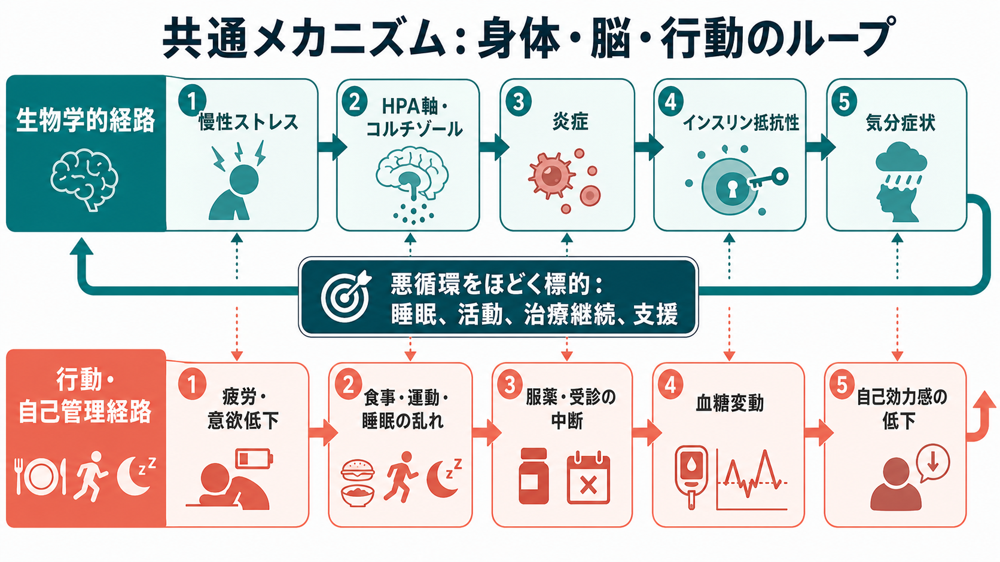
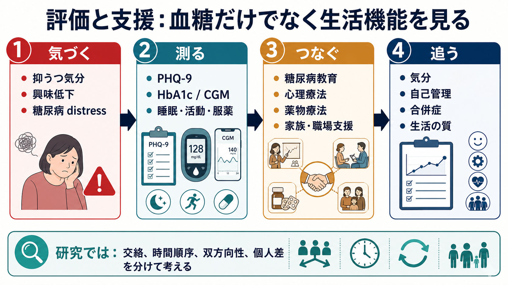

# 糖尿病とうつ病はどう関係するのか

## 要点

- 糖尿病とうつ病は、単に「身体疾患があるから気分が落ち込む」という一方向の関係ではなく、双方向に影響し合う。糖尿病がある人では抑うつ症状が増えやすく、うつ病がある人では2型糖尿病の発症リスクや自己管理の難しさが高まりやすい[1][2]。
- つながりの中心には、血糖値そのものだけでなく、慢性ストレス、睡眠、食行動、身体活動、服薬・受診継続、社会的孤立、合併症への不安がある[3][4]。
- 生物学的には、低度炎症、[[HPA軸は精神疾患にどう関わるのか|HPA軸]]、コルチゾール、インスリン抵抗性、報酬・意欲系の変化が重なりうる[1][5][6]。
- 臨床では、HbA1cだけでなく、[[抑うつ気分とは何か|抑うつ気分]]、興味・喜びの低下、糖尿病 distress、生活機能、自己効力感を一緒に見る必要がある[3][7]。

## この記事で答える問い

1. 糖尿病とうつ病はどの程度、双方向に関係するのか。
2. 気分症状は、血糖管理や合併症リスクにどう影響するのか。
3. 炎症、HPA軸、インスリン抵抗性は、この関係をどう説明するのか。
4. 臨床や研究では、どこを測り、どこに介入すべきか。

## まず結論

糖尿病とうつ病の関係は、「糖尿病が原因でうつ病になる」または「うつ病が原因で糖尿病になる」と単純化しない方がよい。より正確には、身体負担、慢性ストレス、睡眠・食行動・活動量、治療継続、社会的支援、生物学的ストレス反応が、時間をかけて互いに増幅する関係である。

重要なのは、[[大うつ病性障害とは何か|大うつ病性障害]]の有無だけでなく、「糖尿病とともに生活する負担」が気分・行動・身体指標をどう変えているかを見ることである。糖尿病 distress は精神疾患の診断名そのものではないが、自己管理、生活の質、医療者との関係に強く影響しうる[3][7]。

## 背景

糖尿病は、食事、運動、服薬、血糖測定、合併症予防、通院、仕事や家庭生活との調整を長期に求める慢性疾患である。この「毎日続く管理」は、単なる医学的タスクではなく、注意、計画、意欲、希望、対人支援を必要とする。

うつ病では、気分の落ち込み、興味・喜びの低下、疲労、睡眠変化、食欲・体重変化、集中困難、罪悪感、希死念慮などが生活機能を下げる。これらは糖尿病の自己管理に直接関わる。たとえば、疲労と意欲低下は運動や受診を難しくし、睡眠障害と食行動の乱れは血糖変動を大きくし、自己批判は「どうせ改善できない」という感覚を強める。

疫学研究では、糖尿病とうつ病は併存しやすく、双方向の関連が繰り返し示されてきた。あるレビューは、糖尿病のある人ではうつ病が一般集団より多く、うつ病は糖尿病発症や日々の自己管理の困難とも関連すると整理している[1]。一方で、個々の人でどちらが先かは一様ではなく、遺伝、生活環境、肥満、睡眠、薬剤、社会経済的要因などの交絡を慎重に扱う必要がある[2]。

## 基本概念

### 糖尿病とうつ病

糖尿病は、インスリン分泌やインスリン作用の不足により慢性的な高血糖をきたす疾患群である。1型糖尿病、2型糖尿病、妊娠糖尿病、その他の型では背景が異なるが、いずれも生活・治療・合併症予防の継続が重要になる。

うつ病は、単なる気分の落ち込みではなく、気分、意欲、睡眠、食欲、認知、身体感覚、自己評価、希死念慮がまとまって生活機能に影響する状態である。糖尿病との関係を考えるときは、診断基準を満たす大うつ病だけでなく、しきい値下の抑うつ症状も重要である。

### 糖尿病 distress

糖尿病 distress は、血糖管理、合併症不安、食事制限、医療者との関係、家族・職場との調整などから生じる糖尿病特異的な心理的負担を指す。これは[[抑うつ気分とは何か|抑うつ気分]]と重なることがあるが、同じものではない。たとえば「血糖値のことを考え続けて疲れた」「努力しても数値が悪いと責められているように感じる」という体験は、うつ病診断の有無とは別に、糖尿病ケア上の重要な標的になる[3][7]。

## 仕組み

### 1. 自己管理の経路

うつ症状は、糖尿病の自己管理を複数の入り口で難しくする。治療アドヒアランスに関するメタ解析では、うつ症状は糖尿病治療の不遵守と有意に関連し、とくに受診中断や複合的な自己管理指標で関連が目立った[4]。これは「本人の意思が弱い」という話ではなく、うつ病が注意、実行機能、対人接触、希望、疲労感を通じて、日々の行動コストを上げるという話である。

食事、身体活動、服薬、血糖測定、受診は、どれも単発の行動ではなく、毎日・毎週の反復である。[[食欲と体重変化から何がわかるのか|食欲と体重変化]]、睡眠、身体活動が崩れると、血糖変動が大きくなり、血糖変動はさらに疲労感や自己効力感の低下につながる。

### 2. ストレス・HPA軸・炎症の経路

慢性ストレスは、HPA軸と交感神経系を介してコルチゾール、睡眠、食欲、炎症性シグナルに影響する。糖尿病とうつ病の関係を説明するレビューでは、低度炎症、HPA軸の機能変化、代謝ホルモン、行動要因が共通経路として挙げられている[1][5]。これは[[炎症仮説はうつ病をどう説明するのか|炎症仮説]]とも接続する。

ただし、炎症やコルチゾールだけで「糖尿病とうつ病のすべて」を説明できるわけではない。炎症マーカーは集団平均では関連しても、個人診療で単独診断に使えるほど特異的ではない。研究上は、身体活動、肥満、睡眠、感染、薬剤、社会的ストレスを丁寧に分ける必要がある。

### 3. インスリン抵抗性と脳の経路

インスリンは末梢の血糖調節だけでなく、脳内のエネルギー利用、報酬、認知、炎症応答とも関係する。インスリン抵抗性を、2型糖尿病とうつ病にまたがる病態機序として整理するレビューもある[6]。この視点では、代謝の変化は「身体の問題」、気分症状は「心の問題」と分けられず、エネルギー、睡眠、意欲、[[報酬系の異常はうつ病をどう説明するのか|報酬系]]が連続したシステムとして扱われる。

## 図解

| 図 | 読み方 |
|---|---|
| 図1 | 糖尿病とうつ病を左右に置き、身体負担・合併症・自己管理とうつ症状側の意欲低下・睡眠/食行動・治療継続困難が双方向に結ばれることを示す。 |
| 図2 | 生物学的経路と行動・自己管理経路を分け、慢性ストレス、HPA軸、炎症、インスリン抵抗性、自己効力感低下が悪循環を作ることを示す。 |
| 図3 | 臨床では「気づく、測る、つなぐ、追う」という流れで、気分、HbA1c/CGM、睡眠・活動・服薬、生活の質を一緒に扱うことを示す。 |

## 臨床・研究との接続

### 評価では「血糖だけ」を見ない

米国糖尿病学会の Standards of Care は毎年更新される糖尿病診療の包括的ガイドラインであり、2026年版もエビデンスに基づくケア全体を扱っている[8]。心理社会的ケアに関するADAのポジションステートメントは、糖尿病ケアに心理社会的評価と支援を組み込む必要を強調している[3]。

実践上は、PHQ-9のような抑うつ尺度、糖尿病 distress 尺度、HbA1c、CGM、睡眠、活動量、服薬、受診状況、合併症、生活の質を合わせて見る。特に希死念慮、自傷、急激な自己管理中断、重度低血糖・高血糖、摂食障害が疑われる場合は、教育的助言だけで済ませず、身体医療と精神医療を連携させる。

### 介入では「気分だけ」でも「血糖だけ」でも足りない

糖尿病とうつ病が併存する人への協働ケアのメタ解析では、通常ケアに比べてうつ症状の治療反応や生活の質は改善しやすい一方、HbA1cへの効果は研究によって一貫しない[7]。これは、うつ病治療が無意味ということではない。気分、生活機能、治療継続、社会的支援は、それ自体が重要なアウトカムであり、血糖指標とは異なる時間スケールで変化する。

### 研究では時間順序と交絡が鍵になる

横断研究で「糖尿病とうつ病が関連する」と示すだけでは、因果方向は決まらない。うつ症状が先にあり糖尿病リスクを高める場合、糖尿病診断後の負担がうつ症状を高める場合、共通の社会的・生物学的背景が両者を高める場合がある。縦断研究、メンデルランダム化、介入研究、日常生活データを組み合わせて、時間順序と個人差を分けることが課題である[2]。

## よくある誤解

### 「血糖がよくなれば、うつも自然によくなる」

血糖改善が体調や安心感に役立つことはある。しかし、うつ病、糖尿病 distress、孤立、睡眠障害、経済的負担、合併症不安が残れば、気分症状は続くことがある。血糖指標と心理的アウトカムは関連するが、同じものではない。

### 「うつ病だから自己管理できないのは仕方ない」

うつ病は自己管理を難しくするが、そこで終わりではない。行動活性化、睡眠調整、受診しやすい仕組み、薬剤調整、家族・職場支援、糖尿病教育を小さく組み合わせることで、行動コストを下げられる。

### 「糖尿病 distress はうつ病の軽い形である」

糖尿病 distress は、糖尿病に特異的な負担や燃え尽きに近い体験であり、うつ病と重なるが同一ではない。うつ病の診断基準を満たさなくても、糖尿病 distress が強ければケアの焦点になる[3][7]。

## 関連ノート

- [[大うつ病性障害とは何か]]
- [[抑うつ気分とは何か]]
- [[HPA軸は精神疾患にどう関わるのか]]
- [[炎症仮説はうつ病をどう説明するのか]]
- [[報酬系の異常はうつ病をどう説明するのか]]
- [[食欲と体重変化から何がわかるのか]]

## MOC更新候補

- `content/00_MOC/` 配下の精神医学・神経科学と精神疾患・慢性疾患関連MOCに、バッチ統合時に追加候補。
- 糖尿病、慢性疾患管理、糖尿病 distress、身体疾患とうつ病を扱う横断MOCがある場合、本記事を中核ノート候補にする。

## 理解チェック

1. 糖尿病とうつ病の関係を、一方向の因果ではなく双方向のループとして説明するとき、どの行動要因を含めるべきか。
2. 糖尿病 distress と大うつ病性障害は、どこが重なり、どこが異なるか。
3. HPA軸、炎症、インスリン抵抗性は、それぞれどの水準で糖尿病とうつ病をつなぎうるか。
4. 協働ケアがうつ症状を改善してもHbA1cへの効果が一貫しない場合、それをどう解釈すべきか。

## 未解決問題

- 糖尿病の型、罹病期間、合併症、薬物療法、肥満、睡眠、社会経済的要因を分けたうえで、どのサブグループにどの心理社会的介入が最も有効か。
- 炎症、HPA軸、インスリン抵抗性などのバイオマーカーを、個別診療の意思決定にどこまで使えるか。
- CGM、活動量、睡眠、気分記録を組み合わせた日常生活データから、悪循環が強まるタイミングを予測できるか。

## 参考文献

[1] Alzoubi A, Abunaser R, Khassawneh A, Alfaqih M, Khasawneh A, Abdo N. (2018). The Bidirectional Relationship between Diabetes and Depression: A Literature Review. *Korean Journal of Family Medicine*, 39(3), 137-146. https://doi.org/10.4082/kjfm.2018.39.3.137

[2] Schmitz N, Deschenes SS, Burns RJ, et al. (2022). The bidirectional longitudinal association between depressive symptoms and HbA1c: A systematic review and meta-analysis. *Diabetic Medicine*, 39(8), e14842. https://doi.org/10.1111/dme.14842

[3] Young-Hyman D, de Groot M, Hill-Briggs F, Gonzalez JS, Hood K, Peyrot M. (2016). Psychosocial Care for People With Diabetes: A Position Statement of the American Diabetes Association. *Diabetes Care*, 39(12), 2126-2140. https://doi.org/10.2337/dc16-2053

[4] Gonzalez JS, Peyrot M, McCarl LA, et al. (2008). Depression and Diabetes Treatment Nonadherence: A Meta-Analysis. *Diabetes Care*, 31(12), 2398-2403. https://doi.org/10.2337/dc08-1341

[5] Moulton CD, Pickup JC, Ismail K. (2015). The link between depression and diabetes: the search for shared mechanisms. *The Lancet Diabetes & Endocrinology*, 3(6), 461-471. https://doi.org/10.1016/S2213-8587(15)00134-5

[6] Lyra e Silva NM, Lam MP, Soares CN, Munoz DP, Milev R, De Felice FG. (2019). Insulin Resistance as a Shared Pathogenic Mechanism Between Depression and Type 2 Diabetes. *Frontiers in Psychiatry*, 10, 57. https://doi.org/10.3389/fpsyt.2019.00057

[7] Wang Y, Hu M, Zhu D, et al. (2022). Effectiveness of Collaborative Care for Depression and HbA1c in Patients with Depression and Diabetes: A Systematic Review and Meta-Analysis. *International Journal of Integrated Care*, 22(3), 12. https://doi.org/10.5334/ijic.6443

[8] American Diabetes Association. (2025). The American Diabetes Association Releases “Standards of Care in Diabetes--2026”. https://diabetes.org/newsroom/press-releases/american-diabetes-association-releases-standards-care-diabetes-2026
