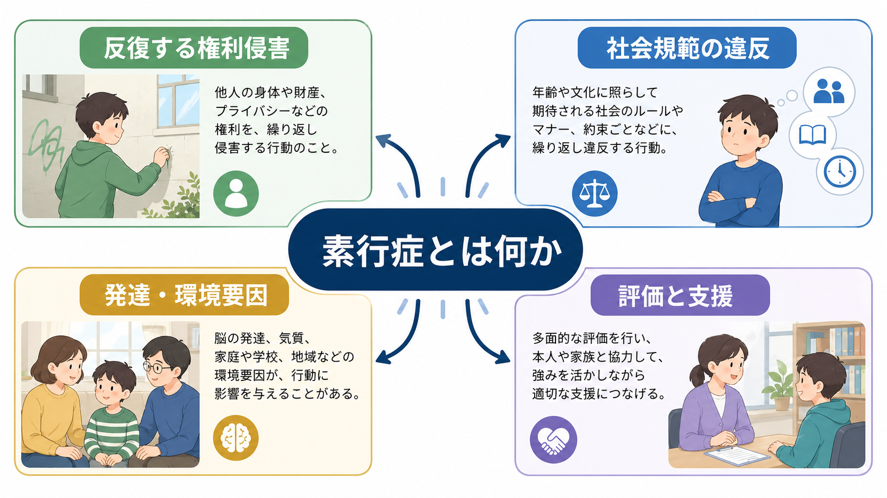
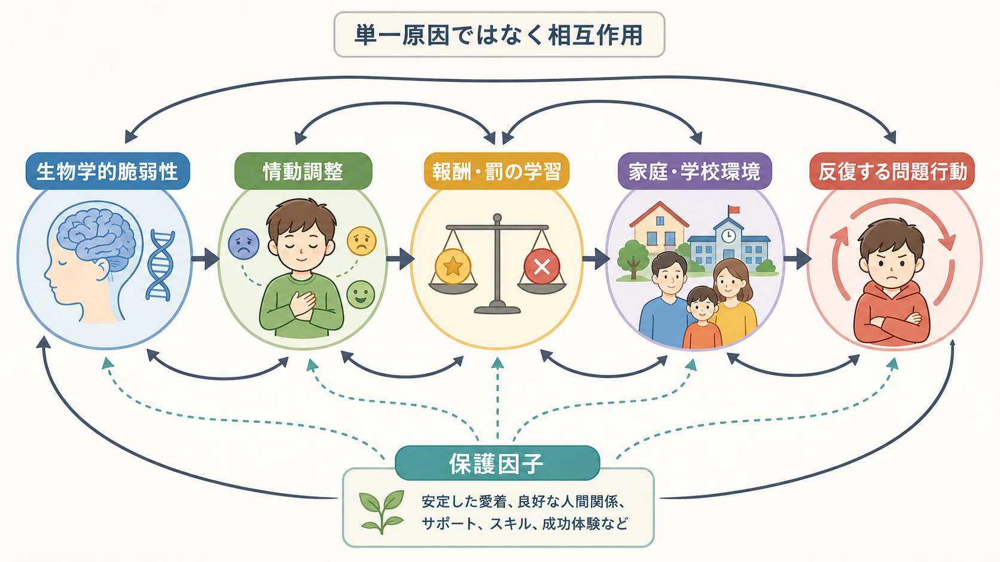
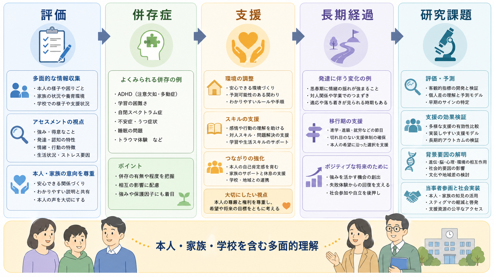

# 素行症とは何か

## 要点

- 素行症は、他者の基本的権利、または年齢相応に期待される主要な社会規範や規則を、反復的・持続的に侵害する行動パターンとして整理される[1][2]。
- 典型的には、対人・動物への攻撃、器物損壊、虚偽や窃盗、重大な規則違反という複数の行動領域から評価する[1]。
- 単なる「悪さ」「反抗期」「家庭のしつけの失敗」ではなく、発達、情動調整、報酬・罰の学習、家庭・学校・地域環境、併存症が絡む多面的な問題である[3][4]。
- 早発型、青年期発症型、向社会的情動の乏しさを伴う群など、経過や支援反応性が異なる下位群を考えることが重要である[4][5]。
- 記述は教育・研究目的であり、個別の子どもや若者を診断したり、処遇や治療方針を断定したりするものではない。

## この記事で答える問い

1. 素行症は、どのような行動パターンを指すのか。
2. 反抗挑戦的な行動、非行、発達特性、トラウマ反応とは何が違うのか。
3. なぜ一部の行動問題は反復し、長期化しやすいのか。
4. 評価と支援では、本人、家族、学校、地域をどのように見ればよいのか。

## まず結論

素行症を理解する中心は、「問題行動のラベル」ではなく、**他者の権利や社会規範を侵害する行動が、どの場面で、どの程度反復し、本人と周囲の生活機能にどんな影響を及ぼしているか**を見ることである。診断分類では行動の型を整理するが、臨床や支援では、併存する[[発達障害群とは何か]]、[[PTSDとは何か]]、[[うつ病とは何か]]、学習困難、家族ストレス、虐待・ネグレクト、学校不適応などを同時に評価する必要がある[3]。

したがって、素行症は「本人が悪いから起こる」という説明では不十分である。もちろん他者への被害や安全確保を軽視してはいけないが、支援の焦点は、責任追及だけでなく、反復を維持している学習、情動、環境、関係性、保護因子を見つけ、再発しにくい条件を作ることにある[3][4]。

## 背景

素行症は、児童青年期の破壊的・衝動制御・行為関連の問題の中で、比較的重い行動パターンを扱う概念である。DSM 系の記述では、少なくとも一定期間にわたり、他者への攻撃、物の破壊、嘘や盗み、重大な規則違反が反復し、社会・学業・職業などの機能障害を伴うことが重視される[1]。ICD-11 でも、素行・反社会的行動を発達段階と文脈の中で評価する分類が置かれている[2]。

重要なのは、行動の「種類」だけではなく、年齢、発達水準、文化的背景、家庭や学校のルール、被害の程度、反復性、生活機能への影響を合わせて見る点である。幼い子どもの一時的なかんしゃく、思春期の境界試し、家庭内だけで見られる反抗、神経発達特性に由来する衝動性は、素行症と重なる部分を持っても同じではない。

## 基本概念

### 中核となる4領域

素行症の行動は、実務上、次の4領域に分けて考えると整理しやすい[1]。

| 領域 | 例 | 評価で見る点 |
|---|---|---|
| 人や動物への攻撃 | 脅し、いじめ、身体的攻撃、残酷な行為 | 被害の深刻さ、反復性、衝動的か計画的か |
| 器物損壊 | 意図的な破壊、放火など | 危険性、目的、怒りや報酬との関係 |
| 虚偽や窃盗 | 嘘、だまし、侵入、盗み | 利得、仲間関係、隠蔽、罪悪感 |
| 重大な規則違反 | 家出、無断外泊、怠学など | 年齢、家庭・学校環境、安全リスク |

この分類は、本人を道徳的に断罪するためではなく、どの行動がどの条件で起こるのかを見取り図にするためのものである。

### 発症年齢と経過

素行症では、発症年齢が経過の理解に役立つ。小児期から攻撃性や規則違反が持続する場合、神経発達上の脆弱性、家庭・学校環境、仲間関係が累積的に絡み、長期化しやすいことがある。一方、青年期に目立つ行動問題は、思春期の自律性、同調、仲間集団、社会的地位の問題と強く結びつくことがある[6]。

ただし、早発型と青年期発症型は機械的な二分法ではない。近年の研究では、衝動性、学業困難、攻撃性、併存症、環境リスクなどを合わせて連続的に評価する必要も指摘されている[7]。

### 向社会的情動の乏しさ

一部の若者では、罪悪感、共感、他者への配慮、成績や役割への関心が乏しい特徴が目立つことがある。DSM-5 以降、このような特徴は「limited prosocial emotions」に関係する指定子として扱われ、臨床像や予後、支援反応性の違いを考える手がかりになる[5]。ただし、この指定子は本人の人格を固定的に決めつけるラベルではなく、複数場面・複数情報源から慎重に評価すべき特徴である。

## 仕組み

素行症の仕組みは、単一原因では説明できない。研究では、遺伝的影響、胎児期・乳幼児期の環境、虐待や不安定な養育、貧困、仲間集団、学校不適応、衝動性、情動認識、報酬・罰への感受性などが相互作用するモデルが検討されている[4]。これは[[発達精神病理学とは何か]]の典型的なテーマでもある。

### 情動調整と脅威認知

怒り、不安、屈辱感、拒絶感が急速に高まり、相手の意図を敵対的に解釈しやすい場合、衝動的な攻撃につながりやすくなる。これは「性格が悪い」というより、感情の立ち上がり、身体反応、注意の向き方、問題解決スキルの組み合わせとして理解できる。[[扁桃体過活動は不安症やPTSDにどう関わるのか]]や[[実行機能は子どもでどのように発達するのか]]とも接続する。

### 報酬・罰の学習

問題行動が、注目、仲間からの承認、物品、刺激、嫌な課題からの逃避と結びつくと、短期的には強化されることがある。逆に、罰が一貫せず、予測不能で、関係性を損なう形で使われると、本人は「何をすればよいか」ではなく「どう隠すか」「どう反撃するか」を学んでしまうことがある[3][4]。

### 神経認知と発達

素行症では、情動処理、共感、報酬に基づく意思決定、実行機能に関わる神経認知的差異が報告されている[4][5]。ただし、脳領域の異常がそのまま個人の行動を決めるわけではない。神経発達上の脆弱性は、[[神経発達の異常は精神疾患にどう関わるのか]]、[[ADHDは前頭線条体回路の障害として説明できるのか]]、[[養育環境は発達にどう影響するのか]]のような環境・学習過程と相互に働く。

## 図解

3枚の図は、本文全体を次の順序で読む補助として配置している。

1. 全体像: 素行症を「反復する権利侵害」「社会規範の違反」「発達・環境要因」「評価と支援」から見る。
2. メカニズム: 生物学的脆弱性、情動調整、報酬・罰の学習、家庭・学校環境、保護因子の相互作用を見る。
3. 接続図: 評価、併存症、支援、長期経過、研究課題を一続きに見る。

## 臨床・研究との接続

### 評価

NICE ガイドラインは、持続する反社会的行動への懸念がある場合、本人、親・養育者、学校など複数の情報源から評価し、家庭・学校・仲間関係での機能、養育、過去と現在の精神・身体健康、併存症、虐待や搾取、自傷・他害リスクを確認することを推奨している[3]。これは、本人の言い分だけ、保護者の言い分だけ、学校の記録だけで判断しないという意味でも重要である。

### 併存症

素行症では、ADHD、学習困難、自閉スペクトラム特性、抑うつ、PTSD、双極性障害、物質使用などの併存を見落とさないことが大切である[1][3][4]。たとえば、[[発達障害群とは何か]]や[[PTSDとは何か]]が背景にある場合、同じ「規則違反」に見える行動でも、必要な支援は大きく変わる。

### 支援

支援の中心は、罰を強めることではなく、行動が起こる条件を評価し、予測可能で一貫した環境、親・養育者支援、感情理解、問題解決、対人スキル、学校や地域との連携を組み合わせることである。NICE は、3-11歳では親トレーニング、重症・複雑例では親子トレーニング、養育者への支援など、社会的学習モデルに基づく心理社会的介入を推奨している[3]。

薬物療法は素行症そのものを単純に「治す」ものとして理解すべきではない。併存するADHD、気分症状、攻撃性の重症度などに応じて専門的に検討されることはあるが、基本は安全確保と心理社会的介入である[3][4]。

## よくある誤解

### 誤解1: 素行症は「悪い子」の診断である

素行症は道徳的評価ではなく、反復する権利侵害や規則違反が生活機能に及ぼす影響を整理する臨床概念である。被害や安全を軽視せず、同時に本人の発達、環境、併存症、支援可能性を見る必要がある[1][3]。

### 誤解2: 親のしつけだけが原因である

養育環境は重要だが、単独原因ではない。遺伝的脆弱性、神経発達、気質、学校環境、仲間関係、地域資源、社会経済的要因が重なって行動パターンが形成される[4]。親を責めるだけでは、支援同盟を壊し、問題の維持要因を見落とす。

### 誤解3: 厳罰化すれば改善する

安全確保や境界設定は必要だが、罰だけでは新しい行動スキルは増えない。むしろ、予測可能なルール、望ましい行動への強化、感情調整、問題解決、保護者・学校・地域の連携が重要である[3]。

### 誤解4: 素行症は必ず成人の反社会性につながる

小児期発症や向社会的情動の乏しさを伴う場合には長期リスクが高いことがあるが、すべての若者が成人期の反社会的パターンへ進むわけではない[4][6]。経過は、発症年齢、併存症、保護因子、介入、学校・家族・地域の支援によって変わる。

## 関連ノート

- [[発達障害群とは何か]]
- [[ADHDは前頭線条体回路の障害として説明できるのか]]
- [[発達精神病理学とは何か]]
- [[養育環境は発達にどう影響するのか]]
- [[トラウマは発達にどう影響するのか]]
- [[逆境的小児期体験ACEとは何か]]
- [[攻撃行動はどのように生じるのか]]
- [[集団規範とは何か]]
- [[スティグマとは何か]]

### 関連ノート候補

- 反抗挑発症とは何か
- 向社会的情動の乏しさとは何か
- 児童青年期の攻撃性評価とは何か
- 親トレーニングとは何か
- 多システム療法とは何か

### MOC更新候補

- `content/00_MOC/MOC｜精神医学.md`
- `content/00_MOC/MOC｜発達・愛着・社会心理.md`
- `content/00_MOC/MOC｜臨床実践・治療.md`

## 理解チェック

1. 素行症を、単なる「反抗」や「非行」と同一視すると何を見落とすか。
2. 4つの中核領域のうち、評価で特に安全確認が必要になりやすいものはどれか。
3. 早発型と青年期発症型を区別することには、どのような実践的意味があるか。
4. 罰だけではなく、報酬・罰の学習や保護因子を見る必要があるのはなぜか。
5. 併存症やトラウマ歴の評価が、支援方針をどのように変えるか。

## 未解決問題

- 向社会的情動の乏しさを、スティグマを強めずに臨床評価へ組み込む最適な方法は何か。
- 素行症の異質性を、発症年齢、神経認知、環境要因、併存症のどの組み合わせで分類すると支援選択に役立つか。
- 学校、家庭、福祉、医療、司法が関わる場合、本人の権利と安全確保を両立する連携モデルをどう設計するか。
- 文化差、地域差、社会経済的要因を踏まえた予防・早期支援をどのように評価するか。

## 参考文献

[1] Mohan, L., Yilanli, M., & Ray, S. (2023). *Conduct Disorder*. StatPearls, NCBI Bookshelf. https://www.ncbi.nlm.nih.gov/books/NBK470238/

[2] World Health Organization. (2024). *Clinical descriptions and diagnostic requirements for ICD-11 mental, behavioural and neurodevelopmental disorders (CDDR)*. https://www.who.int/publications/i/item/9789240077263

[3] National Institute for Health and Care Excellence. (2013, updated 2017). *Antisocial behaviour and conduct disorders in children and young people: recognition and management* (CG158). https://www.nice.org.uk/guidance/cg158

[4] Fairchild, G., Hawes, D. J., Frick, P. J., Copeland, W. E., Odgers, C. L., Franke, B., Freitag, C. M., & De Brito, S. A. (2019). Conduct disorder. *Nature Reviews Disease Primers, 5*, 43. https://doi.org/10.1038/s41572-019-0095-y

[5] Blair, R. J. R., Leibenluft, E., & Pine, D. S. (2014). Conduct disorder and callous-unemotional traits in youth. *New England Journal of Medicine, 371*(23), 2207-2216. https://doi.org/10.1056/NEJMra1315612

[6] Moffitt, T. E. (1993). Adolescence-limited and life-course-persistent antisocial behavior: A developmental taxonomy. *Psychological Review, 100*(4), 674-701. https://doi.org/10.1037/0033-295X.100.4.674

[7] Halliburton, A. E., Cooper, L. D., Heffer, R. W., & Deater-Deckard, K. (2017). Clinically differentiating life-course-persistent and adolescence-limited conduct problems: Is age-of-onset really enough? *Journal of Abnormal Child Psychology, 45*(5), 949-960. https://pmc.ncbi.nlm.nih.gov/articles/PMC5699469/
