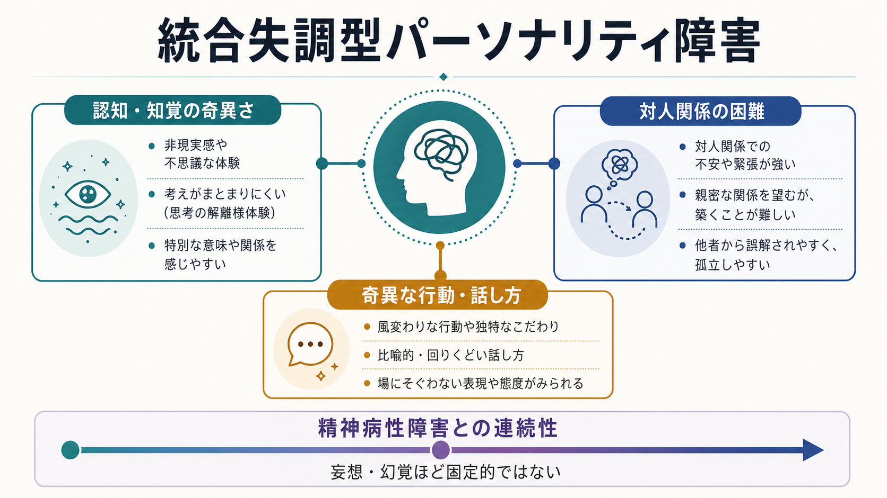
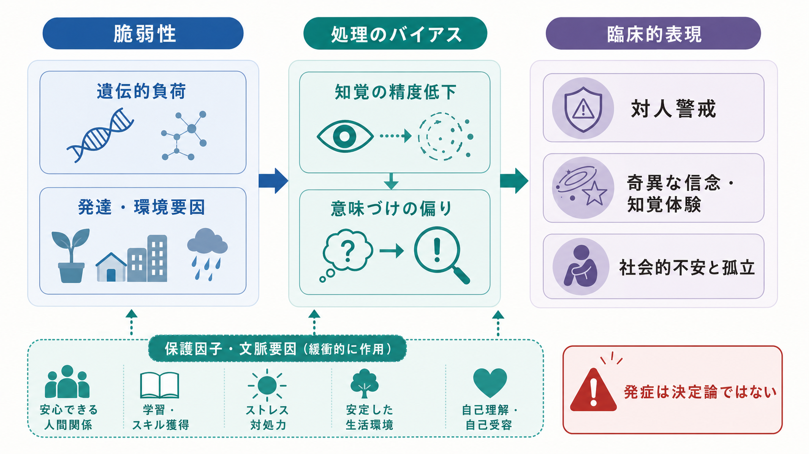
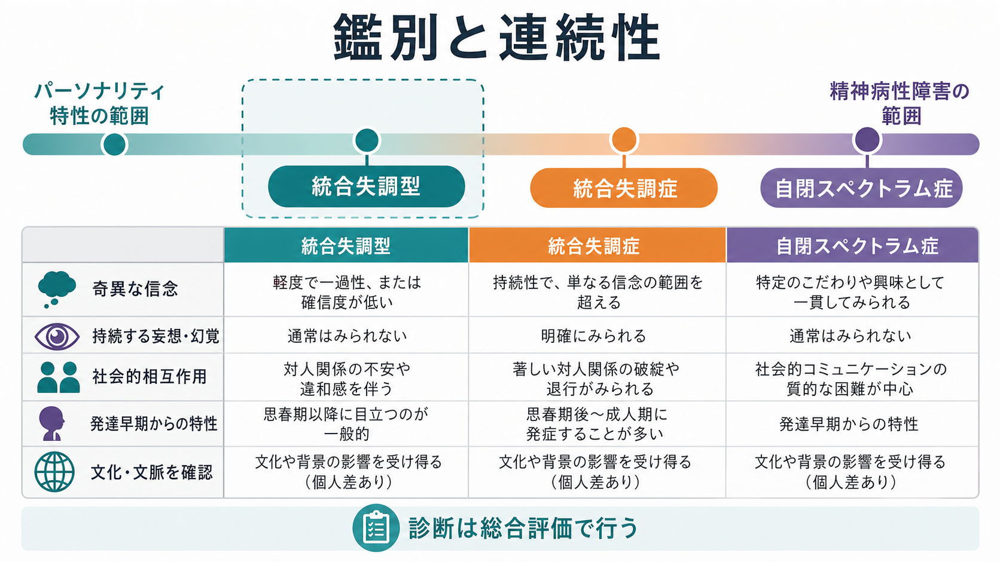

# 統合失調型パーソナリティ障害とは何か

## 要点

- 統合失調型パーソナリティ障害は、親密な対人関係への強い不快感、奇異な信念や[[妄想とは何か|関係念慮]]、通常とは異なる知覚体験、奇異な話し方や行動を長期に示す病態である[1][2]。
- [[統合失調症とは何か]]と連続する側面をもつが、通常は持続的な[[幻覚とは何か]]や固定した[[妄想とは何か]]が診断の中心ではなく、現実検討は比較的保たれる[1][2]。
- 症状は「認知・知覚の奇異さ」「対人関係の困難」「奇異な行動・話し方」という複数次元で捉えると理解しやすい[4][7]。
- 治療・支援では、診断名そのものよりも、対人不安、抑うつ、不安、生活機能、物質使用、ストレス時の一過性精神病症状を丁寧に評価する[3][8]。

## この記事で答える問い

1. 統合失調型パーソナリティ障害は、単なる「変わった性格」と何が違うのか。
2. 統合失調症や[[統合失調症の前駆期とは何か]]とは、どこが連続し、どこが異なるのか。
3. 奇異な信念、知覚体験、対人不安は、どのような仕組みで結びつくのか。
4. 臨床・研究では、どのような評価と支援が重要になるのか。

## まず結論

統合失調型パーソナリティ障害は、「奇異な考えがある人」という単純なラベルではない。中心にあるのは、自己と他者、出来事と意味、知覚と解釈の結びつきが独特になり、その結果として対人関係・学業・仕事・日常生活に持続的な困難が生じることである[1][2]。

たとえば、偶然の出来事を「自分に向けられたサイン」と受け取りやすい、身体感覚や気配を通常とは異なる形で体験する、話が比喩的・迂遠になりやすい、他者への警戒が強く親しくなるほど不安が下がりにくい、といった特徴が組み合わさる。これらは[[統合失調症の陽性症状とは何か|陽性症状]]に似て見えることがあるが、典型的には統合失調症ほど持続的・固定的・生活全体を圧倒する形ではない[1][5]。

## 背景

DSM 系の診断では、統合失調型パーソナリティ障害はパーソナリティ障害として位置づけられる。一方で、DSM-5 以降は統合失調症スペクトラムの一部としても扱われ、ICD-11 では「Schizotypal disorder」が一次性精神病性障害群の下に置かれている[1][2]。この二重の位置づけは、病態を理解するうえで重要である。

つまり、これは「性格の問題」だけでも、「軽い統合失調症」だけでもない。長期的な対人・認知・感情・行動のパターンとして現れる一方で、統合失調症や他の精神病性障害と共有する脆弱性をもつ可能性がある[5][6]。そのため、臨床ではパーソナリティ特性、精神病性症状、発達歴、文化的背景、生活機能を同時に見る必要がある。

## 基本概念

DSM-5 系の記述では、統合失調型パーソナリティ障害は、親密な関係への不快感と能力低下、認知・知覚の歪み、行動の奇異さが成人早期から幅広い場面で持続する状態として整理される。代表的な特徴には、関係念慮、魔術的思考、通常とは異なる知覚体験、奇異な思考や話し方、疑い深さ、感情表出の不適切さや乏しさ、奇異な外見・行動、親しい友人の少なさ、慣れても軽くなりにくい対人不安が含まれる[1][4]。

ICD-11 では、数年以上にわたる行動・外見・話し方の奇異さ、認知・知覚の歪み、通常とは異なる信念、対人関係への不快感と能力低下が中核とされる。妄想様観念や幻覚様体験が起こることはあるが、統合失調症、統合失調感情障害、妄想性障害の診断要件を満たす強度や持続性ではない、という点が強調される[2]。

| 領域 | 具体例 | 見落としやすい点 |
|---|---|---|
| 認知・知覚 | 関係念慮、魔術的思考、身体錯覚、気配感 | 文化的信念や宗教的実践との区別が必要 |
| 対人関係 | 親しい友人が少ない、強い対人不安、疑い深さ | 単なる内向性や人見知りとは限らない |
| 行動・表現 | 奇異な服装、話の迂遠さ、比喩的表現 | 周囲の誤解や孤立を強めることがある |
| 鑑別 | 統合失調症、気分障害、自閉スペクトラム症、物質使用 | 症状の持続性、発症時期、現実検討をみる |

## 仕組み

統合失調型パーソナリティ障害の仕組みは、単一の原因で説明できない。レビュー研究では、統合失調症スペクトラムと共有される神経発達的脆弱性、前頭葉・側頭葉系の機能、注意・作業記憶・社会認知の困難、ドパミン系や他の神経伝達系の関与が検討されてきた[5][6]。

重要なのは、脆弱性があることと、統合失調症を発症することは同じではないという点である。統合失調型の人では、認知・社会機能の困難がみられる一方、代償的な脳機能や保護因子により、明確な精神病状態に至りにくい場合があるというモデルが提案されている[5][6]。

もう一つの見方は、統合失調型を「特性次元」として捉えることである。統合失調型傾向は、陽性次元、陰性次元、解体次元に分けて考えられることが多い。陽性次元は奇異な信念や知覚体験、疑い深さ、陰性次元は快感低下や社会的引きこもり、解体次元は思考・発話・感情表出のまとまりにくさと関係する[7]。この次元的な理解は、診断名の有無だけでなく、どの困難が生活を制限しているかを見るうえで有用である。

## 図解

3枚の図は、それぞれ別の読み方を想定している。1枚目は全体像であり、認知・知覚、対人関係、行動・話し方を三つの入口として示している。2枚目は、脆弱性、情報処理の偏り、対人警戒、奇異な信念・知覚体験が直線的ではなく相互作用することを示す。3枚目は、統合失調型、統合失調症、自閉スペクトラム症を混同しないための比較図である。

## 臨床・研究との接続

臨床評価では、本人の語る奇異な体験をすぐに否定したり、逆に診断名へ急いで当てはめたりしないことが重要である。確認すべきなのは、体験の確信度、持続時間、苦痛、生活機能への影響、現実検討、文化的背景、薬物・身体疾患・睡眠・気分症状の影響である[1][3]。

支援では、信頼関係を作りながら、対人不安、抑うつ、不安、孤立、就学・就労上の困難を扱う。心理療法では、否定的・被害的な解釈の検討、社会的スキル、ストレス対処、生活リズムの安定が焦点になりやすい[3]。薬物療法は診断名そのものを「治す」ものではなく、不安・抑うつ・一過性の精神病様症状など、具体的な標的症状に応じて慎重に考える領域である[3]。

精神病リスクとの接続では、[[統合失調症の前駆期とは何か]]や臨床的高リスク状態との区別が重要になる。統合失調型の特徴が長期的に存在しても、それだけで統合失調症へ進行すると決まるわけではない。NICE の精神病・統合失調症ガイドラインも、早期認識、回復志向、身体健康、家族・支援者への支援を含む包括的なケアを重視している[8]。

研究では、統合失調型は「診断カテゴリ」だけでなく、精神病性体験の連続性、社会認知、予測処理、ストレス反応性、発達的脆弱性を調べるための重要な窓になる[5][7]。ただし、統合失調型傾向が高いことは、将来の発症を一対一で予測するものではない。個別のリスク評価には、症状の強度、機能低下、家族歴、物質使用、外傷体験、支援環境を合わせて見る必要がある。

## よくある誤解

### 誤解1: 「奇妙な人」という性格評価である

統合失調型パーソナリティ障害は、周囲から見た印象だけで決まるものではない。本人の認知・知覚体験、対人不安、生活機能、苦痛、発達歴を含む臨床的評価が必要である[1][2]。

### 誤解2: 統合失調症の軽症版である

統合失調症と連続性はあるが、同じ病態の単なる軽症版ではない。統合失調型では、奇異な信念や知覚体験があっても、持続的な妄想・幻覚、著しい思考解体、精神病エピソードが中心とは限らない[1][5]。

### 誤解3: 対人不安は慣れれば自然に下がる

統合失調型の対人不安は、単なる「慣れ」の問題ではなく、他者の意図を被害的に読みやすいことや、曖昧な社会的手がかりへの警戒と結びつくことがある[1][4]。そのため、安全な関係づくりと解釈の幅を増やす支援が必要になる。

### 誤解4: 診断名がつけば治療方針が自動的に決まる

実際には、主訴が不安なのか、抑うつなのか、孤立なのか、一過性の精神病様症状なのかで支援は変わる。診断名は出発点であり、支援計画は本人の困りごとと機能評価に基づいて組み立てる。

## 関連ノート

- [[統合失調症とは何か]]
- [[統合失調症の前駆期とは何か]]
- [[統合失調症の陽性症状とは何か]]
- [[妄想とは何か]]
- [[幻覚とは何か]]
- [[不安とは何か]]
- [[回避行動とは何か]]

### 関連ノート候補

- パーソナリティ障害とは何か
- 自閉スペクトラム症とは何か
- 社会不安障害とは何か
- 関係念慮とは何か
- 魔術的思考とは何か

### MOC更新候補

- `content/00_MOC/MOC｜精神医学.md`
- `content/00_MOC/MOC｜神経科学と精神疾患.md`
- `content/00_MOC/MOC｜症候学.md`

## 理解チェック

1. 統合失調型パーソナリティ障害で、奇異な信念や知覚体験があっても統合失調症と同一視できない理由は何か。
2. 対人不安が「慣れにくい」場合、どのような認知・対人過程が関係しうるか。
3. 陽性次元、陰性次元、解体次元に分けて考えると、支援計画はどのように具体化しやすくなるか。
4. 文化的背景や発達歴を確認せずに診断することには、どのようなリスクがあるか。

## 参考文献

[1] Puri, P., & Venkatesh, A. (2024). *Schizotypal Personality Disorder*. StatPearls. National Center for Biotechnology Information. https://www.ncbi.nlm.nih.gov/books/NBK603720/

[2] World Health Organization. (2025). *ICD-11 for Mortality and Morbidity Statistics: 6A22 Schizotypal disorder*. https://icd.who.int/browse/2025-01/mms/en

[3] Mayo Clinic. (2024). *Schizotypal personality disorder: Symptoms and causes; Diagnosis and treatment*. https://www.mayoclinic.org/diseases-conditions/schizotypal-personality-disorder/symptoms-causes/syc-20353919

[4] Rosell, D. R., Futterman, S. E., McMaster, A., & Siever, L. J. (2014). Schizotypal personality disorder: A current review. *Current Psychiatry Reports, 16*, 452. https://pmc.ncbi.nlm.nih.gov/articles/PMC4182925/

[5] Siever, L. J., & Davis, K. L. (2004). The pathophysiology of schizophrenia disorders: Perspectives from the spectrum. *American Journal of Psychiatry, 161*(3), 398-413. https://doi.org/10.1176/appi.ajp.161.3.398

[6] Chemerinski, E., Triebwasser, J., Roussos, P., & Siever, L. J. (2013). Schizotypal personality disorder. *Journal of Personality Disorders, 27*(5), 652-679. https://doi.org/10.1521/pedi_2012_26_053

[7] Kwapil, T. R., & Barrantes-Vidal, N. (2015). Schizotypy: Looking back and moving forward. *Schizophrenia Bulletin, 41*(suppl_2), S366-S373. https://pmc.ncbi.nlm.nih.gov/articles/PMC4373633/

[8] National Institute for Health and Care Excellence. (2014, updated 2025). *Psychosis and schizophrenia in adults: prevention and management* (CG178). https://www.nice.org.uk/guidance/cg178

## 未解決問題

- 統合失調型パーソナリティ障害から精神病性障害へ移行する人としない人を分ける保護因子は、どこまで個別に評価できるのか。
- 統合失調型の陽性・陰性・解体次元に対して、どの心理社会的介入が最も有効なのか。
- 文化的に共有された信念、宗教的体験、創造性、精神病性体験をどのように丁寧に区別するべきか。
