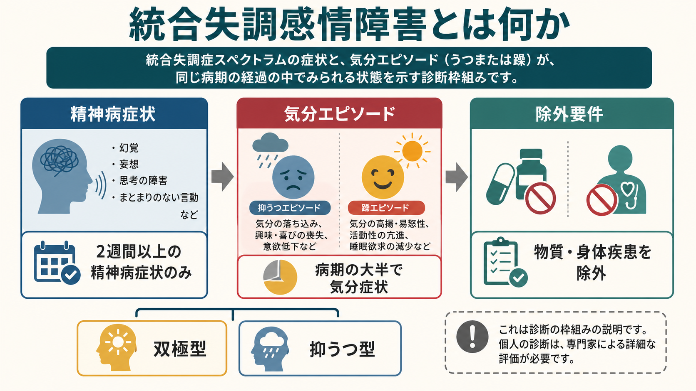
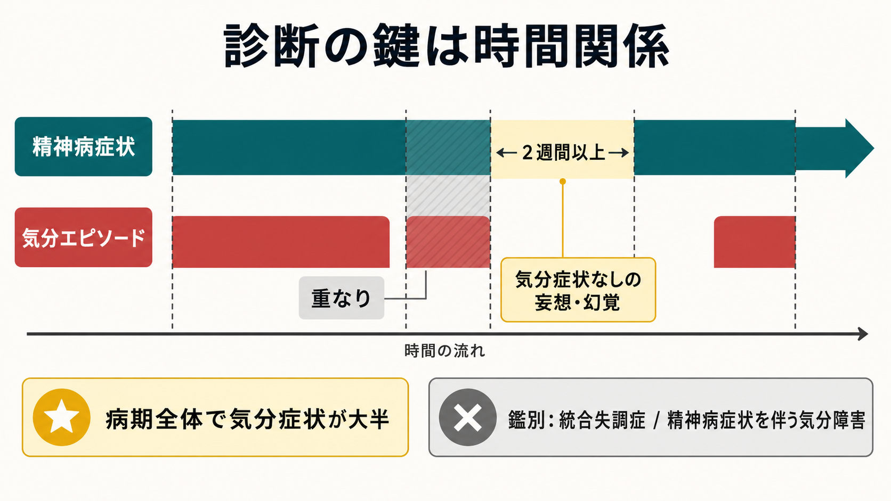

# 統合失調感情障害とは何か

## 要点

- 統合失調感情障害は、[[統合失調症とは何か]]にみられる精神病症状と、うつ病エピソードまたは躁病エピソードが、同じ病期の中で重要な割合を占める診断カテゴリである [1][2]。
- DSM-5-TR では、気分エピソードがない時期にも妄想・幻覚が2週間以上続くこと、かつ気分エピソードが病期全体の大半を占めることが診断の鍵になる [1][3]。
- 精神病症状が気分エピソードの時期だけに限られる場合は、精神病症状を伴う気分障害を考える。反対に、気分症状が病期の一部にとどまる場合は統合失調症側に近づく [1][4]。
- 診断の信頼性と安定性には課題があり、単に「統合失調症とうつ病・躁病が両方ある」という足し算ではなく、症状の時間経過を丁寧に確認する必要がある [3][4]。
- 本記事は教育・研究目的の概説であり、個別の診断や治療方針を決めるものではない。

## この記事で答える問い

1. 統合失調感情障害は、統合失調症や気分障害とどこが違うのか。
2. 診断でなぜ「2週間以上」「病期の大半」という時間関係が重視されるのか。
3. 臨床評価・治療・研究では、どのような注意点があるのか。

## まず結論

統合失調感情障害は、「精神病症状」と「気分エピソード」が併存するだけでは診断できない。DSM-5-TR の考え方では、まず統合失調症の中核症状に相当する妄想、幻覚、まとまりのない発話、まとまりのない行動、陰性症状などがあり、同じ連続した病期の中で大うつ病エピソードまたは躁病エピソードも認められる必要がある [1]。そのうえで、気分エピソードがない時期にも妄想・幻覚が少なくとも2週間続くこと、気分エピソードが病気の活動期・残遺期の大半を占めることが重要になる [1][3]。

このため、統合失調感情障害は「症状の種類」だけでなく「症状がいつ、どれくらい、どの組み合わせで現れたか」を見る診断である。診断面接では、本人の現在の訴えだけでなく、過去の病期、家族・支援者からの情報、診療録、物質使用、身体疾患、薬剤の影響を合わせて検討する [1][5]。

## 背景

精神病症状と気分症状は、実際の臨床ではしばしば重なって現れる。統合失調症の経過中に抑うつが目立つこともあれば、双極性障害やうつ病の重いエピソードで妄想・幻覚が出ることもある [2][4]。この重なりをどのように分類するかは、精神医学の診断体系にとって長く難しい問題だった。

DSM-5 以降の整理では、統合失調感情障害は一時点のエピソード名というより、発症から現在までの病期全体を見て判断する方向へ移った。これは、以前の基準で診断の信頼性や安定性が低く、過剰に診断されやすいという問題があったためである [3]。

一方、ICD-11 では、同じ病気のエピソード内で統合失調症の診断要件と、躁病・混合・中等症以上の抑うつエピソードの診断要件が同時または数日以内に満たされ、症状が少なくとも1か月続くものとして説明される [2]。したがって、[[DSMとICDは何が違うのか]]という観点から見ると、DSM は病期全体における時間割合をより強く意識し、ICD-11 はエピソード内での併存を重視する、と整理できる。

## 基本概念

### 精神病症状

ここでいう精神病症状は、主に妄想、幻覚、まとまりのない発話、まとまりのない行動、陰性症状などを指す [1]。[[統合失調症の陽性症状とは何か]]で扱う妄想・幻覚は特に重要で、DSM-5-TR の統合失調感情障害では「気分エピソードがない時期にも妄想・幻覚が2週間以上ある」ことが境界を決める手がかりになる [1][3]。

### 気分エピソード

気分エピソードには、大うつ病エピソードと躁病エピソードが含まれる。抑うつ型では大うつ病エピソードのみが中心になり、双極型では躁病エピソードが含まれ、しばしば抑うつエピソードも伴う [1][5]。大うつ病エピソードとして数えるには、DSM-5-TR では抑うつ気分を含む必要がある [1]。

気分症状があること自体は、統合失調感情障害に特異的ではない。たとえば[[うつ病とは何か]]の重症エピソードでも妄想が現れることがあり、双極性障害の躁病エピソードでも精神病症状が出ることがある。統合失調感情障害では、気分エピソードの外側にも精神病症状が続く点が重要である [1][5]。

## 仕組み

統合失調感情障害の「単一の原因」や特異的な病態生理は確立していない [1]。むしろ、統合失調症スペクトラム、双極性障害、うつ病、遺伝的脆弱性、ストレス、物質使用、発達歴、社会的支援などが重なり合う臨床カテゴリとして扱うほうが実際的である [1][6]。

神経生物学的には、ドーパミン、セロトニン、ノルアドレナリンなどの神経伝達、白質や海馬・視床を含む脳構造の違いが報告されているが、診断を確定できるバイオマーカーは一般臨床にはない [1]。そのため、診断は画像検査や血液検査だけで決まるのではなく、病歴、精神状態診察、経過観察、身体疾患・薬剤・物質使用の除外を組み合わせて行われる [1][5]。

## 図解

1枚目の図は、統合失調感情障害を「精神病症状」「気分エピソード」「除外要件」の3つから見る概念地図である。特に、双極型と抑うつ型の違いは、躁病エピソードが含まれるかどうかで整理できる [1][5]。

2枚目の図は、診断上もっとも重要な時間関係を示している。精神病症状と気分エピソードが重なるだけなら、精神病症状を伴う気分障害でも説明できる。統合失調感情障害では、気分症状がない時期にも妄想・幻覚が2週間以上続く一方で、病期全体としては気分エピソードが大半を占める、という二重の条件が問題になる [1][3]。

## 臨床・研究との接続

### 評価

評価では、現在の症状だけでなく、発症時期、精神病症状と気分症状の出現順序、各エピソードの期間、寛解期、服薬歴、物質使用、身体疾患、家族歴、自傷他害リスク、生活機能を確認する [1][5]。症状が急性期に強い場合、本人の記憶や説明だけでは時間関係が不明確なことがあるため、家族・支援者・過去の診療情報が重要になる。

### 治療と支援

治療は診断名だけで機械的に決まるものではないが、一般に抗精神病薬、気分安定薬、抗うつ薬、心理社会的支援、生活技能支援、家族支援、就労・就学支援を症状とリスクに応じて組み合わせる [1][5][7]。急性期に自傷他害リスク、著しい生活機能低下、セルフケア困難がある場合には、安全確保と集中的治療が優先される [1][5]。

### 研究

研究上は、統合失調感情障害を独立した疾患単位として扱うべきか、統合失調症と気分障害の連続体の中で扱うべきかが議論されている [3][4]。診断の信頼性が十分でないと、薬物療法研究、遺伝研究、脳画像研究の対象集団が不均一になり、結果の解釈が難しくなる。そのため、研究では診断名だけでなく、精神病症状、躁症状、抑うつ症状、認知機能、生活機能を次元的に測る設計が重要になる。

## よくある誤解

### 「統合失調症とうつ病が両方あれば統合失調感情障害である」

そうではない。重いうつ病や双極性障害では精神病症状が出ることがあり、統合失調症の経過中にも抑うつ症状が目立つことがある。統合失調感情障害では、気分エピソードの外側にある精神病症状と、病期全体に占める気分エピソードの割合を確認する [1][3]。

### 「診断名が決まれば治療も一つに決まる」

診断名は治療方針の出発点だが、十分条件ではない。実際には、幻覚・妄想、躁症状、抑うつ症状、不眠、不安、物質使用、身体合併症、自殺リスク、家族・就労・生活支援の必要性を分けて評価し、治療を組み合わせる [1][5][7]。

### 「画像検査で確定できる」

現時点では、統合失調感情障害を単独で確定する臨床バイオマーカーはない。検査は、身体疾患、神経疾患、薬剤・物質の影響を除外するために使われることが多い [1][5]。

## 関連ノート

- [[統合失調症とは何か]]
- [[統合失調症の陽性症状とは何か]]
- [[うつ病とは何か]]
- [[双極性障害は情動ネットワークの異常として説明できるのか]]
- [[妄想性障害とは何か]]
- [[急性一過性精神病性障害とは何か]]
- [[短期精神病性障害とは何か]]
- [[DSMとICDは何が違うのか]]

## MOC更新候補

- `content/00_MOC/` 配下の精神医学・精神病性障害・気分障害関連 MOC に、本記事へのリンクを追加する候補。
- 並列生成ジョブとの競合を避けるため、本記事作成時点では MOC 本体は更新しない。

## 理解チェック

1. 統合失調感情障害と「精神病症状を伴う気分障害」を分ける時間関係は何か。
2. DSM-5-TR で「病期の大半に気分エピソードがある」ことが重視されるのはなぜか。
3. 統合失調症との鑑別で、気分症状の期間と精神病症状の期間をどのように比べるか。
4. 診断を急がず、身体疾患・薬剤・物質使用を確認する理由は何か。

## 未解決問題

- 統合失調感情障害が独立した疾患単位なのか、精神病症状と気分症状の連続体上の一領域なのかは、なお議論がある [3][4]。
- 診断を安定させる生物学的指標や予後予測指標は十分に確立していない [1][4]。
- 治療研究では、双極型と抑うつ型、併存症、生活機能、認知機能を分けて検討する必要がある。

## 参考文献

[1] Wy, T. J. P., & Saadabadi, A. (2023). Schizoaffective Disorder. *StatPearls*. NCBI Bookshelf. https://www.ncbi.nlm.nih.gov/books/NBK541012/

[2] World Health Organization. (2025). ICD-11 for Mortality and Morbidity Statistics: 6A21 Schizoaffective disorder. https://icd.who.int/browse/2025-01/mms/en#106339515

[3] Malaspina, D., Owen, M. J., Heckers, S., et al. (2013). Schizoaffective Disorder in the DSM-5. *Schizophrenia Research*, 150(1), 21-25. https://doi.org/10.1016/j.schres.2013.04.026

[4] Wilson, J. E., Nian, H., & Heckers, S. (2014). The schizoaffective disorder diagnosis: a conundrum in the clinical setting. *European Archives of Psychiatry and Clinical Neuroscience*, 264(1), 29-34. https://doi.org/10.1007/s00406-013-0410-7

[5] Mayo Clinic. (2024). Schizoaffective disorder: Symptoms and causes; Diagnosis and treatment. https://www.mayoclinic.org/diseases-conditions/schizoaffective-disorder/symptoms-causes/syc-20354504

[6] Cardno, A. G., & Owen, M. J. (2014). Genetic relationships between schizophrenia, bipolar disorder, and schizoaffective disorder. *Schizophrenia Bulletin*, 40(3), 504-515. https://doi.org/10.1093/schbul/sbu016

[7] National Institute for Health and Care Excellence. (2014). Psychosis and schizophrenia in adults: prevention and management. NCBI Bookshelf. https://www.ncbi.nlm.nih.gov/books/NBK555203/
