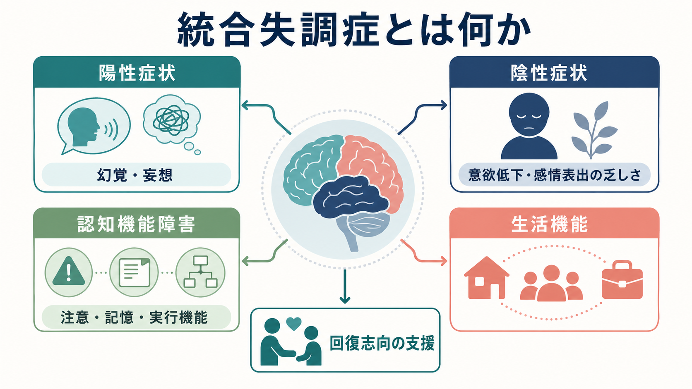
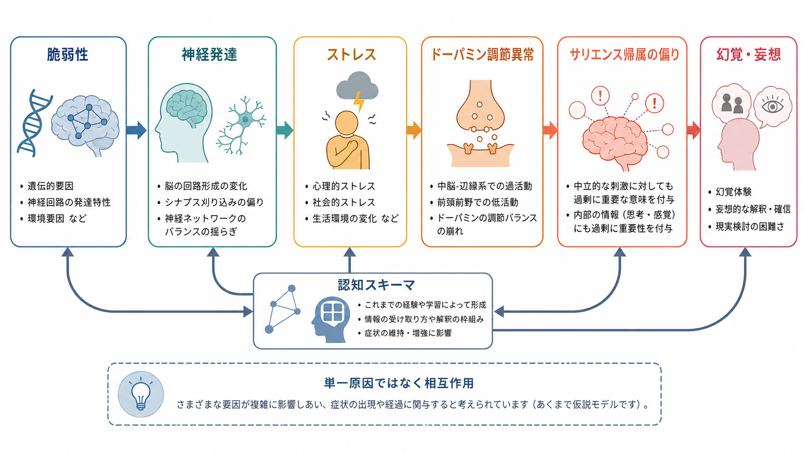
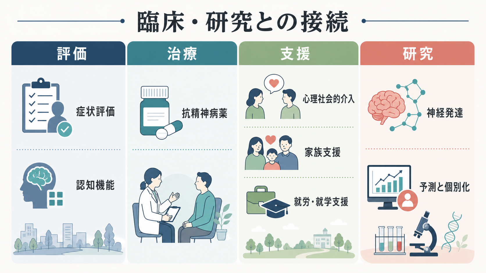

# 統合失調症とは何か

## 要点

- 統合失調症は、[[幻覚とは何か]]や[[妄想とは何か]]だけで定義される病気ではなく、陰性症状、[[認知機能障害とは何か]]、自己体験の変化、行動のまとまりにくさ、生活機能の低下を含む代表的な精神病性障害である[1][2][3]。
- 発症は思春期後期から若年成人期に多いが、背景には神経発達、遺伝的脆弱性、環境要因、ストレス、社会的逆境が複雑に関与すると考えられている[1][4][5]。
- 抗精神病薬は陽性症状や再発予防に重要だが、陰性症状や認知機能障害、社会機能の回復には心理社会的支援、家族支援、身体健康管理、就労・就学支援を組み合わせる必要がある[1][2][8]。
- 研究上は、[[ドパミン仮説は統合失調症をどこまで説明できるのか]]、[[グルタミン酸仮説は統合失調症をどう説明するのか]]、神経発達、サリエンス帰属、予測処理、認知機能障害をつなぐ多層的モデルとして理解されつつある[4][5][6]。

## この記事で答える問い

1. 統合失調症は「幻覚・妄想の病気」とだけ理解してよいのか。
2. 陰性症状や認知機能障害は、なぜ診断・生活機能・支援にとって重要なのか。
3. 神経発達、ドーパミン、グルタミン酸、認知モデルはどのように接続できるのか。
4. 臨床では、薬物療法だけでなく何を評価し、何を支援する必要があるのか。

## まず結論

統合失調症とは、現実検討の障害として現れる陽性症状だけでなく、意欲・感情表出・社会的関心の低下、注意・記憶・実行機能などの認知機能障害、自己と外界の境界感の変化、社会生活上の困難を含む多面的な疾患概念である[1][2][3]。そのため、理解の中心は「奇異な症状があるか」ではなく、「本人の知覚、思考、感情、意欲、認知、関係性、生活機能がどのように変化しているか」に置く必要がある。

同時に、統合失調症は単一の原因で説明できない。遺伝的脆弱性、胎生期・周産期要因、神経発達、感染・免疫、カンナビス使用、心理社会的ストレスなどが相互作用し、発症や経過に関わると考えられている[1][4]。ドーパミン異常は特に陽性症状と関連する重要な経路だが、陰性症状や認知機能障害まで十分に説明するには、グルタミン酸・GABA系、神経発達、認知スキーマ、社会環境を含むモデルが必要になる[4][5][6]。

## 背景

WHO は、統合失調症が個人・家族・社会・教育・職業機能に大きな影響を与えうる一方、効果的なケアの選択肢が存在し、回復可能性をもつ疾患であると整理している[1]。NIMH も、統合失調症を思考、知覚、感情反応、社会的相互作用の障害として説明し、症状を精神病症状、陰性症状、認知症状に分けている[2]。

この整理が重要なのは、統合失調症への一般的イメージがしばしば陽性症状に偏るからである。たとえば[[幻覚とは何か]]や[[被害妄想とは何か]]は目立ちやすいが、本人の学業・仕事・対人関係を長期的に制約するのは、陰性症状や認知機能障害であることも多い[2][7]。したがって、臨床評価では症状の有無だけでなく、持続期間、機能低下、物質・身体疾患・気分障害との鑑別、本人の生活上の困りごとを同時に評価する。

## 基本概念

ICD-11 では、統合失調症は思考、知覚、自己体験、認知、意欲、感情、行動など複数の精神機能にまたがる障害として記述され、持続する妄想、持続する幻覚、思考形式の障害、影響・受動・支配体験などが中核症状とされる[3]。診断は教育・研究上の分類であり、個別の診断や治療方針は専門家による包括的評価に基づく。

| 領域 | 例 | 見落としやすい点 |
|---|---|---|
| 陽性症状 | [[幻覚とは何か]]、[[妄想とは何か]]、思考のまとまりにくさ | 急性期には目立つが、症状の意味づけや苦痛は人により異なる |
| 陰性症状 | 意欲低下、快感消失、会話量の減少、感情表出の乏しさ、社会的引きこもり | 怠け、性格、うつだけと誤解されやすい |
| 認知機能障害 | 注意、作業記憶、言語記憶、実行機能、社会的認知の困難 | 生活機能や就労・就学に強く関係する[7] |
| 自己体験の変化 | 自分の考えや行為が外部に操作されるような体験 | 妄想だけでなく自己感の変化として理解できる |
| 生活機能 | 学業、仕事、対人関係、セルフケア、身体健康管理 | 症状軽減と機能回復は同じではない |

## 仕組み

統合失調症の仕組みは、単一の神経伝達物質や単一の心理要因では説明しにくい。現在の主要な理解は、複数の層が発症リスクと経過を形づくるというものである[4][5]。

### 神経発達と脆弱性

統合失調症は、発症時点だけの疾患ではなく、神経発達の長い時間軸の上に位置づけられることが多い。遺伝的要因、胎生期・周産期要因、感染・免疫、発達期のストレスや社会的逆境などが、脳回路形成や認知・社会機能の発達に影響し、後の精神病リスクに関わる可能性がある[4][5]。これは「発達のどこかで一つの原因がある」という意味ではなく、多数の小さなリスクが重なり、保護因子とのバランスで経過が変わるという理解である。

### ドーパミンとサリエンス帰属

ドーパミン仮説は、統合失調症、とくに陽性症状を理解するうえで中心的な仮説である。中脳-線条体系のドーパミン調節異常により、本来は中立的な刺激や内的体験に過剰な重要性が付与されると、意味づけの偏りや[[関係妄想とは何か]]、[[被害妄想とは何か]]の形成に関わる可能性がある[5][6]。ただし、ドーパミンだけで陰性症状や認知機能障害を説明することは難しく、抗精神病薬がすべての症状を同程度に改善するわけでもない[4][6]。

### グルタミン酸・GABAと認知機能

近年のレビューでは、皮質の興奮・抑制バランス、すなわちグルタミン酸・GABA系の変化が、ドーパミン系の異常や認知機能障害と接続される可能性が議論されている[4][6]。この観点は、[[GABA機能低下は統合失調症にどう関わるのか]]、[[E_Iバランス異常は精神疾患をどう説明するのか]]、[[精神疾患における機能的結合異常とは何か]]ともつながる。

### 認知スキーマと社会環境

Howes と Murray の統合モデルでは、神経発達上の脆弱性や早期逆境がドーパミン系の感作と認知スキーマの偏りに関与し、その後のストレスがサリエンス帰属の異常と妄想的解釈を増幅する流れが示されている[5]。このモデルは、脳内メカニズムと心理社会的文脈を分けずに考える点で有用である。ただし、これは統合的な説明モデルであり、個々の人の発症を一対一で予測するものではない。

## 図解

上の2枚は、統合失調症の全体像とメカニズム仮説をまとめたものである。1枚目は、陽性症状・陰性症状・認知機能障害・生活機能を並列に置き、「回復志向の支援」を中心に据えている。2枚目は、脆弱性、神経発達、ストレス、ドーパミン調節異常、サリエンス帰属、認知スキーマの相互作用を、単一原因ではない流れとして示している。

3枚目は臨床・研究との接続を整理する図である。評価では症状だけでなく認知機能や身体健康をみる。治療では抗精神病薬だけでなく心理社会的介入を組み合わせる。支援では家族、就労・就学、地域生活を含める。研究では神経発達、予測、個別化が重要な課題になる。

## 臨床・研究との接続

### 評価

評価では、陽性症状、陰性症状、認知機能障害、気分症状、不安、睡眠、物質使用、身体疾患、服薬状況、社会的支援、リスクを分けて確認する。統合失調症に似た状態は、物質・薬剤、脳器質性疾患、てんかん、せん妄、双極症、うつ病、トラウマ関連症状などでも起こりうるため、鑑別が重要である[3]。

### 治療と支援

NICE は、成人の精神病・統合失調症に対して、早期認識、初回エピソードへの早期介入、急性期治療、長期回復、身体健康問題への対応、家族・介護者支援を含む包括的管理を推奨している[8]。NIMH も、抗精神病薬、心理社会的治療、就学・就労や対人関係の支援を組み合わせることを説明している[2]。ここでの要点は、治療を「症状を消すこと」だけに狭めず、本人が望む生活機能と社会参加を支えることである。

### 研究

研究では、診断カテゴリーだけでなく、症状次元、認知機能、神経発達、神経回路、炎症・免疫、遺伝、環境要因を横断的に扱う必要がある。統合失調症は異質性が高く、現時点で臨床診断を確定できる単独のバイオマーカーは一般診療には存在しない[4]。そのため、研究の課題は「統合失調症の単一原因を見つけること」ではなく、どの人にどの症状次元・機能障害・支援ニーズがあり、どの介入が有効かを個別化していくことにある。

## よくある誤解

### 誤解1: 統合失調症は「多重人格」である

統合失調症は、複数の人格が交代する疾患ではない。NIMH も、統合失調症は解離性同一症とは異なると明記している[2]。統合失調症の中心は、現実検討、知覚、思考、意欲、感情、認知、生活機能の変化である。

### 誤解2: 幻覚や妄想がなければ統合失調症ではない

診断上、陽性症状は重要だが、統合失調症の理解はそれだけでは不十分である。陰性症状や認知機能障害は、発症前から目立つ場合もあり、長期的な生活機能に深く関係する[2][7]。

### 誤解3: 統合失調症の人は危険である

多くの人は暴力的ではない。NIMH は、統合失調症の人はむしろ被害を受けやすい側面があり、リスクが高まるのは未治療や物質使用が併存する場合などに限られると説明している[2]。スティグマは受診、就労、住居、社会参加を妨げるため、疾患理解そのものが支援の一部になる。

### 誤解4: 薬だけで十分である

抗精神病薬は重要だが、認知機能障害、陰性症状、身体健康、家族関係、就労・就学、地域生活の課題は薬だけでは解決しにくい。包括的支援が必要である[1][2][8]。

## 関連ノート

- [[幻覚とは何か]]
- [[妄想とは何か]]
- [[被害妄想とは何か]]
- [[関係妄想とは何か]]
- [[認知機能障害とは何か]]
- [[ドパミン仮説は統合失調症をどこまで説明できるのか]]
- [[グルタミン酸仮説は統合失調症をどう説明するのか]]
- [[GABA機能低下は統合失調症にどう関わるのか]]
- [[E_Iバランス異常は精神疾患をどう説明するのか]]
- [[精神疾患における機能的結合異常とは何か]]
- [[脳ネットワークの破綻は精神疾患をどう説明するのか]]
- [[精神疾患の次元的理解とは何か]]

### MOC更新候補

- `content/00_MOC/MOC｜神経科学と精神疾患.md`
- `content/00_MOC/MOC｜認知機能.md`
- 精神医学・精神病性障害に対応する MOC があれば、本記事へのリンクを追加候補とする。

## 理解チェック

1. 統合失調症を陽性症状だけで説明すると、何が抜け落ちるか。
2. 陰性症状とうつ症状は、どのように重なり、どこで区別が必要になるか。
3. 認知機能障害が生活機能に関わるとは、具体的にどのような場面を指すか。
4. ドーパミン仮説は何をよく説明し、何を説明しにくいか。
5. 回復志向の支援では、症状評価以外に何を評価すべきか。

## 未解決問題

- 統合失調症の異質性を、診断カテゴリー、症状次元、バイオマーカー、生活機能のどの単位で整理するのが最も有用か。
- 陰性症状と認知機能障害に対する有効な介入を、どのように個別化できるか。
- 神経発達、ドーパミン、グルタミン酸、炎症・免疫、社会的逆境を、予測可能で臨床応用可能なモデルにどう統合するか。
- 初回精神病エピソード前後の早期介入で、長期的な生活機能をどこまで改善できるか。

## 参考文献

[1] World Health Organization. (2025). *Schizophrenia*. https://www.who.int/news-room/fact-sheets/detail/schizophrenia

[2] National Institute of Mental Health. (n.d.). *Schizophrenia*. https://www.nimh.nih.gov/health/publications/schizophrenia

[3] World Health Organization. (2026). *ICD-11 MMS: 6A20 Schizophrenia*. https://icd.who.int/browse/latest-release/mms/en#1683919430

[4] Leucht, S., Siafis, S., McGrath, J. J., McGorry, P., Howes, O. D., Tamminga, C., et al. (2025). Schizophrenia. *Nature Reviews Disease Primers, 11*, 83. https://doi.org/10.1038/s41572-025-00667-6

[5] Howes, O. D., & Murray, R. M. (2014). Schizophrenia: an integrated sociodevelopmental-cognitive model. *The Lancet, 383*(9929), 1677-1687. https://doi.org/10.1016/S0140-6736(13)62036-X

[6] McCutcheon, R. A., Krystal, J. H., & Howes, O. D. (2020). Dopamine and glutamate in schizophrenia: biology, symptoms and treatment. *World Psychiatry, 19*(1), 15-33. https://doi.org/10.1002/wps.20693

[7] Green, M. F., Kern, R. S., Braff, D. L., & Mintz, J. (2000). Neurocognitive deficits and functional outcome in schizophrenia: are we measuring the "right stuff"? *Schizophrenia Bulletin, 26*(1), 119-136. https://doi.org/10.1093/oxfordjournals.schbul.a033430

[8] National Institute for Health and Care Excellence. (2014, reviewed 2025). *Psychosis and schizophrenia in adults: prevention and management (CG178)*. https://www.nice.org.uk/Guidance/CG178
