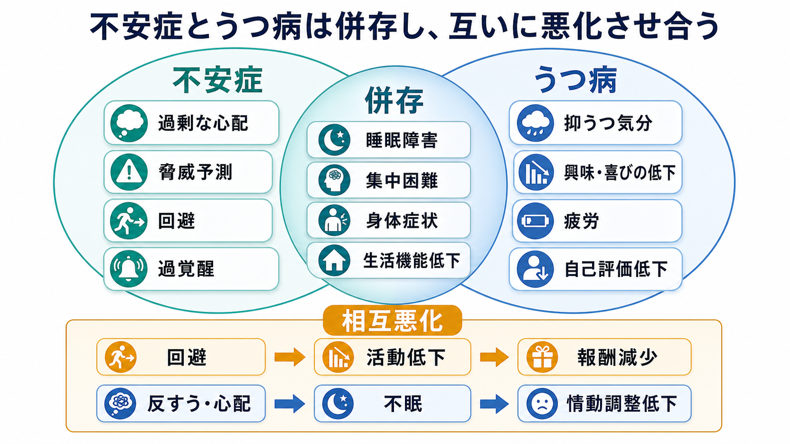
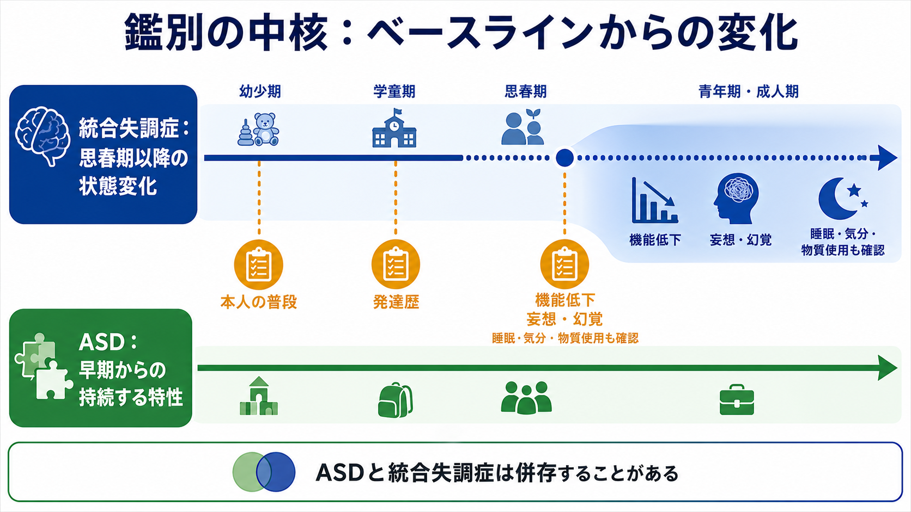
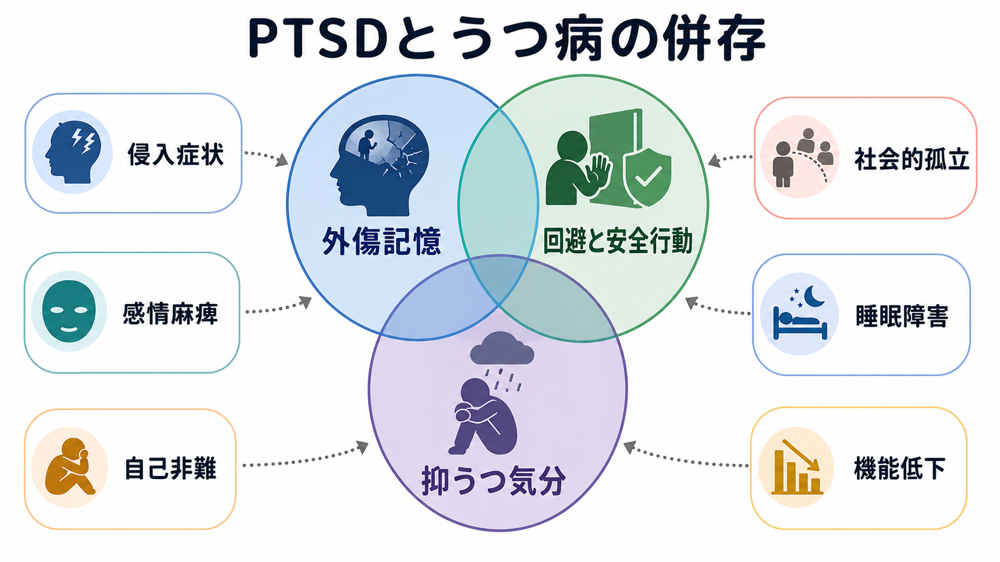

# 統合失調症と双極性障害はどう鑑別するのか

## 要点

- [[統合失調症とは何か|統合失調症]]と[[双極性障害とは何か|双極性障害]]の鑑別では、「妄想・幻覚があるか」だけでは足りない。中心になるのは、精神病症状が躁病・うつ病エピソードの中だけで起きたのか、それとも気分エピソードから独立して持続したのかである[1][3]。
- 精神病症状が躁病または重いうつ病の期間に限局するなら、まず双極性障害の精神病症状を伴う病像を考える[4][5]。
- 気分症状がない時期にも妄想・幻覚が2週間以上続き、かつ気分エピソードが病期の大部分を占めるなら、[[統合失調感情障害とは何か|統合失調感情障害]]が鑑別に入る[4][7]。
- 気分エピソードが病期全体の一部にとどまり、陰性症状、解体症状、認知機能障害、持続的な機能低下が前景にある場合は、統合失調症が示唆されやすい[1][3]。
- 初回評価では診断名を急いで固定せず、[[初回エピソード精神病とは何か|初回エピソード精神病]]として安全性、物質・薬剤、身体疾患、縦断経過、家族や記録からの情報を同時に確認する[6]。

## この記事で答える問い

この記事では、統合失調症と双極性障害を「症状リスト」ではなく「時間軸」から鑑別する。主な問いは次の3つである。

1. 精神病症状が気分エピソードの中だけで出るとき、何を考えるのか。
2. 気分症状がない時期にも妄想・幻覚が続くとき、何が変わるのか。
3. 統合失調感情障害は、統合失調症と双極性障害の「中間」ではなく、どのような時間関係で考えるのか。

ここでの記述は教育・研究目的であり、個別の診断や治療指示ではない。実際の診断では、診察、家族や支援者からの補足情報、診療記録、身体疾患・物質使用・薬剤の評価が必要になる。

## まず結論

最初に作るべきものは、診断名ではなく「縦断的なタイムライン」である。横軸に月日や年単位の経過を置き、その上に以下を重ねる。

- 妄想、幻覚、まとまりにくい思考、解体した行動などの精神病症状
- 躁病・軽躁病・うつ病エピソード
- 睡眠欲求、活動性、会話量、易刺激性、希死念慮、機能低下
- 物質使用、薬剤変更、身体疾患、ストレスイベント
- 入院、休職、学業・仕事・対人機能の変化

このタイムラインで、精神病症状が気分エピソードと同じ期間にだけ出ているなら、双極性障害の精神病症状を伴う病像を考えやすい。反対に、気分エピソードが目立たない時期にも妄想・幻覚が明確に続くなら、統合失調症スペクトラムや統合失調感情障害を考える必要がある[3][4]。

## 背景

統合失調症と双極性障害は、実臨床ではしばしば重なって見える。双極I型障害の躁病では、誇大妄想、被害的な解釈、幻聴、興奮、まとまりにくい発話が出ることがある。一方、統合失調症でも抑うつ、不安、睡眠障害、易刺激性、活動性の変化がみられることがある[3][5]。

そのため、ある一日の診察で「幻聴がある」「気分が高い」「眠っていない」と確認するだけでは、診断は安定しにくい。DSM-5-TR でも、統合失調症の診断では統合失調感情障害、抑うつ障害または双極性障害の精神病症状を伴う病像を除外する必要があると整理される[1][3]。NICE も、精神病症状の評価では精神医学的評価に加えて、身体疾患、処方薬・非処方薬、物質使用、発達歴、社会・職業機能、生活史を含む包括的評価を推奨している[6]。

## 基本概念

### 精神病症状

精神病症状とは、典型的には妄想、幻覚、まとまりにくい思考や発話、解体した行動などを指す。[[統合失調症の陽性症状とは何か|陽性症状]]として語られることが多いが、双極性障害、重いうつ病、物質・薬剤、身体疾患、せん妄、認知症、てんかんなどでも起こりうる。

### 気分エピソード

双極性障害では、躁病、軽躁病、うつ病、混合状態を時間的なまとまりとして評価する。[[双極I型障害とは何か|双極I型障害]]では躁病エピソードが診断の軸になり、[[双極II型障害とは何か|双極II型障害]]では軽躁病とうつ病エピソードの組み合わせが軸になる[5]。

ICD-11 では、双極I型障害の躁病エピソードは、気分高揚・易刺激性・拡大性と活動性またはエネルギー増加を中心に、睡眠欲求低下、観念奔逸、多弁、誇大性、衝動的行動などがまとまって現れる状態として説明される。精神病症状を伴う躁病では、妄想や幻覚はそのエピソード中に存在するものとして扱われる[2]。

### 統合失調感情障害

統合失調感情障害は、単に「統合失調症っぽさ」と「双極性障害っぽさ」が混ざった状態ではない。DSM-5 系の整理では、統合失調症の基準Aに相当する精神病症状と大きな気分エピソードが同じ病期の中で存在し、さらに気分エピソードがない時期にも妄想または幻覚が2週間以上続き、気分症状が病期全体の大部分を占めることが重要になる[4][7]。

## 仕組み

鑑別の仕組みは、次の3段階で考えると整理しやすい。

1. 精神病症状の存在を確認する。
2. その症状が躁病・うつ病エピソードの中だけで起きたかを確認する。
3. 気分症状がない時期の精神病症状と、病期全体に占める気分症状の割合を確認する。

### 精神病症状が気分エピソード中だけなら

妄想や幻覚が躁病、混合状態、重いうつ病の期間に限って出ているなら、双極性障害の精神病症状を伴う病像がまず考えやすい。たとえば、睡眠欲求の著しい低下、活動性増加、多弁、誇大性、浪費や危険行動がまとまって出現し、その期間に「自分には特別な使命がある」という誇大妄想が出る場合である[2][5]。

この場合、精神病症状の内容も気分と一致することがある。躁病では誇大性や特別な力に関する妄想、うつ病では罪業感、破滅、身体的な破綻に関する妄想が目立つことがある。ただし、気分と一致しない精神病症状もありうるため、内容だけで診断を決めない。

### 気分症状がない時期にも妄想・幻覚が続くなら

気分症状が明らかでない時期にも妄想や幻覚が続く場合、双極性障害だけで説明するのは難しくなる。特に、気分エピソードがない時期の妄想・幻覚が2週間以上あるなら、統合失調感情障害が鑑別に入る[4][7]。

ただし、そのまま統合失調感情障害と決めるわけではない。気分症状が病期全体の大部分を占めているか、それとも精神病症状が病期の中心なのかを確認する。気分エピソードが短く、精神病症状、陰性症状、認知機能障害、社会機能低下が持続する場合は、統合失調症がより考えやすくなる[3][4]。

### 「2週間」は機械的な答えではない

2週間という基準は便利な目印だが、臨床判断を自動化するものではない。現実には、本人の記憶が混乱している、躁病中の睡眠低下を「元気だった」と表現する、家族が異変に気づいた時点と本人の発症時点がずれる、物質使用が重なる、治療開始で症状の時間関係が見えにくくなる、ということが多い。

したがって、重要なのは「2週間という数字を満たすか」だけではなく、複数の情報源から時間軸を復元することである[6]。

## 図解

次の比較表は、診断名を先に決めるのではなく、何を観察するかを整理するためのものである。

| 観点 | 統合失調症が示唆されやすい所見 | 双極性障害が示唆されやすい所見 |
|---|---|---|
| 時間関係 | 精神病症状が気分エピソードから独立して続く | 精神病症状が躁病・重いうつ病の期間に限局する |
| 気分症状 | 気分症状はあっても病期全体の一部 | 躁病、軽躁病、うつ病がエピソードとしてまとまる |
| 機能変化 | 前駆期からの社会的引きこもり、意欲低下、認知機能低下 | エピソード間には比較的回復することがある |
| 症状の質 | [[統合失調症の陰性症状とは何か|陰性症状]]、解体症状、持続的な認知機能障害 | 睡眠欲求低下、活動性増加、易刺激性、誇大性、多弁 |
| 除外 | [[物質誘発性精神病とは何か|物質誘発性精神病]]、[[薬剤性精神病とは何か|薬剤性精神病]]、[[器質性精神病とは何か|器質性精神病]]を除外する | 同じく物質・薬剤・身体疾患を除外する |

## 臨床・研究との接続

臨床では、診断名の違いは治療方針、心理教育、家族支援、再発予防計画、予後説明に影響する。ただし、初回エピソードでは診断が後に変わることもあるため、暫定診断として扱い、経過を追いながら更新する姿勢が必要である。

NICE の双極性障害ガイドラインは、双極性障害が疑われる人では専門的な精神保健評価を行い、躁病・軽躁病の既往、うつ病エピソード、機能障害、リスク、身体疾患や薬剤の影響を評価することを重視している[5]。精神病・統合失調症ガイドラインでは、精神病症状をもつ人の包括的評価に、精神医学、身体医学、心理社会、発達、社会・職業、生活の質の領域を含めることが推奨される[6]。

研究面では、統合失調症、双極I型障害、統合失調感情障害の境界は完全に生物学的に切り分けられているわけではない。遺伝学、認知機能、脳画像、治療反応性には重なりがあり、診断分類は実体を完全に写す地図というより、臨床的な意思決定のための作業仮説として使われている[8]。このため、症状の名前だけではなく、時間経過、機能、生活史、リスク、治療反応を含めて考える必要がある。

## よくある誤解

### 誤解1: 幻聴があれば統合失調症である

誤りである。幻聴や妄想は統合失調症でよくみられるが、双極性障害、精神病性うつ病、物質・薬剤、身体疾患でも起こる。重要なのは、精神病症状がどの時期に、どの気分状態とともに、どれくらい続いたかである[3][4]。

### 誤解2: 気分が高いなら双極性障害である

これも単純化しすぎである。統合失調症でも興奮、易刺激性、不眠、不安、抑うつがみられることがある。双極性障害を考えるには、躁病・軽躁病エピソードとして、睡眠欲求低下、活動性増加、多弁、観念奔逸、誇大性、危険行動などが時間的にまとまっているかを見る必要がある[2][5]。

### 誤解3: 統合失調感情障害は「どちらか分からない時の診断」である

統合失調感情障害は、曖昧な時に使う予備箱ではない。気分エピソードと精神病症状が同じ病期に存在し、気分症状がない時期にも妄想・幻覚が2週間以上あり、かつ気分エピソードが病期全体の大部分を占める、という時間関係が重要である[4][7]。

### 誤解4: 一度ついた診断名は変えてはいけない

初回エピソード精神病では、経過観察によって診断が洗練されることがある。後から躁病エピソードが明らかになることもあれば、当初は気分障害に見えた病像が、持続的な精神病症状や陰性症状を中心とする経過を示すこともある。診断変更は失敗ではなく、情報が増えたことによる仮説の更新である。

## 関連ノート

- [[統合失調症とは何か]]
- [[双極性障害とは何か]]
- [[双極I型障害とは何か]]
- [[双極II型障害とは何か]]
- [[統合失調感情障害とは何か]]
- [[初回エピソード精神病とは何か]]
- [[精神病性うつ病とは何か]]
- [[物質誘発性精神病とは何か]]
- [[薬剤性精神病とは何か]]
- [[器質性精神病とは何か]]
- MOC更新候補: 精神医学、疾患・症候群、鑑別診断、精神病、気分障害

## 理解チェック

1. 精神病症状が躁病エピソード中にだけ出ている場合、まずどの診断群を考えやすいか。
2. 気分症状がない時期にも妄想・幻覚が2週間以上ある場合、どの診断が鑑別に入るか。
3. 統合失調症と統合失調感情障害を分けるとき、気分症状が病期全体に占める割合はなぜ重要か。
4. 初回エピソードで、本人の説明だけでなく家族・記録・身体疾患・物質使用を確認する理由は何か。

## 参考文献

[1] American Psychiatric Association. (2022). *Diagnostic and Statistical Manual of Mental Disorders, Fifth Edition, Text Revision (DSM-5-TR).* https://doi.org/10.1176/appi.books.9780890425787

[2] World Health Organization. (2025). *ICD-11 for Mortality and Morbidity Statistics: Bipolar type I disorder and related episode specifiers.* https://icd.who.int/browse/2025-01/mms/en

[3] Hany, M., & Rizvi, A. (2024). Schizophrenia. In *StatPearls.* National Library of Medicine. https://www.ncbi.nlm.nih.gov/books/NBK539864/

[4] Wy, T. J. P., & Saadabadi, A. (2023). Schizoaffective Disorder. In *StatPearls.* National Library of Medicine. https://www.ncbi.nlm.nih.gov/books/NBK541012/

[5] National Institute for Health and Care Excellence. (2025). *Bipolar disorder: assessment and management* (NICE Clinical Guideline No. 185). https://www.ncbi.nlm.nih.gov/books/NBK547001/

[6] National Institute for Health and Care Excellence. (2014). *Psychosis and schizophrenia in adults: prevention and management* (NICE Clinical Guideline No. 178). https://www.nice.org.uk/guidance/cg178

[7] Malaspina, D., Owen, M. J., Heckers, S., Tandon, R., Bustillo, J., Schultz, S., Barch, D. M., Gaebel, W., Gur, R. E., Tsuang, M., Van Os, J., & Carpenter, W. (2013). Schizoaffective Disorder in the DSM-5. *Schizophrenia Research, 150*(1), 21-25. https://doi.org/10.1016/j.schres.2013.04.026

[8] Ivleva, E. I., Morris, D. W., Moates, A. F., Suppes, T., Thaker, G. K., & Tamminga, C. A. (2010). Genetics and intermediate phenotypes of the schizophrenia-bipolar disorder boundary. *Neuroscience & Biobehavioral Reviews, 34*(6), 897-921. https://doi.org/10.1016/j.neubiorev.2009.11.022
