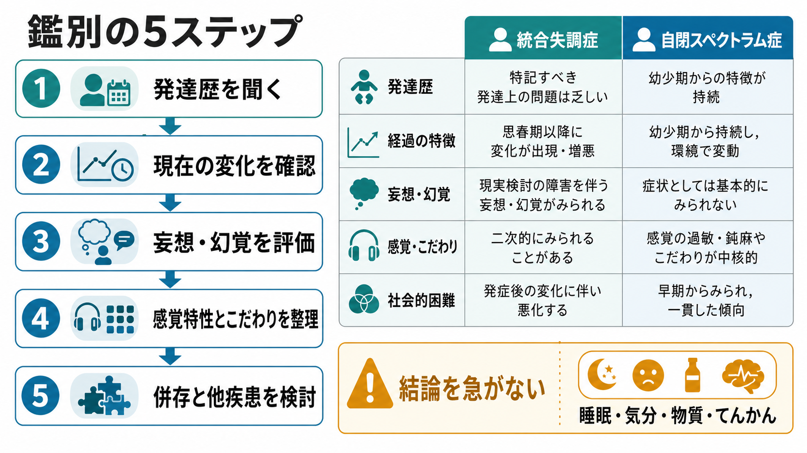

# 統合失調症と自閉スペクトラム症はどう鑑別するのか

## 要点

- 鑑別の中心は「幼少期からの発達特性か、思春期以降に出現・増悪した状態変化か」である。
- ASD の対人困難は、社会的手がかりの読み取り、相互性、こだわり、感覚過敏・鈍麻と結びつきやすい。統合失調症では、妄想、幻覚、思考のまとまりにくさ、陰性症状、機能低下が前景に出る。
- ASD の感覚特性や比喩理解の難しさは、幻覚や妄想に見えることがある。精神病症状と判断するには、外界から来る体験として確信されるか、訂正困難な意味づけになっているかを丁寧に見る。
- 両者は排他的ではない。ASD に統合失調症スペクトラムの精神病症状が併存することもあるため、単純な二者択一にしない。

## この記事で答える問い

このノートでは、統合失調症と自閉スペクトラム症の診断名そのものを覚えるのではなく、臨床で紛らわしくなる「対人困難」「奇異に見える言動」「感覚特性」「妄想・幻覚様体験」をどう分解するかを扱う。診断や治療方針は個別の診察で決まるため、ここでは教育・研究目的の鑑別フレームとして整理する。

## まず結論

統合失調症を疑う手がかりは、本人の普段の様子からの変化である。たとえば、学業・仕事・生活機能が以前より落ちる、会話のまとまりが悪くなる、被害的な意味づけが強まる、幻聴を外界からの声として確信する、睡眠や気分の乱れとともに急に悪化する、といった経過は[[初回エピソード精神病とは何か]]の評価につながる[2][4]。

ASD を疑う手がかりは、幼少期から続く社会的コミュニケーションの特徴、限定された興味、反復的な行動、変化への苦手さ、感覚過敏・鈍麻である。成人期の評価でも、本人の現在像だけでなく、家族・学校記録・過去の行動から発達歴を確認することが重視される[3][5]。

## 背景

統合失調症とASDは、歴史的にも概念的にも近接して論じられてきた。どちらも対人関係の困難、表情や会話の独特さ、社会的孤立、興味の偏り、奇異に見える行動を示しうる。しかし、現代の診断では、統合失調症は精神病症状と経過に、ASDは神経発達症としての早期発症・持続的特性に軸足を置く[1][6]。

NIMH は、統合失調症を「現実との接触が失われたように見える」重い精神疾患として説明し、通常は16歳から30歳の間に初回精神病エピソード後に診断されることが多いとしている[2]。一方、ASD は神経発達症であり、対人相互作用、コミュニケーション、学習、行動に関わる特徴が通常は生後早期から現れる[3]。

## 基本概念

### 統合失調症で見るべきもの

統合失調症の中心は、妄想、幻覚、まとまりにくい思考・発話、まとまりにくい行動、陰性症状である[1]。実際の面接では、症状名を当てはめる前に、次を確認する。

| 観点 | 統合失調症を疑う所見 |
|---|---|
| 時間経過 | 思春期以降から青年期にかけて、以前と違う変化が出る |
| 現実検討 | 被害的・関係的な意味づけが訂正されにくい |
| 幻覚 | 声や知覚が外界から来るものとして体験される |
| 機能 | 学業、仕事、生活、対人関係が以前より低下する |
| 併存評価 | 気分障害、物質使用、身体疾患、てんかん、トラウマを確認する |

NICE の精神病・統合失調症ガイドラインは、精神病症状をもつ人を評価するとき、精神症状だけでなく、身体疾患、薬物・アルコール、心理社会的背景、トラウマ、発達歴、教育・職業機能、生活の質を含む包括的評価を推奨している[4]。これは、[[うつ病とは何か]]、[[双極II型障害とは何か]]、[[てんかんに伴う精神症状とは何か]]、[[PTSDとは何か]]などとの鑑別にも関わる。

### ASDで見るべきもの

ASD の中心は、社会的コミュニケーションと相互性の持続的な困難、限定された反復的な行動・興味・活動、感覚過敏または感覚鈍麻である[1][3]。成人のASD評価でも、現在の困りごとだけでは不十分で、幼少期から成人期までの持続性を見る[5]。

| 観点 | ASDを疑う所見 |
|---|---|
| 時間経過 | 幼少期から一貫して似た傾向がある |
| 対人困難 | 相手の暗黙の意図、表情、文脈を読み取りにくい |
| 興味・行動 | 限定された興味、反復、同一性へのこだわりがある |
| 感覚 | 音、光、触覚、味、においへの過敏・鈍麻がある |
| 変化への反応 | 予定変更や環境変化で強い不安や混乱が出やすい |

NICE の成人ASDガイドラインは、包括的評価で早期発達歴、社会的相互作用とコミュニケーション、常同行動・抵抗・限定興味、家庭・教育・職場での機能、身体・精神疾患、他の神経発達症、感覚特性を評価するよう述べている[5]。[[ADHDとは何か]]など他の神経発達症との重なりもこの段階で整理する。

## 仕組み

### 1. 対人困難の意味が違う

ASD の対人困難は、相手の視線、表情、皮肉、比喩、暗黙のルールなどを読み取る負荷が高いことから生じやすい。本人は「人に興味がない」のではなく、どこを読めばよいか分からない、感覚的に疲れる、予測できないやり取りが苦手、という形で困ることがある。

統合失調症の対人困難は、発症前からの孤立傾向に加えて、妄想的な意味づけ、幻聴への反応、陰性症状、認知機能の低下、気分症状によって二次的に悪化することが多い。重要なのは、以前はできていた対人参加が落ちたのか、もともとの特性として一貫していたのかである[4][6]。

### 2. 奇異性は「内容」より「生成過程」を見る

ASD の独特な話し方や興味の深さは、奇異に見えることがある。しかし、それが限定興味、比喩理解の苦手さ、感覚過敏、ルールへのこだわりから説明できるなら、ただちに妄想とはいえない。

妄想を疑うのは、本人の生活史から見て新しく出現し、根拠が弱いにもかかわらず確信が強く、反証で修正されにくく、生活機能や安全に影響している場合である[1][6]。ASD では、社会的誤解やいじめ体験から被害的に見える解釈が生じることもあるため、体験の文脈を分解する。

### 3. 感覚特性と幻覚を混同しない

ASD では、音が痛く感じる、光が強すぎる、衣服の触感に耐えにくい、においに敏感、といった感覚特性が中核的にみられる[3][5]。これは「存在しない刺激を知覚する」幻覚とは異なる。

ただし、ASD の人が異常知覚体験を語ることはあり、言語化の難しさや具体的表現のために、幻覚様に聞こえる場合がある。Ribolsi らのレビューは、ASD における異常知覚体験は、それが外界由来のものとして解釈され、妄想的意味づけと結びつくときに精神病症状として評価されるべきだと整理している[6]。

### 4. 陰性症状とASD特性を区別する

統合失調症の陰性症状には、感情表出の乏しさ、発語の減少、意欲低下、快感消失、社会的引きこもりが含まれる[1][6]。ASD でも表情が乏しく見える、会話が少ない、ひとりの活動を好むことがあるため、外見だけでは区別しにくい。

鑑別では「昔からそうだったか」「発症後に進行したか」「こだわりや感覚負荷と結びつくか」「快感や興味そのものが失われているか」を見る。ASDでは相互性の独特さや環境負荷への反応として社会的接触が減ることがあり、統合失調症では精神病発症後に陰性症状として機能低下が進むことがある[6]。

## 図解

### 鑑別の5ステップ

| ステップ | 確認すること | 見落としやすい点 |
|---|---|---|
| 1. 発達歴 | 幼少期からの対人・言語・感覚・こだわり | 学校では適応していても、家庭で強い疲弊があった可能性 |
| 2. 現在の変化 | いつから、何が、どの程度変わったか | 「最近悪い」だけでなくベースラインを確認する |
| 3. 精神病症状 | 妄想、幻覚、思考のまとまり、現実検討 | 感覚過敏、比喩表現、空想、トラウマ反応との区別 |
| 4. 機能低下 | 学業、仕事、生活、対人参加 | ASDの環境不適合による二次的疲弊との区別 |
| 5. 併存・他疾患 | 気分、睡眠、物質、身体疾患、てんかん | ASDと精神病症状は併存しうる |

## 臨床・研究との接続

臨床では、ASD か統合失調症かを一度の面接だけで決めるより、生活史、家族からの情報、学校・職場での機能、発症時期、ストレス、睡眠、物質使用、身体疾患を統合して症例定式化する方が実用的である。NICE は、精神病症状の評価でも発達歴と併存する神経発達症を確認すること、ASD 評価でも統合失調症や気分障害、てんかんなどを鑑別・併存として検討することを推奨している[4][5]。

研究的には、ASD と統合失調症は完全に別々の箱ではない。社会認知、感覚処理、予測処理、遺伝的リスク、神経発達過程などで重なりが議論される一方、臨床判断では「発達早期からの持続的特性」と「精神病発症に伴う現実検討の変化」を分ける必要がある[6]。

## よくある誤解

### 「目が合わないならASD」とは限らない

視線が合いにくい理由は複数ある。ASD の感覚負荷や社会的手がかり処理の問題、統合失調症の被注察感、うつ病の意欲低下、社交不安、トラウマ反応などがありうる。単一所見で診断しない。

### 「幻聴と言ったら統合失調症」とは限らない

声のような体験は、睡眠不足、解離、トラウマ、気分障害、物質使用、てんかん、発達特性に伴う内的言語の表現などでも問題になる。外界由来として確信しているか、妄想的意味づけがあるか、機能低下と時間的に連動するかを確認する。

### 「ASDなら精神病にはならない」は誤り

ASD と精神病症状は併存しうる。ASD の診断がある場合でも、急な機能低下、睡眠リズムの破綻、被害的確信、幻覚、思考のまとまりにくさが新たに出たなら、精神病症状として評価する[6]。

### 「統合失調症なら発達特性は見なくてよい」は誤り

精神病症状のある人でも、発達歴、学習歴、感覚特性、コミュニケーション特性を見る必要がある。発達特性を見落とすと、説明の仕方、環境調整、心理教育、家族支援、服薬への反応の評価を誤りやすい[4][5]。

## 関連ノート

- [[初回エピソード精神病とは何か]]
- [[DSMとICDは何が違うのか]]
- [[ASDは脳ネットワークの違いとして理解できるのか]]
- [[ADHDとは何か]]
- [[うつ病とは何か]]
- [[双極II型障害とは何か]]
- [[てんかんに伴う精神症状とは何か]]
- [[PTSDとは何か]]

MOC更新候補: `content/00_MOC/` 配下の精神医学、神経発達症、鑑別診断に関するMOCへ追加する。

## 理解チェック

1. ある対人困難がASDらしいか統合失調症らしいかを判断するとき、最初に確認すべき時間軸は何か。
2. ASDの感覚過敏と幻覚を区別するために、体験のどの側面を確認するか。
3. 陰性症状とASDの社会的相互性の特徴を区別するために、どのような発症前情報が役立つか。
4. ASD と統合失調症を二者択一にしすぎると、どのような併存や鑑別を見落としやすいか。

## 参考文献

[1] American Psychiatric Association. (2022). *Diagnostic and Statistical Manual of Mental Disorders, Fifth Edition, Text Revision (DSM-5-TR).* American Psychiatric Association Publishing. https://www.psychiatry.org/psychiatrists/practice/dsm

[2] National Institute of Mental Health. (2024). *Schizophrenia.* https://www.nimh.nih.gov/health/topics/schizophrenia

[3] National Institute of Mental Health. (2024). *Autism Spectrum Disorder.* https://www.nimh.nih.gov/health/topics/autism-spectrum-disorders-asd

[4] National Institute for Health and Care Excellence. (2014). *Psychosis and schizophrenia in adults: prevention and management (CG178).* https://www.nice.org.uk/guidance/cg178

[5] National Institute for Health and Care Excellence. (2012, updated 2021). *Autism spectrum disorder in adults: diagnosis and management (CG142).* https://www.nice.org.uk/guidance/cg142

[6] Ribolsi, M., Fiori Nastro, F., Pelle, M., Medici, C., Sacchetto, S., Lisi, G., Riccioni, A., Siracusano, M., Mazzone, L., & Di Lorenzo, G. (2022). Recognizing psychosis in autism spectrum disorder. *Frontiers in Psychiatry, 13*, 768586. https://doi.org/10.3389/fpsyt.2022.768586

## 未解決問題

- ASD の異常知覚体験を、精神病症状、感覚特性、解離、トラウマ反応としてどう測定し分けるか。
- ASD と統合失調症スペクトラムの併存例で、心理社会的支援、環境調整、薬物療法の優先順位をどう個別化するか。
- 成人期に初めて評価されるASDで、過去資料が乏しい場合に発達歴をどの程度確からしく復元できるか。
