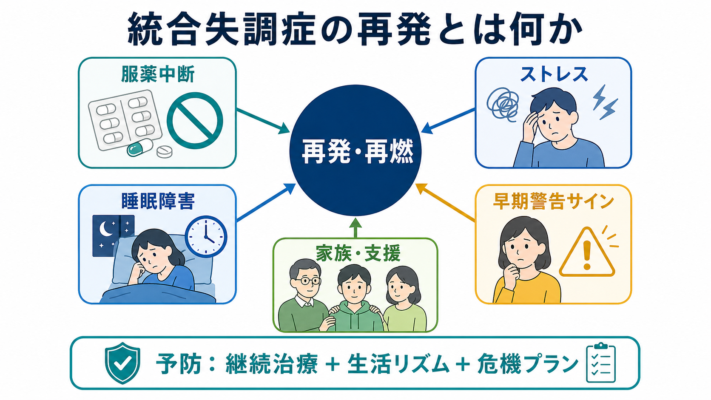
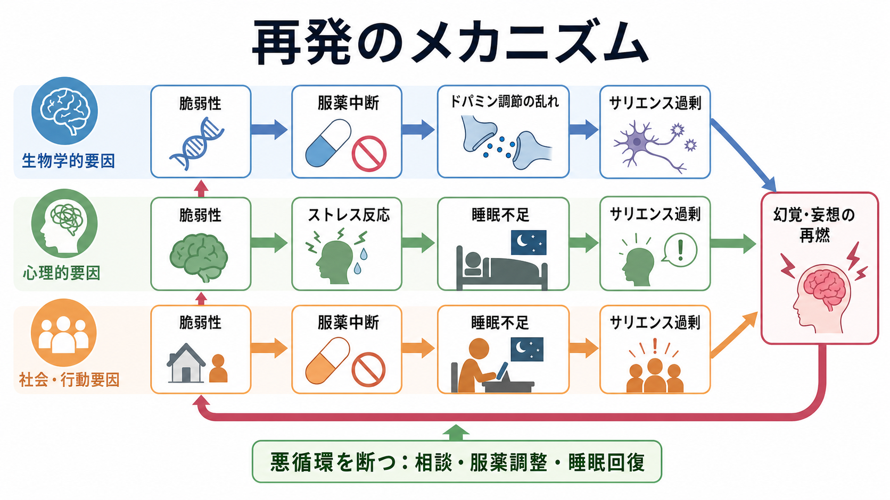
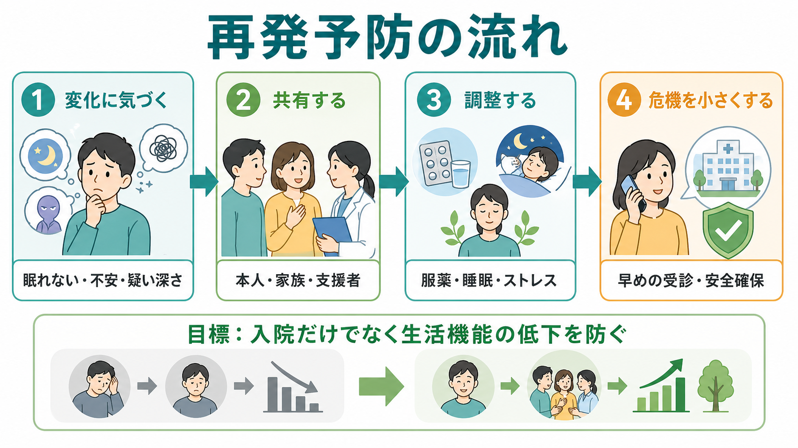

# 統合失調症の再発とは何か

## 要点

- 統合失調症の再発とは、寛解または安定していた[[統合失調症とは何か]]の症状が再び強まり、生活・対人関係・安全・治療計画に明らかな影響を及ぼす状態である。
- 再発は「薬を飲まなかったから起きる」という単線的な現象ではなく、服薬中断、ストレス、睡眠障害、物質使用、孤立、家族・支援環境、早期警告サインへの対応遅れが重なって起きやすくなる[1][2]。
- 抗精神病薬の維持療法は再発リスクを下げるが、過鎮静、副作用、病識、スティグマ、生活上の事情が[[アドヒアランスとは何か]]を揺らすため、共同意思決定とモニタリングが重要になる[2][3]。
- 再発予防は「入院を避ける」だけでなく、学業・仕事・家族関係・認知機能・自己効力感の低下を小さくするための早期対応である[1][4]。

## この記事で答える問い

1. 統合失調症の「再発」「再燃」「悪化」は何を指すのか。
2. 服薬中断、ストレス、睡眠障害はどのように再発に関わるのか。
3. 早期警告サインは何を見ればよいのか。
4. 再発予防計画では、薬物療法以外に何を組み込むべきか。

## まず結論

統合失調症の再発は、幻覚・妄想などの[[統合失調症の陽性症状とは何か]]が再び目立つことだけではない。眠れない、疑い深くなる、周囲の刺激が過剰に意味を帯びる、会話や生活リズムが崩れる、家族や支援者との接触が減る、といった変化が先行し、その後に症状と生活機能の悪化が見えることが多い[1][7]。

したがって、再発予防の中心は「症状が強くなってから対応する」ことではなく、本人が気づきやすい変化をあらかじめ言語化し、[[再発予防計画とは何か]]として、相談先、服薬調整の相談方法、睡眠・ストレス対策、危機時の安全確保を決めておくことである[1][7]。

## 背景

統合失調症は、急性期の症状が軽快した後も再発しうる長期経過をとる。再発は本人の苦痛だけでなく、入院、就労・就学の中断、家族負担、自己効力感の低下、治療への不信感を伴いやすい。再発を繰り返すほど社会機能の回復が難しくなる場合があるため、臨床では急性期治療と同じくらい維持期の支援が重要になる[1][4]。

ただし、再発を「本人の努力不足」とみなす理解は不正確である。再発リスクは、神経生物学的脆弱性、環境ストレス、薬物療法の中断、睡眠覚醒リズム、対人環境、支援へのアクセスによって変化する。これは[[ストレス脆弱性モデルとは何か]]とよく対応する。

## 基本概念

### 再発・再燃・悪化

「再発」は、一定期間安定していた症状が再び臨床的に問題となる水準まで強くなることを指す。研究では、入院、症状評価尺度の悪化、救急受診、薬物療法の変更、機能低下などを組み合わせて定義することが多い[2]。日常臨床では、症状の点数だけでなく、本人の生活がどの程度崩れているかを同時に見る。

「再燃」は、完全な寛解後の再発だけでなく、残存症状が再び強まるニュアンスで使われる。たとえば、声が聞こえる頻度が増える、被害的な解釈が強まる、睡眠が短くなる、服薬や受診が途切れる、といった変化である。

### 早期警告サイン

再発の前には、本人や周囲が気づける小さな変化が出ることがある。代表例は、不眠、昼夜逆転、不安、焦燥、疑い深さ、孤立、会話量の変化、刺激への過敏さ、服薬忘れ、受診回避である[7]。これらは特異的ではないため、単独で「再発」と断定するのではなく、その人のいつものパターンとの差分として見る。

## 仕組み

### 服薬中断と再発リスク

抗精神病薬の維持療法は、再発予防の主要な柱である。プラセボ対照試験のメタ解析では、維持療法は再発を有意に減らすことが示されている[2]。初回エピソード後の研究でも、治療中断は再発の強い予測因子として報告されている[3]。

しかし、服薬継続は単なる意思の問題ではない。副作用、効果実感の乏しさ、病識の変動、服薬への抵抗感、生活の不規則さ、経済的・社会的問題が重なる。したがって、[[精神疾患と服薬アドヒアランス不良はどう関係するのか]]を評価し、本人が納得できる目標、服薬方法、副作用対策を一緒に検討する必要がある。

### ストレスと脆弱性

生活イベント、対人葛藤、孤立、過度な要求、経済的困難は、再発リスクを高めうる。メタ解析では、ストレスフルな生活イベントと精神病性障害の再発との関連が示されている[4]。ストレスは睡眠、注意、情動調整、サリエンス処理を乱し、もともと脆弱な認知・神経システムに負荷をかける。

ここで重要なのは、ストレスをゼロにすることではない。現実的な目標は、本人が負荷の上昇を早く検出し、相談、休息、環境調整、服薬相談、支援者との連絡によって悪循環を小さくすることである。

### 睡眠障害と再発

[[睡眠障害とは何か]]は、再発のサインであると同時に、再発を進める要因にもなりうる。睡眠不足は注意・情動調整・現実検討を不安定にし、ストレス反応を増幅させる。精神病症状と睡眠・概日リズム障害の関係を扱うレビューでは、睡眠問題が症状悪化や機能低下と結びつくことが整理されている[5]。

臨床的には、睡眠は本人と支援者が観察しやすい指標である。「眠れない」「早朝に目が覚める」「昼夜逆転する」「夜に考えが止まらない」という変化は、再発予防計画の中で扱いやすい。

## 図解

上の図は、再発を一つの原因ではなく、複数の経路が合流する悪循環として描いている。服薬中断はドパミン調節や症状の閾値に影響し、ストレスは不安・過覚醒・疑い深さを高め、睡眠障害は情動制御と現実検討を弱める。これらが重なると、外界の刺激が過剰に意味を持つように感じられ、[[妄想とは何か]]や[[幻覚とは何か]]が再び強まることがある。

ただし、この図は因果を単純化した教育用モデルである。すべての人に同じ順序で起きるわけではなく、再発の初期サインは人によって異なる。

## 臨床・研究との接続

### 家族・支援者との共有

家族介入は、統合失調症の再発予防に重要な心理社会的介入の一つである。Cochraneレビューでは、家族介入が再発や再入院を減らす可能性が示されている[6]。これは家族に責任を負わせるという意味ではない。本人と家族・支援者が、再発サイン、相談の仕方、危機時の連絡先、休息の取り方を共有するための支援である。関連して[[家族への説明で何に注意するべきか]]や[[心理教育とは何か]]が役立つ。

### 早期警告サインへの介入

早期警告サインを見つける介入は、再発予防の中核になりうる。Cochraneレビューでは、早期サインの認識と対応を教える介入が再発や入院に影響しうる一方、研究間の差や実装上の課題もあるとされる[7]。重要なのは、一般的なチェックリストを押しつけることではなく、「その人にとっての黄色信号」を本人の言葉で整理することである。

### 薬物療法と心理社会的介入の組み合わせ

心理社会的介入のネットワークメタ解析では、家族介入、心理教育、認知行動療法、社会技能訓練などが再発や機能に関わる可能性が比較されている[8]。薬物療法は重要だが、服薬だけで生活上の負荷、孤立、睡眠、就労・就学、家族負担が自動的に解決するわけではない。再発予防は、薬物療法、心理教育、家族支援、生活リズム、地域支援を組み合わせる実践である。

## よくある誤解

### 誤解1: 再発は本人の気合い不足で起こる

再発は、脆弱性、ストレス、睡眠、服薬、社会的支援が重なる医学的・心理社会的現象である。本人の責任に還元すると、相談の遅れや孤立を招きやすい。

### 誤解2: 薬を飲んでいれば絶対に再発しない

維持療法は再発リスクを下げるが、ゼロにはしない[2]。睡眠、ストレス、物質使用、身体疾患、対人環境も再発に関わる。だからこそ、服薬継続と同時に生活リズムと支援体制を整える。

### 誤解3: 少し眠れないだけなら関係ない

不眠は誰にでも起こるが、統合失調症の既往がある人では再発サインの一部になりうる[5][7]。一晩だけで判断せず、数日単位の変化、日中機能、疑い深さ、不安、服薬状況と合わせて見る。

### 誤解4: 家族が見張れば再発は防げる

家族支援は監視ではない。本人の自律性を尊重しながら、変化に気づいたときに責めずに共有し、支援へつなぐための環境づくりである[6]。

## 関連ノート

- [[統合失調症とは何か]]
- [[統合失調症の前駆期とは何か]]
- [[統合失調症の陽性症状とは何か]]
- [[統合失調症の陰性症状とは何か]]
- [[統合失調症の認知機能障害とは何か]]
- [[治療抵抗性統合失調症とは何か]]
- [[アドヒアランスとは何か]]
- [[再発予防計画とは何か]]
- [[ストレス脆弱性モデルとは何か]]
- [[睡眠障害とは何か]]
- [[心理教育とは何か]]
- [[家族への説明で何に注意するべきか]]

### MOC更新候補

- `content/00_MOC/` 配下の精神医学・精神病性障害・臨床実践系 MOC
- 並列ジョブとの衝突を避けるため、本記事作成時点では MOC ファイルは直接更新していない。

## 理解チェック

1. 統合失調症の再発を、症状だけでなく生活機能を含めて説明するとどうなるか。
2. 服薬中断が再発に関わる一方で、服薬継続を難しくする要因には何があるか。
3. 睡眠障害は、再発の「サイン」と「要因」の両方になりうるのはなぜか。
4. 早期警告サインを本人の言葉で整理する利点は何か。
5. 家族介入を「監視」と区別するには、どのような説明が必要か。

## 未解決問題

- 個人ごとの再発サインを、過剰な監視や不安を増やさずにデジタル指標で扱う方法はまだ発展途上である。
- 抗精神病薬の最適な維持期間、減量可能性、長期副作用と再発リスクのバランスは、個別化が必要である。
- 睡眠・ストレス・社会的孤立への介入が、どの患者群で最も再発予防に寄与するかはさらに検証が必要である。

## 参考文献

[1] National Institute for Health and Care Excellence. (2014, reviewed 2025). *Psychosis and schizophrenia in adults: prevention and management (CG178)*. https://www.nice.org.uk/guidance/cg178

[2] Leucht, S., Tardy, M., Komossa, K., Heres, S., Kissling, W., Salanti, G., & Davis, J. M. (2012). Antipsychotic drugs versus placebo for relapse prevention in schizophrenia: a systematic review and meta-analysis. *The Lancet, 379*(9831), 2063-2071. https://doi.org/10.1016/S0140-6736(12)60239-6

[3] Robinson, D., Woerner, M. G., Alvir, J. M. J., Bilder, R., Goldman, R., Geisler, S., Koreen, A., Sheitman, B., Chakos, M., Mayerhoff, D., & Lieberman, J. A. (1999). Predictors of relapse following response from a first episode of schizophrenia or schizoaffective disorder. *Archives of General Psychiatry, 56*(3), 241-247. https://doi.org/10.1001/archpsyc.56.3.241

[4] Martland, N., Martland, R., Cullen, A. E., & Bhattacharyya, S. (2020). Are adult stressful life events associated with psychotic relapse? A systematic review of 23 studies. *Psychological Medicine, 50*(14), 2302-2316. https://doi.org/10.1017/S0033291720003554

[5] Meyer, N., Faulkner, S. M., McCutcheon, R. A., Pillinger, T., Dijk, D.-J., & MacCabe, J. H. (2020). Sleep and circadian rhythm disturbance in remitted schizophrenia and bipolar disorder: a systematic review and meta-analysis. *Schizophrenia Bulletin, 46*(5), 1126-1143. https://doi.org/10.1093/schbul/sbaa024

[6] Pharoah, F., Mari, J. J., Rathbone, J., & Wong, W. (2010). Family intervention for schizophrenia. *Cochrane Database of Systematic Reviews*, (12), CD000088. https://doi.org/10.1002/14651858.CD000088.pub2

[7] Morriss, R., Vinjamuri, I., Faizal, M. A., Bolton, C. A., & McCarthy, J. P. (2013). Training to recognise the early signs of recurrence in schizophrenia. *Cochrane Database of Systematic Reviews*, (2), CD005147. https://doi.org/10.1002/14651858.CD005147.pub2

[8] Bighelli, I., Rodolico, A., García-Mieres, H., Pitschel-Walz, G., Hansen, W.-P., Schneider-Thoma, J., Siafis, S., Wu, H., Wang, D., Salanti, G., Furukawa, T. A., Barbui, C., & Leucht, S. (2021). Psychosocial and psychological interventions for relapse prevention in schizophrenia: a systematic review and network meta-analysis. *The Lancet Psychiatry, 8*(11), 969-980. https://doi.org/10.1016/S2215-0366(21)00243-1
