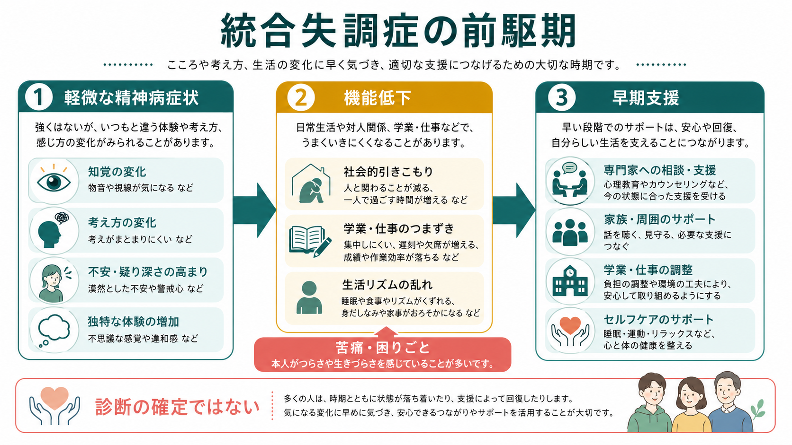
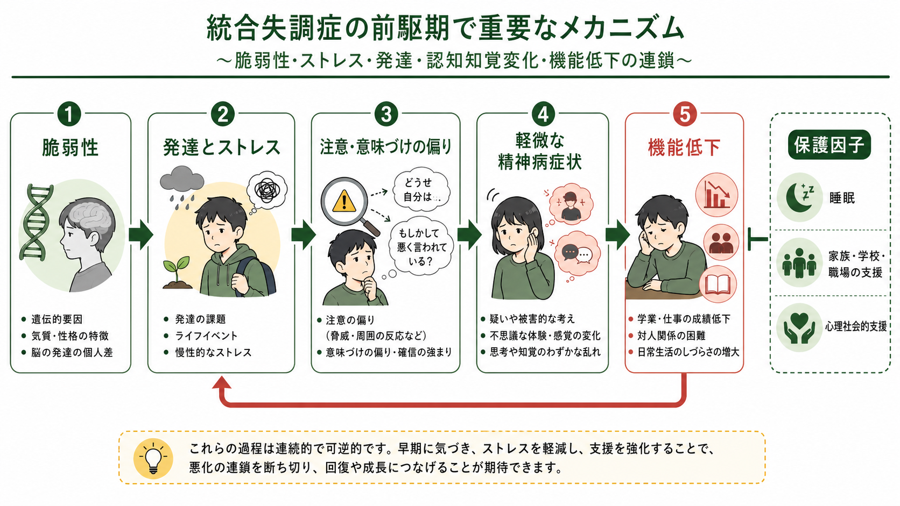
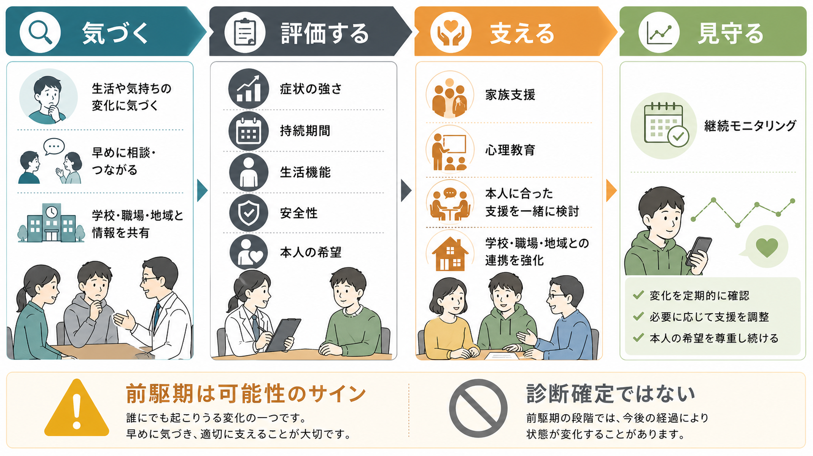

# 統合失調症の前駆期とは何か

## 要点

- 統合失調症の前駆期とは、明確な精神病エピソードの前に、軽微な精神病症状、陰性症状様の変化、認知・情動の不調、学業・仕事・対人関係の機能低下が目立ち始める時期を指す。
- 現代の臨床研究では、「前駆期」という後から見た呼び方だけでなく、臨床的高リスク状態 clinical high risk for psychosis: CHR-P や ultra-high risk: UHR という前向きの概念で扱うことが多い [1][2]。
- 重要なのは、前駆期は「統合失調症になることが決まった段階」ではない点である。CHR-P 研究の更新メタ分析では、精神病への移行は3年で約25%と推定され、多くの人は移行しない [6]。
- 早期支援の焦点は、予言やラベル貼りではなく、苦痛、生活機能、安全性、家族・学校・職場との調整、睡眠やストレス、併存する不安・抑うつ・物質使用を丁寧に扱うことである [4][5]。

## この記事で答える問い

1. 統合失調症の前駆期とは、どのような状態を指すのか。
2. 軽微な精神病症状と生活機能低下は、どのように結びつくのか。
3. CHR-P、UHR、attenuated psychosis という概念は何を見ているのか。
4. 早期支援では、何をして、何を急いで決めつけないのか。

## まず結論

統合失調症の前駆期は、「発症直前の一本道」ではなく、本人の体験、生活機能、発達段階、ストレス、環境支援が交差する不安定な時期である。たとえば、物音や視線が気になる、周囲の反応を被害的に読みやすい、考えがまとまりにくい、人と会うのがつらい、学業や仕事が続きにくい、睡眠リズムが崩れる、といった変化が重なることがある。

ただし、これらは統合失調症に特異的ではない。不安症、うつ病、発達特性、トラウマ、睡眠不足、物質使用、身体疾患、薬剤、思春期・青年期の環境変化でも似た状態は起こりうる。したがって、評価では [[精神状態診察MSEとは何か]] や [[MSEで知覚異常をどう聞くか]] のような症状の確認に加えて、[[病前機能とは何か]]、[[精神科で生活機能をどう評価するか]]、安全性、本人の希望を合わせて見る。

## 背景

精神病の前駆期に注目する理由は、初回エピソードが明確になる前から、本人や家族が困りごとを経験していることが多いからである。CAARMS は、精神病発症の可能性を示す精神病理を構造化して評価し、UHR 基準を満たすかを判断するために開発された面接である [3]。同じ領域で SIPS も用いられ、近年は SIPS と CAARMS の対応づけも進められている [7]。

ここで注意すべきなのは、「前駆期」という言葉は、発症した後に振り返ると使いやすい一方、発症前の時点では予測の不確実性が大きいことである。そこで研究と臨床では、明確な統合失調症診断を先取りするのではなく、援助希求、苦痛、機能低下、軽微な精神病症状の組み合わせとして CHR-P/UHR を扱う [1][2]。

## 基本概念

### 前駆期

前駆期は、明確な精神病症状が持続して診断基準を満たす前に、気分、認知、知覚、対人関係、行動、生活機能に変化がみられる時期である。よくみられる変化には、社会的引きこもり、意欲低下、集中困難、不眠、不安、抑うつ、疑い深さ、軽い知覚変化、学業・仕事の低下がある。

ただし、これらの多くは非特異的である。[[幻覚とは何か]] や [[妄想とは何か]] で扱うような明確な精神病症状と、違和感・不安・過敏さ・疑念の段階は連続していることがあるが、同じものではない。

### CHR-P と UHR

CHR-P は、精神病への移行リスクが一般集団より高いとみなされる援助希求者を、構造化面接で同定する研究・臨床概念である。UHR 基準では、しばしば次のような状態が扱われる [2][3]。

| 領域 | 見るポイント | 例 |
|---|---|---|
| 弱い精神病症状 | 強度は診断閾値未満だが、頻度・苦痛・影響がある | 被害的に感じる、視線や物音が気になる |
| 短時間の精神病症状 | 一過性で自然軽快するが、明確な精神病様体験がある | 短時間だけ確信が強まる、声のように感じる |
| リスク状態と機能低下 | 家族歴や脆弱性に加え、生活機能が落ちる | 学業・仕事の低下、社会的引きこもり |

### Attenuated psychosis

attenuated psychosis は、弱い、または閾値未満の精神病症状を指す表現である。DSM-5 では attenuated psychosis syndrome は正式診断ではなく、さらなる研究が必要な状態として扱われてきた [8]。この位置づけは、臨床的に重要な苦痛や機能低下を見逃さない一方で、若者に過剰な診断ラベルを貼らないための慎重さを反映している。

## 仕組み

統合失調症の前駆期を一つの原因で説明することはできない。実際には、脆弱性、発達、ストレス、睡眠、物質使用、家族・学校・職場環境、認知的な意味づけ、社会的孤立が重なり、体験の強さと機能低下が増幅されることがある。

この見方は [[ストレス脆弱性モデルとは何か]] と相性がよい。もともとの脆弱性がある人にストレスが加わると、不安、過覚醒、睡眠障害、注意の偏りが強まり、曖昧な出来事が「自分に向けられている」「危険のサインだ」と読まれやすくなる。そこから回避や引きこもりが増えると、安心できる対人接触や現実検討の機会が減り、さらに疑念や孤立が強まることがある。

ただし、この流れは決定論ではない。睡眠の回復、安心できる相談先、家族・学校・職場の調整、心理教育、ストレス軽減、併存する不安・抑うつへの支援によって、悪循環が弱まることもある [4][5]。

## 図解

この記事の図は、前駆期を「診断確定の図」ではなく「評価と支援を整理する図」として読む。

| 図 | 目的 | 読み方 |
|---|---|---|
| 図1 | 全体像 | 軽微な精神病症状、機能低下、早期支援を一つの地図にする |
| 図2 | メカニズム | 脆弱性、ストレス、注意・意味づけ、機能低下の連鎖を見る |
| 図3 | 臨床応用 | 気づく、評価する、支える、見守るという支援の順序を見る |

## 臨床・研究との接続

### 評価

評価では、「精神病に移行するか」だけを見ない。症状の強さ、持続期間、頻度、現実検討、苦痛、生活機能、安全性、併存症、物質使用、身体疾患、発達歴、家族歴、支援資源を合わせて確認する。CAARMS や SIPS は、こうした評価を標準化するための道具であり、短い会話だけで将来を決める道具ではない [3][7]。尺度利用の考え方は [[精神科診断面接で尺度をどう使うか]] ともつながる。

### 移行リスク

CHR-P の移行リスクはゼロではないが、必然でもない。2021年の更新メタ分析では、CHR-P から精神病への累積移行リスクは1年で約15%、2年で約19%、3年で約25%と推定された [6]。この数字は「4人に1人が3年で移行する」という集団平均であり、個人の未来をそのまま示すものではない。研究間の異質性も大きく、評価対象、紹介経路、年齢、基準、支援内容によって変わる。

### 支援

NICE は、成人でも若年者でも、診断閾値に満たない精神病症状や精神状態変化がある場合、個別 CBT、家族介入、併存する不安・抑うつ・物質使用への標準的支援を検討し、抗精神病薬を「精神病予防」の目的で用いないことを推奨している [4][5]。ここでの支援は、本人を脅かす予防医療ではなく、現在の困りごとを軽くし、生活を支えるための協働である。

実際の支援では、[[精神科におけるチーム医療とは何か]]、[[精神科治療計画はどのように立てるのか]]、[[生物心理社会モデルとは何か]] の視点が役立つ。学校、職場、家族、地域支援、睡眠・生活リズム、心理教育を組み合わせることで、症状だけでなく生活機能と安心感を支える。

## よくある誤解

### 誤解1: 前駆期なら、統合失調症になることが決まっている

決まっていない。CHR-P はリスクが高い集団を表す概念だが、多くの人は精神病へ移行しない [6]。だからこそ、早期支援では予言よりも、現在の苦痛と生活機能を支えることが重要である。

### 誤解2: 軽い症状なら様子を見るだけでよい

症状が軽くても、本人が強い不安や孤立を感じていたり、学業・仕事・睡眠・対人関係が落ちていたりするなら支援の対象になる。軽いかどうかではなく、苦痛、機能低下、安全性、持続、変化の速度を見る。

### 誤解3: 早期支援とは薬で発症を止めることである

単純化しすぎである。NICE は、診断閾値に満たない状態に対して、精神病予防目的の抗精神病薬を勧めていない [4][5]。心理社会的支援、CBT、家族支援、併存症への対応、継続モニタリングが中心になる。

### 誤解4: 本人の話を否定すれば現実検討が戻る

強い否定や説得は、安心感を下げ、相談を断ちやすくすることがある。面接では、体験の真偽を急いで裁くよりも、「どのくらい確信しているか」「どんな時に強まるか」「生活に何が起きているか」「安全上の心配はあるか」を確認する。

## 関連ノート

既存ノート:

- [[精神状態診察MSEとは何か]]
- [[MSEで知覚異常をどう聞くか]]
- [[幻覚とは何か]]
- [[妄想とは何か]]
- [[病前機能とは何か]]
- [[精神科で生活機能をどう評価するか]]
- [[ストレス脆弱性モデルとは何か]]
- [[生物心理社会モデルとは何か]]
- [[精神科診断面接で尺度をどう使うか]]
- [[精神科におけるチーム医療とは何か]]

今後の作成候補:

- 初回エピソード精神病とは何か
- 臨床的高リスク状態 CHR-P とは何か
- CAARMS と SIPS は何を評価するのか
- 弱い精神病症状とは何か
- 早期精神病支援とは何か
- 精神病未治療期間 DUP とは何か

MOC 更新候補:

- `content/00_MOC/MOC｜精神医学.md` の疾患・症候群または早期支援付近に追加候補。
- `content/00_MOC/MOC｜症候学.md` の幻覚・妄想・精神病症状関連の接続候補。
- 並列編集衝突を避けるため、本作業では MOC 本体は更新しない。

## 理解チェック

1. 前駆期という言葉を、発症が必然であるという意味で使ってはいけない理由は何か。
2. CHR-P/UHR 評価で、軽微な精神病症状だけでなく生活機能を見るのはなぜか。
3. NICE が診断閾値未満の状態に精神病予防目的の抗精神病薬を推奨しないことは、早期支援の方針にどう関係するか。
4. 本人の疑念や知覚変化を聞くとき、強く否定するよりも確認すべき軸は何か。

## 参考文献

[1] Schultze-Lutter, F., Michel, C., Schmidt, S. J., et al. (2015). EPA guidance on the early detection of clinical high risk states of psychoses. *European Psychiatry, 30*(3), 405-416. https://doi.org/10.1016/j.eurpsy.2015.01.010

[2] Fusar-Poli, P., Bonoldi, I., Yung, A. R., et al. (2012). Predicting psychosis: meta-analysis of transition outcomes in individuals at high clinical risk. *Archives of General Psychiatry, 69*(3), 220-229. https://doi.org/10.1001/archgenpsychiatry.2011.1472

[3] Yung, A. R., Yuen, H. P., McGorry, P. D., et al. (2005). Mapping the onset of psychosis: the Comprehensive Assessment of At-Risk Mental States. *Australian and New Zealand Journal of Psychiatry, 39*(11-12), 964-971. https://doi.org/10.1080/j.1440-1614.2005.01714.x

[4] National Institute for Health and Care Excellence. (2014). *Psychosis and schizophrenia in adults: prevention and management* (NICE guideline CG178). https://www.nice.org.uk/guidance/cg178

[5] National Institute for Health and Care Excellence. (2013, updated 2016). *Psychosis and schizophrenia in children and young people: recognition and management* (NICE guideline CG155). https://www.nice.org.uk/guidance/cg155

[6] Salazar de Pablo, G., Radua, J., Pereira, J., et al. (2021). Probability of transition to psychosis in individuals at clinical high risk: an updated meta-analysis. *JAMA Psychiatry, 78*(9), 970-978. https://doi.org/10.1001/jamapsychiatry.2021.0830

[7] Addington, J., Woods, S. W., Yung, A. R., et al. (2024). Harmonizing the Structured Interview for Psychosis-Risk Syndromes (SIPS) and the Comprehensive Assessment of At-Risk Mental States (CAARMS): an initial approach. *Early Intervention in Psychiatry, 18*(4), 248-254. https://doi.org/10.1111/eip.13401

[8] American Psychiatric Association. (2013). *Diagnostic and Statistical Manual of Mental Disorders, Fifth Edition: Conditions for Further Study: Attenuated Psychosis Syndrome.* https://www.psychiatry.org/psychiatrists/practice/dsm

## 未解決問題

- CHR-P の中で、誰にどの強度の支援をどの期間提供するのが最も有益か。
- 移行リスクだけでなく、生活機能、苦痛、回復、学校・職場参加を主要アウトカムとしてどう評価するか。
- 早期支援の利益と、過剰診断・スティグマ・不必要な医療化のリスクをどう両立させるか。
- デジタルモニタリングや予測モデルを用いる場合、プライバシー、説明可能性、本人の自己決定をどう守るか。

## 更新ログ

- 2026-04-28: 初稿作成。前駆期、CHR-P/UHR、軽微な精神病症状、機能低下、早期支援、参考文献、図解を整理。
