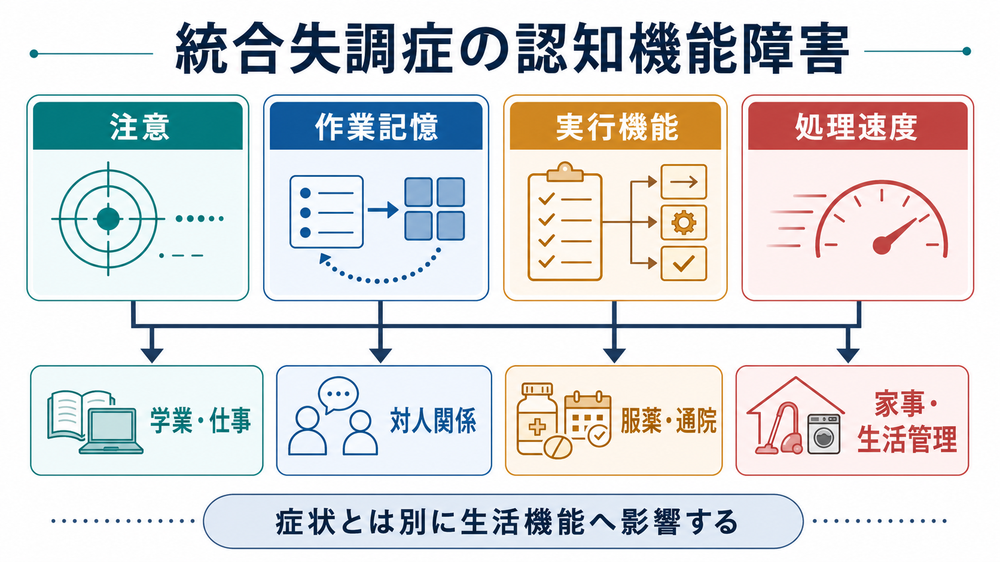
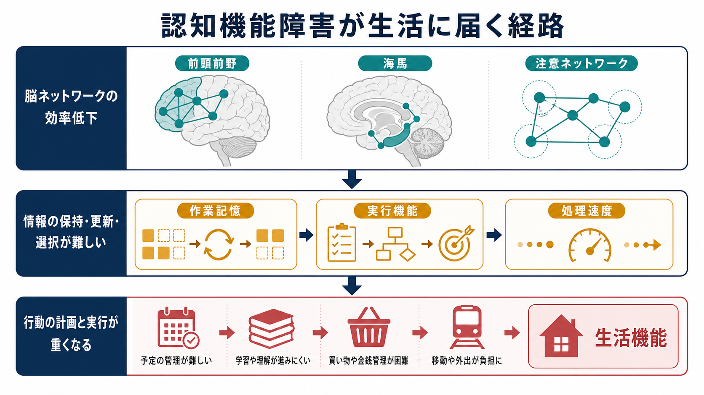
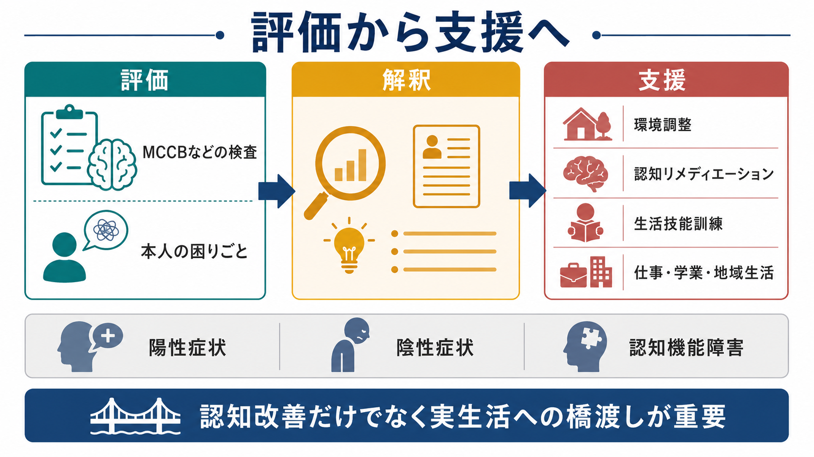

# 統合失調症の認知機能障害とは何か

## 要点

- 統合失調症の認知機能障害とは、幻覚や妄想とは別に、注意、[[ワーキングメモリとは何か|作業記憶]]、[[実行機能とは何か|実行機能]]、処理速度、学習・記憶、社会的認知などが低下し、日常生活の計画・遂行を難しくする状態である。
- 認知機能障害は多くの人で病初期からみられ、症状が落ち着いている時期にも残りやすい。生活機能、就労、学業、対人関係、地域生活の予測因子として重要である[1][2]。
- 認知機能検査の点数だけで本人の困難を決めるのではなく、本人の目標、環境負荷、支援資源、陰性症状・抑うつ・不安・薬剤副作用などを合わせて理解する必要がある。
- 支援では、認知リメディエーション、生活技能訓練、環境調整、就労・就学支援を組み合わせ、検査上の改善を実生活へ橋渡しする視点が重要になる[6][7][8]。

## この記事で答える問い

この記事では、「統合失調症では、なぜ幻覚や妄想が目立たない時期にも生活が難しくなることがあるのか」という問いに答える。中心に置くのは、注意・作業記憶・実行機能・処理速度の低下が、予定管理、会話、買い物、金銭管理、服薬、通院、学業・仕事へどう波及するかである。

## まず結論

統合失調症の認知機能障害は、「頭が悪くなる」という一言では説明できない。むしろ、情報を選ぶ、保つ、更新する、素早く処理する、目標に沿って行動を組み立てる、といった複数の過程が同時に重くなる現象である。たとえば、予定を聞く、必要な物を覚える、交通機関を調べる、時間に間に合うように出る、途中で予定変更に対応する、という一連の行動は、注意、作業記憶、処理速度、実行機能をまとめて使う。

そのため、認知機能障害は、精神病症状の有無だけでは説明しにくい生活上のつまずきを生む。研究レビューでは、神経認知の低下が地域生活、社会的機能、職業機能などの転帰と関連することが繰り返し示されてきた[1][4]。

## 背景

統合失調症は、幻覚、妄想、まとまりにくい思考、陰性症状などで説明されることが多い。しかし臨床と研究では、[[認知機能障害とは何か|認知機能障害]]が中核的な問題として扱われてきた。DSM-5 に認知機能障害を診断基準として明示的に入れるべきかをめぐる議論でも、統合失調症では記憶、注意、作業記憶、問題解決、処理速度、社会的認知の低下が大きく、機能転帰と結びつくことが強調された[3]。

この点が重要なのは、陽性症状が軽くなっても、生活の自立や社会参加がすぐに回復するとは限らないからである。NICE の成人精神病・統合失調症ガイドラインも、早期認識と治療に加えて、長期的な回復、身体健康、家族・介護者支援を含む包括的なケアを重視している[7]。認知機能障害は、その包括的支援の中で「なぜ実生活の行動が重くなるのか」を説明する重要な視点になる。

## 基本概念

### 注意

注意は、必要な情報へ焦点を合わせ、気が散る情報を抑え、一定時間その状態を保つ機能である。[[注意障害とは何か|注意障害]]があると、会話の要点を追う、説明を聞きながら必要な点を抜き出す、作業中に別の刺激へ逸れないようにすることが難しくなる。

### 作業記憶

作業記憶は、情報を短時間保ちながら操作する機能である。たとえば、医師から聞いた服薬変更を頭に置いたまま、生活リズムに合わせて飲む時間を考えるには作業記憶が必要である。統合失調症では、特に言語性作業記憶を含む作業記憶の低下が中核的な認知問題として議論されてきた[2]。

### 実行機能

実行機能は、目標設定、計画、切り替え、抑制、問題解決をまとめる概念である。[[実行機能障害とは何か|実行機能障害]]があると、何から始めるかを決める、途中で計画を修正する、優先順位をつける、不要な行動を止めることが難しくなる。生活場面では、片づけ、金銭管理、就労準備、通院継続などに影響しやすい。

### 処理速度

処理速度は、情報を受け取り、判断し、反応するまでの速さに関わる。処理速度が低いと、理解がないわけではなくても、会話や作業のテンポについていきにくい。周囲が急かすほど負荷が増え、誤りや疲労が増えることがある。処理速度は MATRICS Consensus Cognitive Battery でも主要領域の一つとして扱われる[5]。

## 仕組み

統合失調症の認知機能障害を単一の脳部位だけで説明することはできない。前頭前野、海馬、注意ネットワーク、感覚処理、報酬系、神経伝達、発達過程、ストレス、睡眠、薬剤、身体疾患などが重なって、情報処理の効率を変えると考える方が現実に近い。

重要なのは、脳ネットワークの変化が「検査の点数」だけで終わらず、日常行動の連鎖へ届くことである。情報を保てないと予定が抜けやすい。更新が遅いと急な変更に弱くなる。選択が難しいと買い物や手続きが負担になる。実行機能が重いと、やるべきことは分かっていても開始できない。これは怠けや意志の弱さではなく、認知負荷と環境要求の不一致として理解する必要がある。

## 図解

| 認知領域 | 生活で見える困難 | 支援の入口 |
|---|---|---|
| 注意 | 説明を聞き落とす、刺激で中断される | 短く区切る、書面化する、環境刺激を減らす |
| 作業記憶 | 指示や予定を保持しにくい | メモ、チェックリスト、リマインダー |
| 実行機能 | 始められない、順序立てが難しい | 手順化、共同計画、優先順位づけ |
| 処理速度 | テンポについていけない、疲れやすい | 時間的余裕、待つ支援、速度より正確性の調整 |

この表は診断や治療指示ではなく、困りごとを整理するための見取り図である。実際の支援では、本人が何を達成したいか、どの場面で困るか、何が助けになるかを一緒に確認する。

## 臨床・研究との接続

研究では、MATRICS という枠組みが統合失調症の認知機能評価を標準化する大きな役割を果たした。MATRICS は、処理速度、注意・覚醒、作業記憶、言語学習、視覚学習、推論・問題解決、社会的認知を治療研究で重要な領域として整理した[5]。この枠組みは、[[認知機能検査は何を測っているのか|認知機能検査]]を「単一の知能」ではなく、複数領域のプロファイルとして読むうえで有用である。

ただし、検査成績と実生活は同じものではない。Fett らのメタ分析では、神経認知と社会的認知は機能転帰と関連するが、実生活の転帰には症状、環境、支援、社会的文脈も関与する[4]。したがって、検査で弱い領域を見つけたら、次に「どの生活場面で、どの環境要求とぶつかっているのか」を見る必要がある。

支援に関しては、認知リメディエーションのメタ分析で、認知成績だけでなく心理社会的機能にも改善が示され、特に精神科リハビリテーションと組み合わせた場合に機能面の効果が強いことが報告されている[6]。NICE の複雑な精神病に対するリハビリテーション指針も、認知機能障害、併存症、身体疾患などが社会的・日常的機能へ重く影響しうるため、本人中心のリハビリテーションと地域生活への支援が必要だと整理している[8]。

## よくある誤解

### 誤解1: 認知機能障害は陽性症状が強い時だけ起こる

認知機能障害は、幻覚や妄想の強さだけで説明できない。病前や初回エピソード前後からみられることがあり、症状が落ち着いた後にも残りやすいとされる[2][3]。

### 誤解2: 検査で低いから生活能力がない

検査は重要な手がかりだが、本人の生活能力をそのまま決めるものではない。環境調整、支援者、道具、経験、動機づけ、身体状態によって、同じ認知特性でも生活上の結果は変わる。

### 誤解3: 認知機能障害は本人の努力不足である

認知機能障害は、情報処理の負荷が高くなる状態であり、努力不足と同一視できない。本人に努力を求めるだけでは、疲労や失敗体験が増えることがある。支援では、課題を分ける、外部記憶を使う、作業環境を整える、十分な時間を確保することが有効な場合がある。

### 誤解4: 認知だけ改善すれば生活も自動的に改善する

認知リメディエーションは有用な支援の一つだが、実生活への橋渡しが必要である。訓練課題で改善した能力を、通院、買い物、就労、対人場面へ移すには、リハビリテーション、家族・支援者との協働、環境調整が重要になる[6][8]。

## 関連ノート

- [[認知機能障害とは何か]]
- [[注意障害とは何か]]
- [[ワーキングメモリとは何か]]
- [[実行機能とは何か]]
- [[実行機能障害とは何か]]
- [[認知機能検査は何を測っているのか]]
- [[精神状態診察MSEとは何か]]
- [[ドパミン仮説は統合失調症をどこまで説明できるのか]]
- [[グルタミン酸仮説は統合失調症をどう説明するのか]]
- [[陰性症状は報酬系や認知制御の障害と関係するのか]]

## MOC更新候補

- `content/00_MOC/MOC｜精神医学.md`
- `content/00_MOC/MOC｜神経科学と精神疾患.md`
- `content/00_MOC/MOC｜認知機能.md`
- `content/00_MOC/MOC｜臨床実践・治療.md`

## 理解チェック

1. 統合失調症の認知機能障害が、陽性症状とは別に生活機能へ影響するとはどういう意味か。
2. 注意、作業記憶、実行機能、処理速度は、通院や服薬管理のどの場面に関わるか。
3. 認知機能検査の結果を、本人の実生活支援へつなげるときに確認すべきことは何か。
4. 認知リメディエーションだけでなく、環境調整や生活技能訓練が必要になる理由は何か。

## 参考文献

[1] Green, M. F., Kern, R. S., Braff, D. L., & Mintz, J. (2000). Neurocognitive deficits and functional outcome in schizophrenia: Are we measuring the "right stuff"? *Schizophrenia Bulletin*, 26(1), 119-136. https://doi.org/10.1093/oxfordjournals.schbul.a033430

[2] Bowie, C. R., & Harvey, P. D. (2005). Cognition in schizophrenia: Impairments, determinants, and functional importance. *Psychiatric Clinics of North America*, 28(3), 613-633. https://doi.org/10.1016/j.psc.2005.05.004

[3] Barch, D. M., & Ceaser, A. (2012). Cognition in schizophrenia: Core psychological and neural mechanisms. *Trends in Cognitive Sciences*, 16(1), 27-34. https://doi.org/10.1016/j.tics.2011.11.015

[4] Fett, A.-K. J., Viechtbauer, W., Dominguez, M.-G., Penn, D. L., van Os, J., & Krabbendam, L. (2011). The relationship between neurocognition and social cognition with functional outcomes in schizophrenia: A meta-analysis. *Neuroscience & Biobehavioral Reviews*, 35(3), 573-588. https://doi.org/10.1016/j.neubiorev.2010.07.001

[5] Nuechterlein, K. H., Green, M. F., Kern, R. S., et al. (2008). The MATRICS Consensus Cognitive Battery, Part 1: Test selection, reliability, and validity. *American Journal of Psychiatry*, 165(2), 203-213. https://doi.org/10.1176/appi.ajp.2007.07010042

[6] McGurk, S. R., Twamley, E. W., Sitzer, D. I., McHugo, G. J., & Mueser, K. T. (2007). A meta-analysis of cognitive remediation in schizophrenia. *American Journal of Psychiatry*, 164(12), 1791-1802. https://doi.org/10.1176/appi.ajp.2007.07060906

[7] National Institute for Health and Care Excellence. (2014, updated 2014). *Psychosis and schizophrenia in adults: prevention and management* (Clinical guideline CG178). https://www.nice.org.uk/Guidance/CG178

[8] National Institute for Health and Care Excellence. (2020). *Rehabilitation for adults with complex psychosis* (NICE guideline NG181). https://www.nice.org.uk/guidance/ng181

## 未解決問題

- 認知機能障害の改善が、どの条件で実生活の改善へ最もよく転移するのか。
- 認知リメディエーション、就労支援、家族支援、デジタル補助具をどう組み合わせると、本人の目標に沿った効果が高まるのか。
- 認知機能障害、陰性症状、抑うつ、不安、薬剤副作用、身体疾患を、個別事例でどのように分けて見立てるのが妥当か。
