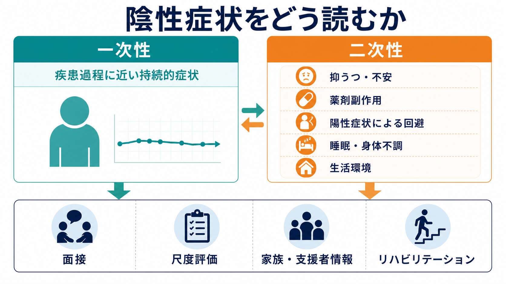
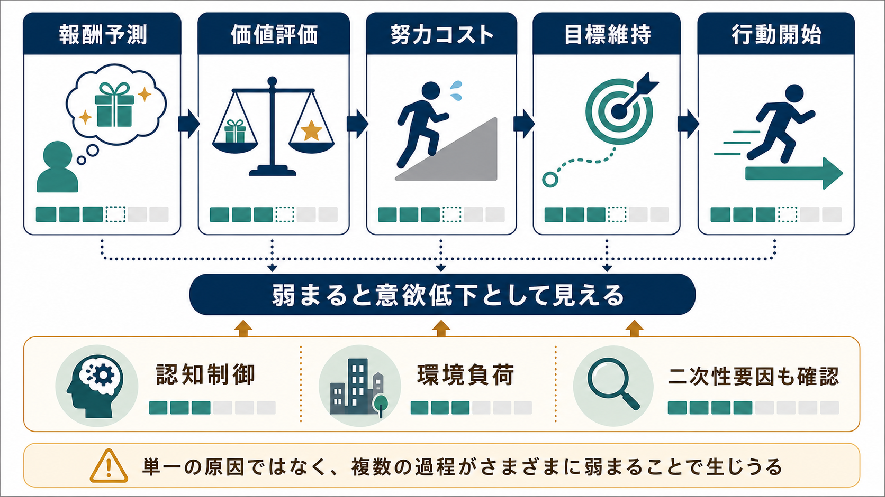

# 統合失調症の陰性症状とは何か

## 要点

- 統合失調症の陰性症状とは、感情表出、会話、意欲、快感、社会参加などが「少なくなる」「始まりにくくなる」症状群である。NIMHは、意欲低下、日常活動への興味・楽しみの低下、社会的引きこもり、感情表出困難、通常機能の困難を陰性症状として説明している[1]。
- 代表的な5領域は、感情鈍麻、会話量低下、快感消失、社会性低下、意欲低下である[2]。
- 近年は、感情鈍麻・会話量低下を含む「表出の低下」と、意欲低下・快感消失・社会性低下を含む「動機づけと快感の低下」という2因子で整理されることが多い[3][7]。
- 陰性症状は[[統合失調症の陽性症状とは何か|陽性症状]]より目立ちにくいが、学業、就労、対人関係、自立生活などの生活機能に強く関わる[3][4]。
- 臨床では、一次性の陰性症状だけでなく、[[うつ病とは何か|抑うつ]]、不安、薬剤性[[パーキンソニズムとは何か|パーキンソニズム]]、[[アカシジアとは何か|アカシジア]]、陽性症状による回避、睡眠・身体不調、孤立した環境などによる二次性の低活動を分けて考える[4][5]。

## この記事で答える問い

1. 統合失調症の陰性症状とは、具体的にどのような症状群なのか。
2. 「怠け」「性格」「単なる内向性」とは何が違うのか。
3. 一次性陰性症状と二次性陰性症状をどう区別して考えるのか。
4. 臨床・研究ではどのように評価し、支援につなげるのか。

## まず結論

陰性症状は、本人の中に「何かがない」と単純に決めつける概念ではない。むしろ、外から見える行動、表情、発話、社会参加、目標に向かう行動が減る方向に現れる症状群である。重要なのは、外から「やる気がない」と見える状態の背後に、報酬を予測する力、価値を見積もる力、努力コストを超えて行動を始める力、目標を保つ力、環境から支えられる条件など、複数の過程が関わる点である[3][4]。

そのため、陰性症状を評価するときは「できていない行動」を数えるだけでは足りない。どの領域が弱いのか、いつから続いているのか、[[統合失調症の認知機能障害とは何か|認知機能障害]]や陽性症状、抑うつ、薬剤副作用、生活環境がどの程度関与しているのかを分けて読む必要がある[5]。

## 背景

[[統合失調症とは何か|統合失調症]]は、陽性症状、陰性症状、認知機能障害など複数の次元から理解される。幻覚や妄想は周囲から気づかれやすい一方で、陰性症状は「話さない」「外出しない」「反応が薄い」「身の回りのことが進まない」といった形で見えるため、本人の努力不足や家族関係の問題として誤解されやすい。

しかし、陰性症状は統合失調症の中核的な症状領域の一つであり、特に持続的な一次性陰性症状は生活機能の低下と結びつきやすい[2][3]。研究上も、治療標的、尺度開発、リハビリテーション、就労支援、家族支援を考えるうえで重要な領域になっている[6][7][8]。

## 基本概念

### 5つの中核領域

NIMH-MATRICSの合意声明以降、陰性症状は次の5領域で整理されることが多い[2]。

| 領域 | 概要 | 日常で見えやすい形 |
|---|---|---|
| 感情鈍麻 | 表情、声の抑揚、身振りなどの感情表出が乏しくなる | うれしい・悲しい場面でも表情変化が少ない |
| 会話量低下 | 自発的な発話や会話の広がりが少なくなる | 質問に短く答える、話題が続きにくい |
| 快感消失 | 楽しみ、または楽しみを予期する力が低下する | 以前楽しめた活動に向かいにくい |
| 社会性低下 | 対人関係への関心や参加が減る | 友人・家族・支援者との接点が減る |
| 意欲低下 | 目標に向けて行動を始め、続ける力が低下する | 受診準備、家事、学業、就労活動が進みにくい |

### 2因子モデル

5領域は、研究上は大きく2つにまとめられることが多い。第一は「表出の低下」で、感情鈍麻と会話量低下を含む。第二は「動機づけと快感の低下」で、意欲低下、快感消失、社会性低下を含む[3][7]。

この区別は臨床的にも有用である。たとえば、表情が乏しい人でも、内的な感情体験や希望が完全に失われているとは限らない。逆に、会話ではよく反応できる人でも、目標を立てて行動を始める過程が弱く、生活機能が大きく制限されることがある。

### 一次性と二次性

一次性陰性症状は、統合失調症の疾患過程に近い、持続的な陰性症状を指す。二次性陰性症状は、別の要因によって陰性症状のように見える状態である[4][5]。

二次性要因には、抑うつ、強い不安、陽性症状による回避、薬剤性の錐体外路症状や鎮静、物質使用、睡眠障害、身体疾患、社会的孤立、刺激の乏しい生活環境などがある。見た目が似ていても、支援の入口が変わるため、この区別は重要である。

## 仕組み

陰性症状の仕組みは単一の原因で説明できない。特に意欲低下や快感消失は、[[報酬系とは何か|報酬系]]、価値学習、努力コスト、認知制御、社会的文脈が重なって生じると考えられる[3][4]。

1. 報酬予測: 「やればよい結果がありそうだ」と予測する。
2. 価値評価: その活動が自分にとって意味を持つか見積もる。
3. 努力コスト: 疲労、不安、手順の複雑さ、失敗可能性を見積もる。
4. 目標維持: 途中で注意や目的を保つ。
5. 行動開始: 実際に動き出し、続ける。

この連鎖のどこかが弱まると、外からは「動かない」「参加しない」「楽しまない」と見えやすい。ここに[[統合失調症の認知機能障害とは何か|認知機能障害]]が加わると、計画、準備、切り替え、記憶、注意の負荷が高まり、行動開始がさらに難しくなる。

## 図解

図1は、陰性症状を一次性と二次性に分けて読むための臨床的整理である。症状が持続しているか、抑うつ・不安・薬剤副作用・陽性症状による回避・睡眠や身体不調・生活環境が関わるかを確認し、面接、尺度評価、家族・支援者情報、リハビリテーションにつなげる。

図2は、報酬予測、価値評価、努力コスト、目標維持、行動開始という流れを示している。陰性症状は「意欲がゼロ」というより、この流れの複数箇所が弱まり、外から意欲低下として見える状態として理解できる。

## 臨床・研究との接続

### 評価

陰性症状の評価では、[[精神状態診察MSEとは何か|精神状態診察]]で表情、声の抑揚、会話量、身振り、活動量を観察するだけでなく、本人の主観的体験、日常の活動頻度、支援者から見た変化を合わせて確認する。

研究・臨床尺度としては、BNSSとCAINSがよく知られている。BNSSは5領域を短時間で評価するために開発された尺度であり、心理測定上の検討も行われている[6]。CAINSは、動機づけ・快感と表出という2因子を明確に扱う面接尺度として開発・検証された[7]。

### 支援

陰性症状への支援は「もっと頑張るよう促す」ことではない。二次性要因を減らし、生活手順を小さくし、成功しやすい活動を設計し、予測可能な環境を作り、精神科リハビリテーションやIPS援助付き雇用などの生活機能支援につなげることが中心になる[8]。

薬物療法は陽性症状や再発予防に重要だが、陰性症状そのものへの効果は限定的な場合がある。特に二次性陰性症状では、薬剤性の鎮静や錐体外路症状、抑うつ、不安、孤立などを見直すことが重要である[4][8]。これは個別の治療指示ではなく、教育・研究目的の一般的整理である。

## よくある誤解

### 誤解1: 陰性症状は怠けである

陰性症状は、報酬予測、価値評価、努力コスト、目標維持、表出、社会参加の障害として現れる。本人の性格や努力不足だけで説明すると、評価と支援の入口を失いやすい。

### 誤解2: 感情鈍麻は感情がないという意味である

感情鈍麻は、表情、声、身振りに感情が出にくい状態を指す。内的な感情体験が完全に消えているとは限らない。観察される表出と主観的体験を分けて聞く必要がある[3]。

### 誤解3: 陰性症状は薬だけで十分に改善する

薬物療法は重要だが、陰性症状、とくに生活機能に直結する意欲低下や社会性低下には、二次性要因の評価、心理社会的支援、リハビリテーション、環境調整が必要になることが多い[4][8]。

### 誤解4: 外出しないなら、すべて社会性低下である

外出しない理由は複数ある。幻聴や被害妄想への反応、抑うつ、不安、身体症状、貧困、移動手段の不足、薬剤副作用、家族関係、地域資源の乏しさでも外出は減る。行動だけでなく、理由と経過を確認する。

## 関連ノート

- [[統合失調症とは何か]]
- [[統合失調症の陽性症状とは何か]]
- [[統合失調症の認知機能障害とは何か]]
- [[統合失調症の前駆期とは何か]]
- [[治療抵抗性統合失調症とは何か]]
- [[報酬系とは何か]]
- [[ドパミン仮説は統合失調症をどこまで説明できるのか]]
- [[MSEで話し方から何がわかるのか]]
- [[MSEで気分と感情をどう区別するか]]
- [[MSEで外観と行動から何を観察するか]]

今後の作成候補:

- 精神科リハビリテーションとは何か
- IPS援助付き雇用とは何か

## 理解チェック

1. 陰性症状の5領域を挙げると何か。
2. 表出の低下と、動機づけ・快感の低下はどう違うか。
3. 一次性陰性症状と二次性陰性症状を区別する理由は何か。
4. 感情鈍麻を「感情がない」と即断してはいけない理由は何か。
5. 陰性症状が生活機能に影響する経路として、どのような過程が考えられるか。

## 参考文献

[1] National Institute of Mental Health. Schizophrenia. https://www.nimh.nih.gov/health/publications/schizophrenia

[2] Kirkpatrick, B., Fenton, W. S., Carpenter, W. T., Jr., & Marder, S. R. (2006). The NIMH-MATRICS consensus statement on negative symptoms. *Schizophrenia Bulletin*, 32(2), 214-219. https://doi.org/10.1093/schbul/sbj053

[3] Marder, S. R., & Galderisi, S. (2017). The current conceptualization of negative symptoms in schizophrenia. *World Psychiatry*, 16(1), 14-24. https://doi.org/10.1002/wps.20385

[4] Correll, C. U., & Schooler, N. R. (2020). Negative symptoms in schizophrenia: A review and clinical guide for recognition, assessment, and treatment. *Neuropsychiatric Disease and Treatment*, 16, 519-534. https://doi.org/10.2147/NDT.S225643

[5] Galderisi, S., Mucci, A., Dollfus, S., Nordentoft, M., Falkai, P., Kaiser, S., Giordano, G. M., Vandevelde, A., Nielsen, M. Ø., Glenthøj, L. B., Sabé, M., Pezzella, P., Bitter, I., & Gaebel, W. (2021). EPA guidance on assessment of negative symptoms in schizophrenia. *European Psychiatry*, 64(1), e23. https://doi.org/10.1192/j.eurpsy.2021.11

[6] Kirkpatrick, B., Strauss, G. P., Nguyen, L., Fischer, B. A., Daniel, D. G., Cienfuegos, A., & Marder, S. R. (2011). The Brief Negative Symptom Scale: Psychometric properties. *Schizophrenia Bulletin*, 37(2), 300-305. https://doi.org/10.1093/schbul/sbq059

[7] Kring, A. M., Gur, R. E., Blanchard, J. J., Horan, W. P., & Reise, S. P. (2013). The Clinical Assessment Interview for Negative Symptoms (CAINS): Final development and validation. *American Journal of Psychiatry*, 170(2), 165-172. https://doi.org/10.1176/appi.ajp.2012.12010109

[8] Galderisi, S., Kaiser, S., Bitter, I., Nordentoft, M., Mucci, A., Sabé, M., Giordano, G. M., Nielsen, M. Ø., Glenthøj, L. B., Pezzella, P., Falkai, P., Dollfus, S., & Gaebel, W. (2021). EPA guidance on treatment of negative symptoms in schizophrenia. *European Psychiatry*, 64(1), e21. https://doi.org/10.1192/j.eurpsy.2021.13

## 未解決問題

- 一次性陰性症状と二次性陰性症状を、日常臨床でどこまで安定して区別できるか。
- 表出の低下と動機づけ・快感の低下が、どの程度異なる神経認知メカニズムを持つか。
- 尺度評価、生活ログ、家族・支援者情報、就労・社会参加データをどう統合すれば、個別支援に使える評価になるか。
- 薬物療法、心理社会的介入、就労支援、家族支援、地域支援の最適な組み合わせは何か。

## MOC更新候補

- `content/00_MOC/` 配下の精神医学、統合失調症、精神症候学、精神科リハビリテーション関連MOCに追加候補。
- 並列ジョブとの衝突を避けるため、本記事作成時点ではMOC本体は更新しない。
