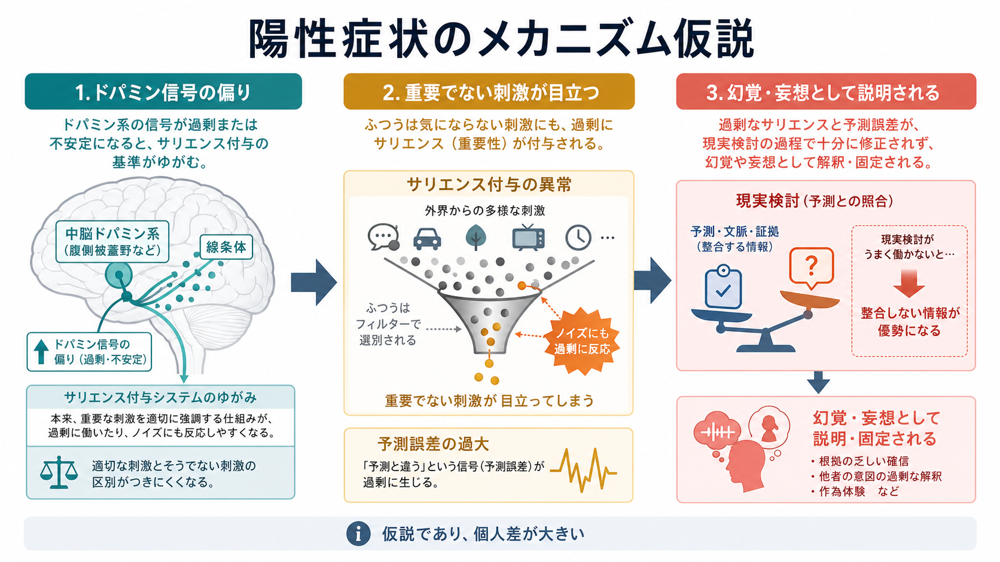
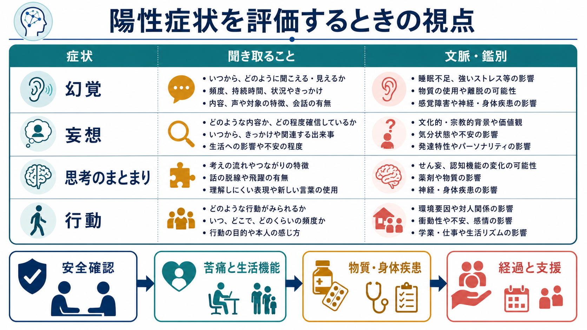

# 統合失調症の陽性症状とは何か

## 要点

- 統合失調症の陽性症状とは、通常の経験に「過剰に加わる」形で現れる症状群であり、代表は幻覚、妄想、思考障害、解体した行動である。
- これらは単なる「奇妙な言動」ではなく、知覚・意味づけ・信念形成・行動制御にまたがる現実検討のゆらぎとして理解できる。
- 陽性症状は診断名そのものではない。気分障害、物質使用、神経・身体疾患、睡眠不足、文化的背景などでも精神病症状は起こりうるため、[[精神状態診察MSEとは何か]]と経過評価が重要になる。
- ドパミン系のサリエンス付与異常や、予測符号化における予測誤差・確信度の異常は、陽性症状を理解する有力な研究モデルである。ただし単一原因として断定できるものではない。

## この記事で答える問い

この記事では、統合失調症の陽性症状を「何が増えている症状なのか」「幻覚・妄想・思考障害はどのようにつながるのか」「臨床では何を確認するのか」という観点から整理する。個別の診断や治療指示ではなく、教育・研究目的の概説である。

## まず結論

統合失調症の陽性症状は、現実を知覚し、意味づけ、他者と共有可能な形で検討する過程が乱れたときに目立つ症状群である。WHO は統合失調症を、現実の知覚の著しい障害と行動の変化を特徴とし、持続する妄想、幻覚、影響・支配・作為体験、まとまりに欠ける思考、著しく解体した行動などを含みうる状態として説明している [1]。NIMH も、精神病症状を「何が現実で何が現実でないかを認識しにくくなる」変化として位置づけ、幻覚・妄想・思考障害を中心に説明している [2]。

## 背景

「陽性」という語は、症状がよいという意味ではない。精神医学では、健康な状態から何かが失われる症状を陰性症状、通常は存在しない体験や表現が加わる症状を陽性症状と呼ぶ。たとえば、意欲低下、感情表出の乏しさ、社会的ひきこもりは陰性症状に近く、幻聴、被害妄想、話の脱線は陽性症状に近い。

DSM-5-TR に基づく診断説明では、統合失調症の特徴的症状として、妄想、幻覚、まとまりのない発話、著しくまとまりのない行動または緊張病性行動、陰性症状が挙げられ、そのうち少なくとも一つは妄想・幻覚・まとまりのない発話である必要があるとされる [3]。したがって陽性症状は診断の中核をなすが、症状の有無だけで診断が決まるわけではない。持続期間、生活機能の低下、気分症状との関係、物質や身体疾患の影響などを含めて評価される。

## 基本概念

### 幻覚

幻覚とは、外界に対応する刺激がないにもかかわらず、知覚として体験される現象である。統合失調症では幻聴、とくに声として体験される幻覚がよく知られるが、視覚、嗅覚、味覚、体感に関する幻覚もありうる [2]。臨床的には「聞こえるか、見えるか」だけでなく、いつから、どの程度の頻度で、どの場面で、本人にとってどのくらい現実味があるか、苦痛や行動への影響があるかを確認する。これは [[MSEで知覚異常をどう聞くか]] と直接つながる。

### 妄想

妄想とは、本人にとって強い確信を伴い、反証されても修正されにくい信念である。内容としては、被害妄想、関係妄想、誇大妄想、身体に関する妄想、作為体験や思考伝播に関わる信念などがある。重要なのは、妄想を「間違った考え」とだけ扱わないことである。本人には切迫した意味や一貫性をもって体験されていることが多く、背景にある不安、孤立、感覚体験、文化的文脈を含めて理解する必要がある [1]。

### 思考障害

思考障害は、考えの流れ、結びつき、まとまりが乱れる状態である。臨床では、本人の頭の中を直接見るのではなく、発話のまとまり、脱線、迂遠、連合弛緩、途絶、新作語などから推定する。DSM-5-TR の診断説明でも、まとまりのない発話は中核的症状の一つに位置づけられる [3]。評価は [[MSEで思考過程をどう評価するか]] と [[MSEで思考内容をどう評価するか]] に分けて考えると整理しやすい。

### 解体した行動

解体した行動とは、目標に沿った行動の組み立てが難しくなり、周囲からは理解しにくい、場面に合わない、または著しくまとまりを欠く行動として見える状態である。衣食住、睡眠、学業、仕事、対人関係に影響しやすく、本人の安全や生活機能の評価が必要になる [1]。

## 仕組み

陽性症状を説明する代表的な仮説の一つが、ドパミン系によるサリエンス付与の異常である。サリエンスとは、ある刺激や考えが「重要だ」「目立つ」「意味がある」と感じられる度合いである。Kapur は、精神病を「異常なサリエンス」の状態として捉え、通常なら通り過ぎる刺激や内的表象に過剰な意味が付与されることで、妄想や幻覚の形成に関与しうると論じた [4]。Howes と Kapur は、統合失調症のドパミン仮説を、遺伝・環境・発達など複数の経路が線条体ドパミン機能の変化に収束し、精神病症状の表現に関与するモデルとして整理している [5]。

もう一つの重要な見方は、予測符号化・ベイズ推論の枠組みである。脳は感覚入力を受動的に受け取るだけでなく、「何が起こっているはずか」という予測と、実際の感覚入力との差である予測誤差を使って世界を推定している。この枠組みでは、幻覚や妄想は、感覚入力、予測、予測誤差、確信度の重みづけがずれた結果として理解される [6]。より新しいレビューでも、精神病では事前信念と感覚データの精度づけが不適応に変化し、幻覚と妄想が同じ枠組みで説明されうる一方、症状ごとの違いも残ると整理されている [7]。

この説明は有用だが、注意点がある。第一に、ドパミンや予測誤差の仮説は、本人の体験を「脳内化学物質だけ」で説明しきるものではない。第二に、陽性症状は統合失調症に特異的ではない。第三に、症状の意味づけは、睡眠、ストレス、孤立、トラウマ、物質使用、身体疾患、文化的背景に影響される。したがって、研究モデルは臨床評価を置き換えるものではなく、評価で得られた現象を理解するための補助線である。

## 図解

### 1. 陽性症状の概念地図

1枚目の図は、幻覚、妄想、思考障害、解体した行動を、現実検討のゆらぎとしてまとめている。症状は独立に並ぶだけでなく、互いに影響する。たとえば幻聴が「誰かが自分を監視している」という妄想的解釈に結びつき、その不安が回避行動や生活リズムの乱れにつながることがある。

### 2. サリエンスと予測誤差

2枚目の図は、ドパミン信号の偏り、重要でない刺激への過剰なサリエンス付与、現実検討の過程での修正困難という流れを示す。ここで大切なのは、症状を「本人の意志の弱さ」や「性格」ではなく、知覚・意味づけ・信念更新の障害として扱うことである。

### 3. 臨床評価の視点

3枚目の図は、陽性症状を聞き取るときの視点をまとめている。安全確認、苦痛と生活機能、物質・身体疾患、経過と支援を分けて確認することで、「症状名を当てる」だけでなく、本人が何に困っているのかを見落としにくくなる。

## 臨床・研究との接続

臨床では、陽性症状を確認するときに、まず本人の体験を尊重しながら、確信度、苦痛、行動への影響、安全性を評価する。たとえば、幻聴があるだけで緊急性が高いとは限らない。一方で、命令性の声、自傷他害への切迫、強い被害確信、食事や睡眠の破綻がある場合は、慎重な安全評価が必要になる。ここは [[精神科で重症度をどう判断するか]]、[[病識とは何か]]、[[器質性精神障害を見逃さないためには何を見るべきか]] と関連する。

鑑別では、気分エピソードに伴う精神病症状、物質使用や離脱、せん妄、てんかん、神経変性疾患、内分泌・代謝異常、感染症、薬剤性の症状などを考える。診断名を急いで固定するよりも、時間経過、生活機能、身体所見、薬物・アルコール使用、家族や支援者からの情報を合わせることが重要である [8]。

研究では、陽性症状はドパミン、グルタミン酸、感覚予測、自己モニタリング、社会的認知、ストレス応答など多層のメカニズムと関連づけて検討されている。[[ストレス脆弱性モデルとは何か]] の観点からは、遺伝的・発達的脆弱性、環境ストレス、睡眠、孤立、物質使用などが、発症や再燃のリスクを変化させる要因として整理できる。

## よくある誤解

### 「陽性症状があるなら必ず統合失調症である」

これは誤りである。幻覚や妄想は、統合失調症以外の精神疾患、物質使用、身体疾患、睡眠不足、強いストレスなどでも起こりうる。診断には、症状の種類だけでなく、持続期間、機能低下、気分症状との時間関係、身体・薬物要因の除外が必要である [3]。

### 「妄想は説得すれば消える」

妄想は、本人にとって強い確信と情動的な意味を伴うことが多い。正面から否定すると、防衛的になったり孤立が深まったりすることがある。臨床的には、信念の真偽を争うよりも、苦痛、睡眠、安全、生活上の困りごと、支援可能性を確認する姿勢が重要である。これは [[心理教育とは何か]] や [[共同意思決定とは何か]] ともつながる。

### 「幻聴はすべて危険である」

幻聴の内容、頻度、命令性、本人の距離の取り方、苦痛、行動への影響によってリスクは大きく異なる。多くの場合、本人は症状に苦しみながらも生活を維持しようとしている。リスクだけに注目すると、スティグマを強める可能性がある。NIMH も、統合失調症の人は暴力的であるという一般化を避け、むしろ被害を受けやすい側面にも注意を促している [2]。

### 「脳の病気だから心理社会的支援は関係ない」

陽性症状には神経生物学的基盤が関与するが、症状の悪化・軽減、本人の意味づけ、生活機能、回復には心理社会的要因も大きく関わる。WHO は薬物療法だけでなく、心理教育、家族介入、認知行動療法、心理社会的リハビリテーションなどを含む支援の重要性を述べている [1]。

## 関連ノート

- [[精神状態診察MSEとは何か]]
- [[MSEで知覚異常をどう聞くか]]
- [[MSEで思考過程をどう評価するか]]
- [[MSEで思考内容をどう評価するか]]
- [[病識とは何か]]
- [[器質性精神障害を見逃さないためには何を見るべきか]]
- [[ストレス脆弱性モデルとは何か]]
- [[心理教育とは何か]]
- MOC更新候補: [[MOC｜精神医学]], [[MOC｜症候学]], [[MOC｜神経科学と精神疾患]]

## 理解チェック

1. 陽性症状の「陽性」は、症状が望ましいという意味ではなく、通常の経験に何かが加わるという意味である。
2. 幻覚は知覚の異常、妄想は信念形成の異常、思考障害は考えの流れやまとまりの異常として整理できる。
3. 陽性症状があることだけでは統合失調症とは診断できず、経過、生活機能、気分症状、物質・身体疾患の影響を確認する必要がある。
4. ドパミン系のサリエンス付与異常や予測符号化モデルは、陽性症状を理解する研究モデルであり、個々の体験を単純化して断定するためのものではない。

## 参考文献

[1] World Health Organization. (2025). *Schizophrenia*. https://www.who.int/news-room/fact-sheets/detail/schizophrenia

[2] National Institute of Mental Health. (n.d.). *Schizophrenia*. https://www.nimh.nih.gov/health/publications/schizophrenia

[3] Merck Manual Professional Edition. (2025). *Schizophrenia*. https://www.merckmanuals.com/professional/psychiatric-disorders/schizophrenia-and-related-disorders/schizophrenia

[4] Kapur, S. (2003). Psychosis as a State of Aberrant Salience: A Framework Linking Biology, Phenomenology, and Pharmacology in Schizophrenia. *American Journal of Psychiatry, 160*(1), 13-23. https://doi.org/10.1176/appi.ajp.160.1.13

[5] Howes, O. D., & Kapur, S. (2009). The Dopamine Hypothesis of Schizophrenia: Version III-The Final Common Pathway. *Schizophrenia Bulletin, 35*(3), 549-562. https://doi.org/10.1093/schbul/sbp006

[6] Fletcher, P. C., & Frith, C. D. (2009). Perceiving is believing: a Bayesian approach to explaining the positive symptoms of schizophrenia. *Nature Reviews Neuroscience, 10*, 48-58. https://doi.org/10.1038/nrn2536

[7] Sterzer, P., Adams, R. A., Fletcher, P., Frith, C., Lawrie, S. M., Muckli, L., Petrovic, P., Uhlhaas, P., Voss, M., & Corlett, P. R. (2018). The Predictive Coding Account of Psychosis. *Biological Psychiatry, 84*(9), 634-643. https://doi.org/10.1016/j.biopsych.2018.05.015

[8] Hany, M., & Rizvi, A. (2024). *Schizophrenia*. StatPearls. https://www.ncbi.nlm.nih.gov/books/NBK539864/

## 未解決問題

- 幻覚、妄想、思考障害が同じメカニズムから生じるのか、それとも一部だけを共有する異なる経路なのかは、まだ十分に確定していない。
- ドパミン、グルタミン酸、予測誤差、社会的ストレスを、個人ごとの症状変化や回復過程にどう結びつけるかは研究途上である。
- 症状評価を標準化しつつ、本人の主観的意味や文化的背景を損なわない記述方法が課題である。
