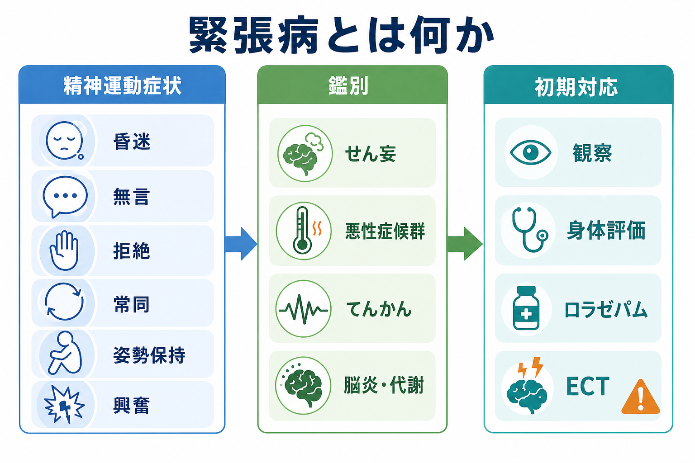
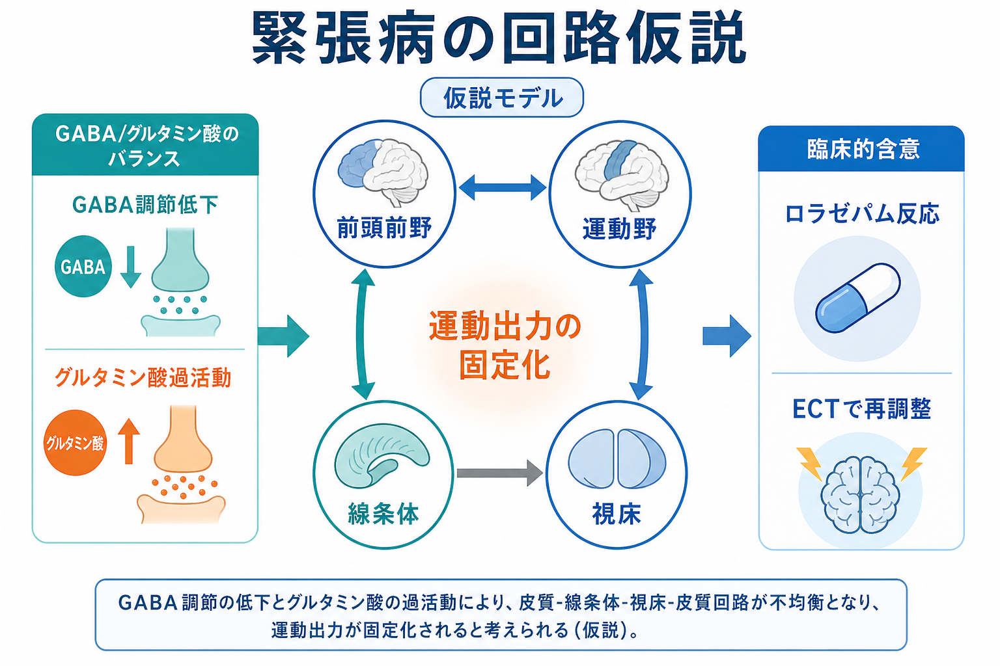
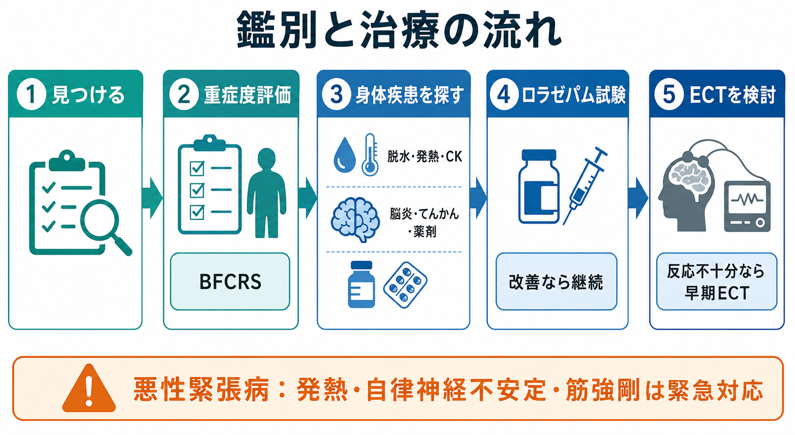

# 緊張病とは何か

## 要点

- 緊張病は、昏迷、無言、拒絶、姿勢保持、常同、反響言語、反響動作、目的の乏しい興奮などが組み合わさる精神運動症候群である。
- かつては統合失調症と強く結びつけて理解されていたが、現在は気分障害、精神病性障害、自閉スペクトラム症、神経疾患、自己免疫性脳炎、代謝・内分泌疾患、薬剤性状態など幅広い背景で起こりうる症候群として扱う[1][2]。
- 診断は観察と診察が中心で、DSM-5-TR/ICD-11では概ね複数の緊張病徴候の存在を重視する。Bush-Francis Catatonia Rating Scale（BFCRS）はスクリーニングと重症度評価に広く用いられる[1][3]。
- 鑑別では、[[せん妄とは何か]]、悪性症候群、非けいれん性てんかん重積、脳炎、薬剤性・中毒性状態、重度抑うつ、解離、パーキンソニズムなどを並行して考える[1][4]。
- 治療は、身体合併症の予防・評価、原因疾患への対応、ベンゾジアゼピン系薬、電気けいれん療法（ECT）を組み合わせて考える。悪性緊張病では発熱、自律神経不安定、筋強剛、意識変容を伴い、緊急性が高い[1][5]。

## この記事で答える問い

1. 緊張病は「病名」なのか、「症候群」なのか。
2. 昏迷・拒絶・常同・興奮を、どう一つの臨床像として理解するのか。
3. どの疾患を見逃すと危険なのか。
4. ロラゼパム反応性やECTは、緊張病理解に何を示しているのか。

## まず結論

緊張病は、意欲がない、反抗している、精神病だから固まっている、という単純な理解では捉えにくい。中核にあるのは、運動開始、運動停止、姿勢、発話、外界への応答が全体として障害される「精神運動の調律不全」である。したがって、[[MSEで外観と行動から何を観察するか]]や[[精神運動制止とは何か]]の延長で見るだけでなく、身体疾患、薬剤、神経疾患、精神科救急を同時に考える必要がある。

## 背景

緊張病は19世紀にKahlbaumが記載した古典的症候群だが、20世紀には長く「緊張型統合失調症」のイメージに吸収されてきた。現在の分類では、[[統合失調症とは何か]]だけでなく、双極性障害、うつ病、神経発達症、一般身体疾患、薬剤・物質の影響に伴って起こる横断的症候群として扱われる[1][2]。

疫学的には、臨床サンプルにおける緊張病の平均有病割合はメタ解析で約9%と推定されるが、対象集団、診断基準、評価尺度によって大きく変動する[6]。このばらつきは、緊張病が珍しいからというより、観察しないと見逃されやすく、しかも背景疾患が多様であることを反映している。

緊張病を見逃すことの臨床的意味は大きい。低栄養、脱水、誤嚥、深部静脈血栓、褥瘡、横紋筋融解、自律神経不安定などの身体合併症が起こりうる。さらに、抗精神病薬への反応が悪い、あるいは悪化する場面もあり、通常の精神病性興奮や陰性症状と同じ方針で扱うと危険になりうる[1][5]。

## 基本概念

### 緊張病徴候

緊張病で観察される徴候は、少なくとも次の群に分けると理解しやすい。

| 群 | 例 | 観察のポイント |
|---|---|---|
| 運動低下 | 昏迷、無動、無言、凝視、摂食低下 | 眠っているのではなく覚醒しているのに応答・運動が乏しい |
| 運動固定 | 姿勢保持、カタレプシー、ろう屈症、筋強剛 | 不自然な姿勢や抵抗が持続する |
| 運動過剰 | 目的の乏しい興奮、衝動性、常同、衒奇症 | 外的刺激に比例しない行動として出る |
| 反応様式 | 拒絶、命令自動、反響言語、反響動作 | 「協力しない」ではなく反応形式の異常として見る |
| 自律神経・全身 | 発熱、頻脈、血圧変動、脱水、CK上昇 | 悪性緊張病や悪性症候群との鑑別を要する |

DSM-5-TRでは複数の緊張病徴候の組み合わせを診断の中核に置き、BAPガイドラインもDSM-5-TRまたはICD-11と同様に、3つ以上の緊張病徴候を基準に診断することを推奨している[1]。ただし、診断基準は「緊張病を疑うための入口」であって、原因検索や安全評価を省略してよいという意味ではない。

### BFCRS

BFCRSは、緊張病徴候を系統的に拾うための代表的尺度である。原著では23項目の評価尺度と14項目のスクリーニング版が作られ、評価者間信頼性が示された[3]。臨床的には、初回評価で徴候の見落としを減らすこと、ロラゼパム試験やECT前後の変化を見ること、[[精神科診断面接で尺度をどう使うか]]を具体化することに役立つ。

## 仕組み

緊張病の神経機構は確定していない。現在の理解では、GABA、グルタミン酸、ドパミンなどの神経伝達、前頭前野・運動野・基底核・視床を含む運動制御回路、情動・自律神経系の相互作用が関与すると考えられている[2][4]。

特にGABA機能低下とグルタミン酸過活動の仮説は、ベンゾジアゼピン系薬への反応性やECTの有効性を説明する枠組みとして使われる[2][4]。ただし、これは単一原因モデルではない。緊張病は一つの神経伝達物質の過不足というより、運動開始・抑制・予測・環境応答を統合する回路が、背景疾患や薬剤、炎症、代謝異常によって不安定化した状態と考える方が近い。

この点で、緊張病は[[GABAは脳で何をしているのか]]、[[グルタミン酸仮説は統合失調症をどう説明するのか]]、[[脳ネットワークの破綻は精神疾患をどう説明するのか]]をつなぐ臨床的入口になる。もっとも、画像検査や脳波だけで緊張病を「診断」できるわけではなく、検査は主に原因検索と鑑別のために位置づけられる[1]。

## 図解

緊張病を疑う場面では、症状名を当てるよりも、次の流れで考えると実践に接続しやすい。

| 段階 | 見ること | 目的 |
|---|---|---|
| 1. 見つける | 昏迷、無言、拒絶、姿勢保持、常同、興奮 | 「意思の問題」ではなく症候群として拾う |
| 2. 測る | BFCRS、バイタル、摂食・水分、意識水準 | 重症度と変化を追う |
| 3. 探す | 薬剤、感染、代謝、脳炎、てんかん、悪性症候群 | 可逆的・危険な原因を見逃さない |
| 4. 試す | ロラゼパム反応性、支持療法 | 診断補助と治療を兼ねる |
| 5. 進める | ECT、原因疾患治療、合併症予防 | 遷延化と悪性化を防ぐ |

## 臨床・研究との接続

### 鑑別診断

緊張病の鑑別で重要なのは、似ている症状を一つずつ否定するより、同時に存在しうる状態を見落とさないことである。[[鑑別診断とは何か]]や[[器質性精神障害を見逃さないためには何を見るべきか]]の原則がそのまま当てはまる。

| 鑑別 | 似ている点 | 注意点 |
|---|---|---|
| せん妄 | 意識・注意の変動、興奮、活動性低下 | 緊張病と併存することがあり、注意障害だけで説明しきれない姿勢保持や反響症状を見る |
| 悪性症候群 | 発熱、筋強剛、CK上昇、自律神経不安定 | ドパミン遮断薬の開始・増量、鉛管様筋強剛、白血球増多などの文脈を見る[5] |
| 非けいれん性てんかん重積 | 無反応、意識変容、奇異な行動 | 脳波を含む神経学的評価を考える |
| 自己免疫性脳炎・感染・代謝 | 精神症状、意識変容、運動異常 | 発熱、神経徴候、急性発症、検査異常を手がかりにする |
| 重度うつ病・精神病性障害 | 無言、活動低下、拒食、妄想 | 背景診断より先に緊張病そのものへの対応が必要なことがある |
| 薬剤性・物質性状態 | 鎮静、興奮、筋強剛、離脱 | [[薬剤性精神症状とは何か]]として服薬・中断・中毒を確認する |

### 治療導線

BAPガイドラインは、緊張病を同定したら、全ての検査結果を待つのではなく、緊張病への治療、背景疾患への治療、合併症予防を並行して進めることを推奨している[1]。第一選択としてはベンゾジアゼピン系薬、特にロラゼパムがよく用いられ、反応が乏しい場合、悪性緊張病、重症例、または背景疾患からECTが適切な場合にはECTを早期に検討する[1][4]。

ここで重要なのは、ロラゼパム試験を「緊張病なら必ず効く検査」と過信しないことである。反応が乏しくても緊張病を否定できず、遷延例や統合失調症を背景とする例では反応が限定的なことがある[2][4]。また、鎮静、呼吸抑制、転倒、身体疾患、併用薬などのリスク評価は不可欠であり、個別の投薬判断は臨床現場で行われるべきである。

### 研究上の位置づけ

研究上、緊張病は精神疾患のカテゴリーを横断する症候群として重要である。統合失調症、気分障害、自閉スペクトラム症、神経疾患、自己免疫疾患などを横断して現れるため、[[精神疾患の次元的理解とは何か]]やRDoC的な発想と相性がよい。運動、発話、意欲、予測、情動、自律神経を一体として見ることで、精神症状を「主観的訴え」だけでなく、観察可能な身体化された行動として研究できる。

## よくある誤解

### 誤解1：緊張病は統合失調症の一型である

現在は、統合失調症に限定される症候群ではない。気分障害、一般身体疾患、神経疾患、薬剤性状態でも起こりうる[1][2]。

### 誤解2：動かない人だけが緊張病である

緊張病には興奮型の表現もあり、目的の乏しい運動興奮、常同、衝動性として現れることがある[2]。活動性が高いから緊張病ではない、とは言えない。

### 誤解3：拒絶は本人の意思や反抗である

拒絶、無言、摂食低下は、意思決定や対人態度だけで説明しない。精神運動症候群として観察し、脱水、栄養、身体合併症、安全を評価する。

### 誤解4：抗精神病薬を増やせばよい

精神病性症状が背景にあっても、緊張病が前景にある場合は抗精神病薬で悪化する可能性がある。悪性症候群や悪性緊張病との鑑別も必要であり、[[精神科救急では何を優先するべきか]]の問題として扱う[1][5]。

## 関連ノート

- [[せん妄とは何か]]
- [[精神運動制止とは何か]]
- [[精神状態診察MSEとは何か]]
- [[MSEで外観と行動から何を観察するか]]
- [[器質性精神障害を見逃さないためには何を見るべきか]]
- [[薬剤性精神症状とは何か]]
- [[統合失調症とは何か]]
- [[GABAは脳で何をしているのか]]
- [[グルタミン酸仮説は統合失調症をどう説明するのか]]

## MOC更新候補

- `content/00_MOC/MOC｜精神医学.md`
- `content/00_MOC/MOC｜総論・診断・面接.md`
- `content/00_MOC/MOC｜臨床実践・治療.md`
- `content/00_MOC/MOC｜神経科学と精神疾患.md`

## 理解チェック

1. 緊張病を、統合失調症ではなく「精神運動症候群」として捉える利点は何か。
2. 昏迷、拒絶、興奮が同じ症候群に含まれるのはなぜか。
3. 悪性症候群、せん妄、非けいれん性てんかん重積を鑑別に入れる理由は何か。
4. BFCRSは、診断名を決めるためだけでなく、どのような臨床判断に役立つか。
5. ロラゼパム反応性とECTの有効性は、GABA/グルタミン酸仮説とどのように接続されるか。

## 未解決問題

- DSM-5-TR、ICD-11、BFCRSのどの閾値が、どの臨床場面で最も有用かは完全には一致していない。
- 緊張病の神経回路モデルは有力だが、個別症例の原因診断や治療選択を直接決めるバイオマーカーにはまだなっていない。
- 悪性緊張病、悪性症候群、せん妄、自己免疫性脳炎が重なる症例で、治療順序をどう最適化するかには臨床的判断が大きい。
- ベンゾジアゼピン、ECT、抗精神病薬、原因疾患治療の組み合わせを検証する大規模試験は限られている[1]。

## 参考文献

[1] Rogers, J. P., Oldham, M. A., Fricchione, G., Northoff, G., Wilson, J. E., Mann, S. C., Francis, A., Wieck, A., Wachtel, L. E., Lewis, G., Grover, S., Hirjak, D., Ahuja, N., Zandi, M. S., Young, A. H., Fone, K., Andrews, S., Kessler, D., Saifee, T., Gee, S., Baldwin, D. S., & David, A. S. (2023). Evidence-based consensus guidelines for the management of catatonia: Recommendations from the British Association for Psychopharmacology. *Journal of Psychopharmacology, 37*(4), 327-369. https://doi.org/10.1177/02698811231158232

[2] Rasmussen, S. A., Mazurek, M. F., & Rosebush, P. I. (2016). Catatonia: Our current understanding of its diagnosis, treatment and pathophysiology. *World Journal of Psychiatry, 6*(4), 391-398. https://doi.org/10.5498/wjp.v6.i4.391

[3] Bush, G., Fink, M., Petrides, G., Dowling, F., & Francis, A. (1996). Catatonia. I. Rating scale and standardized examination. *Acta Psychiatrica Scandinavica, 93*(2), 129-136. https://doi.org/10.1111/j.1600-0447.1996.tb09814.x

[4] Sienaert, P., Dhossche, D. M., Vancampfort, D., De Hert, M., & Gazdag, G. (2014). A clinical review of the treatment of catatonia. *Frontiers in Psychiatry, 5*, 181. https://doi.org/10.3389/fpsyt.2014.00181

[5] Iyer, V., Spurling, B. C., & Rizvi, A. (2025). Catatonia. In *StatPearls*. StatPearls Publishing. https://www.ncbi.nlm.nih.gov/books/NBK430842/

[6] Solmi, M., Pigato, G. G., Roiter, B., Guaglianone, A., Martini, L., Fornaro, M., Monaco, F., Carvalho, A. F., Stubbs, B., Veronese, N., & Correll, C. U. (2018). Prevalence of catatonia and its moderators in clinical samples: Results from a meta-analysis and meta-regression analysis. *Schizophrenia Bulletin, 44*(5), 1133-1150. https://doi.org/10.1093/schbul/sbx157

