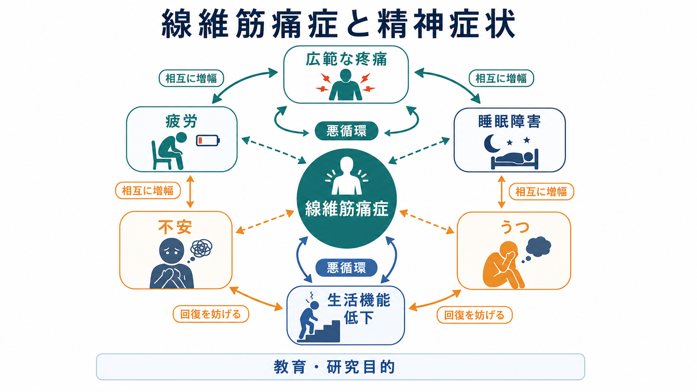
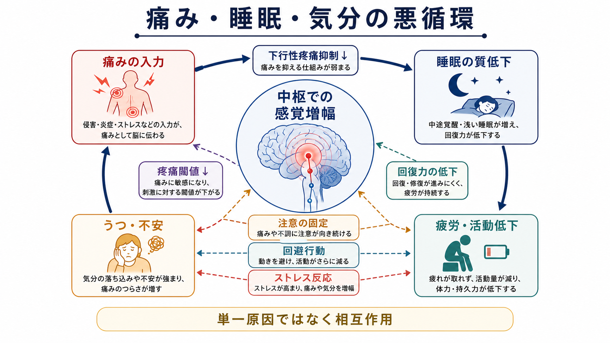
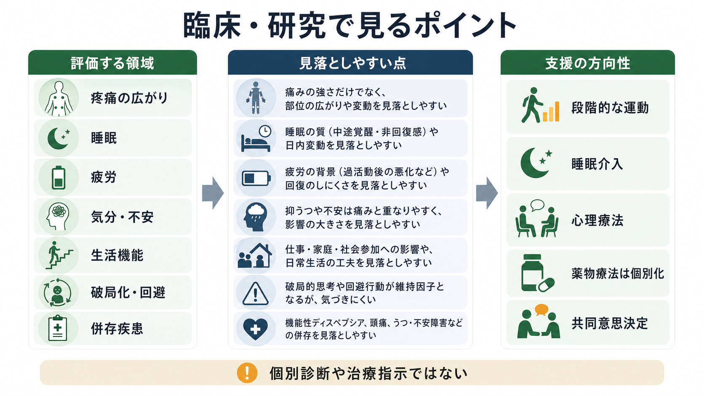

# 線維筋痛症と精神症状はどう関係するのか

## 要点

- 線維筋痛症は、広範な疼痛、疲労、睡眠障害、認知のにぶさ、気分・不安症状がまとまって現れやすい慢性疼痛症候群である[1]。
- うつや不安は「痛みの原因を心理だけに還元する」ための説明ではない。痛み、睡眠、疲労、注意、活動量、ストレス反応が互いに増幅する一部として理解する。
- 評価では、疼痛の広がりだけでなく、睡眠、疲労、生活機能、[[うつ病とは何か|うつ病]]、不安症状、破局化、回避行動、併存疾患を並行してみる。
- 支援は単独の特効薬を探すより、教育、段階的な運動、睡眠介入、心理療法、薬物療法の個別化を組み合わせる方向で考える[7]。

## この記事で答える問い

1. 線維筋痛症では、なぜ痛みだけでなく疲労、睡眠障害、うつ、不安が一緒に問題になりやすいのか。
2. 精神症状は、線維筋痛症の「原因」なのか「結果」なのか、それとも相互作用なのか。
3. 臨床や研究では、どの評価軸を持つと見落としが減るのか。

## まず結論

線維筋痛症と精神症状の関係は、単純な一方向の因果ではなく、**中枢神経系の感覚増幅、睡眠の質低下、疲労、活動低下、痛みへの注意、うつ・不安が循環する関係**として捉えるのが実用的である。診断基準でも、広範疼痛に加えて疲労、起床時の非回復感、認知症状などの重症度を評価する枠組みが用いられてきた[2]。

つまり、精神症状は「痛みが気のせいである」という意味ではない。むしろ、痛みが長く続くほど睡眠が浅くなり、疲労で活動が減り、活動低下が体力低下と孤立を招き、抑うつ・不安が痛みへの注意や予期不安を強める、という悪循環が起こりうる。

## 背景

線維筋痛症は、検査で明確な炎症や組織損傷が示されないことも多いため、誤解されやすい。公的な解説では、慢性的で広範な痛み、疲労、睡眠障害、集中・記憶の困難、気分症状が代表的症状として整理され、疼痛感受性の上昇や疼痛関連神経経路の変化が関わると説明されている[1]。

精神医学的には、線維筋痛症は[[身体症状症とは何か|身体症状症]]と混同されやすい。しかし、線維筋痛症は疼痛処理の変化を含む慢性疼痛状態として扱われ、身体症状症は症状への過剰な思考・感情・行動のパターンに焦点を当てる診断である。両者が重なることはあるが、同一ではない。

## 基本概念

### 線維筋痛症

線維筋痛症は、広範な疼痛を中心に、疲労、非回復性睡眠、認知症状、頭痛、過敏性腸症候群などを伴いうる状態である[1]。2010年のACR予備診断基準では、圧痛点だけに依存せず、広範疼痛指数と症状重症度を組み合わせ、疲労、起床時の非回復感、認知症状、身体症状の広がりを評価する方向が示された[2]。

### 精神症状

ここでいう精神症状は、主に抑うつ、不安、焦燥、睡眠の質低下、注意・記憶の困難、痛みへの過剰な警戒、回避行動を指す。線維筋痛症患者ではうつ・不安が高頻度に報告され、2025年にオンライン公開されたメタ解析では、線維筋痛症患者における不安の統合有病割合は約46.6%、抑うつは約50.8%と推定された[4]。ただし、研究間の異質性が大きいため、この数値は「半数前後で問題になりうる」という目安として読むべきである。

### 慢性疼痛としての位置づけ

線維筋痛症は[[慢性疼痛と精神疾患はどう関係するのか|慢性疼痛と精神疾患]]の代表的な接点である。痛みが長く続くと、神経系の感作、睡眠不足、活動制限、社会的役割の喪失が重なり、気分や不安が変化する。逆に、うつ・不安・睡眠障害は痛みの閾値や痛みへの注意を変え、疼痛体験を強める可能性がある[3]。

## 仕組み

### 1. 中枢での感覚増幅

線維筋痛症では、末梢組織の損傷だけで痛みを説明しきれない場合が多い。臨床レビューでは、線維筋痛症を中枢神経系の疼痛増幅を特徴とする「centralized pain」の一型として捉える説明が提示されている[3]。脳画像研究の系統的レビューも、前帯状皮質や前頭前野など痛み・情動・認知制御に関わる領域の変化と中枢感作の関連を検討している[8]。

この視点は、[[疼痛と精神疾患は脳内でどうつながるのか]]や[[身体症状症は脳の予測処理で説明できるのか]]とも接続できる。痛みは「組織からの入力」だけでなく、脳が入力をどう予測し、注意し、意味づけ、調整するかによって変化する。

### 2. 睡眠障害が痛みと気分をつなぐ

線維筋痛症では、眠っても回復感が乏しい、途中覚醒が多い、睡眠効率が低いといった問題がよくみられる。睡眠に関するメタ解析では、線維筋痛症群は健常対照群に比べ、主観的睡眠の悪化だけでなく、睡眠効率低下、入眠困難、睡眠中覚醒の増加などが示された[5]。睡眠、痛み、抑うつ、身体機能を1年追跡した研究では、これらが相互に関連し、睡眠問題が疼痛・抑うつ・機能に重要な位置を占めることが示唆された[6]。

したがって、[[不眠障害とは何か|不眠障害]]や[[睡眠障害とは何か|睡眠障害]]の評価は、単なる併存症チェックではなく、疼痛悪循環の中心をみる作業になる。実務上は[[精神科診察で睡眠をどう評価するか]]のように、睡眠時間だけでなく、睡眠効率、中途覚醒、日中の眠気、非回復感、睡眠時無呼吸やむずむず脚症候群の可能性も確認する。

### 3. うつ・不安は痛みの「意味づけ」と「行動」を変える

抑うつが強いと、活動量が落ち、報酬経験が減り、痛み以外の刺激に注意を向けにくくなる。不安が強いと、痛みの増悪を予期して活動を避けやすくなる。これらは痛みを直接「作る」というより、痛みの注意配分、回避行動、睡眠、社会参加を通じて、痛みの持続条件を強める。

この構図は[[素因ストレスモデルとは何か]]や[[ストレス脆弱性モデルとは何か]]に近い。脆弱性、痛み、睡眠不足、生活ストレス、孤立が重なると症状が悪化しやすく、逆に支援資源、睡眠改善、活動の再構築、心理的柔軟性が増えると悪循環を弱めやすい。

## 図解

上の2枚の図は、線維筋痛症を「痛みだけの病気」とも「心だけの問題」とも見ないための見取り図である。

| 視点 | 見るもの | 精神症状との関係 |
|---|---|---|
| 疼痛処理 | 広範疼痛、痛覚過敏、アロディニア | 不安や注意の固定が痛みの目立ちやすさを変える |
| 睡眠 | 非回復性睡眠、中途覚醒、睡眠効率 | 睡眠低下が疲労・抑うつ・痛みを悪化させる |
| 疲労 | 易疲労、活動後の悪化、回復困難 | 活動低下と自己効力感低下につながる |
| 気分・不安 | 抑うつ、不安、焦燥、破局化 | 回避行動、予期不安、孤立を通じて疼痛を維持する |
| 生活機能 | 家事、仕事、学業、対人関係 | 機能低下が抑うつ・不安の二次的要因になる |

## 臨床・研究との接続

臨床では、線維筋痛症の評価を「痛みの強さ」だけで終えないことが重要である。疼痛の分布、睡眠、疲労、認知症状、気分・不安、生活機能、薬物、併存するリウマチ性疾患、甲状腺疾患、貧血、睡眠時無呼吸などを確認する。精神科側では[[疼痛症状は精神科でどう評価するか]]の観点が有用で、身体疾患の見落としと、症状の心理社会的維持因子の見落としを両方避ける必要がある。

治療・支援について、EULAR勧告は、教育と非薬物的アプローチを基盤に置き、運動療法を中心的に推奨し、心理療法や薬物療法は症状の性質に応じて個別化する方針を示した[7]。この方針は、うつや不安を「別問題」として切り離すのではなく、痛み、睡眠、疲労、活動、気分を同時に扱う多面的支援と相性がよい。

研究では、線維筋痛症を単一疾患として均質に扱いすぎると、結果の解釈が難しくなる。抑うつ・不安の重症度、睡眠障害、薬物使用、身体活動量、疼痛期間、併存疾患を層別化しないと、「何が痛みを悪化させているのか」「どの介入が誰に効くのか」が見えにくい。

## よくある誤解

### 誤解1: 線維筋痛症は「検査で異常がないから精神疾患である」

これは不正確である。線維筋痛症では通常の血液検査やX線で説明できないことがあるが、それは「痛みが存在しない」という意味ではない。中枢神経系の疼痛処理、睡眠、疲労、情動、注意が関与する慢性疼痛状態として理解する[3]。

### 誤解2: うつや不安を治せば、痛みは必ず消える

うつ・不安への介入は重要だが、痛みの全体を説明する単独因子ではない。睡眠、活動量、身体疾患、薬物、対人・職場環境、疼痛処理の変化も同時に評価する必要がある。

### 誤解3: 運動すればよいので、精神症状は見なくてよい

運動は重要な介入候補だが、強すぎる負荷は挫折や症状悪化の体験につながることがある。抑うつ、不安、睡眠不足、恐怖回避が強い場合、段階づけ、目標設定、心理教育、共同意思決定が必要になる[7]。

### 誤解4: 身体症状症と同じである

線維筋痛症と身体症状症は重なることがあるが、同義ではない。線維筋痛症では広範疼痛、疲労、睡眠、疼痛処理の変化が中心であり、身体症状症では症状に対する過剰な思考・感情・行動が診断上の焦点になる。

## 関連ノート

- [[慢性疼痛と精神疾患はどう関係するのか]]
- [[疼痛と精神疾患は脳内でどうつながるのか]]
- [[疼痛症状は精神科でどう評価するか]]
- [[うつ病とは何か]]
- [[不眠障害とは何か]]
- [[睡眠障害とは何か]]
- [[身体症状症とは何か]]
- [[精神科診察で睡眠をどう評価するか]]
- [[素因ストレスモデルとは何か]]
- [[ストレス脆弱性モデルとは何か]]

## 理解チェック

1. 線維筋痛症で、睡眠障害が痛みとうつ不安をつなぐ理由を説明できるか。
2. 「精神症状がある」ことと「痛みが気のせいである」ことが同じではない理由を説明できるか。
3. 線維筋痛症の評価で、疼痛の強さ以外に確認すべき項目を5つ挙げられるか。
4. 身体症状症との違いを、診断の焦点という観点から説明できるか。

## MOC更新候補

- `content/00_MOC/` の精神医学、慢性疼痛、睡眠、身体症状関連のMOCに追加候補。
- 並列編集回避のため、本ジョブではMOCファイル自体は更新しない。

## 未解決問題

- うつ・不安、睡眠障害、疼痛感作のどれが先行するかは個人差が大きく、横断研究だけでは因果を決めにくい。
- 線維筋痛症の下位タイプごとに、運動、睡眠介入、心理療法、薬物療法の最適な組み合わせが異なる可能性がある。
- 研究では、抑うつ・不安の評価尺度、睡眠評価、疼痛指標、併存疾患の扱いが異なり、メタ解析でも異質性が大きい。

## 参考文献

[1] National Institute of Arthritis and Musculoskeletal and Skin Diseases. (2024). *Fibromyalgia: Symptoms, Causes, and Treatment*. https://www.niams.nih.gov/health-topics/fibromyalgia

[2] Wolfe, F., Clauw, D. J., Fitzcharles, M.-A., Goldenberg, D. L., Katz, R. S., Mease, P., et al. (2010). The American College of Rheumatology preliminary diagnostic criteria for fibromyalgia and measurement of symptom severity. *Arthritis Care & Research, 62*(5), 600-610. https://doi.org/10.1002/acr.20140

[3] Clauw, D. J. (2014). Fibromyalgia: A clinical review. *JAMA, 311*(15), 1547-1555. https://doi.org/10.1001/jama.2014.3266

[4] Jafari, M., Zadgari, E., Amouzadeh-Lichahi, M., Vesali-Moghaddam, A., Amirian, B., Kazemian, N., et al. (2026). The global prevalence of depression and anxiety among fibromyalgia patients: A systematic review and meta-analysis. *Journal of Affective Disorders, 393*(Pt A), 120340. https://doi.org/10.1016/j.jad.2025.120340

[5] Wu, Y.-L., Chang, L.-Y., Lee, H.-C., Fang, S.-C., & Tsai, P.-S. (2017). Sleep disturbances in fibromyalgia: A meta-analysis of case-control studies. *Journal of Psychosomatic Research, 96*, 89-97. https://doi.org/10.1016/j.jpsychores.2017.03.011

[6] Bigatti, S. M., Hernandez, A. M., Cronan, T. A., & Rand, K. L. (2008). Sleep disturbances in fibromyalgia syndrome: Relationship to pain and depression. *Arthritis & Rheumatism, 59*(7), 961-967. https://doi.org/10.1002/art.23828

[7] Macfarlane, G. J., Kronisch, C., Dean, L. E., Atzeni, F., Häuser, W., Fluß, E., et al. (2017). EULAR revised recommendations for the management of fibromyalgia. *Annals of the Rheumatic Diseases, 76*(2), 318-328. https://doi.org/10.1136/annrheumdis-2016-209724

[8] Cagnie, B., Coppieters, I., Denecker, S., Six, J., Danneels, L., & Meeus, M. (2014). Central sensitization in fibromyalgia? A systematic review on structural and functional brain MRI. *Seminars in Arthritis and Rheumatism, 44*(1), 68-75. https://doi.org/10.1016/j.semarthrit.2014.01.001
