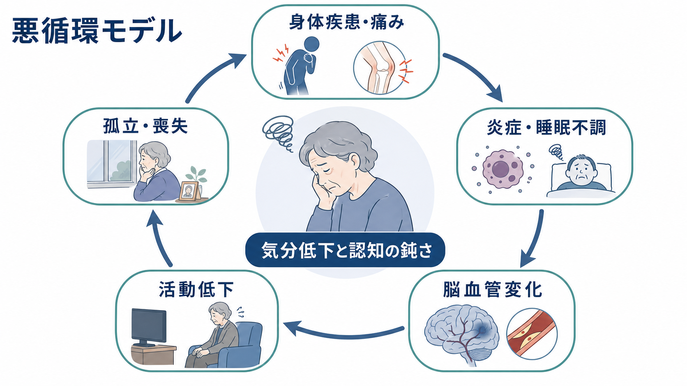
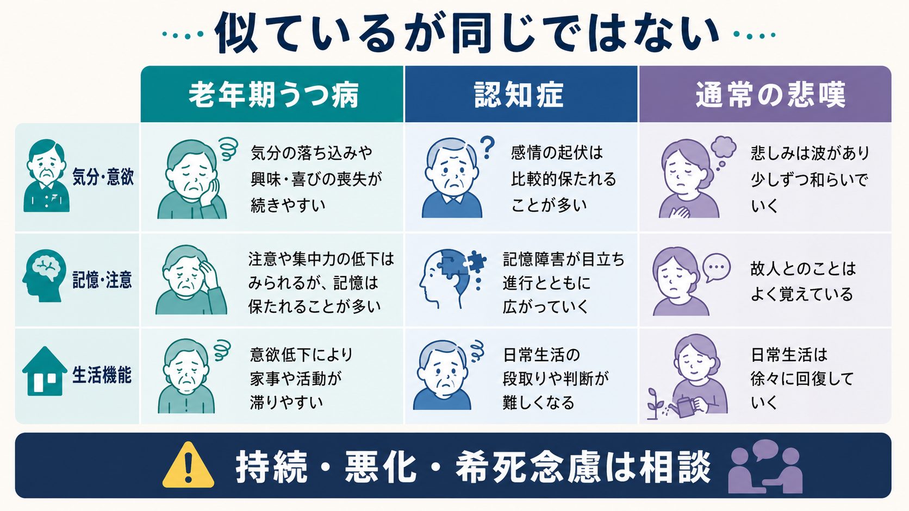

# 老年期うつ病とは何か

## 要点

- 老年期うつ病は、単に「高齢者に起きた[[うつ病とは何か|うつ病]]」ではなく、身体疾患、疼痛、睡眠障害、薬剤、社会的孤立、喪失体験、認知機能低下が重なって見え方が変わる抑うつ状態である[1][2]。
- 高齢者では、悲しさよりも、疲労、食欲低下、睡眠不調、痛み、意欲低下、活動量低下、集中困難として現れることがある[1][5]。
- [[認知症とは何か|認知症]]、[[軽度認知障害とは何か|軽度認知障害]]、[[せん妄と認知症はどう違うのか|せん妄]]、通常の悲嘆、身体疾患による倦怠感と重なりやすいため、気分だけでなく生活機能、時間経過、情報源を総合して見る必要がある[4][7]。
- 自殺リスク、希死念慮、急な機能低下、食事・水分摂取の低下、混乱、幻覚・妄想、重い身体疾患の悪化がある場合は、研究上の概念整理ではなく臨床的評価が必要になる[1][2][4]。

## この記事で答える問い

1. 老年期うつ病は、成人期のうつ病と何が違って見えるのか。
2. 身体症状、認知症状、喪失体験はどのように抑うつと結びつくのか。
3. 認知症や悲嘆と、どこが似ていて、どこに注意して区別するのか。
4. 研究・臨床では、どのような観点から評価されるのか。

## まず結論

老年期うつ病は、気分の落ち込みだけを中心に理解すると見落とされやすい。高齢者では、慢性疼痛、心血管疾患、脳血管病変、睡眠障害、薬剤の影響、配偶者や友人の喪失、退職、役割喪失、孤立が重なり、抑うつが「体が動かない」「物忘れが増えた」「家事や外出が億劫になった」という形で現れやすい[1][3][5]。

そのため、老年期うつ病を理解する中心は、症状名の暗記ではなく、**身体・認知・社会的文脈が互いに悪循環を作る**という見方である。抑うつが認知機能を鈍らせることもあれば、初期の神経変性疾患や血管性変化が抑うつとして見えることもある[6][7][8]。

## 背景

高齢期には、身体疾患の増加、疼痛、感覚機能の低下、睡眠の変化、退職や死別による役割の変化が同時に起きやすい。WHO は、高齢者のメンタルヘルスにおいて、孤立、孤独、喪失、慢性疾患、機能低下、介護負担などが重要なリスク要因になると整理している[3]。

一方で、「年を取れば落ち込むのは当然」と捉えると、治療可能なうつ病や自殺リスクを見落とす。CDC や NIMH は、高齢者のうつ病は老化の自然な一部ではなく、症状が身体疾患や生活機能の低下として見えやすいことを強調している[1][2]。

## 基本概念

老年期うつ病は、一般に高齢期にみられる大うつ病エピソード、持続的な抑うつ、身体疾患に伴う抑うつ、認知機能低下を伴う抑うつなどを含む実用的な臨床・研究概念である。診断分類上は[[大うつ病性障害とは何か|大うつ病性障害]]や持続性抑うつ障害などの基準で評価されるが、老年期では併存疾患と機能評価が特に重要になる[4][5]。

典型的な特徴は、次の三つにまとめられる。

| 観点 | 老年期で目立ちやすい形 | 注意点 |
|---|---|---|
| 身体症状 | 疲労、疼痛、食欲低下、睡眠不調、体重減少 | 身体疾患、薬剤、栄養、睡眠障害との鑑別が必要 |
| 認知症状 | 注意・集中の低下、処理速度低下、実行機能低下 | [[うつ病と認知症はどう鑑別するのか|うつ病と認知症の鑑別]]が必要 |
| 社会的文脈 | 死別、退職、介護、孤立、役割喪失 | 通常の悲嘆と大うつ病を分けて考える |

ここで重要なのは、身体症状があるから「心理的問題ではない」とも、認知症状があるから「認知症だけ」とも決めつけないことである。老年期では複数の要因が同時に存在し、互いに症状を強める[5][7]。

## 仕組み

### 身体疾患と疼痛

慢性疾患、疼痛、心血管疾患、糖尿病、神経疾患は、活動量の低下、睡眠不調、炎症、社会参加の減少を通じて抑うつを悪化させうる。逆に、抑うつは服薬、運動、食事、受診行動の維持を難しくし、身体疾患の管理を複雑にする[4][5]。この双方向性は、[[疼痛と精神疾患は脳内でどうつながるのか|疼痛と精神疾患]]や[[フレイルと精神症状はどう関係するのか|フレイル]]の理解とも接続する。

### 認知機能と実行機能

老年期うつ病では、記憶そのものよりも注意、処理速度、計画、切り替え、問題解決といった実行機能が鈍ることがある。これにより、本人は「物忘れが増えた」と訴え、家族は認知症を疑うことがある[6][7]。

ただし、抑うつに伴う認知低下が回復する場合もあれば、後に[[アルツハイマー型認知症とは何か|アルツハイマー型認知症]]や[[血管性認知症とは何か|血管性認知症]]が明らかになる場合もある。したがって、一回の印象だけでなく、時間経過、日常生活の変化、神経心理検査、身体・薬剤要因を組み合わせて考える必要がある[7][8]。

### 血管性うつ病という視点

老年期うつ病の一部では、前頭葉-皮質下回路や白質病変など、脳血管性変化との関連が議論されてきた。この見方は「血管性うつ病仮説」と呼ばれ、実行機能低下、精神運動制止、治療反応性の違いなどを説明する枠組みとして使われる[8]。ただし、すべての老年期うつ病を血管病変だけで説明できるわけではない。

### 喪失体験と孤立

死別、退職、身体機能の低下、友人関係の縮小、住まいの変化は、老年期の抑うつに深く関わる。通常の悲嘆では、悲しみは波のように変動し、亡くなった人への思いと結びついて現れやすい。一方で、持続する興味・喜びの喪失、強い罪責感、生活機能の著しい低下、希死念慮が続く場合には、[[喪失反応と大うつ病はどう違うのか|喪失反応と大うつ病]]を分けて考える必要がある[4][5]。

## 図解

老年期うつ病では、単一の原因よりも「身体疾患・痛み」「睡眠不調」「脳血管変化」「活動低下」「孤立・喪失」が循環する構図が重要である。図は理解の補助であり、個別の診断や治療方針を示すものではない。

比較の実用上の要点は、エピソード性である。うつ病では、いつ頃から気分・意欲・睡眠・食欲・活動量が変わったかが手がかりになる。認知症では、記憶や判断の障害がより広く持続的に進行することが多い。通常の悲嘆では、喪失に関する悲しみは強くても、時間と状況によって波があり、自己価値全体の否定とは限らない[4][7]。

## 臨床・研究との接続

臨床評価では、症状の有無だけでなく、次の情報を合わせて見る。

- いつ始まり、どのくらい続き、以前と比べてどれほど変化したか。
- 睡眠、食欲、体重、疼痛、便通、倦怠感、薬剤変更、飲酒の変化。
- 家事、金銭管理、服薬管理、外出、対人交流などの生活機能。
- 本人の訴えと、家族・支援者が観察する変化の違い。
- 希死念慮、自殺念慮、絶望感、急な孤立、食事・水分摂取の低下。

研究では、老年期うつ病は認知症リスク、脳血管病変、炎症、睡眠、フレイル、孤独、社会的決定要因と接続して調べられる。とくに、抑うつが認知症の危険因子なのか、前駆症状なのか、共通の脳病理を反映するのかは、現在も重要な論点である[6][7]。

## よくある誤解

**誤解1: 高齢者のうつは老化だから仕方ない。**  
老化に伴う変化と、治療・支援の対象になる抑うつは同じではない。抑うつが長く続き、生活機能や安全に影響する場合は、年齢だけで説明しない[1][2]。

**誤解2: 物忘れがあるなら認知症であり、うつ病ではない。**  
うつ病でも注意・集中・処理速度が落ち、物忘れのように見えることがある。一方で、うつ病と認知症が併存することもあるため、どちらか一方に決め打ちしない[7]。

**誤解3: 死別後の落ち込みはすべて通常の悲嘆である。**  
悲嘆は自然な反応だが、長期にわたる生活機能低下、強い自己否定、希死念慮がある場合は、大うつ病や[[複雑性悲嘆とは何か|複雑性悲嘆]]との関係を考える必要がある[4][5]。

**誤解4: 身体症状が多いなら精神科的な問題ではない。**  
老年期では身体疾患と抑うつが相互に影響する。身体評価を軽視せず、同時に気分・意欲・生活機能も見ることが重要である[4][5]。

## 関連ノート

- [[うつ病とは何か]]
- [[大うつ病性障害とは何か]]
- [[うつ病と認知症はどう鑑別するのか]]
- [[認知症とは何か]]
- [[軽度認知障害とは何か]]
- [[血管性認知症とは何か]]
- [[喪失反応と大うつ病はどう違うのか]]
- [[複雑性悲嘆とは何か]]
- [[睡眠障害とは何か]]
- [[フレイルと精神症状はどう関係するのか]]
- [[気分障害における自殺リスクとは何か]]

## MOC更新候補

- `content/00_MOC/` 配下の精神医学・気分障害・老年精神医学に関する MOC があれば、本記事を追加候補にする。
- 並列ジョブとの衝突を避けるため、本タスクでは MOC 本体は更新しない。

## 理解チェック

1. 老年期うつ病で、悲しさよりも身体症状や生活機能低下が目立つのはなぜか。
2. 老年期うつ病と認知症を比較するとき、症状の内容だけでなく時間経過を見る理由は何か。
3. 通常の悲嘆と大うつ病を分けて考えるうえで、生活機能と希死念慮はなぜ重要か。
4. 血管性うつ病仮説は、老年期うつ病のどの側面を説明しようとしているか。

## 未解決問題

- 老年期うつ病が認知症の危険因子、前駆症状、共通病理の反映のどれに当たるかは、個人差が大きく一義的に決めにくい[6][7]。
- 血管性変化、炎症、睡眠、孤独、フレイルの寄与を、個別症例でどの程度重みづけるかは研究・臨床上の課題である[3][8]。
- 高齢者では薬物療法、心理社会的支援、身体疾患管理、介護・地域支援が絡むため、単一の介入だけで説明しにくい。

## 参考文献

[1] National Institute of Mental Health. *Older Adults and Depression*. https://www.nimh.nih.gov/health/publications/older-adults-and-depression

[2] Centers for Disease Control and Prevention. *Depression Is Not a Normal Part of Growing Older*. https://www.cdc.gov/aging/depression/index.html

[3] World Health Organization. *Mental health of older adults*. https://www.who.int/news-room/fact-sheets/detail/mental-health-of-older-adults

[4] National Institute for Health and Care Excellence. *Depression in adults: treatment and management (NICE guideline NG222)*. https://www.nice.org.uk/guidance/ng222

[5] Taylor, W. D. (2014). Clinical practice. Depression in the elderly. *The New England Journal of Medicine*, 371(13), 1228-1236. https://doi.org/10.1056/NEJMcp1402180

[6] Alexopoulos, G. S. (2005). Depression in the elderly. *The Lancet*, 365(9475), 1961-1970. https://doi.org/10.1016/S0140-6736(05)66665-2

[7] Butters, M. A., Young, J. B., Lopez, O., Aizenstein, H. J., Mulsant, B. H., Reynolds, C. F., DeKosky, S. T., & Becker, J. T. (2008). Pathways linking late-life depression to persistent cognitive impairment and dementia. *Dialogues in Clinical Neuroscience*, 10(3), 345-357. https://pmc.ncbi.nlm.nih.gov/articles/PMC3181886/

[8] Taylor, W. D., Aizenstein, H. J., & Alexopoulos, G. S. (2013). The vascular depression hypothesis: mechanisms linking vascular disease with depression. *Molecular Psychiatry*, 18(9), 963-974. https://doi.org/10.1038/mp.2013.20
