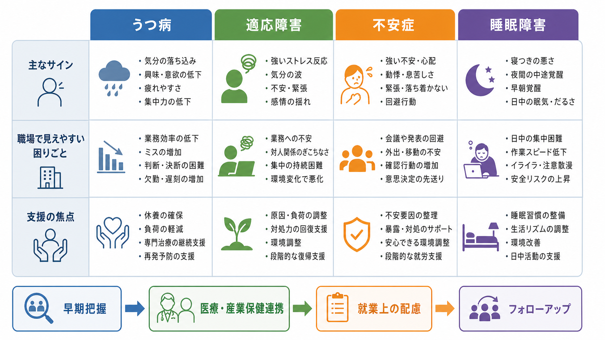
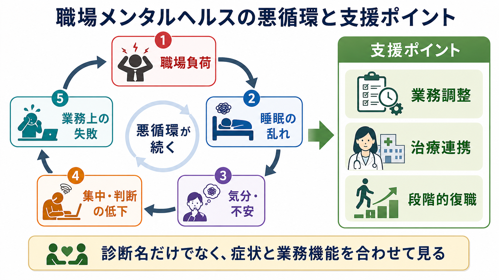

# 職場メンタルヘルスで多い疾患には何があるのか

## 要点

- 職場メンタルヘルスで頻繁に問題になるのは、[[うつ病とは何か|うつ病]]、適応障害、不安症、[[不眠障害とは何か|睡眠障害]]である。ただし、職場で見える行動だけから診断名を決めるのではなく、症状、経過、業務機能、職場要因を合わせて評価する必要がある[1][2]。
- うつ病では、気分の落ち込み、興味・喜びの低下、疲労、集中困難、希死念慮などが、欠勤、作業能率低下、判断困難、対人摩擦として現れやすい[5]。
- 適応障害では、明確なストレス因子に続いて情緒面・行動面の反応が強まり、原因負荷の調整、対処力の回復、環境調整が支援の焦点になる[7]。
- 不安症では、過剰な心配、パニック、回避、確認行動が、会議・発表・移動・意思決定の困難として見えやすい[6]。
- 睡眠障害は単独でも問題になるが、うつ病・不安症・適応障害と相互に悪化しやすい。慢性不眠では CBT-I が第一選択の心理的治療として推奨される[8]。

## この記事で答える問い

1. 職場メンタルヘルスで多い疾患は、どのように整理できるのか。
2. それぞれは職場でどのように見えやすいのか。
3. 就労支援では、診断名だけでなく何を評価するべきか。
4. 休職・復職・就業上の配慮では、どのような考え方が役立つのか。

## まず結論

職場メンタルヘルスでは、「何の病名か」だけでなく、「どの症状が、どの業務機能を、どの職場条件のもとで妨げているか」を見ることが重要である。たとえば同じ「欠勤」でも、うつ病の制止・疲労、不安症の回避、睡眠障害による日中眠気、適応障害での環境負荷への反応では、必要な支援が異なる。

そのため実務上は、診断名を医療側で評価しつつ、職場側では安全配慮、業務負荷、勤務時間、対人環境、復職後のフォローアップを整理する。WHO/ILO は、職場メンタルヘルス対策を、心理社会的リスクの予防、働く人への支援、合理的配慮、復職支援を含む広い枠組みとして位置づけている[1][2]。

## 背景

日本では、精神障害に関する労災請求・支給決定が重要な産業保健上の課題になっている。厚生労働省の過労死等の労災補償状況では、精神障害事案について請求件数、支給決定件数、自殺事案などが毎年度集計されており、職場要因とメンタルヘルス不調の関係を把握する公的資料として用いられる[3]。

ただし、労災統計は「職場メンタルヘルスで多い疾患の全体像」そのものではない。労災認定は業務による心理的負荷の評価を含む制度上の判断であり、日常の産業保健相談、休職・復職支援、一般臨床で見られる頻度とは一致しない。したがって、この記事では統計上の認定件数だけでなく、臨床診断、職場機能、就労支援の観点を組み合わせて整理する。

## 基本概念

### うつ病

うつ病は、気分の落ち込みや興味・喜びの低下だけでなく、睡眠、食欲、疲労、思考・集中、罪責感、希死念慮などを含む症候群である[5]。職場では「やる気がない」ではなく、作業開始に時間がかかる、判断が遅れる、ミスが増える、対人接触を避ける、遅刻・欠勤が増えるといった業務機能の変化として表面化しやすい。

就労支援では、[[大うつ病性障害とは何か|大うつ病性障害]]か、[[双極性障害とうつ病はどう鑑別するのか|双極性障害との鑑別]]が必要か、希死念慮があるか、睡眠・身体疾患・薬剤・物質使用の影響があるかを確認する。職場側では、業務量、納期、対人負荷、責任範囲、勤務時間を具体的に調整する。

### 適応障害

適応障害は、明確なストレス因子に続いて、苦痛や機能障害が強く出る状態として理解される[7]。職場では、配置転換、上司・同僚との関係、業務量の急増、評価不安、ハラスメント、組織変更などが背景になりやすい。

適応障害の支援では、「本人の弱さ」として扱うのではなく、ストレス因子の性質、本人の対処資源、周囲の支援、環境調整可能性を分けて見る。原因負荷が継続している場合、休養だけでは再燃しやすい。業務内容、指揮命令系統、相談先、復帰時の段階づけを調整することが重要である。

### 不安症

不安症では、過剰な心配、身体症状、パニック発作、回避、確認行動などが中心になる。[[不安症群とは何か|不安症群]]には、[[全般不安症とは何か|全般不安症]]、[[パニック症とは何か|パニック症]]、社交不安症、特定の恐怖症などが含まれる[6]。

職場では、会議や発表を避ける、通勤・出張が困難になる、確認に時間がかかる、意思決定を先送りする、身体症状のため救急受診を繰り返す、といった形で見えやすい。就労支援では、回避を強めすぎない配慮と、急性期の安全確保を両立させる必要がある。

### 睡眠障害

睡眠障害は、入眠困難、中途覚醒、早朝覚醒、睡眠の質の低下、日中眠気、疲労、集中困難として現れる。慢性不眠では、睡眠機会が十分にあるにもかかわらず、睡眠困難と日中機能障害が続くことが中心になる[8]。

職場では、午前中の能率低下、注意散漫、作業速度低下、事故リスクの上昇、感情調整の難しさとして現れる。夜勤・交替勤務、長時間労働、在宅勤務での生活リズムの崩れ、カフェイン・アルコール、うつ病や不安症の併存を評価する。

## 仕組み

職場メンタルヘルスの不調は、単純な「ストレスがあるから病気になる」という直線では説明しにくい。実際には、職場負荷、睡眠の乱れ、気分・不安、認知機能、業務上の失敗が循環し、悪循環を作る。

たとえば業務負荷が高まると、睡眠時間が短くなり、回復が不十分になる。睡眠不足は不安や抑うつ気分を強め、集中・判断を低下させる。その結果、ミスや遅れが増え、さらに職場負荷と自己批判が増える。この循環は、うつ病、不安症、適応障害、睡眠障害のいずれでも見られるが、どこを主に介入点にするかはケースによって異なる。

## 図解

1 枚目の図は、うつ病、適応障害、不安症、睡眠障害を、主なサイン、職場で見えやすい困りごと、支援の焦点から比較している。ここで重要なのは、同じ「パフォーマンス低下」でも背景が異なる点である。

2 枚目の図は、職場負荷から睡眠の乱れ、気分・不安、集中・判断の低下、業務上の失敗へ進む悪循環を示している。支援ポイントは、業務調整、治療連携、段階的復職であり、診断名だけでなく症状と業務機能を合わせて見ることが軸になる。

## 臨床・研究との接続

臨床では、診断、重症度、リスク、併存症、治療選択を評価する。職場では、就業可否、業務上の配慮、復職計画、フォローアップを評価する。この二つは重なるが、同じではない。医療者が「就労可能」と判断しても、実際の職務内容が高負荷であれば再発リスクは高まる。逆に、症状が残っていても、業務調整と支援体制があれば段階的に復帰できる場合もある。

厚生労働省の職場復帰支援の手引きでは、休業開始から主治医による復職可能判断、職場復帰可否の判断、職場復帰支援プランの作成、復帰後フォローアップまでを段階的に扱う考え方が示されている[4]。この枠組みは、診断名よりも「現在どの業務ができ、どの負荷が再燃リスクになるか」を具体化するために役立つ。

研究面では、職場ストレス、睡眠、抑うつ、不安、認知機能、復職成績、再休職の予測因子をつなぐ研究が重要である。特に、症状スコアだけでなく、勤務時間、裁量、対人環境、支援者の有無、治療継続、生活リズムを含めた多層的な評価が必要になる。

## よくある誤解

### 「職場で元気そうなら病気ではない」

職場では表情や会話を保っていても、帰宅後に強い疲弊が出ることがある。短時間の面談印象だけで判断せず、睡眠、休日の回復、欠勤・遅刻、ミス、対人負荷、希死念慮を確認する。

### 「適応障害は軽い病気である」

適応障害は、診断名の印象よりも生活・就労機能への影響が大きいことがある。ストレス因子が続くと慢性化やうつ病・不安症への移行も問題になるため、早期の環境調整と医療・産業保健連携が重要である[7]。

### 「睡眠は本人の生活習慣だけの問題である」

睡眠は生活習慣だけでなく、勤務時間、交替勤務、業務量、心理的緊張、併存するうつ病・不安症、薬剤、身体疾患の影響を受ける。慢性不眠では、睡眠衛生だけでなく CBT-I などの構造化された介入が推奨される[8]。

### 「復職は休職前と同じ働き方に戻すこと」

復職は単なる復帰日ではなく、業務負荷を段階的に戻し、再発リスクを観察しながら調整するプロセスである。復職直後は、業務量、責任、対人負荷、残業、通院継続、睡眠リズムを定期的に確認する。

## 関連ノート

- [[うつ病とは何か]]
- [[大うつ病性障害とは何か]]
- [[双極性障害とうつ病はどう鑑別するのか]]
- [[不安症群とは何か]]
- [[全般不安症とは何か]]
- [[パニック症とは何か]]
- [[不眠障害とは何か]]

### 今後の作成候補

- 適応障害とは何か
- 職場復帰支援とは何か
- 産業保健におけるメンタルヘルス面談とは何か
- 休職と復職の判断では何を見るのか

### MOC 更新候補

- `content/00_MOC/MOC｜精神医学.md`
- `content/00_MOC/MOC｜臨床実践・治療.md`
- `content/00_MOC/MOC｜キャリア・学習法.md`

## 理解チェック

1. 職場で「ミスが増えた」とき、うつ病、不安症、睡眠障害、適応障害ではどのように背景が異なりうるか。
2. 診断名だけで就業上の配慮を決めることには、どのような限界があるか。
3. 復職支援で、主治医の診断書に加えて職場側が確認すべき情報は何か。
4. 睡眠の乱れが、気分・不安・業務機能にどのような悪循環を作るか。

## 未解決問題

- 職場で観察される業務機能低下を、個人の症状、職務設計、組織文化に分けて評価する標準的な方法はまだ十分に整っていない。
- 復職支援では、再休職を防ぐための配慮と、過剰な回避を固定化しない支援のバランスが難しい。
- 職場のストレス要因と臨床診断の関係は、労災認定、産業保健、一般精神科診療で評価目的が異なるため、資料の読み替えが必要である。

## 参考文献

[1] World Health Organization. (2022). *WHO guidelines on mental health at work*. https://www.who.int/publications/i/item/9789240053052

[2] World Health Organization and International Labour Organization. (2022). *Mental health at work: policy brief*. https://www.who.int/publications/i/item/9789240057944

[3] 厚生労働省. (2025). 令和6年度「過労死等の労災補償状況」を公表します. https://www.mhlw.go.jp/stf/newpage_59039.html

[4] 厚生労働省. (2019). *心の健康問題により休業した労働者の職場復帰支援の手引き*. https://www.mhlw.go.jp/content/000561013.pdf

[5] National Institute for Health and Care Excellence. (2022). *Depression in adults: treatment and management (NICE guideline NG222)*. https://www.nice.org.uk/guidance/ng222

[6] National Institute for Health and Care Excellence. (2011, updated). *Generalised anxiety disorder and panic disorder in adults: management (Clinical guideline CG113)*. https://www.nice.org.uk/guidance/cg113

[7] Maercker, A., Brewin, C. R., Bryant, R. A., et al. (2013). Diagnosis and classification of disorders specifically associated with stress: proposals for ICD-11. *World Psychiatry, 12*(3), 198-206. https://doi.org/10.1002/wps.20057

[8] Edinger, J. D., Arnedt, J. T., Bertisch, S. M., et al. (2021). Behavioral and psychological treatments for chronic insomnia disorder in adults: an American Academy of Sleep Medicine clinical practice guideline. *Journal of Clinical Sleep Medicine, 17*(2), 255-262. https://doi.org/10.5664/jcsm.8986
