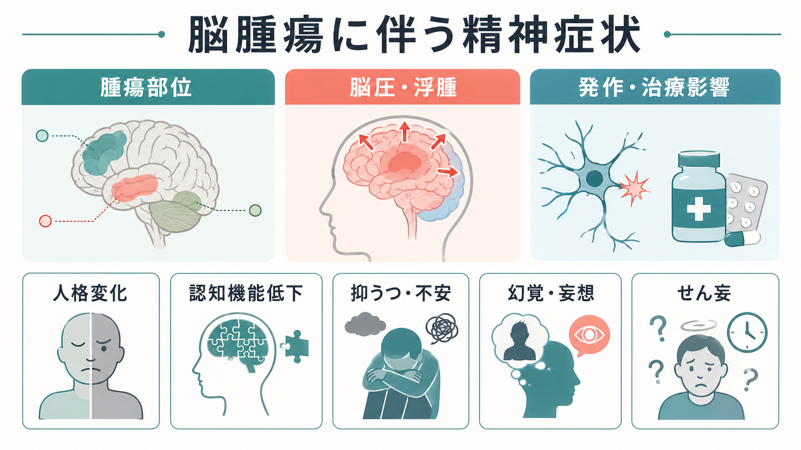
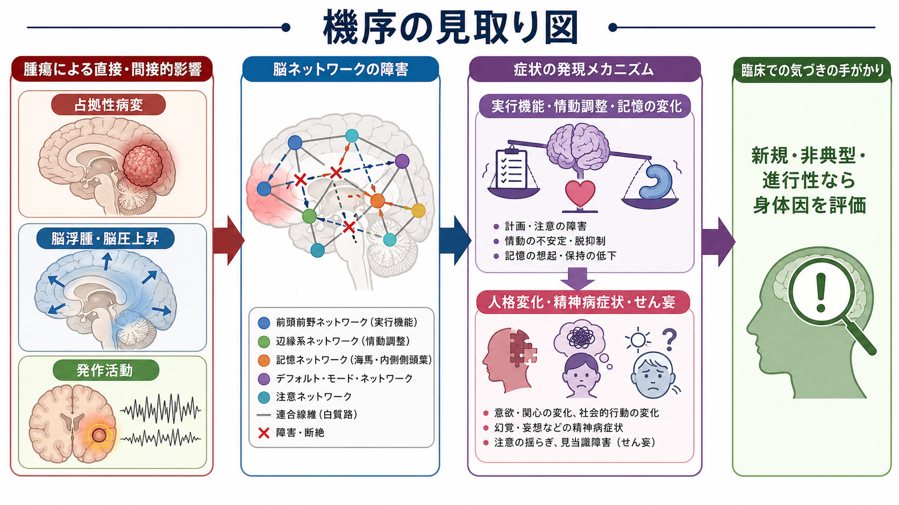
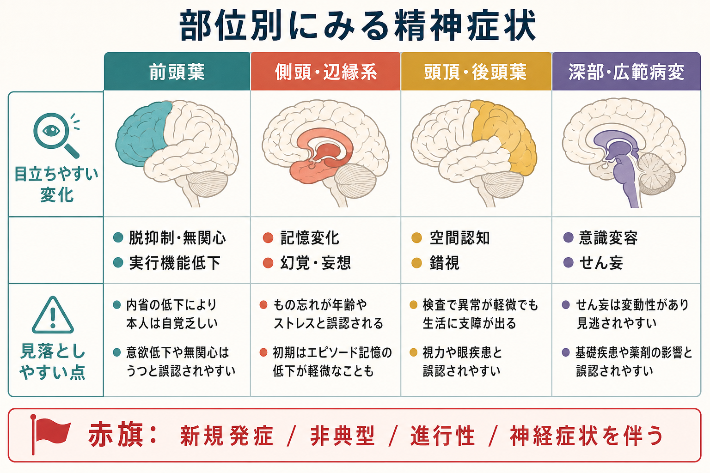

# 脳腫瘍に伴う精神症状とは何か

## 要点

- 脳腫瘍に伴う精神症状は、腫瘍そのものの局所作用、脳浮腫・頭蓋内圧上昇、発作活動、治療や薬剤、がん診断への心理的反応が重なって生じる。
- 前頭葉では脱抑制、無関心、判断低下、人格変化が目立ちやすく、側頭葉・辺縁系では記憶変化、幻覚、妄想、発作関連症状が前景化しやすい。
- 新規発症、非典型、進行性、神経症状を伴う、または高齢期初発の精神症状では、[[器質性精神病とは何か]]や[[身体疾患による気分障害とは何か]]の鑑別として脳腫瘍を含む身体因を考える。
- この記事は教育・研究目的の整理であり、個別の診断や治療指示ではない。

## この記事で答える問い

1. 脳腫瘍では、なぜ人格変化・認知症状・精神病症状が起こりうるのか。
2. 腫瘍部位ごとに、どのような精神症状が目立ちやすいのか。
3. 一次性の精神疾患と見分けるとき、どのような「赤旗」を意識すべきか。
4. 研究・臨床で、脳腫瘍関連の精神症状をどう位置づければよいのか。

## まず結論

脳腫瘍に伴う精神症状は、「精神症状に見えるが、脳内の占拠性病変やその周辺変化が背景にあることがある」という問題である。NCI の成人中枢神経系腫瘍情報では、症状は腫瘍の場所、影響を受ける機能、腫瘍の大きさに依存し、人格・気分・注意集中・行動の変化も脳腫瘍の症状に含まれると整理されている[1]。American Cancer Society も、腫瘍による頭蓋内圧上昇では頭痛、発作、嘔気、視覚変化、眠気に加えて、人格や行動の変化が起こりうると説明している[2]。

ただし、精神症状があるから脳腫瘍である、という単純な話ではない。抑うつ、不安、幻覚、妄想、[[せん妄とは何か]]、[[認知機能障害とは何か]]は多くの疾患で起こる。重要なのは、発症年齢、経過、神経学的徴候、発作、頭痛・嘔吐・意識変容、認知低下の進行、治療抵抗性、本人らしさからの変化を総合して、身体因を見落とさないことである。

## 背景

脳腫瘍は、原発性腫瘍と転移性腫瘍を含む広いカテゴリーである。NICE の成人脳腫瘍・脳転移ガイドラインは、診断、モニタリング、治療、支持療法を多職種で標準化することを目的としており、疑われる神経膠腫では標準構造 MRI を初期診断として推奨している[3]。EANO の成人びまん性神経膠腫ガイドラインも、診断と治療は神経画像、病理、分子診断、多職種カンファレンスに基づくべきだとする[4]。

精神医学的には、脳腫瘍は「精神症状の鑑別診断」の一部である。レビュー論文では、脳腫瘍の精神症状として気分症状、精神病症状、記憶問題、人格変化、不安などが報告され、ときに精神症状が唯一の初発症状になりうると整理されている[5]。古典的な症例系列でも、前頭葉腫瘍では無為、人格変化、抑うつ、側頭・辺縁系腫瘍では幻聴・幻視、躁状態、パニック発作、健忘などが記載されている[6]。

このため、[[初回エピソード精神病とは何か]]や[[うつ病とは何か]]を考える場面でも、経過が通常と合わない場合には「一次性精神疾患だけで説明してよいか」を点検する必要がある。

## 基本概念

### 神経精神症状

脳腫瘍に伴う精神症状は、しばしば「神経精神症状」または「神経行動症状」と呼ばれる。これは、気分、認知、行動、知覚、思考の変化が、脳腫瘍や治療の影響と結びついて生じるという意味である。患者本人には「気分が落ち込む」「怒りっぽい」「忘れやすい」「集中できない」と感じられることもあれば、家族や支援者には「以前のその人と違う」「社会的判断が変わった」「同じ説明を保てない」と見えることもある。

### 精神症状の主な型

脳腫瘍に伴う症状は、次のように分けると整理しやすい。NCI は脳・脊髄腫瘍や治療に関連する認知症状として、記憶、発話、理解、集中の困難を挙げている[8]。

| 型 | 例 | 関連しやすい背景 |
|---|---|---|
| 人格・行動変化 | 脱抑制、攻撃性、無関心、意欲低下、社会的判断低下 | 前頭葉、前頭皮質下回路、広範な脳機能低下 |
| 認知症状 | 注意低下、記憶障害、実行機能低下、処理速度低下 | 前頭葉、側頭葉、白質路、脳圧上昇、治療後変化 |
| 気分・不安症状 | 抑うつ、不安、焦燥、易怒性、情動不安定 | 腫瘍部位、診断への心理的反応、睡眠障害、薬剤 |
| 精神病症状 | [[幻覚とは何か]]、[[妄想とは何か]]、猜疑性、まとまりにくさ | 側頭葉・辺縁系、発作活動、せん妄、薬剤 |
| 意識・覚醒の変化 | 眠気、変動する注意、見当識障害、[[せん妄とは何か]] | 頭蓋内圧上昇、浮腫、感染、代謝異常、薬剤 |

## 仕組み

### 1. 腫瘍部位による局所回路の障害

脳腫瘍は、腫瘍細胞がある場所だけでなく、その周辺の皮質、白質路、ネットワークを圧迫・浸潤・切断する。前頭葉では実行機能、抑制、意欲、社会的判断に関わる回路が障害されやすく、脱抑制、無関心、計画性低下、性格変化として現れることがある[6]。こうした変化は本人の病識低下を伴いやすく、周囲が先に気づくことも多い。

側頭葉や辺縁系では、記憶、情動、知覚体験、発作活動との関係が重要になる。側頭・辺縁系腫瘍では、幻聴・幻視、パニック様発作、躁状態、健忘などが報告されており[6]、[[妄想とは何か]]や[[幻覚とは何か]]だけを切り出して見ると一次性精神病と紛らわしいことがある。

### 2. 脳浮腫・頭蓋内圧上昇

腫瘍が大きくなる、周囲に浮腫が生じる、脳脊髄液の流れが妨げられると、頭蓋内圧が上昇する。これにより頭痛、嘔吐、眠気、意識変容、注意低下、見当識障害が出現し、精神科的には[[せん妄とは何か]]や急な認知低下として見えることがある[2]。NICE は神経膠腫の経過観察において、身体的、心理的、認知的ウェルビーイングの変化を定期的に評価することを推奨しており[3]、精神症状も腫瘍経過の一部として追跡されるべきである。

### 3. 発作活動と発作後状態

脳腫瘍は成人の新規発作の原因になりうる。EANO ガイドラインでは、新しい神経症状や発作が頭蓋内病変を示唆しうること、発作を経験した患者では抗てんかん薬を用いること、一方で発作歴のない神経膠腫患者への一次予防は初回発作リスクを下げないことが述べられている[4]。発作は全身けいれんだけでなく、奇妙な感覚、既視感、恐怖感、記憶の途切れ、意識の変容として現れることがあり、発作後の混乱が精神症状に見えることもある。

### 4. 治療・薬剤・心理社会的要因

手術、放射線療法、化学療法、副腎皮質ステロイド、抗てんかん薬、睡眠障害、疼痛、がん診断への心理的反応も、気分、不安、認知、行動に影響する。人格・行動変化に関するスコーピングレビューは、脳腫瘍関連の人格・行動変化が、腫瘍部位、病勢進行、頭蓋内圧、浮腫、既存の精神疾患、診断への心理的適応、手術・放射線・化学療法などの影響を受けうると整理している[7]。

この点は、脳腫瘍を「腫瘍だけの問題」と見ないために重要である。精神症状は、腫瘍、脳ネットワーク、身体状態、薬剤、生活環境、家族関係が重なった結果として理解する必要がある。

## 図解

### 部位別の見取り図

部位別には、次のような傾向を仮説として持つと臨床像を整理しやすい。ただし、実際の症状は腫瘍型、左右差、増大速度、浮腫、発作、治療歴、もともとの認知予備能に左右される。

| 部位 | 目立ちやすい精神・認知症状 | 見落としやすい点 |
|---|---|---|
| 前頭葉 | 脱抑制、無関心、意欲低下、判断低下、実行機能障害 | 抑うつ、パーソナリティ問題、怠慢と誤認されやすい |
| 側頭葉・辺縁系 | 記憶変化、幻覚、妄想、恐怖発作、既視感 | 発作関連症状やエピソード記憶障害が目立たないことがある |
| 頭頂葉・後頭葉 | 空間認知障害、錯視、視覚症状、身体認知の変化 | 精神症状より「生活上のミス」として見えることがある |
| 深部・広範病変 | 覚醒低下、注意変動、せん妄、処理速度低下 | 薬剤、感染、代謝異常、睡眠障害との重なりを見落としやすい |

### 赤旗としての精神症状

次の特徴があるときは、脳腫瘍に限らず、身体疾患・神経疾患・薬剤性の要因を考える余地が大きくなる。

- 高齢期または中年期以降の初発精神病症状。
- それまでの性格や生活機能から見て急に変わった人格・行動変化。
- 数週間から数か月で進行する認知低下、意欲低下、判断低下。
- 頭痛、嘔吐、発作、片麻痺、失語、視野障害、歩行障害、尿失禁などの神経症状を伴う。
- 注意や覚醒の変動、見当識障害、日内変動がある。
- 一般的な治療反応と合わない、または症状像が非典型である。

## 臨床・研究との接続

### 臨床での位置づけ

臨床では、脳腫瘍に伴う精神症状を「精神科だけの問題」または「脳外科だけの問題」と分けないほうがよい。NICE ガイドラインが示すように、成人脳腫瘍の診療は多職種連携を前提とする[3]。精神症状は、腫瘍の進行、治療副作用、認知機能、意思決定能力、家族の負担、生活の質に直結する。

また、脳腫瘍患者の人格・行動変化は、本人の病識低下のため過小評価されやすい。スコーピングレビューでは、人格・行動変化が患者本人だけでなく介護者の苦痛や生活の質にも関わること、支援介入の研究がまだ少ないことが示されている[7]。したがって、本人の訴えだけでなく、家族・支援者から見た変化、日常生活上の困りごと、服薬や睡眠、発作の記録を合わせて評価することが重要である。

### 研究での位置づけ

研究上は、脳腫瘍関連の精神症状は、病変部位と症状の対応だけでなく、ネットワーク障害として考える必要がある。前頭葉、側頭葉、辺縁系、白質路、デフォルトモードネットワーク、注意ネットワークなどの障害は、単一の症状ではなく、実行機能、情動調整、記憶、自己認識、社会的行動のまとまりとして現れる。

さらに、精神症状の評価は腫瘍治療のアウトカムにも関わる。EANO ガイドラインは成人神経膠腫の診断・治療で分子診断や治療選択を重視しているが[4]、患者の生活機能や認知・心理状態をどう評価し支援するかは、神経腫瘍学と精神医学の接点になる。

## よくある誤解

### 誤解1: 精神症状があるなら、まず精神疾患である

精神症状の多くは一次性精神疾患でも生じるが、脳腫瘍でも起こりうる。特に新規・非典型・進行性の症状、神経症状、発作、頭蓋内圧上昇を疑う症状がある場合、[[器質性精神病とは何か]]の観点で身体因を考える必要がある[5]。

### 誤解2: 脳腫瘍なら必ず明らかな神経症状が先に出る

前頭葉腫瘍のように、初期には人格変化や知的機能の変化が中心で、明らかな麻痺や失語が目立たないことがある[6]。そのため、家族が感じる「本人らしさの変化」は重要な情報になりうる。

### 誤解3: 画像で腫瘍が見つかれば精神症状の説明は終わる

腫瘍が見つかっても、症状の原因は一つとは限らない。浮腫、発作、薬剤、睡眠、疼痛、感染、代謝異常、がん診断への心理的反応が重なる。精神症状の理解には、脳病変と生活史・環境の両方を見る必要がある。

### 誤解4: 精神症状への支援は腫瘍治療の後でよい

精神症状は、意思決定、治療継続、家族関係、介護負担に直接影響する。人格・行動変化への心理社会的介入研究はまだ限られるが、患者と介護者への情報提供、環境調整、認知・行動面の評価は早期から必要になりうる[7]。

## 関連ノート

- [[器質性精神病とは何か]]
- [[身体疾患による気分障害とは何か]]
- [[認知機能障害とは何か]]
- [[せん妄とは何か]]
- [[幻覚とは何か]]
- [[妄想とは何か]]
- [[初回エピソード精神病とは何か]]
- [[うつ病とは何か]]
- [[不安とは何か]]
- [[神経回路とは何か]]

## MOC更新候補

- `content/00_MOC/MOC｜症候学.md`
- `content/00_MOC/MOC｜神経科学と精神疾患.md`
- `content/00_MOC/MOC｜基礎神経科学.md`

並列ジョブとの衝突を避けるため、本記事では MOC 本体は更新していない。

## 理解チェック

1. 脳腫瘍に伴う精神症状を、腫瘍部位、脳浮腫・頭蓋内圧、発作、治療・薬剤、心理社会的要因に分けて説明できるか。
2. 前頭葉腫瘍で人格変化や無関心が目立ちやすい理由を、実行機能と抑制の観点から説明できるか。
3. 側頭葉・辺縁系病変で幻覚、妄想、記憶変化、発作関連症状が紛らわしくなる理由を説明できるか。
4. 一次性精神疾患だけで説明しにくい「赤旗」を3つ挙げられるか。
5. 脳腫瘍が見つかった後も、精神症状の原因を腫瘍だけに還元しない理由を説明できるか。

## 未解決問題

- 脳腫瘍関連の人格・行動変化を、日常診療で短時間に妥当かつ反復可能に評価する標準手法は十分に確立していない。
- 腫瘍部位と精神症状の対応は有用な見取り図だが、ネットワーク障害、白質路、浮腫、発作、薬剤、心理社会的背景を含む統合モデルが必要である。
- 患者本人の病識低下がある場合、本人報告、家族報告、神経心理検査、行動観察をどう統合するかは臨床上の課題である。
- 人格・行動変化に対する心理社会的介入の研究は少なく、患者・介護者双方を支える介入研究が求められる[7]。

## 参考文献

[1] National Cancer Institute. *Adult Central Nervous System Tumors Treatment (PDQ®)–Patient Version*. https://www.cancer.gov/types/brain/patient/adult-brain-treatment-pdq

[2] American Cancer Society. *Signs and Symptoms of Brain Tumors in Adults*. https://www.cancer.org/cancer/types/brain-spinal-cord-tumors-adults/detection-diagnosis-staging/signs-and-symptoms.html

[3] National Institute for Health and Care Excellence. *Brain tumours (primary) and brain metastases in adults*. NICE Guideline No. 99. 2021. https://www.ncbi.nlm.nih.gov/books/NBK544711/

[4] Weller M, van den Bent M, Preusser M, et al. EANO guidelines on the diagnosis and treatment of diffuse gliomas of adulthood. *Nature Reviews Clinical Oncology*. 2021;18:170-186. https://doi.org/10.1038/s41571-020-00447-z

[5] Madhusoodanan S, Ting MB, Farah T, Ugur U. Psychiatric aspects of brain tumors: A review. *World Journal of Psychiatry*. 2015;5(3):273-285. https://doi.org/10.5498/wjp.v5.i3.273

[6] Filley CM, Kleinschmidt-DeMasters BK. Neurobehavioral presentations of brain neoplasms. *Western Journal of Medicine*. 1995;163(1):19-25. https://pmc.ncbi.nlm.nih.gov/articles/PMC1302910/

[7] McDougall E, Breen LJ, Nowak AK, Dhillon HM, Halkett GKB. Psychosocial interventions for personality and behavior changes in adults with a brain tumor: A scoping review. *Neuro-Oncology Practice*. 2023;10(5):408-417. https://doi.org/10.1093/nop/npad031

[8] National Cancer Institute. *Cognitive Symptoms*. https://www.cancer.gov/rare-brain-spine-tumor/living/symptoms/cognitive
