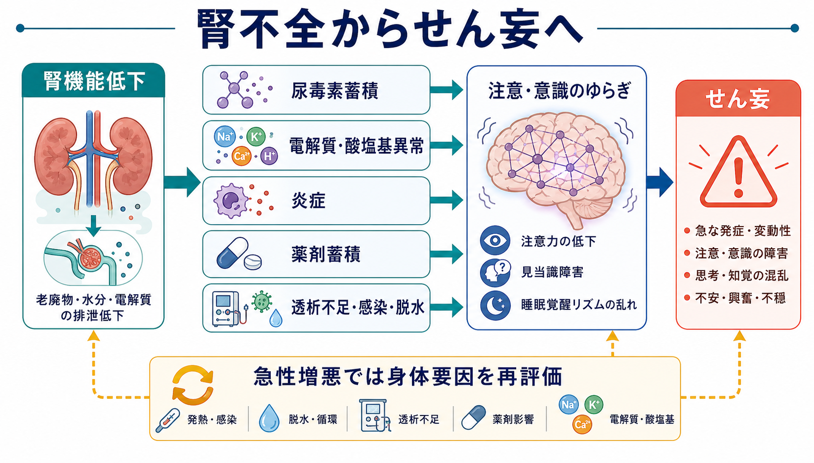
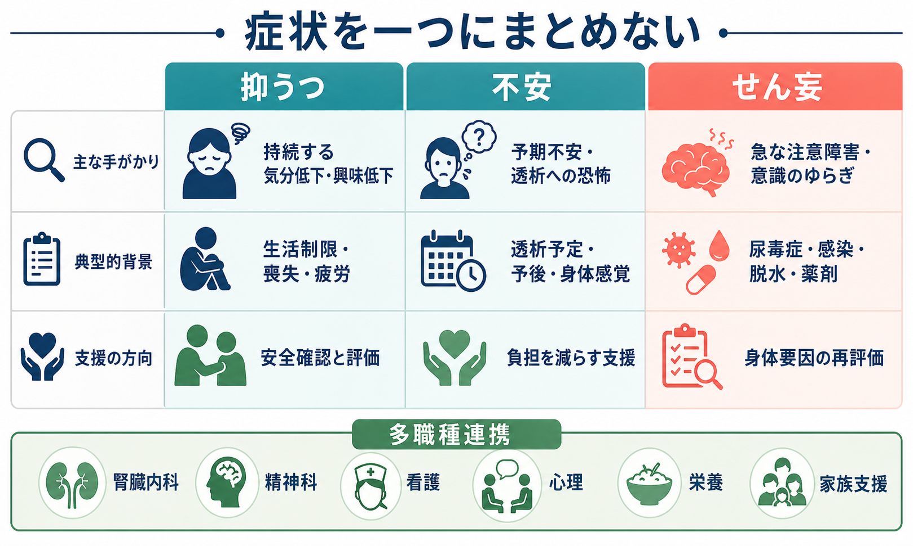

# 腎不全に伴う精神症状とは何か

## 要点

- 腎不全に伴う精神症状は、単に「透析がつらいから気分が落ちる」という心理反応だけではない。尿毒素の蓄積、電解質・酸塩基異常、炎症、薬剤蓄積、睡眠障害、透析スケジュール、食事・水分制限、役割喪失が重なって、[[うつ病とは何か|抑うつ]]、[[不安症群とは何か|不安]]、[[せん妄と認知症はどう違うのか|せん妄]]、認知機能低下として現れる[1][2][3]。
- せん妄や急な意識・注意の変化では、尿毒症、感染、脱水、低血圧、透析不足、薬剤蓄積などの身体要因を優先して再評価する必要がある[2][3]。
- 抑うつと不安は透析患者で見逃されやすい。疲労、食欲低下、睡眠障害、集中困難などが腎不全そのものや透析後のだるさと重なるため、症状名だけでなく経過、生活機能、本人の意味づけを分けて読む[4][5][6]。
- 本記事は教育・研究目的の整理であり、個別の診断や治療指示ではない。急な混乱、強い希死念慮、透析拒否、著しい不眠・興奮、発熱や脱水を伴う変化は、臨床的には緊急評価の対象になりうる。

## この記事で答える問い

1. 腎不全では、なぜ抑うつ・不安・せん妄が起こりやすくなるのか。
2. 尿毒症や透析不足による脳機能の変化と、生活制限による心理的苦痛はどう区別して考えるべきか。
3. 透析患者の「不安」「落ち込み」「混乱」を、どのように多職種で評価するのか。
4. 研究では、腎不全に伴う精神症状をどのような未解決問題として扱えるのか。

## まず結論

腎不全に伴う精神症状は、身体疾患による[[器質性精神病とは何か|器質性の変化]]と、慢性疾患を抱えて生きる心理社会的負荷が重なった状態として理解すると整理しやすい。尿毒症性脳症では、尿毒素、電解質・酸塩基異常、血液脳関門や血管反応、炎症などが脳機能に影響し、注意や意識のゆらぎ、認知変化、せん妄様の状態が起こりうる[2][3]。一方で、透析導入、週数回の通院、食事・水分制限、就労や家族役割の変化、将来への不確実性は、抑うつや不安の背景になりやすい[5][6]。

したがって臨床的な見立てでは、「心理的な問題か、身体的な問題か」と二分しない。まず急性変化では身体要因を探し、同時に本人の生活史、透析経験、支援資源、病気への意味づけを評価する。これは[[身体症状症とは何か|身体症状へのとらわれ]]だけを見るのでも、[[大うつ病性障害とは何か|大うつ病性障害]]だけに還元するのでもない。

## 背景

慢性腎臓病と末期腎不全は、医学的管理が長期に続く疾患である。KDIGO 2024 CKD ガイドラインは、CKD の評価・管理、薬剤管理、合併症管理だけでなく、多様な臨床環境での患者中心のケアを重視している[1]。精神症状はこの患者中心ケアの周辺的問題ではなく、生活の質、治療継続、自己管理、家族支援、意思決定に関わる中心的な問題である。

透析患者では、抑うつ、不安、不眠、疼痛、倦怠感、認知機能低下が相互に絡む。抑うつは CKD 全体で頻度が高く、2024年のメタ解析でも CKD 患者における臨床的抑うつの負荷が大きいことが示されている[4]。ただし、頻度の数字だけを覚えるよりも、症状の重なり方を理解するほうが実践的である。腎不全の疲労、食欲低下、睡眠障害は抑うつ尺度の項目と重なるため、「点数が高い」ことと「精神疾患としての抑うつエピソード」は同じではない[5]。

## 基本概念

### 腎不全に伴う精神症状

ここでいう腎不全に伴う精神症状とは、腎機能低下や腎代替療法を背景に出現・増悪・維持される気分、意欲、不安、注意、意識、睡眠、認知、行動の変化を指す。代表的には、抑うつ、不安、せん妄、認知機能低下、不眠、透析への恐怖、治療継続への抵抗感が含まれる。

| 領域 | 主な症状 | 読み方 |
|---|---|---|
| 抑うつ | 気分低下、興味低下、疲労感、希死念慮、自己効力感の低下 | 腎不全の身体症状、栄養状態、炎症、生活制限、喪失体験と重ねて評価する[4][5] |
| 不安 | 透析中の恐怖、予期不安、息苦しさ、動悸、身体感覚への過敏 | 心血管・呼吸器・神経疾患、尿毒症、抑うつとの重なりを除外しながら見る[6] |
| せん妄 | 急な注意障害、意識水準のゆらぎ、見当識障害、睡眠覚醒リズムの乱れ | 尿毒症、感染、脱水、薬剤、透析不足などの急性身体要因を優先する[2][3] |
| 認知機能低下 | 注意、実行機能、記憶、処理速度の低下 | [[認知症とは何か|認知症]]、せん妄、透析前後の変動、血管性リスクを分けて考える |

### 尿毒症性脳症

尿毒症性脳症は、急性腎障害または進行した慢性腎臓病に伴う中枢神経系の機能障害である。Rosner らのレビューは、尿毒症性脳症を「腎機能低下に伴う中枢神経系異常の幅広い症候群」と整理し、尿毒素の保持、ホルモン代謝、電解質・酸塩基異常、血管反応、血液脳関門、炎症が関与すると述べている[2]。StatPearls も、尿毒症性脳症では症状が軽い集中困難からせん妄、けいれん、昏睡まで幅をもつと整理している[3]。

重要なのは、尿毒症性脳症には単一の決定的検査がないことである。改善が透析や移植後に確認されて初めて診断が支持される場合もあり、感染、薬剤、電解質異常、脳血管障害、[[不眠障害とは何か|睡眠障害]]が混在しやすい[2]。

## 仕組み

### 1. 尿毒素・電解質・炎症が注意と意識を揺らす

腎不全では、排泄されにくい物質や薬剤が蓄積しやすくなる。さらに、ナトリウム、カリウム、カルシウム、酸塩基平衡、水分量、血圧、炎症状態が変動する。これらは神経伝達、脳血流、血液脳関門、神経炎症に影響し、注意力、見当識、覚醒水準、睡眠覚醒リズムを不安定にする[2][3]。

急にぼんやりする、会話がかみ合わない、昼夜逆転が強い、透析日や感染症の前後で変動する、といった変化では、精神症状としてだけでなく身体要因として読む必要がある。これは[[せん妄と認知症はどう違うのか|せん妄]]の見立てとよく重なる。

### 2. 透析は負担であり、同時に安定化の手段でもある

透析は尿毒症を改善する一方で、生活時間を大きく拘束する。透析中の血圧低下、筋けいれん、倦怠感、穿刺への恐怖、移動負担、食事・水分制限は、不安や抑うつを強めうる。また、透析不足、感染、脱水、薬剤蓄積はせん妄を誘発・増悪しうる[2][3]。

この二面性を見落とすと、「透析が原因だから仕方ない」または「透析をすれば全部よくなる」という単純化になる。実際には、透析条件、身体合併症、睡眠、疼痛、社会的支援、心理的安全感を一緒に調整していく視点が必要である。

### 3. 生活制限と喪失体験が抑うつ・不安を形づくる

腎不全では、食事・水分制限、就労制限、旅行や外出の制約、身体機能の低下、家族内役割の変化、将来への不確実性が続く。透析患者の不安は、動悸や息苦しさなど身体症状として表現されることもあり、うつや尿毒症との重なりが大きい[6]。不安を「透析へのわがまま」や「理解不足」と解釈すると、本人の苦痛を見落としやすい。

抑うつについても、CKD 患者では高頻度に認められるが、身体症状との重なりが大きい。Cukor らは、血液透析患者の抑うつ評価では、抑うつ症状と尿毒症・薬剤・身体症状の重複が推定を難しくすると指摘している[5]。

## 図解

### 腎不全からせん妄へ

1枚目の図は、腎機能低下から尿毒素蓄積、電解質・酸塩基異常、炎症、薬剤蓄積、透析不足・感染・脱水を経て、注意・意識のゆらぎとせん妄へ向かう経路を示している。急性増悪では、心理的説明だけで完結せず、身体要因を再評価することが中心になる。

### 症状を一つにまとめない

2枚目の図は、抑うつ、不安、せん妄を、主な手がかり、典型的背景、支援の方向に分けている。透析患者の精神症状は併存しやすいが、急性の注意障害なら身体要因の再評価、持続する気分低下なら抑うつ評価、予期不安や透析恐怖なら不安評価というように、入口を分けると支援につながりやすい。

## 臨床・研究との接続

### 臨床では「身体評価」と「心理社会的評価」を同時に進める

急な混乱や意識の変動では、せん妄として安全確認を行い、尿毒症、感染、脱水、電解質異常、低血糖、低酸素、薬剤蓄積、アルコール・ベンゾジアゼピン離脱などを再評価する。慢性的な落ち込みや不安では、抑うつ・不安の尺度を用いることは有用だが、結果は腎不全の身体症状との重なりを踏まえて読む必要がある[5][6]。

心理社会的介入も重要である。透析患者の抑うつに対する心理社会的介入のコクランレビューは、介入研究の質や異質性に注意しつつ、心理的支援が抑うつや生活の質に関わる可能性を整理している[7]。近年のメタ解析でも、心理的介入が血液透析患者の抑うつ・不安に効果を示す可能性が検討されている[8]。ただし、これは個別の治療選択を自動的に決める根拠ではなく、腎臓内科、精神科、看護、心理、栄養、ソーシャルワーク、家族支援を組み合わせるための土台である。

### 研究では多因子モデルが必要になる

腎不全に伴う精神症状の研究では、単純な「腎機能低下がうつを起こす」という一方向モデルでは不十分である。少なくとも、腎機能指標、透析条件、炎症、栄養、睡眠、疼痛、薬剤、認知機能、生活制限、社会的支援、治療アドヒアランスを同時に扱う必要がある。KDIGO 2024 が患者中心ケアと多職種的・包括的アプローチを強調する背景にも、この多因子性がある[1]。

## よくある誤解

### 「透析患者の落ち込みは当然なので評価しなくてよい」

透析生活が大きな負担であることと、抑うつを評価しなくてよいことは違う。落ち込みが持続し、興味低下、希死念慮、セルフケア低下、透析継続困難につながる場合は、生活支援と精神医学的評価の両方が必要になる。

### 「混乱しているなら認知症である」

腎不全患者の急な混乱は、まずせん妄として考える。数時間から数日の急な変化、日内変動、注意障害、睡眠覚醒リズムの乱れがある場合、[[認知症とは何か|認知症]]だけで説明せず、身体要因と薬剤を再評価する。

### 「不安は気持ちの問題で、腎不全とは別である」

不安は透析予定、穿刺、身体感覚、予後不確実性、食事・水分制限、息苦しさや動悸などの身体症状と結びつきやすい[6]。身体評価をせずに「不安」と決めるのも、心理的苦痛を無視して「身体だけ」と決めるのも不十分である。

## 関連ノート

- [[うつ病とは何か]]
- [[大うつ病性障害とは何か]]
- [[不安症群とは何か]]
- [[せん妄と認知症はどう違うのか]]
- [[器質性精神病とは何か]]
- [[不眠障害とは何か]]
- [[認知症とは何か]]
- [[身体症状症とは何か]]

MOC更新候補:

- `content/00_MOC/` 配下の精神医学、神経認知障害、身体疾患に伴う精神症状、臨床実践系MOCに追加候補。

今後の作成候補:

- 「透析患者の抑うつをどう評価するか」
- 「尿毒症性脳症とは何か」
- 「慢性腎臓病と認知機能低下」
- 「透析患者の不安と治療アドヒアランス」

## 理解チェック

1. 腎不全に伴うせん妄を疑うとき、最初に再評価すべき身体要因を3つ挙げられるか。
2. 抑うつ尺度の点数が高いとき、腎不全の身体症状との重なりをどう考えるか。
3. 透析への不安を、単なる拒否や理解不足として扱うと何を見落とすか。
4. 腎不全に伴う精神症状を研究する際、どの変数を同時に測る必要があるか。

## 未解決問題

- 尿毒素、炎症、血管反応、睡眠、薬剤蓄積のどの組み合わせが、せん妄や認知機能低下に最も強く関与するのか。
- 透析条件の変更、運動、心理療法、家族支援、社会的処方が、抑うつ・不安・生活の質にどの程度寄与するのか。
- 抑うつ尺度・不安尺度を、腎不全の身体症状と重ならない形でどう解釈するのか。
- 透析導入前から導入後までの心理症状の時間経過を、どのように縦断的に追跡するのか。

## 参考文献

[1] Kidney Disease: Improving Global Outcomes (KDIGO). (2024). *2024 Clinical Practice Guideline for the Evaluation and Management of Chronic Kidney Disease*. https://kdigo.org/kdigo-announces-publication-of-2024-ckd-guideline/

[2] Rosner, M. H., Husain-Syed, F., Reis, T., Ronco, C., & Vanholder, R. (2022). Uremic encephalopathy. *Kidney International*, 101(2), 227-241. https://doi.org/10.1016/j.kint.2021.09.025

[3] Olano, C. G., Akram, S. M., Hashmi, M. F., & Bhatt, H. (2024). *Uremic Encephalopathy*. StatPearls. https://www.ncbi.nlm.nih.gov/books/NBK564327/

[4] Adejumo, O. A., Edeki, I. R., Oyedepo, D. S., et al. (2024). Global prevalence of depression in chronic kidney disease: a systematic review and meta-analysis. *Journal of Nephrology*, 37(9), 2455-2472. https://doi.org/10.1007/s40620-024-01998-5

[5] Cukor, D., Peterson, R. A., Cohen, S. D., & Kimmel, P. L. (2006). Depression in end-stage renal disease hemodialysis patients. *Nature Clinical Practice Nephrology*, 2, 678-687. https://doi.org/10.1038/ncpneph0359

[6] Cohen, S. D., Cukor, D., & Kimmel, P. L. (2016). Anxiety in patients treated with hemodialysis. *Clinical Journal of the American Society of Nephrology*, 11(12), 2250-2255. https://doi.org/10.2215/CJN.02590316

[7] Natale, P., Palmer, S. C., Ruospo, M., Saglimbene, V. M., Rabindranath, K. S., & Strippoli, G. F. M. (2019). Psychosocial interventions for preventing and treating depression in dialysis patients. *Cochrane Database of Systematic Reviews*. https://pmc.ncbi.nlm.nih.gov/articles/PMC6886341/

[8] Yan, S., Zhu, X., Huo, Z., Wang, Z., & Cui, H. (2025). Psychological Intervention for Depression and Anxiety in Hemodialysis Patients: A Meta-Analysis. *Actas Espanolas de Psiquiatria*, 53(1), 154-164. https://doi.org/10.62641/aep.v53i1.1628
