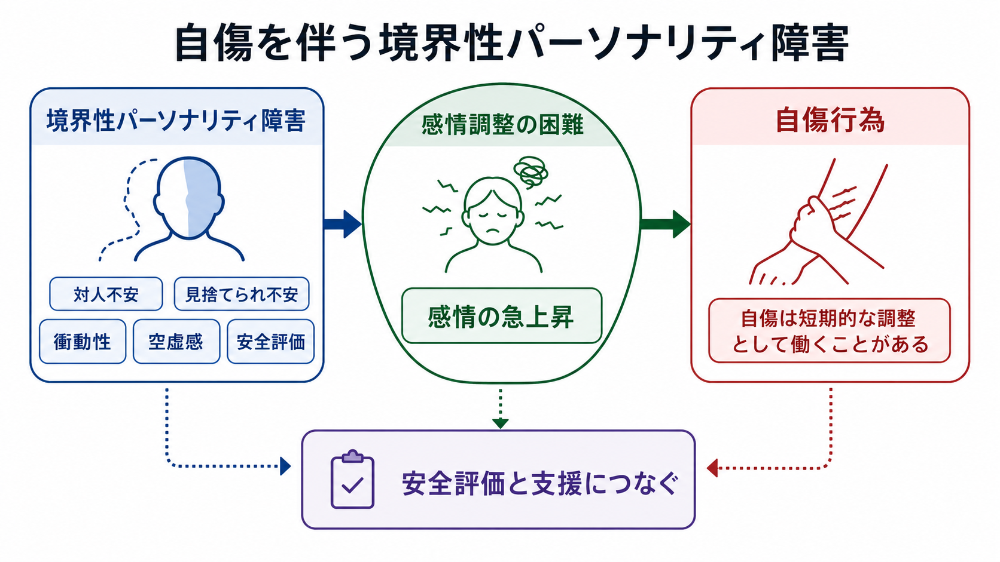
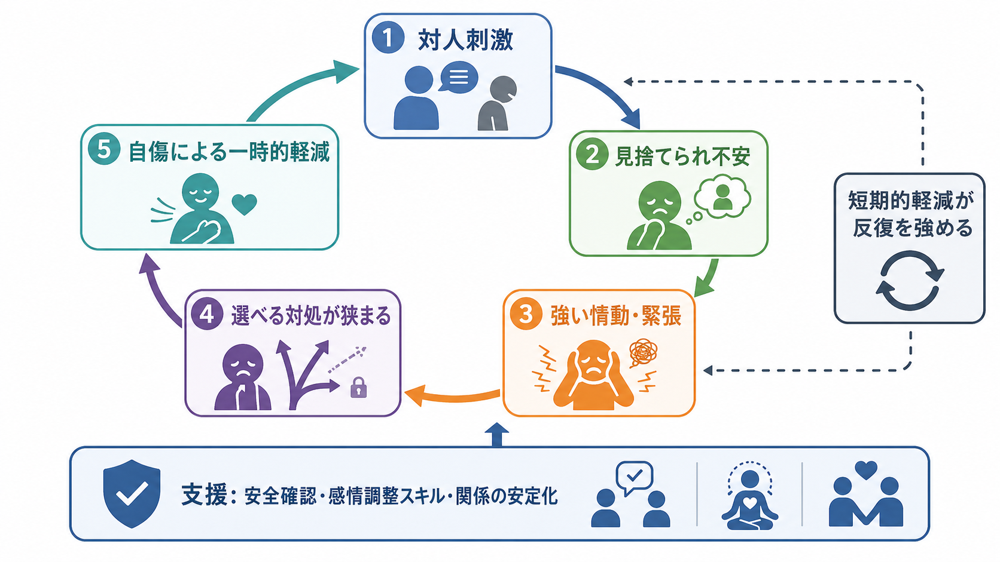
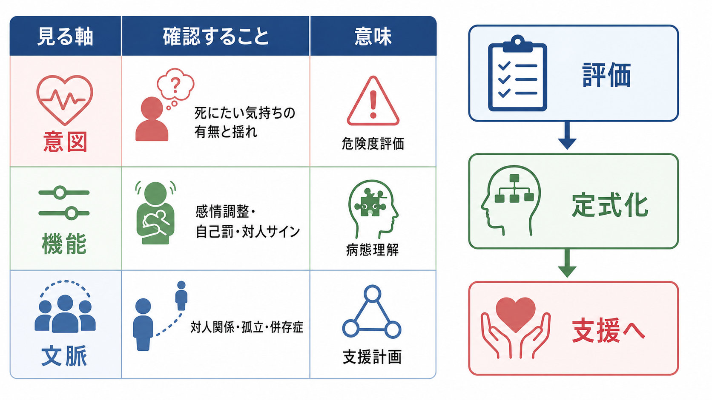

# 自傷を伴う境界性パーソナリティ障害とは何か

## 要点

- 境界性パーソナリティ障害（borderline personality disorder; BPD）は、感情の不安定さ、対人関係の不安定さ、自己像の揺らぎ、衝動性、自傷・自殺関連行動を含みうる臨床像として理解される [1][2]。
- 自傷は「死にたい気持ち」だけで説明されるとは限らない。強い不安、怒り、空虚感、解離、自己罰、対人関係の危機を短期的に調整する行動として働くことがある [3][4]。
- しかし、短期的な緊張低下は反復を強めることがあり、NSSI（非自殺性自傷）であっても将来の自殺関連リスクと切り離して扱うべきではない [3][5]。
- 臨床では、診断名そのものよりも、いまの安全性、行為の機能、対人文脈、併存症、本人がすでに使えている対処を合わせて定式化することが重要である [2][6]。

## この記事で答える問い

1. 自傷を伴う BPD とは、どのような状態を指すのか。
2. なぜ自傷が「感情調整」や「対人不安」と結びつくのか。
3. NSSI と自殺企図はどう区別し、どこを同時に評価するのか。
4. 研究知見を、臨床の安全評価や支援計画にどう接続できるのか。

## まず結論

自傷を伴う BPD は、「自傷する人は境界性パーソナリティ障害である」という単純な対応ではない。BPD の一部の人では、見捨てられ不安、対人関係の急激な緊張、強い情動、空虚感、解離、衝動性が重なり、自傷が一時的な緊張低下や自己罰、助けを求めるサインとして選ばれやすくなる [1][3][4]。

したがって理解の中心は、行為の外見ではなく「その人にとって何が起き、何を下げ、何を伝え、何を避けようとしていたのか」である。これは個別診断や治療指示ではなく、教育・研究目的の病態理解である。実際の危機場面では、[[自傷と自殺企図はどう違うのか]]や[[自殺リスク評価では何を聞くべきか]]で扱うように、意図、致死性、計画性、反復、支援可能性を丁寧に確認する必要がある [2][6]。

## 背景

BPD は歴史的に、感情、対人関係、自己像、行動制御の不安定さが長期に持続するパターンとして記述されてきた。DSM 系の診断では反復する自殺関連行動や自傷が特徴の一部として扱われ、ICD-11 ではパーソナリティ障害を重症度と特性の組み合わせで捉え、必要に応じて「境界型パターン」を記述する方向へ移っている [1][2]。

自傷は BPD に特異的な行動ではない。[[うつ病とは何か]]、[[PTSDとは何か]]、[[摂食障害群とは何か]]、[[物質使用障害とは何か]]、発達特性、対人暴力、孤立、文化的文脈など、さまざまな背景で起こりうる。NICE の self-harm ガイドラインは、自己中毒や自己損傷を目的にかかわらず self-harm として扱い、評価と支援を受けやすくする広い定義を採用している [6]。この広い定義は、初期対応で「本当に死ぬ気があったか」を急いで裁くより、まず安全と文脈を確認するために役立つ。

## 基本概念

### 境界性パーソナリティ障害

BPD は「性格が悪い」という意味ではない。感情の立ち上がりが速く、落ち着くまでに時間がかかり、関係の不安が自己評価や行動を大きく揺らす状態として理解するとよい。JAMA のレビューは、BPD の中核に、情動不安定性、衝動性、対人関係の不安定性、自己像の障害があると整理している [1]。

### 自傷と NSSI

自傷は広い用語であり、自殺意図の有無を問わず、自分の身体を意図的に傷つける行動を含む。NSSI は nonsuicidal self-injury の略で、死ぬ意図を伴わない自己損傷を指す。ただし、NSSI と自殺企図は完全に別世界の行動ではない。NSSI の反復は、将来の自殺関連リスクと関連するため、「死ぬつもりはなかった」という説明を尊重しながらも、安全評価は省略できない [5][6]。

### 感情調整

感情調整とは、不安、怒り、羞恥、空虚感、絶望、身体的緊張を扱い、行動選択の幅を保つ働きである。BPD では、感情の強度、持続、回復の難しさが目立ちやすい。レビュー研究は、BPD の情動調整困難を、感情反応性、情動の強さ、情動認識、衝動制御の問題など複数の成分として整理している [7]。

## 仕組み

### 1. 対人刺激が情動を急上昇させる

BPD で自傷が起こる典型的な文脈には、拒絶、沈黙、別れ、返信の遅れ、批判、孤立などがある。これらは外から見ると小さく見えても、本人の経験では「関係が切れる」「見捨てられる」「自分は価値がない」という切迫した意味を持つことがある。ここには[[扁桃体回路は情動をどう処理するのか]]、[[サリエンスネットワークとは何か]]、[[島皮質は内受容感覚ネットワークで何をしているのか]]で扱うような、脅威検出、身体感覚、注意の偏りが関わる可能性がある。

### 2. 選べる対処が狭まる

強い情動が上がると、[[前頭頭頂ネットワークは認知制御をどう支えるのか]]で扱うような認知制御が使いにくくなる。言葉で説明する、距離を取る、誰かに相談する、睡眠を取るといった選択肢が見えにくくなり、「いまこの苦痛を止める」行動に注意が集まりやすい。

### 3. 自傷が短期的な緊張低下として働く

Klonsky のレビューは、自傷の機能として、急性の負の感情を下げる感情調整機能に強い証拠があると整理した [3]。Nock と Prinstein の機能モデルでは、自傷は自動的強化、社会的強化、正の強化、負の強化の組み合わせで理解される [4]。つまり、苦痛を減らす、何かを感じる、自己罰を行う、助けを求める、対人状況を変える、といった複数の機能が同時に働きうる。

### 4. 短期的軽減が反復を強める

自傷後に一時的に緊張が下がると、次に同じ苦痛が来たときにも同じ行動が選ばれやすくなる。これは「本人が望んで悪化させている」という意味ではない。むしろ、短期的には効いてしまう対処が、長期的には選択肢を狭め、羞恥、秘密、孤立、身体的リスクを増やすという悪循環である。

## 図解

自傷を伴う BPD を図式化すると、少なくとも次の三層を分ける必要がある。

| 層 | 見ること | 説明 |
|---|---|---|
| 症状の層 | 感情不安定、自傷、衝動性、空虚感 | 観察される行動や訴え。診断分類ではここが目立つ。 |
| 機能の層 | 緊張低下、自己罰、解離からの回復、対人サイン | 行動が本人の中で何をしているか。支援計画の中心になる。 |
| 文脈の層 | 対人関係、孤立、併存症、過去の体験、支援資源 | 行動が起きやすい条件と、変えられる環境要因。 |

## 臨床・研究との接続

臨床では、BPD という診断名を急いで貼ることよりも、危機の安全評価と、行動の機能分析を並行して行うことが重要である。NICE の BPD ガイドラインは、反復する自傷、持続するリスク行動、著しい情動不安定性がある場合、BPD 評価につなぐことを推奨している [2]。同時に、self-harm ガイドラインは、リスク尺度だけで処遇を決めるのではなく、心理社会的評価、本人のニーズ、安全計画、継続支援を重視する [6]。

治療研究では、弁証法的行動療法（DBT）が代表的である。DBT は、受容と変化を組み合わせ、感情調整、苦痛耐性、対人関係スキル、マインドフルネスを扱う。Linehan らの RCT では、自殺関連行動を伴う BPD に対して DBT が専門家治療と比較され、自殺企図や救急受診などの臨床アウトカムで有用性が示された [8]。ただし、どの介入が誰に最適か、併存症や年齢、文化的背景で効果がどう変わるかは、なお研究課題である。

神経科学的には、BPD を単一の脳部位の障害として説明するのは粗すぎる。むしろ、脅威検出、内受容感覚、報酬・罰、認知制御、対人予測が相互作用するネットワークの問題として考える方がよい。これは[[脳ネットワークの破綻は精神疾患をどう説明するのか]]や[[素因ストレスモデルとは何か]]とも接続する。

## よくある誤解

### 誤解1: 自傷はすべて「死にたい」という意味である

自傷には、死にたい気持ちを伴う場合も、伴わない場合もある。NSSI では、主観的には「死ぬため」ではなく「耐えるため」に行われることがある [3][4]。ただし、NSSI でも将来の自殺リスクとの関連があるため、安全評価を省略してよいという意味ではない [5][6]。

### 誤解2: 自傷は人を操作するためだけの行動である

対人機能を持つ自傷は存在するが、それを「操作」とだけ呼ぶと理解を誤る。多くの場合、本人は言葉にできない苦痛、見捨てられ不安、助けの求め方の不足の中で行動している。対人サインとしての機能を認めることと、行為を肯定することは別である。

### 誤解3: BPD なら自傷する、自傷するなら BPD である

BPD の人すべてが自傷するわけではなく、自傷する人すべてが BPD でもない。[[双極性障害とは何か]]、[[PTSDとは何か]]、[[大うつ病性障害とは何か]]、[[物質使用障害とは何か]]などとの鑑別や併存評価が必要になる。

### 誤解4: 診断名を伝えれば問題が説明できる

診断名は入口であり、定式化の代わりにはならない。いつ、誰との関係で、どの感情が上がり、どの行動で何が下がり、次に何が悪化するのかを記述して初めて、支援の焦点が見える。

## 関連ノート

- [[自傷と自殺企図はどう違うのか]]
- [[自殺リスク評価では何を聞くべきか]]
- [[精神科面接で境界設定はなぜ必要なのか]]
- [[PTSDとは何か]]
- [[大うつ病性障害とは何か]]
- [[物質使用障害とは何か]]
- [[扁桃体回路は情動をどう処理するのか]]
- [[サリエンスネットワークとは何か]]
- [[島皮質は内受容感覚ネットワークで何をしているのか]]
- [[前頭頭頂ネットワークは認知制御をどう支えるのか]]

## MOC更新候補

- `content/00_MOC/` 配下の精神医学、臨床実践、リスク評価、自傷関連の MOC に追加候補。
- 並列生成ジョブとの競合を避けるため、このタスクでは MOC ファイル自体は更新しない。

## 理解チェック

1. 自傷を「行為の危険度」だけでなく「機能」から見ると、どのような情報が追加で見えるか。
2. NSSI と自殺企図を区別する軸は何か。区別しても安全評価を省略できない理由は何か。
3. BPD における対人不安、感情調整困難、自傷反復は、どのような悪循環を作りうるか。
4. 支援計画を考えるとき、診断名だけでなく文脈と保護因子を見る必要があるのはなぜか。

## 未解決問題

- BPD と NSSI の関係は強いが、NSSI の機能、頻度、致死性、併存症の違いを反映した精密なサブタイプ分類はまだ発展途上である。
- DBT などの心理療法は有望だが、どの成分がどの患者群に最も効くのか、現実の地域医療でどう実装するかには課題が残る。
- 神経画像研究は感情・対人・認知制御ネットワークの関与を示唆するが、個人の診断や治療選択にそのまま使える段階ではない。

## 参考文献

[1] Leichsenring, F., Heim, N., Leweke, F., Spitzer, C., Steinert, C., & Kernberg, O. F. (2023). Borderline Personality Disorder: A Review. *JAMA, 329*(8), 670-679. https://doi.org/10.1001/jama.2023.0589

[2] National Institute for Health and Care Excellence. (2009). *Borderline personality disorder: recognition and management* (Clinical guideline CG78). https://www.nice.org.uk/guidance/cg78

[3] Klonsky, E. D. (2007). The functions of deliberate self-injury: A review of the evidence. *Clinical Psychology Review, 27*(2), 226-239. https://doi.org/10.1016/j.cpr.2006.08.002

[4] Nock, M. K., & Prinstein, M. J. (2004). A functional approach to the assessment of self-mutilative behavior. *Journal of Consulting and Clinical Psychology, 72*(5), 885-890. https://doi.org/10.1037/0022-006X.72.5.885

[5] Nock, M. K., Joiner, T. E., Jr., Gordon, K. H., Lloyd-Richardson, E., & Prinstein, M. J. (2006). Non-suicidal self-injury among adolescents: Diagnostic correlates and relation to suicide attempts. *Psychiatry Research, 144*(1), 65-72. https://doi.org/10.1016/j.psychres.2006.05.010

[6] National Institute for Health and Care Excellence. (2022). *Self-harm: assessment, management and preventing recurrence* (NICE guideline NG225). https://www.nice.org.uk/guidance/ng225

[7] Carpenter, R. W., & Trull, T. J. (2013). Components of emotion dysregulation in borderline personality disorder: A review. *Current Psychiatry Reports, 15*, 335. https://doi.org/10.1007/s11920-012-0335-2

[8] Linehan, M. M., Comtois, K. A., Murray, A. M., Brown, M. Z., Gallop, R. J., Heard, H. L., Korslund, K. E., Tutek, D. A., Reynolds, S. K., & Lindenboim, N. (2006). Two-year randomized controlled trial and follow-up of dialectical behavior therapy vs therapy by experts for suicidal behaviors and borderline personality disorder. *Archives of General Psychiatry, 63*(7), 757-766. https://doi.org/10.1001/archpsyc.63.7.757
