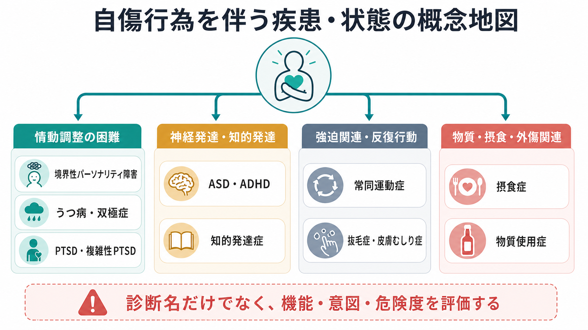
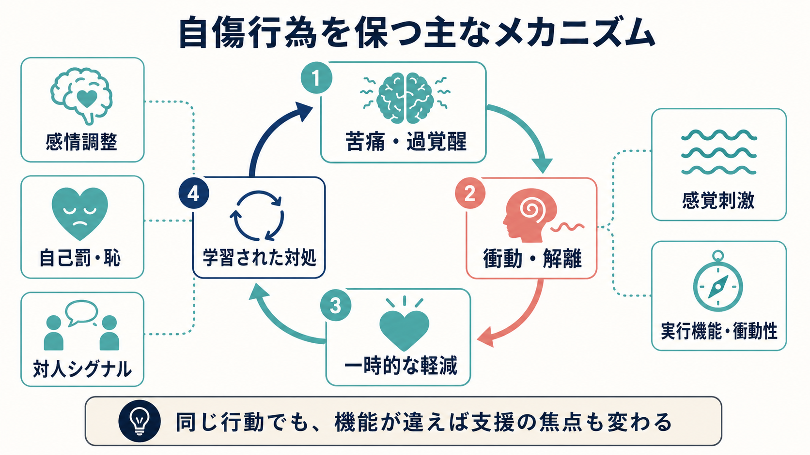
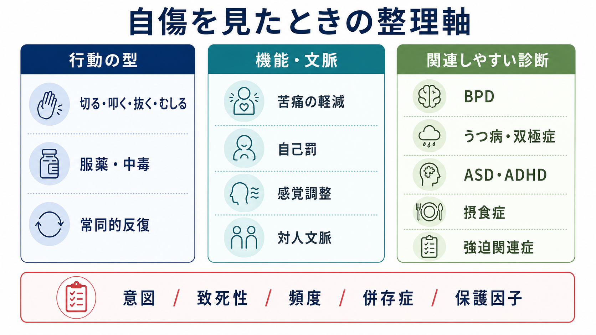

# 自傷行為を伴う疾患には何があるのか

## 要点

- 自傷行為は単一の診断名ではなく、複数の疾患・発達特性・生活文脈を横断して現れる行動である。NICE は self-harm を「見かけ上の目的にかかわらない意図的な自己中毒または自己損傷」と広く定義する一方、反復的・常同的な自己損傷行動は別に扱うとしている[1]。
- [[境界性パーソナリティ障害とは何か|境界性パーソナリティ障害]]では、自傷は情動調整、自己罰、対人危機のサインとして現れやすい。ただし、自傷があるから BPD、BPD なら必ず自傷、という対応ではない[2][4]。
- [[うつ病とは何か|うつ病]]、[[大うつ病性障害とは何か|大うつ病性障害]]、[[双極性障害とは何か|双極性障害]]、[[PTSDとは何か|PTSD]]では、抑うつ、絶望、過覚醒、解離、自己非難が自傷と重なりやすい[5]。
- [[自閉スペクトラム症とは何か|自閉スペクトラム症]]、[[ADHDとは何か|ADHD]]、[[知的発達症とは何か|知的発達症]]では、感覚調整、衝動性、コミュニケーション困難、常同的反復行動として自己損傷が見えることがある[6][7]。
- [[抜毛症とは何か|抜毛症]]、[[皮膚むしり症とは何か|皮膚むしり症]]などの身体集中反復行動、[[摂食障害群とは何か|摂食症]]、[[物質使用障害とは何か|物質使用症]]でも、身体への損傷や危険な自己管理が生じうる。ただし機能、意図、致死性はそれぞれ異なる。

## この記事で答える問い

1. 自傷行為はどのような疾患・状態で見られるのか。
2. 「自傷」「非自殺性自傷」「自殺企図」「常同的自己損傷」はどう整理できるのか。
3. 境界性パーソナリティ障害、うつ病、発達症では何が違うのか。
4. 診断名だけでなく、どの評価軸で見ればよいのか。

## まず結論

自傷行為を見たときに最初に考えるべきことは、「どの診断名か」だけではない。重要なのは、行動の型、意図、致死性、反復性、機能、併存症、保護因子を分けて見ることである。たとえば同じ「皮膚を傷つける」という行動でも、BPD に伴う強い感情の急上昇を下げる行動、うつ病に伴う自己罰、ASD に伴う感覚調整、知的発達症に伴う常同的反復、皮膚むしり症に伴う強迫関連の反復行動では、臨床的な意味が異なる。

また、非自殺性自傷（nonsuicidal self-injury: NSSI）は「死ぬ意図がない自傷」として整理されるが、将来の自殺関連リスクと無関係ではない[2][3]。そのため、[[自傷と自殺企図はどう違うのか|自傷と自殺企図]]を区別しつつ、毎回のエピソードで安全性を過小評価しないことが重要である。

## 背景

自傷行為は、精神医学では古くから BPD と結びつけて理解されてきた。しかし研究が進むにつれて、NSSI は気分症、不安症、PTSD、摂食症、物質使用症、発達症、身体集中反復行動などにまたがる横断的現象として扱われるようになった[2][5]。これは、自傷行為が「疾患そのもの」ではなく、苦痛、衝動、解離、感覚、対人関係、自己評価、学習された対処の交点に現れる行動だからである。

臨床上は、用語の使い分けも重要である。広義の自傷は、自己中毒、過量服薬、切る・叩く・焼くなどの自己損傷を含む。一方、NSSI は「死ぬ意図がない直接的な身体損傷」を指すことが多い[2][3]。さらに、ASD や知的発達症で見られる頭打ち、手を噛む、身体を叩くなどの常同的自己損傷は、NSSI とは異なる機能を持つことがある[1][6]。

## 基本概念

### 自傷

自傷は、意図的な自己損傷や自己中毒を広く含む臨床用語である。NICE の定義は、見かけ上の目的や本人の説明にかかわらず、まず自己損傷・自己中毒があった事実から評価を始めるための広い枠組みである[1]。この広い定義は、初期対応や安全評価では有用だが、行動の機能や背景診断まで説明するものではない。

### 非自殺性自傷

NSSI は、死ぬ意図を伴わない、直接的で意図的な身体損傷を指す。DSM-5 以降では、NSSI disorder は正式診断というより、さらなる研究対象として扱われてきた[3]。NSSI では、強い不快感を下げる、麻痺した感覚から戻る、自己罰を行う、他者へ苦痛を伝えるなど、複数の機能が報告されている[2]。

### 自殺企図

自殺企図は、少なくとも一部に死ぬ意図を伴う自己危害行動である。実際の面接では、本人が「死にたかったわけではない」と述べても、致死性、計画性、発見可能性、後悔、希死念慮、準備行動を別々に確認する必要がある。これは、NSSI と自殺企図が概念上は区別されても、臨床上は同じ人の中で重なったり移行したりするためである[2][3]。

### 常同的自己損傷

常同的自己損傷は、神経発達症や知的発達症で見られる反復的・リズミカル・非目的的に見える自己損傷である。行動の背景には、感覚入力の調整、痛みや不快の表出、予測困難な環境への反応、コミュニケーション手段の不足があることがある。NICE の self-harm ガイドラインは、この反復的・常同的自己損傷を主対象から外しており、評価枠組みが異なることを示している[1]。

## 疾患・状態別の整理

### 境界性パーソナリティ障害

BPD は自傷と最も強く結びつけられてきた診断の一つである。自傷は、見捨てられ不安、対人関係の急変、強い怒り、空虚感、解離、自己罰と結びつくことがある。青年期の NSSI と BPD 特性には縦断的な関連が示されており、自傷は BPD の将来リスクや重症度を考える入口になる[4]。

ただし、自傷を BPD の「証拠」として短絡してはいけない。BPD 以外の疾患でも自傷は起こるし、BPD でも自傷が前景に出ない人はいる。臨床的には、[[自傷を伴う境界性パーソナリティ障害とは何か|自傷を伴うBPD]]を考えるときも、診断名より先に、感情の上がり方、対人文脈、解離、衝動性、反復後の変化を具体的に見る必要がある。

### うつ病・双極症

うつ病では、絶望感、自己否定、罪責感、精神運動制止、希死念慮が自傷と重なりやすい。NSSI と気分症・不安症・PTSD などの情動障害にはメタ分析レベルで関連が示されており、NSSI は特定診断に閉じない横断的なリスク行動として理解される[5]。

双極症では、抑うつエピソード中の希死念慮や自己罰に加え、混合状態や躁・軽躁状態での衝動性、物質使用、危険行動が関与することがある。[[双極I型障害とは何か|双極I型障害]]、[[双極II型障害とは何か|双極II型障害]]、[[パーソナリティ障害と双極性障害はどう鑑別するのか|BPDとの鑑別]]では、気分エピソードの時間構造を確認することが重要になる。

### PTSD・複雑性PTSD・解離症

PTSD や [[複雑性PTSDとは何か|複雑性PTSD]] では、過覚醒、侵入記憶、回避、自己非難、対人不信、解離が自傷に結びつくことがある。自傷は、耐えがたい記憶や身体感覚を止める、現実感を取り戻す、自己嫌悪を身体化する行動として現れることがある。情動障害との関連を扱ったメタ分析でも、PTSD は NSSI と強い関連を示す群の一つとして扱われている[5]。

[[解離症群とは何か|解離症群]]では、「自分がやった感覚が薄い」「気づいたら傷があった」と語られることもある。この場合、意図の評価は難しくなるため、エピソード前後の記憶、トリガー、身体感覚、対人文脈を丁寧に整理する必要がある。

### 自閉スペクトラム症・知的発達症

ASD では、自傷や自己損傷行動のリスクが高いことが系統的レビュー・メタ分析で示されている[6]。ASD に伴う自己損傷は、NSSI と同じく情動調整の機能を持つ場合もあるが、感覚調整、予測困難な環境への反応、コミュニケーション困難、常同行動として現れる場合もある。

[[知的発達症とは何か|知的発達症]]を伴う場合、痛み、身体疾患、睡眠、てんかん、環境変化、要求水準、支援者との相互作用が行動に影響することがある。この領域では、「なぜやめないのか」と見るより、「何を伝え、何を調整し、何を避け、何を得ているのか」と機能分析的に見るほうが実践的である。

### ADHD

ADHD では、衝動性、情動調整困難、睡眠問題、併存する抑うつ・不安・BPD 特性が自傷と関連しうる。ADHD 症状と自傷行為の関連を扱った PRISMA レビューは、ADHD が自傷リスクの一因となりうることを示している[7]。ただし、ADHD 単独で説明しきるより、併存症、性別、思春期発達、物質使用、家庭・学校環境を同時に見る必要がある。

### 強迫関連症・身体集中反復行動

[[抜毛症とは何か|抜毛症]]、[[皮膚むしり症とは何か|皮膚むしり症]]、爪噛み、頬粘膜を噛む行動などは、身体集中反復行動（body-focused repetitive behaviors: BFRBs）として整理される。これらは「死にたいから傷つける」というより、緊張、不快感、退屈、違和感、完全にしたい感覚への反応として反復され、結果として身体損傷を生む[8]。

この群では、BPD やうつ病に伴う自傷とは異なり、行動の自動性、感覚的報酬、習慣化、強迫性が前景化しやすい。したがって、同じ「皮膚を傷つける」行動でも、皮膚むしり症、NSSI、強迫症、ASD に伴う感覚調整では評価軸が異なる。

### 摂食症・物質使用症・精神病性障害

摂食症では、過食・嘔吐、下剤乱用、過活動、自己評価の身体化、自己罰が自傷的に働くことがある。[[摂食障害群とは何か|摂食障害群]]では、身体損傷が直接的な切創ではなく、栄養障害、電解質異常、身体への過度な負荷として現れることもある。

[[物質使用障害とは何か|物質使用障害]]では、酩酊、離脱、抑制低下、衝動性、対人危機、過量使用が自己危害と重なる。精神病性障害では、命令幻聴、被害妄想、身体への奇異な確信、強い焦燥が自己損傷を引き起こすことがある。いずれも、診断名だけでなく、意識状態、現実検討、物質、身体状態を含めた評価が必要である。

## 仕組み

自傷行為を維持する仕組みは、一つではない。代表的には、次のようなループとして整理できる。

1. 苦痛、過覚醒、自己嫌悪、解離、感覚過負荷が高まる。
2. 言語化や対人調整がうまく働かず、衝動や反復行動が強まる。
3. 自傷後に、一時的な緊張低下、現実感の回復、自己罰の完了、周囲の反応が起きる。
4. 一時的な軽減が「次も同じ行動を選ぶ」学習として固定される。

このループは、Nock のレビューで整理された内的機能と対人的機能の両方に対応する[2]。内的機能とは、つらい感情を下げる、何も感じない状態から戻る、自己罰を行うといった機能である。対人的機能とは、苦痛を伝える、支援を引き出す、要求や状況から離れるといった機能である。どちらも「操作」ではなく、本人にとって利用可能だった対処が狭まった結果として理解する必要がある。

## 図解

自傷行為を伴う疾患を整理するときは、次の三層で見ると混乱しにくい。

| 層 | 見ること | 例 |
|---|---|---|
| 行動の型 | どのように身体を傷つけたか | 切る、叩く、噛む、抜く、むしる、過量服薬、自己中毒 |
| 機能・文脈 | 何を下げ、何を伝え、何を調整したか | 苦痛軽減、自己罰、感覚調整、対人サイン、解離からの回復 |
| 関連診断 | 背景にどの疾患・状態があるか | BPD、うつ病、双極症、PTSD、ASD、ADHD、摂食症、強迫関連症 |

この三層を分けると、「自傷があるから BPD」といった短絡を避けやすくなる。逆に、診断名がすでについている場合でも、行動の型と機能を見ないと、支援の焦点は定まらない。

## 臨床・研究との接続

臨床では、まず身体的安全、意図、致死性、再発可能性、支援資源を確認する。そのうえで、診断名を急いで貼るのではなく、行動の機能を仮説として立てる。NICE は、self-harm 後の心理社会的評価で、本人のニーズ、現在の困難、強み、脆弱性、将来リスク、保護因子を含めて評価することを重視している[1]。

研究では、自傷は疾患別の症状であると同時に、横断的なメカニズムを持つ行動として扱われる。NSSI と情動障害の関連を示すメタ分析は、自傷を BPD だけに閉じない見方を支持している[5]。一方で、ASD や知的発達症の自己損傷では、感覚、発達、環境、コミュニケーションの要因を含む別の研究枠組みが必要になる[6]。

このため、臨床研究でも実践でも、「疾患名」「行動の形」「行動の機能」「危険度」を同じ表に押し込めず、分けて測ることが重要である。

## よくある誤解

### 自傷がある人は全員、境界性パーソナリティ障害である

誤りである。BPD では自傷が重要な臨床特徴になりうるが、自傷はうつ病、PTSD、ASD、ADHD、摂食症、物質使用症、強迫関連症などでも見られる。BPD かどうかは、対人関係、自己像、感情、衝動性、持続的パターンを含めて評価する必要がある[4]。

### 死ぬつもりがない自傷なら危険ではない

誤りである。NSSI は概念上、自殺企図と区別される。しかし NSSI は将来の自殺関連リスクや精神的苦痛と関連しうるため、死ぬ意図がなかったという一点だけで安全とは判断できない[2][3]。

### 自傷は人を操作するための行動である

この見方は臨床的に有害である。対人的機能を持つ自傷は存在するが、それは「操作」ではなく、苦痛を言語化する手段や支援を求める手段が不足している状態として理解できる。本人の責任追及よりも、どの文脈で何が起きているのかを記述するほうが有用である。

### 発達症の自己損傷は精神医学的に扱わなくてよい

誤りである。ASD や知的発達症に伴う自己損傷では、医学的評価、感覚・環境調整、コミュニケーション支援、併存する不安・抑うつ・睡眠問題の評価が必要になることがある[6]。NSSI と同じ枠に押し込まないことと、軽視しないことは両立する。

## 関連ノート

- [[自傷と自殺企図はどう違うのか]]
- [[自殺リスク評価では何を聞くべきか]]
- [[自傷を伴う境界性パーソナリティ障害とは何か]]
- [[境界性パーソナリティ障害とは何か]]
- [[うつ病とは何か]]
- [[大うつ病性障害とは何か]]
- [[双極性障害とは何か]]
- [[PTSDとは何か]]
- [[複雑性PTSDとは何か]]
- [[自閉スペクトラム症とは何か]]
- [[ADHDとは何か]]
- [[知的発達症とは何か]]
- [[抜毛症とは何か]]
- [[皮膚むしり症とは何か]]
- [[摂食障害群とは何か]]
- [[物質使用障害とは何か]]

### MOC更新候補

- `content/00_MOC/` 配下の精神医学、症候学、リスク評価、自傷関連 MOC に追加候補。
- 並列ジョブとの衝突を避けるため、このタスクでは MOC 本体は更新しない。

### 関連ノート候補

- 自傷行為の機能分析とは何か
- 常同的自己損傷とは何か
- 非自殺性自傷 disorder とは何か
- 発達症における感覚調整と自己損傷

## 理解チェック

1. 自傷行為を見たとき、診断名より先に分けるべき評価軸は何か。
2. NSSI と自殺企図はどこで区別されるか。区別しても安全評価を省略できない理由は何か。
3. BPD、うつ病、ASD、ADHD で、自傷行為の機能はどのように異なりうるか。
4. 抜毛症や皮膚むしり症は、BPD に伴う自傷と何が違うか。

## 未解決問題

- NSSI と自殺企図の移行を、個人単位でどこまで予測できるのか。
- ASD や知的発達症に伴う自己損傷と、情動調整としての NSSI を、どの評価尺度で統合的に扱えるのか。
- ADHD と自傷の関連は、衝動性、睡眠、抑うつ、BPD 特性、性別によってどの程度媒介・修飾されるのか。
- 身体集中反復行動と NSSI の境界は、機能、意図、自動性、強迫性のどこで引くのが実践的か。

## 参考文献

[1] National Institute for Health and Care Excellence. (2022). *Self-harm: assessment, management and preventing recurrence* (NICE Guideline NG225). https://www.nice.org.uk/guidance/ng225

[2] Nock, M. K. (2010). Self-injury. *Annual Review of Clinical Psychology, 6*, 339-363. https://doi.org/10.1146/annurev.clinpsy.121208.131258

[3] Gratz, K. L., Dixon-Gordon, K. L., Chapman, A. L., & Tull, M. T. (2015). Diagnosis and characterization of DSM-5 nonsuicidal self-injury disorder using the Clinician-Administered Nonsuicidal Self-Injury Disorder Index. *Assessment, 22*(5), 527-539. https://doi.org/10.1177/1073191114565878

[4] Stead, V. E., Boylan, K., & Schmidt, L. A. (2019). Longitudinal associations between non-suicidal self-injury and borderline personality disorder in adolescents: a literature review. *Borderline Personality Disorder and Emotion Dysregulation, 6*, 3. https://doi.org/10.1186/s40479-019-0100-9

[5] Bentley, K. H., Cassiello-Robbins, C. F., Vittorio, L., Sauer-Zavala, S., & Barlow, D. H. (2015). The association between nonsuicidal self-injury and the emotional disorders: A meta-analytic review. *Clinical Psychology Review, 37*, 72-88. https://doi.org/10.1016/j.cpr.2015.02.006

[6] Blanchard, A., Chihuri, S., DiGuiseppi, C. G., & Li, G. (2021). Risk of self-harm in children and adults with autism spectrum disorder: A systematic review and meta-analysis. *JAMA Network Open, 4*(10), e2130272. https://doi.org/10.1001/jamanetworkopen.2021.30272

[7] Allely, C. S. (2014). The association of ADHD symptoms to self-harm behaviours: a systematic PRISMA review. *BMC Psychiatry, 14*, 133. https://doi.org/10.1186/1471-244X-14-133

[8] Günal Okumuş, H., & Akdemir, D. (2023). Body focused repetitive behavior disorders: Behavioral models and neurobiological mechanisms. *Turkish Journal of Psychiatry, 34*(1), 50-59. https://doi.org/10.5080/u26213
