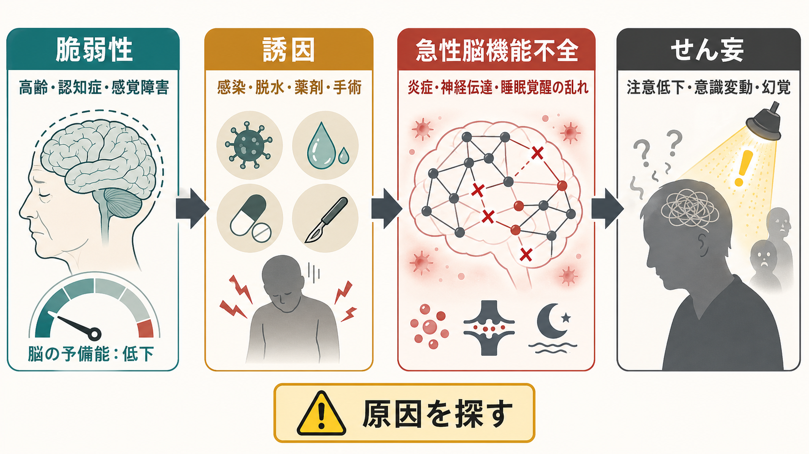
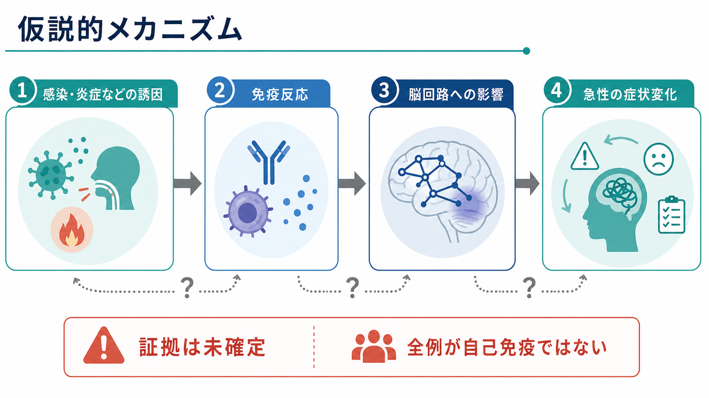
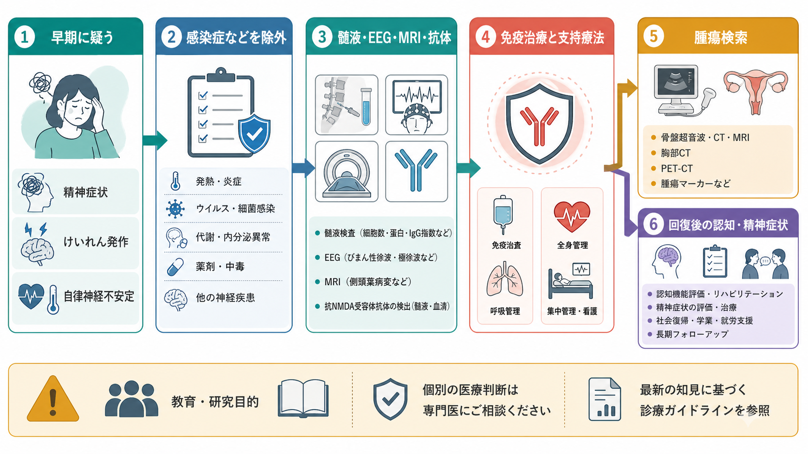

# 自己免疫性脳炎に伴う精神症状とは何か

## 要点

- 自己免疫性脳炎は、免疫反応が脳のシナプス、神経細胞表面抗原、細胞内抗原などに関わり、急性または亜急性に精神症状、記憶障害、けいれん、意識障害、自律神経症状を起こす病態群である[1]。
- 精神科初診時には、[[初回エピソード精神病とは何か|初回エピソード精神病]]、躁状態、[[緊張病とは何か|緊張病]]、[[せん妄とは何か|せん妄]]のように見えることがある。したがって「精神症状があるから精神疾患」と早く閉じないことが重要である[2][3]。
- 見逃しを減らす鍵は、急性発症、日内変動、[[意識障害とは何か|意識障害]]、近時記憶障害、けいれん、不随意運動、自律神経不安定、発熱、頭痛、抗精神病薬への過敏反応などの赤旗を拾うことである[2][6]。
- 検査は抗体検査だけではなく、髄液、MRI、EEG、感染症・代謝・薬剤性要因の除外、腫瘍検索を組み合わせて考える。抗体陰性でも臨床像から自己免疫性脳炎が疑われる場合がある[1][7]。
- 本稿は教育・研究目的の概説であり、個別の診断や治療指示ではない。急性の意識障害、けいれん、自律神経不安定を伴う場合は、救急・神経内科・精神科の連携が必要になる。

## この記事で答える問い

1. 自己免疫性脳炎は、なぜ急性精神病症状や緊張病のように見えるのか。
2. どのような症状の組み合わせなら、[[器質性精神病とは何か|器質性精神病]]や神経疾患として再評価すべきか。
3. 精神科臨床で、抗NMDA受容体脳炎などをどのように疑い、どの検査や連携につなげるのか。
4. 「抗体が陽性なら診断」「抗体が陰性なら除外」と考えてよいのか。

## まず結論

自己免疫性脳炎に伴う精神症状は、単なる「精神症状の鑑別リスト」ではなく、脳炎が精神症状として立ち上がる場面を見逃さないための視点である。代表例である抗NMDA受容体脳炎では、病初期に不安、焦燥、不眠、幻覚、妄想、まとまりにくい行動、躁的興奮、緊張病様症状が目立ち、その後にけいれん、記憶障害、言語障害、不随意運動、意識障害、自律神経不安定が加わることがある[3][4]。

ただし、すべての急性精神病症状に抗神経抗体検査を機械的に行うという意味ではない。重要なのは、精神症状の内容だけでなく、時間経過、認知・意識の変動、神経学的徴候、身体所見、薬剤反応、検査所見を合わせて、[[鑑別診断とは何か|鑑別診断]]を更新することである[1][2][6]。

## 背景

自己免疫性脳炎が精神医学で重要になった理由は、脳炎が「精神病のように見える」だけでなく、一部では免疫療法や腫瘍治療によって改善しうるからである。特に抗NMDA受容体脳炎は、若年者に急性精神症状で始まり、精神科病棟や救急で最初に評価されることがある[3][4]。

Grausらの診断アプローチは、抗体結果が出る前でも、急性・亜急性の記憶障害、精神状態変化、精神症状に、けいれん、髄液細胞増多、MRI所見、脳炎を示唆する臨床像などを組み合わせて「可能性のある自己免疫性脳炎」を考える枠組みを提示した[1]。これは、抗体検査を待ってから考えるのでは遅い場面があるためである。

精神科側では、HerkenとPrüssが精神科患者における自己免疫性脳炎の red flags を整理し、けいれん、緊張病、自律神経不安定、意識変容、抗精神病薬への悪性症候群様反応、髄液異常、EEG異常、MRI異常などを、追加評価を促す手がかりとして示した[2]。また、自己免疫性精神病の国際コンセンサスは、精神病症状だけでなく神経免疫学的所見を組み合わせて、疑い例を層別化する考え方を提案している[6]。

## 基本概念

### 自己免疫性脳炎とは何か

自己免疫性脳炎は、自己抗体や細胞性免疫などが脳に関わり、急性または亜急性に脳機能障害を起こす病態群である。抗NMDA受容体、LGI1、CASPR2、GABA-B受容体、AMPARなど、神経細胞表面またはシナプス関連抗原に対する抗体では、精神症状、けいれん、記憶障害、運動異常などが比較的目立ちやすい[1][4]。

一方で、抗体の種類ごとに年齢、腫瘍関連、けいれんの出やすさ、記憶障害、精神症状の出方は異なる。したがって「自己免疫性脳炎 = 抗NMDA受容体脳炎」ではない。抗NMDA受容体脳炎は重要な代表例だが、臨床では抗体の型、髄液所見、画像所見、EEG、腫瘍検索、感染症除外を合わせて考える必要がある[1][7]。

### 精神症状として何が出るか

精神症状は、幻覚、妄想、被害的解釈、まとまりにくい言動、興奮、不眠、不安、抑うつ、躁的状態、脱抑制、奇異な行動、緊張病様症状として現れる。抗NMDA受容体脳炎の臨床研究では、精神症状は非常に高頻度にみられ、初発症状として精神症状が前景化する例も多い[5]。

ここで重要なのは、精神症状が「精神疾患らしくない形」で出るとは限らないことである。初期には[[統合失調症とは何か|統合失調症]]、[[双極性障害とは何か|双極性障害]]、急性一過性精神病、薬剤性精神病のように見えることがある。違いは、症状名ではなく、発症の速さ、認知・意識の揺らぎ、神経症状、身体徴候、検査所見との組み合わせに表れる[2][6]。

### 「自己免疫性精神病」との関係

自己免疫性脳炎は、脳炎としての臨床像を伴う病態である。一方、自己免疫性精神病という概念は、精神病症状が前景に出る症例のなかに、自己免疫機序が関与する一群があるのではないかという研究・臨床上の枠組みである[6]。両者は重なるが同じではない。

臨床的には、自己免疫性脳炎の基準を満たすほど神経症状や検査異常が明確でない時点でも、神経免疫学的評価を検討すべき精神病症状がある。たとえば、急性発症、腫瘍既往、自己免疫疾患、感染後発症、けいれん、緊張病、意識変容、EEGや髄液異常などがある場合である[2][6]。

## 仕組み

### シナプス機能とネットワークの乱れ

抗NMDA受容体脳炎では、NMDA受容体に対するIgG抗体が神経細胞表面の受容体機能を変化させ、シナプス伝達、可塑性、ネットワーク活動に影響すると考えられている[4]。NMDA受容体は記憶、学習、興奮・抑制バランスに関わるため、その機能低下は記憶障害、混乱、精神病様体験、緊張病様症状と結びつきうる。

この点は、[[グルタミン酸仮説は統合失調症をどう説明するのか|グルタミン酸仮説]]と概念的に接続する。統合失調症研究ではNMDA受容体機能低下が精神病症状や認知機能障害を説明する候補として議論されてきたが、自己免疫性脳炎では、抗体による受容体機能変化という、より具体的な病態機序が検討される[4]。

### 炎症、血液脳関門、ミクログリア

自己免疫性脳炎では、自己抗体だけでなく、炎症、感染後免疫反応、腫瘍関連免疫、[[血液脳関門はなぜ必要なのか|血液脳関門]]の変化、[[ミクログリアは脳の免疫細胞として何をしているのか|ミクログリア]]を含む神経免疫系の反応が関わる可能性がある。これらは単一の直線的経路ではなく、髄液細胞増多、蛋白上昇、MRI病変、EEG徐波、けいれん閾値低下、睡眠覚醒リズムの乱れとして観察されることがある[1][7]。

精神症状は、局所病変だけで説明されるとは限らない。記憶、自己感、情動、サリエンス、覚醒、運動制御を支える広域ネットワークが乱れることで、幻覚・妄想、興奮、行動のまとまりにくさ、意識変容、緊張病様症状が同時に起こりうる。

### 抗精神病薬への反応が手がかりになることがある

自己免疫性脳炎では、興奮や幻覚妄想に対して抗精神病薬が使われることがある。しかし、急速な錐体外路症状、悪性症候群様反応、強い鎮静、意識レベル低下が目立つ場合は、単なる薬剤副作用としてだけでなく、基礎に脳炎や緊張病、自律神経不安定がないかを再評価する必要がある[2][8]。

これは「抗精神病薬を使ってはいけない」という意味ではない。むしろ、急性期の安全確保、睡眠、興奮への対応は重要である。ただし、症状を鎮静だけで説明してしまうと、神経学的評価や免疫療法のタイミングを逃すことがある。

## 図解

1枚目は、急性精神症状を脳機能不全の文脈で見直す全体像を示している。精神症状、誘因、急性脳機能不全、せん妄様の変化を分けて見ることで、[[せん妄とは何か|せん妄]]や身体疾患を早期に考える視点を作る。

2枚目は、自己抗体、炎症、脳回路の乱れから急性の症状変化が生じるという仮説的な機序を示している。画像中の「証拠は未確定」は、すべての精神症状が自己免疫で説明できるわけではないという注意点である。

3枚目は、臨床での見逃しを減らす流れである。急性精神症状があっても、発熱・炎症、けいれん、自律神経不安定、髄液、MRI、EEG、抗体検査、腫瘍検索、回復後の認知・精神症状フォローを一連の流れとして考える。

## 臨床・研究との接続

### 精神科で拾うべき赤旗

精神科診療で特に注意したいのは、次のような組み合わせである[2][6]。

| 観察する軸 | 自己免疫性脳炎を考える手がかり |
|---|---|
| 発症様式 | 数日から数週間で急速に変化する。以前の病前機能からの落差が大きい |
| 意識・注意 | ぼんやりする、日内変動する、会話が続かない、[[見当識障害とは何か|見当識障害]]がある |
| 記憶 | 近時記憶が急に低下する。同じ質問を繰り返す。出来事の保持が悪い |
| 神経症状 | けいれん、不随意運動、失語、歩行障害、眼球運動異常、頭痛、髄膜刺激症状 |
| 自律神経・全身 | 発熱、頻脈、血圧変動、低換気、発汗、尿閉、睡眠覚醒の著しい乱れ |
| 精神症状 | 幻覚妄想、興奮、緊張病、不眠、急な人格変化が神経・身体症状と併走する |
| 薬剤反応 | 抗精神病薬で過度の錐体外路症状、悪性症候群様反応、意識低下が出る |
| 検査 | 髄液異常、EEG徐波・てんかん性活動、MRI側頭葉病変、抗神経抗体陽性 |

この表はチェックリストではなく、評価の向きを変えるための地図である。赤旗が複数ある場合は、精神科単独で閉じず、救急、神経内科、小児科、集中治療、婦人科・腫瘍科などとの連携を検討する。

### 検査の考え方

自己免疫性脳炎の評価では、髄液検査、MRI、EEG、血液検査、感染症評価、抗神経抗体検査、腫瘍検索が組み合わされる[1][7]。特に髄液は、抗体検出だけでなく、細胞数、蛋白、オリゴクローナルバンド、感染症除外に関わる。EEGは特異的診断ではないが、びまん性徐波やてんかん性活動を通じて、脳機能障害を支持することがある。

MRIが正常でも自己免疫性脳炎は否定できない。抗NMDA受容体脳炎ではMRIが正常または非特異的なことがある一方、EEGや髄液が異常を示す場合がある[4][5]。逆に、抗体が血清で弱陽性でも、それだけで原因と決めるのは危険である。臨床像、髄液、時間経過、他疾患の除外を合わせて判断する必要がある[1][6]。

### 治療・支援との接続

急性期治療では、感染性脳炎などの除外と並行して、ステロイド、免疫グロブリン、血漿交換などの免疫療法、腫瘍がある場合の腫瘍治療、けいれん・自律神経不安定・低換気・興奮への全身管理が検討される[7]。治療反応が不十分な場合には、リツキシマブやシクロホスファミドなどの二次治療が検討されることもある[7]。

精神症状への対応は、免疫療法の代替ではなく、急性期安全管理と回復支援の一部である。睡眠、環境調整、せん妄予防、興奮への最小限で慎重な薬物療法、緊張病評価、家族説明、身体拘束を避けるための多職種ケアが重要になる[8]。回復後も、記憶障害、遂行機能低下、疲労、不安、抑うつ、再発不安、学業・就労復帰の課題が残ることがあるため、[[認知機能障害とは何か|認知機能障害]]の評価やリハビリテーションが必要になる。

### 研究上の問い

自己免疫性脳炎は、精神症状を「心理か脳か」という二分法で分けるのではなく、免疫、シナプス、ネットワーク、意識、行動、社会的回復をつなぐモデルとして重要である。特に、精神病症状とNMDA受容体機能、炎症と認知機能、抗体陽性と臨床的因果性、免疫療法のタイミング、回復後の精神症状の評価は、研究上の重要な課題である[4][6][8]。

## よくある誤解

### 誤解1: 幻覚や妄想が目立つなら一次性精神疾患である

誤りである。幻覚や妄想は、自己免疫性脳炎、[[てんかんに伴う精神症状とは何か|てんかん関連精神症状]]、薬剤性精神病、内分泌疾患、感染症、代謝異常、脳腫瘍などでも起こりうる。一次性精神疾患の可能性を考えることと、身体・神経疾患を評価することは対立しない。

### 誤解2: 抗体検査が陰性なら自己免疫性脳炎ではない

誤りである。抗体陰性の自己免疫性脳炎や、現行検査で検出されにくい病態がある。逆に、抗体陽性だけで診断が確定するわけでもない。臨床像、髄液、MRI、EEG、感染症除外、治療反応を総合する必要がある[1][7]。

### 誤解3: MRIが正常なら脳炎ではない

誤りである。自己免疫性脳炎では、MRIが正常または非特異的な場合がある。EEGや髄液、症状経過、抗体検査が重要な情報を与えることがある[4][5]。

### 誤解4: 精神症状への対応は免疫療法が始まれば不要になる

誤りである。急性期には興奮、睡眠障害、緊張病様症状、自傷他害リスク、せん妄、家族の混乱が問題になる。回復期には記憶障害、疲労、不安、抑うつ、社会復帰の困難が残ることがある。神経内科的治療と精神科的支援は並行して必要になる[8]。

## 関連ノート

- [[器質性精神病とは何か]]
- [[初回エピソード精神病とは何か]]
- [[せん妄とは何か]]
- [[意識障害とは何か]]
- [[見当識障害とは何か]]
- [[緊張病とは何か]]
- [[てんかんに伴う精神症状とは何か]]
- [[鑑別診断とは何か]]
- [[血液脳関門はなぜ必要なのか]]
- [[ミクログリアは脳の免疫細胞として何をしているのか]]
- [[グルタミン酸仮説は統合失調症をどう説明するのか]]

MOC更新候補: 精神医学MOC、神経免疫・神経精神医学MOC、鑑別診断MOC。並列ジョブとの競合を避けるため、本稿ではMOC本体を更新しない。

今後の作成候補: 抗NMDA受容体脳炎とは何か、自己免疫性精神病とは何か、抗神経抗体検査とは何か、急性精神病症状で行う身体評価とは何か。

## 理解チェック

1. 急性精神病症状に、意識障害、近時記憶障害、けいれん、自律神経不安定が加わるとき、なぜ自己免疫性脳炎を考える必要があるのか。
2. 抗NMDA受容体脳炎では、なぜ精神症状が病初期に前景化しうるのか。
3. 抗体検査、髄液、MRI、EEGのうち、どれか一つだけで自己免疫性脳炎を確定・除外しにくい理由は何か。
4. 精神科的対応と神経内科的対応を分けずに進めるべき場面はどのようなときか。

## 未解決問題

- 精神病症状を呈する患者のうち、どの層に神経免疫学的評価を行うと有益性と過剰検査のバランスがよいのか。
- 血清抗体陽性、髄液陰性、臨床像が非典型という場合に、因果性をどう評価するのか。
- 免疫療法後に残る認知機能障害、疲労、抑うつ、不安をどのように長期支援へ接続するのか。
- 自己免疫性脳炎の知見は、一次性精神病の炎症・免疫サブタイプ研究にどこまで一般化できるのか。

## 参考文献

[1] Graus F, Titulaer MJ, Balu R, et al. (2016). A clinical approach to diagnosis of autoimmune encephalitis. *The Lancet Neurology*, 15(4), 391-404. https://doi.org/10.1016/S1474-4422(15)00401-9

[2] Herken J, Prüss H. (2017). Red Flags: Clinical Signs for Identifying Autoimmune Encephalitis in Psychiatric Patients. *Frontiers in Psychiatry*, 8, 25. https://doi.org/10.3389/fpsyt.2017.00025

[3] Kayser MS, Dalmau J. (2011). Anti-NMDA Receptor Encephalitis in Psychiatry. *Current Psychiatry Reviews*, 7(3), 189-193. https://pmc.ncbi.nlm.nih.gov/articles/PMC3983958/

[4] Dalmau J, Lancaster E, Martinez-Hernandez E, Rosenfeld MR, Balice-Gordon R. (2011). Clinical experience and laboratory investigations in patients with anti-NMDAR encephalitis. *The Lancet Neurology*, 10(1), 63-74. https://doi.org/10.1016/S1474-4422(10)70253-2

[5] Wang W, Zhang L, Chi XS, He L, Zhou D, Li JM. (2020). Psychiatric Symptoms of Patients With Anti-NMDA Receptor Encephalitis. *Frontiers in Neurology*, 10, 1330. https://doi.org/10.3389/fneur.2019.01330

[6] Pollak TA, Lennox BR, Müller S, et al. (2020). Autoimmune psychosis: an international consensus on an approach to the diagnosis and management of psychosis of suspected autoimmune origin. *The Lancet Psychiatry*, 7(1), 93-108. https://doi.org/10.1016/S2215-0366(19)30290-1

[7] Abboud H, Probasco JC, Irani S, et al. (2021). Autoimmune encephalitis: proposed best practice recommendations for diagnosis and acute management. *Journal of Neurology, Neurosurgery & Psychiatry*, 92(7), 757-768. https://doi.org/10.1136/jnnp-2020-325300

[8] Abboud H, Probasco JC, Irani S, et al. (2021). Autoimmune encephalitis: proposed recommendations for symptomatic and long-term management. *Journal of Neurology, Neurosurgery & Psychiatry*, 92(8), 897-907. https://doi.org/10.1136/jnnp-2020-325302
